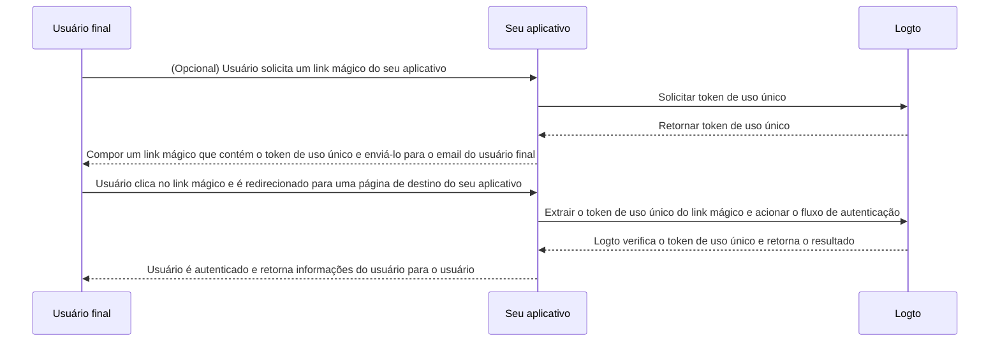

# Link mágico (Token de uso único)

import Availability from '@components/Availability';

<Availability cloud oss={{ major: 1, minor: 27 }} />

Semelhante à senha de uso único (OTP), um token de uso único é outro método de autenticação sem senha que pode ser usado para verificar a identidade de um usuário. O token é válido por um período limitado de tempo e está associado a um endereço de email do usuário final.

Às vezes, você pode querer convidar novos usuários para seu aplicativo / organização sem exigir que eles criem uma conta primeiro. Ou você pode esquecer sua senha e querer fazer login / redefinir sua senha verificando rapidamente sua identidade via email. Nesses casos, o aplicativo pode enviar um "link mágico" para seu email. E você será autenticado imediatamente ao clicar no link.

Os desenvolvedores de aplicativos podem usar o token de uso único para compor um link mágico e enviá-lo para o endereço de email do usuário final.

## Fluxo do token de uso único \{#one-time-token-flow}

Aqui está o diagrama de sequência do fluxo de autenticação usando token de uso único:



## Guia de implementação \{#implementation-guide}

Logto oferece um conjunto de APIs de Gerenciamento e APIs de Experiência para facilitar a implementação do seu link mágico.

Antes de começar, certifique-se de ter uma instância do Logto pronta e ter estabelecido a conexão Máquina para Máquina entre seu servidor de aplicativos e o endpoint do Logto (necessário para as APIs de Gerenciamento). Saiba mais sobre [Logto Management API](/integrate-logto/interact-with-management-api).

### Passo 1: Solicitar token de uso único \{#step-1-request-one-time-token}

Use a Logto Management API para criar um token de uso único.

```bash
POST /api/one-time-tokens
```

Exemplo de payload do corpo da solicitação:

```json
{
  "email": "user@example.com",
  // Opcional. Padrão é 600 (10 minutos).
  "expiresIn": 3600,
  // Opcional. O usuário será provisionado para as organizações especificadas após verificação bem-sucedida.
  "context": {
    "jitOrganizationIds": ["abcdefgh1234"]
  }
}
```

### Passo 2: Compor seu link mágico \{#step-2-compose-your-magic-link}

Depois de obter o token de uso único, você pode compor um link mágico e enviá-lo para o endereço de email do usuário final. O link mágico deve conter pelo menos o token e o email do usuário como parâmetros, e deve navegar para uma página de destino em seu próprio aplicativo. Ex.: `https://yourapp.com/landing-page`.

Aqui está um exemplo simples de como o link mágico pode parecer:

```
https://yourapp.com/landing-page?token=YHwbXSXxQfL02IoxFqr1hGvkB13uTqcd&email=user@example.com
```

:::note

Os nomes dos parâmetros no link mágico podem ser totalmente personalizados. Você pode adicionar informações adicionais ao link mágico com base nos requisitos do seu aplicativo, bem como codificar todos os parâmetros da URL.

:::

### Passo 3: Acionar o fluxo de autenticação via Logto SDK \{#step-3-trigger-the-authentication-flow-via-logto-sdk}

Depois que o usuário final clicar no link mágico e navegar para seu aplicativo, você pode extrair os parâmetros `token` e `email` da URL e, em seguida, chamar a função `signIn()` do Logto SDK para acionar o fluxo de autenticação.

```typescript title="TokenLandingPage.tsx"
// Exemplo em React
import { useLogto } from '@logto/react';
import { useEffect } from 'react';
import { useSearchParams } from 'react-router-dom';

const TokenLandingPage = () => {
  const { signIn } = useLogto();
  const [searchParams] = useSearchParams();

  useEffect(() => {
    // Extrair o token e o email do link mágico
    const oneTimeToken = searchParams.get('token');
    const email = searchParams.get('email');

    // Supondo que este seja seu URI de redirecionamento de login
    const redirectUri = 'https://yourapp.com/callback';

    if (oneTimeToken && email) {
      signIn({
        redirectUri,
        clearTokens: false, // Opcional. Veja a mensagem de aviso abaixo
        extraParams: {
          'one_time_token': oneTimeToken,
          'login_hint': email,
        },
      });
    }
  }, [searchParams, signIn]);

  return <>Por favor, aguarde...</>;
};
```

:::warning

Se um usuário já estiver logado, chamar a função `signIn()` do SDK limpará automaticamente todos os tokens armazenados em cache (Token de ID, Token de acesso e Token de atualização) do armazenamento do cliente, o que resultará na perda do status de autenticação do usuário atual.

Portanto, você deve especificar um parâmetro adicional de login `clearTokens: false` para evitar limpar os tokens existentes. Se isso for especificado, você também precisará limpar manualmente os tokens na página de callback de login.

Ignore isso se seus links mágicos não forem projetados para usuários autenticados.

:::

### Passo 4: (Opcional) Limpar tokens em cache na página de callback de login \{#step-4-clear-cached-tokens-in-sign-in-callback-page}

Se você especificar `clearTokens: false` na função de login, precisará limpar manualmente os tokens na página de callback de login.

```typescript title="Callback.tsx"
// Exemplo em React
import { useHandleSignInCallback, useLogto } from '@logto/react';
import { useEffect } from 'react';

const Callback = () => {
  const { clearAllTokens } = useLogto();

  useEffect(() => {
    void clearAllTokens();
  }, [clearAllTokens]);

  useHandleSignInCallback(() => {
    // Navegar para sua página inicial
  });

  return <>Por favor, aguarde...</>;
};
```

## FAQs \{#faqs}

<details>

<summary>

### Posso usar o link mágico para convidar novos usuários para minhas organizações? \{#can-i-use-the-magic-link-to-invite-new-users-to-my-organizations}

</summary>

Sim, você pode usar o link mágico para convidar novos usuários para seu aplicativo, bem como para organizações. Se você quiser convidar novos usuários para sua organização, basta especificar os `jitOrganizationIds` no corpo da solicitação.

O usuário se juntará automaticamente às organizações após verificação bem-sucedida, e papéis padrão da organização serão atribuídos. Confira a seção "Provisionamento Just-in-time" na página de detalhes da sua organização e configure os papéis padrão para suas organizações.

</details>

<details>

<summary>

### O token de uso único expira? \{#does-the-one-time-token-expire}

</summary>

Sim, o token de uso único expirará após o tempo `expiresIn` especificado (em segundos). O tempo de expiração padrão é de 10 minutos.

</details>

<details>

<summary>

### Se eu desativar o registro de usuário na "Experiência de login", ainda posso usar o link mágico para convidar usuários? \{#if-i-disable-user-registration-in-sign-in-experience-can-i-still-use-magic-link-to-invite-users}

</summary>

Sim, você ainda pode usar o link mágico para convidar usuários, mesmo se desativar o registro de usuário na "Experiência de login".

</details>

<details>

<summary>

### O que acontecerá se um usuário já estiver logado e, em seguida, clicar em outro link mágico? \{#what-will-happen-if-a-user-already-signed-in-and-then-click-another-magic-link}

</summary>

Existem vários cenários possíveis:

1. O usuário já está logado e, em seguida, clica em um link mágico que está associado à conta de usuário atual. Nesse caso, o Logto ainda verificará o token de uso único e provisionará o usuário para as organizações especificadas, se necessário.
2. O usuário já está logado e, em seguida, clica em um link mágico que está associado a uma conta diferente. Nesse caso, o Logto solicitará ao usuário que continue como a nova conta ou volte para o aplicativo com a conta atual.
   1. Se o usuário optar por continuar como a nova conta, o Logto mudará para a nova conta após a verificação do token ser bem-sucedida.
   2. Se o usuário optar por permanecer na conta atual, o Logto não verificará o token e retornará ao aplicativo com a conta atual.
3. Se seu prompt de login estiver configurado para "login" ou contiver "login", o Logto fará automaticamente o login na conta associada ao token de uso único sem solicitar a troca.

</details>
