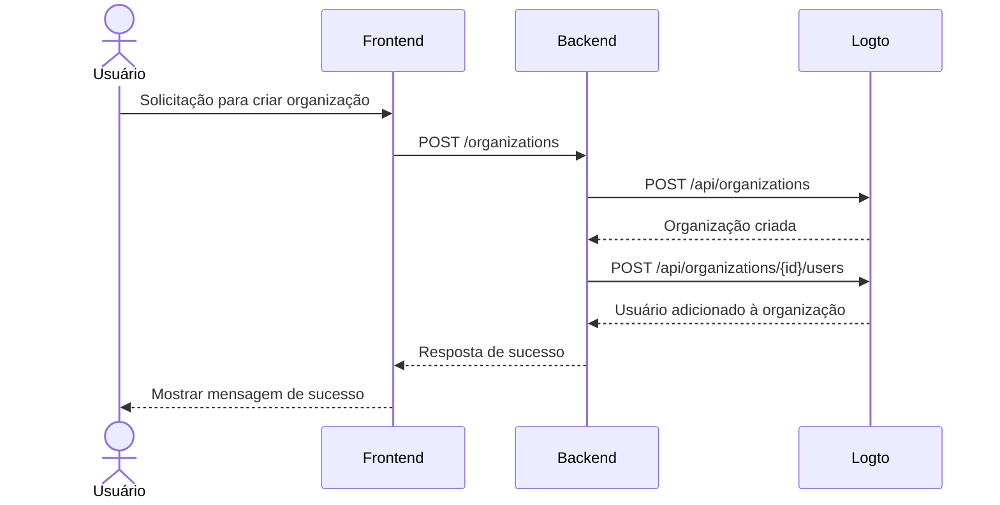

import GearIcon from '@site/src/assets/gear.svg';
import OrganizationIcon from '@site/src/assets/organization.svg';

# Experiência de organização

A experiência de [organização](/organizations) é o conjunto de interfaces e fluxos que seus clientes empresariais e seus funcionários utilizam — especialmente em [aplicativos multi-inquilino](https://auth.wiki/multi-tenancy). Este guia mostra como integrá-la ao seu aplicativo usando a Logto Management API.

Esta seção ajuda você a projetar a **experiência de organização** para seus usuários finais — por exemplo:

1. Administradores podem criar suas próprias organizações.
2. Administradores podem gerenciar membros da organização.
3. Administradores podem convidar membros para suas organizações.
4. e mais.

  

## Entenda o fluxo de autenticação \{#understand-the-authentication-flow}

Para integrar com a Logto Management API, primeiro entenda o fluxo básico de autenticação. Ele possui dois requisitos principais:

### Proteja sua API backend \{#protect-your-backend-api}

- As chamadas do frontend para sua API backend exigem autenticação.
- Proteja os endpoints da API validando o token de acesso Logto do usuário.
- Garanta que apenas usuários autenticados possam acessar seus serviços.

### Acesse a Logto Management API \{#access-the-logto-management-api}

- Seu serviço backend chama com segurança a Logto Management API.
- Siga o guia [Interaja com a Management API](/integrate-logto/interact-with-management-api) para configuração.
- Use autenticação máquina para máquina para obter credenciais de acesso.

Os próximos capítulos explicam como configurar a Logto Management API e apresentam casos de uso comuns para construir sua experiência de organização.

## Funcionalidades da experiência de organização \{#features-for-organization-experience}

<DocCardList
  items={[
    {
      type: 'link',
      label: 'Definir funcionalidades de gerenciamento de organização',
      href: '/end-user-flows/organization-experience/organization-management',
      description:
        'Projete seu próprio app multi-inquilino com papéis e permissões de organização.',
      customProps: {
        icon: <OrganizationIcon />,
      },
    },
    {
      type: 'link',
      label: 'Configure seu serviço de app com a Logto Management API',
      href: '/end-user-flows/organization-experience/setup-app-service-with-management-api',
      description:
        'Conecte com segurança seu backend à Logto Management API usando autenticação máquina para máquina.',
      customProps: {
        icon: <GearIcon />,
      },
    },
    {
      type: 'link',
      label: 'Criar organização',
      href: '/end-user-flows/organization-experience/create-organization',
      description:
        'Use a Logto Management API para permitir que usuários finais criem organizações no produto por conta própria.',
      customProps: {
        icon: <OrganizationIcon />,
      },
    },
    {
      type: 'link',
      label: 'Obter informações do usuário dentro de uma organização',
      href: '/end-user-flows/organization-experience/get-user-info',
      description: 'Busque informações do usuário dentro de uma organização.',
      customProps: {
        icon: <OrganizationIcon />,
      },
    },
    {
      type: 'link',
      label: 'Trocador de organização',
      href: '/end-user-flows/organization-experience/organization-switcher',
      description: 'Implemente a troca de organização em seu aplicativo.',
      customProps: {
        icon: <GearIcon />,
      },
    },
    {
      type: 'link',
      label: 'Convidar membros da organização',
      href: '/end-user-flows/organization-experience/invite-organization-members',
      description: 'Use a Logto Management API para implementar convites de organização.',
      customProps: {
        icon: <GearIcon />,
      },
    },
    {
      type: 'link',
      label: 'Entrar na organização',
      href: '/end-user-flows/organization-experience/join-the-organization',
      description: 'Implemente os fluxos de entrada em organização no seu app.',
      customProps: {
        icon: <GearIcon />,
      },
    },
    {
      type: 'link',
      label: 'Gerenciamento de permissões e recursos',
      href: '/end-user-flows/organization-experience/permission-and-resource-management',
      description: 'Gerencie permissões e recursos dentro de uma organização',
      customProps: {
        icon: <GearIcon />,
      },
    },
  ]}
/>

Para uma explicação detalhada sobre definições de organização, conceitos de membros e templates de organização, veja [Entenda como as organizações funcionam](/organizations/understand-how-organizations-work).

## Recursos relacionados \{#related-resources}

<Url href="https://blog.logto.io/build-multi-tenant-saas-application">
  Construa um aplicativo SaaS multi-inquilino: Um guia completo do design à implementação
</Url>
