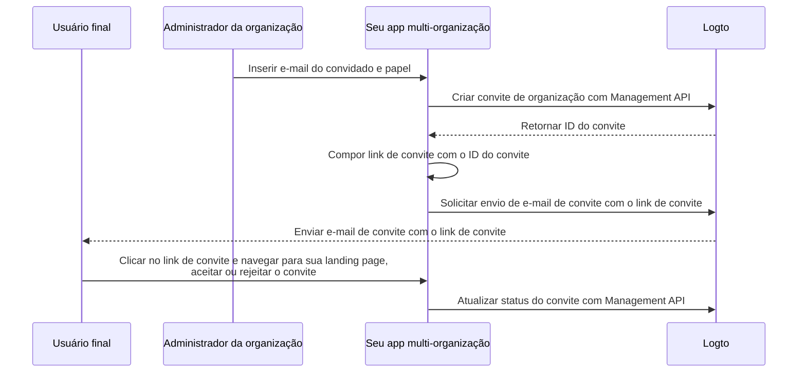

# Convidar membros da organização

Em aplicativos multi-inquilinos, um requisito comum é convidar membros para uma organização. Este guia apresenta as etapas e detalhes técnicos para implementar esse recurso.

## Visão geral do fluxo \{#flow-overview}

O processo geral é ilustrado no diagrama abaixo:



## Criar papéis da organização \{#create-organization-roles}

Antes de convidar membros, crie papéis da organização. Veja o [template de organização](/authorization/organization-template) para saber mais sobre papéis e permissões.

Neste guia, vamos criar dois papéis típicos de organização: `admin` e `member`.

O papel `admin` tem acesso total a todos os recursos da organização, enquanto o papel `member` tem acesso limitado. Por exemplo:

- Papel `admin`:
  - `read:data` - Acesso de leitura a todos os recursos de dados da organização.
  - `write:data` - Acesso de escrita a todos os recursos de dados da organização.
  - `delete:data` - Acesso de exclusão a todos os recursos de dados da organização.
  - `invite:member` - Convidar membros para a organização.
  - `manage:member` - Gerenciar membros na organização.
  - `delete:member` - Remover membros da organização.
- Papel `member`:
  - `read:data` - Acesso de leitura a todos os recursos de dados da organização.
  - `write:data` - Acesso de escrita a todos os recursos de dados da organização.
  - `invite:member` - Convidar membros para a organização.

Isso pode ser feito facilmente no [Logto Console](https://cloud.logto.io/). Você também pode usar o [Logto Management API](https://openapi.logto.io/operation/operation-createorganizationrole) para criar papéis de organização programaticamente.

## Configure seu conector de e-mail \{#configure-your-email-connector}

Como os convites são enviados por e-mail, certifique-se de que seu [conector de e-mail](/connectors/email-connectors) está devidamente configurado. Para enviar convites, configure um [template de e-mail](/connectors/email-connectors/email-templates#email-template-types) com o tipo de uso `OrganizationInvitation`. Você pode incluir variáveis de organização (por exemplo, nome, logo) e do convidador (por exemplo, e-mail, nome) [variáveis](/connectors/email-connectors/email-templates#email-template-variables) no conteúdo, e personalizar [templates localizados](/connectors/email-connectors/email-templates#email-template-localization) conforme necessário.

Um exemplo de template de e-mail para o tipo de uso `OrganizationInvitation` é mostrado abaixo:

```json
{
  "subject": "Bem-vindo à minha organização",
  "content": "<p>Junte-se à {{organization.name}} por este <a href=\"{{link}}\" target=\"_blank\">link</a>.</p>",
  "usageType": "OrganizationInvitation",
  "type": "text/html"
}
```

O placeholder `{{link}}` no conteúdo do e-mail será substituído pelo link real do convite quando o e-mail for enviado.

:::note

O “serviço de e-mail Logto” integrado do Logto Cloud atualmente não suporta o tipo de uso `OrganizationInvitation`. Configure seu próprio conector de e-mail (por exemplo, SendGrid) e configure o template `OrganizationInvitation`.

:::

## Gerenciar convites com Logto Management API \{#handle-invitations-with-logto-management-api}

:::note

Se você ainda não configurou o Logto Management API, veja [Interaja com Management API](/integrate-logto/interact-with-management-api) para detalhes.

:::

### Criar um convite de organização com Logto Management API \{#create-an-organization-invitation-with-logto-management-api}

Há um conjunto de APIs de convite no recurso de organizações. Com essas APIs, você pode:

- `POST /api/organization-invitations`: Criar um convite de organização com um papel de organização atribuído.
- `POST /api/one-time-tokens`: Criar um token de uso único para o convidado autenticar ao aceitar o convite. [Saiba mais](/end-user-flows/one-time-token)
- `POST /api/organization-invitations/{id}/message`: Enviar o convite da organização para o convidado por e-mail.

:::note

O payload suporta uma propriedade `link` para que você possa compor seu próprio link de convite com base no ID do convite. Por exemplo:

:::

```json
{
  "link": "https://your-app.com/invitation/join?id=your-invitation-id&token=your-one-time-token&email=invitee-email"
}
```
