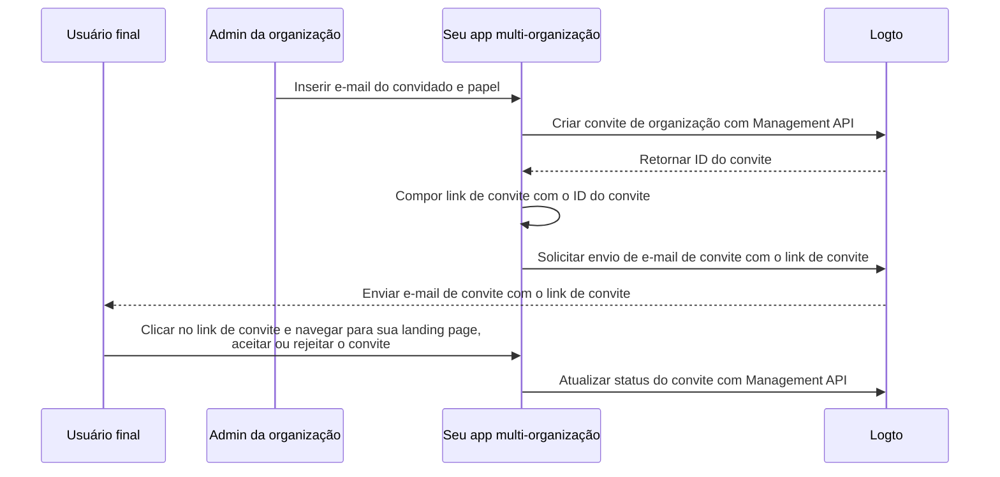

# Convidar membros da organização

Como um aplicativo multi-organização, um requisito comum é convidar membros para sua organização. Neste guia, vamos mostrar os passos e detalhes técnicos para implementar esse recurso em seu aplicativo.

## Visão geral do fluxo \{#flow-overview}

O processo geral é ilustrado no diagrama abaixo:



## Criar papéis da organização \{#create-organization-roles}

Antes de convidar membros para sua organização, você precisa criar papéis da organização. Confira o [Template de organização](/authorization/organization-template) para saber mais sobre papéis e permissões da organização.

Neste guia, vamos criar dois papéis típicos de organização: `admin` e `member`.

O papel `admin` tem acesso total a todos os recursos da organização, enquanto o papel `member` tem acesso limitado. Por exemplo, cada papel pode ter um conjunto de permissões como segue:

- Papel `admin`:
  - `read:data` - Acesso de leitura a todos os recursos de dados da organização.
  - `write:data` - Acesso de escrita a todos os recursos de dados da organização.
  - `delete:data` - Acesso de exclusão a todos os recursos de dados da organização.
  - `invite:member` - Convidar membros para a organização.
  - `manage:member` - Gerenciar membros na organização.
  - `delete:member` - Remover membros da organização.
- Papel `member`:
  - `read:data` - Acesso de leitura a todos os recursos de dados da organização.
  - `write:data` - Acesso de escrita a todos os recursos de dados da organização.
  - `invite:member` - Convidar membros para a organização.

Isso pode ser feito facilmente no [Logto Console](https://cloud.logto.io/). Você também pode usar o [Logto Management API](https://openapi.logto.io/operation/operation-createorganizationrole) para criar papéis de organização programaticamente.

## Configure seu conector de e-mail \{#configure-your-email-connector}

Como os convites são enviados por e-mail, certifique-se de que seu [conector de e-mail](/connectors/email-connectors) está devidamente configurado. Para enviar convites, você precisa configurar um tipo de uso de [template de e-mail](/connectors/email-connectors/email-templates#email-template-types) - `OrganizationInvitation`. Você também pode incluir variáveis de organização (por exemplo, nome da organização, logo) e do convidador (por exemplo, e-mail do convidador, nome) [variáveis](/connectors/email-connectors/email-templates#email-template-variables) no conteúdo, ou personalizar [templates multilíngues](/connectors/email-connectors/email-templates#email-template-localization) conforme necessário.

Um exemplo de template de e-mail para o tipo de uso `OrganizationInvitation` é mostrado abaixo:

```json
{
  "subject": "Bem-vindo à minha organização",
  "content": "<p>Junte-se à {{organization.name}} por este <a href=\"{{link}}\" target=\"_blank\">link</a>.</p>",
  "usageType": "OrganizationInvitation",
  "type": "text/html"
}
```

O placeholder `{{link}}` no conteúdo do e-mail será substituído pelo link real de convite ao enviar o e-mail. Neste guia, vamos supor que seria `https://your-app.com/invitation/accept/{your-invitation-id}`.

:::note

O "serviço de e-mail Logto" integrado do Logto Cloud não suporta o tipo de uso `OrganizationInvitation` no momento. Em vez disso, você precisa configurar seu conector de e-mail (por exemplo, Sendgrid) e configurar o template `OrganizationInvitation`.

:::

## Lidar com convites usando Logto Management API \{#handle-invitations-with-logto-management-api}

:::note

Se você ainda não configurou o Logto Management API, confira [Interaja com Management API](/integrate-logto/interact-with-management-api) para detalhes.

:::

Fornecemos um conjunto de APIs de Management relacionadas a convites no recurso de organizações. Com essas APIs, você pode:

- `POST /api/organization-invitations` criar um convite de organização com um papel de organização atribuído.
- `POST /api/organization-invitations/{id}/message` enviar o convite da organização para o convidado por e-mail.
  Observação: O payload desta API suporta uma propriedade `link`, você pode compor seu link de convite com base no ID do convite. Por exemplo:

  ```json
  {
    "link": "https://your-app.com/invitation/accept/{your-invitation-id}"
  }
  ```

  Assim, você precisa implementar uma landing page quando seu convidado acessar o link de convite em seu aplicativo.

- `GET /api/organization-invitations` & `GET /api/organization-invitations/{id}` obter todos os seus convites ou um específico pelo ID.
  Em sua landing page, use essas APIs para listar todos os convites ou detalhes de um convite que um usuário recebeu.
- `PUT /api/organization-invitations/{id}/status` aceitar ou rejeitar o convite atualizando o status do convite.
  Use esta API para lidar com a resposta do usuário ao convite.

## Use controle de acesso baseado em papel (RBAC) da organização para gerenciar permissões de usuário \{#use-organization-role-based-access-control-rbac-to-manage-user-permissions}

Com as configurações acima, agora você pode enviar convites por e-mail, e os convidados podem ingressar na organização com o papel atribuído.

Usuários com diferentes papéis de organização terão diferentes escopos (permissões) em seus tokens de organização. Assim, tanto seu app cliente quanto os serviços de backend devem verificar esses escopos para determinar recursos visíveis e ações permitidas.

## Lidar com atualizações de escopo em tokens de organização \{#handle-scope-updates-in-organization-tokens}

:::note
Esta seção envolve tópicos avançados sobre gerenciamento de template de organização e cenários de autorização. Se você não está familiarizado com esses conceitos, leia primeiro [Autorização](/authorization) e [Template de organização](/authorization/organization-template).
:::

Gerenciar atualizações de escopo em tokens de organização envolve:

### Revogar escopos existentes \{#revoking-existing-scopes}

Por exemplo, rebaixar um admin para um membro não-admin deve remover escopos do usuário. Nesse caso, você pode simplesmente limpar o token de organização em cache e buscar um novo com o refresh token. Os escopos reduzidos serão refletidos imediatamente no novo token de organização emitido.

### Conceder novos escopos \{#granting-new-scopes}

Isso pode ser dividido em dois cenários:

#### Conceder novos escopos já definidos em seu sistema de autenticação \{#grant-new-scopes-that-already-defined-in-your-auth-system}

Semelhante à revogação de escopos, se o novo escopo concedido já estiver registrado no servidor de autenticação, você pode simplesmente emitir um novo token de organização, e os novos escopos serão refletidos imediatamente.

#### Conceder novos escopos recém-introduzidos em seu sistema de autenticação \{#grant-new-scopes-that-are-newly-introduced-your-auth-system}

Nesse caso, você precisa acionar um processo de novo login ou novo consentimento para atualizar o token de organização do usuário. Por exemplo, chamando o método `signIn` no Logto SDK.

### Implementar verificação de permissão em tempo real e atualizar token de organização \{#implement-real-time-permission-check-and-update-organization-token}

O Logto fornece Management API para buscar permissões de usuário em tempo real na organização.

- `GET /api/organizations/{id}/users/{userId}/scopes` ([Referências da API](https://openapi.logto.io/operation/operation-listorganizationuserscopes))

Você pode então comparar os escopos no token de organização do usuário com as permissões em tempo real para determinar se o usuário foi promovido ou rebaixado.

- Se rebaixado, você pode simplesmente limpar o token de organização em cache e o SDK emitirá automaticamente um novo com os escopos atualizados.

  ```ts
  const { clearAccessToken } = useLogto();

  ...
  // Se os escopos em tempo real buscados forem menores que os escopos do token de organização
  await clearAccessToken();
  ```

  Isso não requer um novo login ou processo de consentimento. Novos tokens de organização serão emitidos automaticamente pelo Logto SDK.

- Se um novo escopo for introduzido em seu sistema de autenticação, acione um novo login ou processo de consentimento para atualizar o token de organização do usuário. Vamos usar o SDK React como exemplo:

  ```ts
  const { clearAllTokens, signIn } = useLogto();

  ...
  // Se os escopos em tempo real buscados tiverem escopos recém-atribuídos em relação aos escopos do token de organização
  await clearAllTokens();
  signIn({
    redirectUri: '<your-sign-in-redirect-uri>',
    prompt: 'consent',
  });
  ```

  O código acima acionará uma navegação para a tela de consentimento e redirecionará automaticamente de volta ao seu app, com os escopos atualizados no token de organização do usuário.

## Recursos relacionados \{#related-resources}

<Url href="https://blog.logto.io/implement-user-collaboration-in-your-app">
  Como implementamos colaboração de usuários em um app multi-inquilino
</Url>
