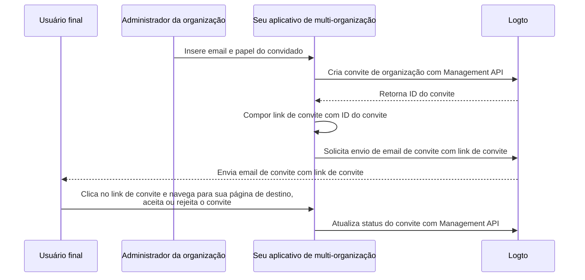

# Convidar membros da organização

Como um aplicativo de multi-organização, um requisito comum é convidar membros para sua organização. Neste guia, vamos orientá-lo através dos passos e detalhes técnicos para implementar esse recurso em seu aplicativo.

## Visão geral do fluxo

O processo geral é ilustrado no diagrama abaixo:



## Criar papéis da organização

Antes de convidar membros para sua organização, você precisa criar papéis da organização. Confira o guia [Configurar modelo de organização](/authorization/organization-template/configure-organization-template) para instruções detalhadas.

Neste guia, vamos criar dois papéis típicos de organização: `admin` e `member`.

O papel `admin` tem acesso total a todos os recursos da organização, enquanto o papel `member` tem acesso limitado. Por exemplo, cada papel pode ter um conjunto de permissões como segue:

- Papel `admin`:
  - `read:data` - Acesso de leitura a todos os recursos de dados da organização.
  - `write:data` - Acesso de escrita a todos os recursos de dados da organização.
  - `delete:data` - Acesso de exclusão a todos os recursos de dados da organização.
  - `invite:member` - Convidar membros para a organização.
  - `manage:member` - Gerenciar membros na organização.
  - `delete:member` - Remover membros da organização.
- Papel `member`:
  - `read:data` - Acesso de leitura a todos os recursos de dados da organização.
  - `write:data` - Acesso de escrita a todos os recursos de dados da organização.
  - `invite:member` - Convidar membros para a organização.

Isso pode ser feito facilmente no [Logto Console](https://cloud.logto.io/). Você também pode usar o [Logto Management API](https://openapi.logto.io/operation/operation-createorganizationrole) para criar papéis de organização programaticamente.

## Configurar seu conector de email

Como os convites são enviados por email, certifique-se de que seu [conector de email](/connectors/email-connectors) esteja devidamente configurado. Para enviar convites, você precisa configurar um tipo de uso de [modelo de email](/connectors/email-connectors/email-templates#email-template-types) recém-introduzido - `OrganizationInvitation`.

Um modelo de email de exemplo para o tipo de uso `OrganizationInvitation` é mostrado abaixo:

```json
{
  "subject": "Bem-vindo à minha organização",
  "content": "<p>Junte-se à minha organização por este <a href=\"{{link}}\" target=\"_blank\">link</a>.</p>",
  "usageType": "OrganizationInvitation",
  "type": "text/html"
}
```

O espaço reservado `{{link}}` no conteúdo do email será substituído pelo link de convite real ao enviar o email. Neste guia, vamos supor que seria `https://your-app.com/invitation/accept/{your-invitation-id}`.

:::note

O "serviço de email Logto" embutido no Logto Cloud não suporta o tipo de uso `OrganizationInvitation` no momento. Em vez disso, você precisa configurar seu conector de email (por exemplo, Sendgrid) e configurar o modelo `OrganizationInvitation`.

:::

## Lidar com convites com Logto Management API

:::note

Se você ainda não configurou o Logto Management API, confira [Interagir com Management API](/integrate-logto/interact-with-management-api) para detalhes.

:::

Fornecemos um conjunto de APIs de gerenciamento relacionadas a convites no recurso de organizações. Com essas APIs, você pode:

- `POST /api/organization-invitations` criar um convite de organização com um papel de organização atribuído.
- `POST /api/organization-invitations/{id}/message` enviar o convite da organização para o convidado por email.
  Nota: Este payload de API suporta uma propriedade `link`, você pode compor seu link de convite com base no ID do convite. Por exemplo:

  ```json
  {
    "link": "https://your-app.com/invitation/accept/{your-invitation-id}"
  }
  ```

  Consequentemente, você precisa implementar uma página de destino quando seu convidado navegar pelo link de convite para seu aplicativo.

- `GET /api/organization-invitations` & `GET /api/organization-invitations/{id}` obter todos os seus convites ou um específico por ID.
  Na sua página de destino, use essas APIs para listar todos os convites ou detalhes de um convite que um usuário recebeu.
- `PUT /api/organization-invitations/{id}/status` aceitar ou rejeitar o convite atualizando o status do convite.
  Use esta API para lidar com a resposta do usuário ao convite.

Por favor, note que todas as APIs listadas acima requerem um "token de organização" válido. [Confira este guia](/authorization/organization-template/protect-organization-resources#step-2-fetch-the-organization-token) para aprender como obter o token de organização.

## Usar controle de acesso baseado em papel (RBAC) da organização para gerenciar permissões de usuário

Com as configurações acima, você pode agora enviar convites por email, e os convidados podem se juntar à organização com o papel atribuído.

Usuários com diferentes papéis de organização terão diferentes escopos (permissões) em seus tokens de organização. Assim, tanto seu aplicativo cliente quanto os serviços de backend devem verificar esses escopos para determinar recursos visíveis e ações permitidas.

## Lidar com atualizações de escopo em tokens de organização

:::note

Certifique-se de ter integrado a organização com seu aplicativo. Confira o [guia de integração](/authorization/organization-template/protect-organization-resources) para mais detalhes.

:::

Gerenciar atualizações de escopo em tokens de organização envolve:

### Revogar escopos existentes

Por exemplo, rebaixar um administrador para um membro não-administrador deve remover escopos do usuário. Nesse caso, você pode simplesmente limpar o token de organização em cache e buscar um novo com token de atualização. Os escopos reduzidos serão refletidos imediatamente no novo token de organização emitido.

### Conceder novos escopos

Isso pode ser dividido em dois cenários:

#### Conceder novos escopos já definidos em seu sistema de autenticação

Semelhante à revogação de escopos, se o novo escopo concedido já estiver registrado no servidor de autenticação, você pode simplesmente emitir um novo token de organização, e os novos escopos serão refletidos imediatamente.

#### Conceder novos escopos que são recém-introduzidos em seu sistema de autenticação

Nesse caso, você precisa acionar um processo de novo login ou novo consentimento para atualizar o token de organização do usuário. Por exemplo, chamando o método `signIn` no Logto SDK.

Saiba mais sobre [emitir um token de organização](/authorization/organization-template/protect-organization-resources/#fetch-the-organization-token).

### Implementar verificação de permissão em tempo real e atualizar token de organização

Logto fornece Management API para buscar permissões de usuário em tempo real na organização.

- `GET /api/organizations/{id}/users/{userId}/scopes` ([Referências de API](https://openapi.logto.io/operation/operation-listorganizationuserscopes))

Você pode então comparar os escopos no token de organização do usuário com as permissões em tempo real para determinar se o usuário foi promovido ou rebaixado.

- Se rebaixado, você pode simplesmente limpar o token de organização em cache e o SDK emitirá automaticamente um novo com os escopos atualizados.

  ```ts
  const { clearAccessToken } = useLogto();

  ...
  // Se os escopos em tempo real buscados tiverem menos escopos do que os escopos do token de organização
  await clearAccessToken();
  ```

  Isso não requer um processo de novo login ou novo consentimento. Novos tokens de organização serão emitidos automaticamente pelo Logto SDK.

- Se um novo escopo for introduzido em seu sistema de autenticação, acione um processo de novo login ou novo consentimento para atualizar o token de organização do usuário. Vamos tomar o SDK React como exemplo:

  ```ts
  const { clearAllTokens, signIn } = useLogto();

  ...
  // Se os escopos em tempo real buscados tiverem escopos recém-atribuídos do que os escopos do token de organização
  await clearAllTokens();
  signIn({
    redirectUri: '<your-sign-in-redirect-uri>',
    prompt: 'consent',
  });
  ```

  O código acima acionará uma navegação de página para a tela de consentimento e redirecionará automaticamente de volta para seu aplicativo, com escopos atualizados no token de organização do usuário.

## Recursos relacionados

<Url href="https://blog.logto.io/implement-user-collaboration-in-your-app">
  Como implementamos a colaboração de usuários dentro de um aplicativo multi-inquilino
</Url>
