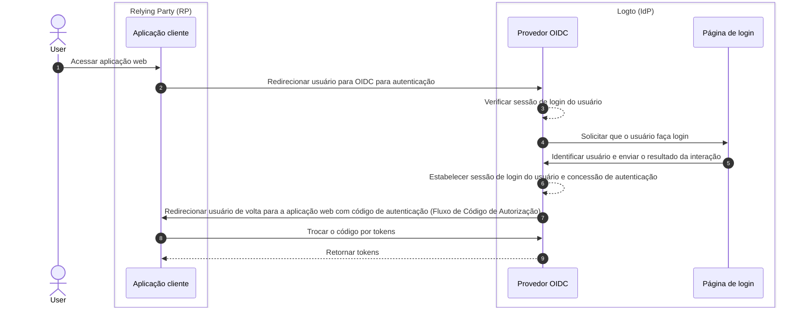

# Logout

O processo de logout no Logto (como um provedor de identidade baseado em OIDC) é um conceito multifacetado devido ao envolvimento tanto da sessão de login centralizada gerenciada pelo Logto quanto do status de autenticação distribuído gerenciado pelas aplicações cliente.

## Sessão de login

Para entender melhor o processo de logout, é importante primeiro entender como as sessões de login do usuário e seu status de autenticação são gerenciados no Logto.



1. O usuário acessa a aplicação web (RP).
2. A aplicação cliente redireciona o usuário para o Logto (IdP) para [autenticação (Authentication)](https://auth.wiki/authentication).
3. O provedor OIDC verifica o status da sessão de login do usuário. Se não houver sessão ou a sessão tiver expirado, o usuário é solicitado a fazer login.
4. O usuário interage com a página de login para ser autenticado.
5. Após o login bem-sucedido, o Logto cria uma nova sessão para o usuário e redireciona de volta para a aplicação cliente com um código de autorização.
6. O provedor OIDC cria uma nova sessão de login e concessão de autenticação para o usuário.
7. O provedor OIDC redireciona o usuário de volta para o cliente com um código de autenticação ([Fluxo de Código de Autorização](https://auth.wiki/authorization-code-flow)).
8. O cliente recebe o código de autenticação e o troca por tokens para acessar as informações do usuário.
9. Conceder tokens à aplicação cliente.

## Componentes

### Sessão de login centralizada gerenciada pelo Logto

No fluxo acima, a sessão de login centralizada é gerenciada pelo Logto. A sessão é criada quando o usuário faz login com sucesso e é destruída quando o usuário faz logout. A sessão também é destruída quando a sessão do usuário expira.

A sessão de login do Logto é gerenciada usando cookies de sessão. O cookie de sessão é definido quando o usuário faz login. Todas as solicitações de autenticação são validadas contra o cookie de sessão. Se o cookie de sessão estiver presente e válido, o usuário será automaticamente autenticado e redirecionado diretamente para a aplicação cliente com o código de autorização. Caso contrário, o usuário será solicitado a fazer login.

1. Cookie de sessão compartilhado do Logto
   Para um usuário que faz login em várias aplicações cliente a partir do mesmo agente de usuário (por exemplo, navegador), o usuário terá um cookie de sessão compartilhado sob o domínio do Logto. Isso significa que o usuário só precisa fazer login uma vez e será automaticamente autenticado para outras aplicações cliente.

   ```mermaid
    flowchart TD
    subgraph User [Agente de usuário A]
      U[Usuário]

      subgraph Layer1 [Domínio do cliente A]
        A[Aplicação Cliente A]
      end

      subgraph Layer1 [Domínio do cliente B]
        B[Aplicação Cliente B]
      end

      subgraph Layer2 [Domínio do Logto]
          C{{Sessão de login do Logto?}}
          D[Página de login]
      end
    end

    U --> |Login| A
    A --> |Redirecionar para Logto| C
    U --> |Login| B
    B --> |Redirecionar para Logto| C
    C --> |Não| D
    D --> |Criar sessão| C
   ```

2. Cookie de sessão isolado do Logto
   Para um usuário que faz login em diferentes aplicações cliente a partir de diferentes dispositivos ou navegadores, o usuário terá cookies de sessão isolados sob o domínio do Logto. Isso significa que o usuário precisa fazer login separadamente para cada aplicação cliente.

   ```mermaid
    flowchart TD
    U[Usuário]

    subgraph DeviceA [Agente de usuário A]
      subgraph Layer1 [Domínio do cliente A]
        A[Aplicação Cliente A]
      end

      subgraph Layer2 [Domínio do Logto]
          C{{Sessão de login do Logto?}}
          D[Página de login]
      end
    end

    subgraph DeviceB [Agente de usuário B]
      subgraph Layer3 [Domínio do cliente B]
        B[Aplicação Cliente B]
      end

      subgraph Layer4 [Domínio do Logto]
          E{{Sessão de login do Logto?}}
          F[Página de login]
      end
    end

    U --> |Login| A
    A --> |Redirecionar para Logto| C
    U --> |Login| B
    B --> |Redirecionar para Logto| E
    C --> |Não| D
    E --> |Não| F
    D --> |Criar sessão| C
    F --> |Criar sessão| E
   ```

## Status de autenticação distribuído gerenciado pelas aplicações cliente

Cada aplicação cliente mantém seu próprio status de autenticação. Seja uma aplicação Nativa, SPA ou Web, todas têm sua própria maneira de gerenciar o status de autenticação do usuário.

Após o login bem-sucedido, a aplicação cliente pode receber um [Token de ID (ID token)](https://auth.wiki/id-token) e um [Token de acesso (Access token)](https://auth.wiki/access-token). A aplicação cliente pode usar o Token de ID para determinar a identidade do usuário e o Token de acesso para acessar os recursos do usuário. O status de autenticação do usuário é representado pelo tempo de expiração do Token de acesso.

- Aplicações Nativas e SPA:
  A aplicação cliente precisa armazenar e gerenciar esses tokens de forma segura para manter o status de autenticação do usuário. Por exemplo, armazenar os tokens no armazenamento local ou de sessão e limpar os tokens quando o usuário fizer logout.
- Aplicações Web:
  Aplicações web, como aquelas construídas com frameworks como Next.js, geralmente gerenciam sua própria sessão para usuários logados juntamente com os tokens emitidos pelo Logto. Uma vez que o usuário faz login e a aplicação web recebe os tokens do Logto, ela pode armazenar os tokens no lado do cliente, assim como as aplicações SPA, ou pode armazenar os tokens no lado do servidor e gerenciar a sessão usando cookies ou outros mecanismos.

## Mecanismos de logout

### Limpar tokens e sessão local no lado do cliente

No lado do cliente, um logout simples envolve limpar a sessão local e remover tokens (Token de ID, Token de acesso, Token de atualização) do armazenamento local ou de sessão. Isso resulta em um logout apenas no lado do cliente, onde a sessão centralizada permanece intacta. Usuários que fazem logout dessa maneira ainda podem acessar outras aplicações sob a mesma sessão do servidor de autorização até que a sessão centralizada expire ou seja ativamente destruída.

### Limpar sessão de login no Logto

Para explicitamente fazer logout do usuário e limpar a sessão no Logto, a aplicação cliente precisa redirecionar o usuário para o **endpoint de término de sessão** do Logto.

Por exemplo, `https://{seu-domínio-logto}/oidc/session/end`

O **endpoint de término de sessão** é um endpoint padrão do OIDC que permite que a aplicação cliente notifique o servidor de autorização que o usuário fez logout. O endpoint limpará a sessão de login centralizada no Logto.

Uma vez que a sessão é limpa, qualquer solicitação de autorização subsequente exigirá que o usuário faça login novamente.

Se um **URI de redirecionamento pós-logout** for fornecido, o usuário será redirecionado para o URI especificado após a sessão ser limpa. Caso contrário, o usuário será redirecionado para a página padrão de pós-logout hospedada pelo Logto.

## Logout federado: Logout de back-channel

Para um gerenciamento de logout mais consistente, o Logto suporta [logout de back-channel](https://openid.net/specs/openid-connect-backchannel-1_0-final.html). O logout de back-channel é um mecanismo que permite que o Logto notifique todas as aplicações cliente sob a mesma sessão de login quando o usuário faz logout.

Isso é particularmente útil em cenários onde o usuário faz logout de uma aplicação cliente e espera ser desconectado de todas as outras aplicações cliente sob a mesma sessão de login do Logto.

Para habilitar o logout de back-channel para suas aplicações cliente, vá para a página de detalhes da aplicação no painel do Logto e registre um URI de logout de back-channel. O Logto enviará um token de logout para todos os URI registrados quando o usuário iniciar uma solicitação de logout de qualquer aplicação cliente.

Se sua aplicação cliente exigir que a sessão de login seja incluída no token de logout, ative as configurações `Is session required` na configuração de logout de back-channel. Uma reivindicação `sid` será incluída no token de logout para identificar a sessão de login do usuário no Logto.

1. O usuário inicia uma solicitação de logout de uma aplicação cliente.
2. O Logto recebe a solicitação de término de sessão, gera um token de logout e envia o token de logout para todos os URI de logout de back-channel registrados.
3. Cada aplicação cliente recebe o token de logout e executa ações de logout.

Ações de logout para cada aplicação cliente ao receber o token de logout:

- Validar o token de logout.
- Limpar a sessão local e remover tokens do armazenamento local ou de sessão.

## Métodos de logout nos SDKs do Logto

Se você estiver integrando o Logto com sua aplicação cliente usando os SDKs do Logto:

- Para aplicações SPA e web, o método `client.signOut()` limpará o armazenamento local de tokens e redirecionará o usuário para o endpoint de término de sessão do Logto. Você pode especificar um **URI de redirecionamento pós-logout** para redirecionar o usuário após a sessão ser limpa.
- Para aplicações nativas (incluindo aplicativos híbridos como **React Native** e **Flutter**), apenas o armazenamento local de tokens é limpo. Isso ocorre porque, em aplicações nativas, usamos o webview sem sessão para lidar com o processo de login. Nenhum cookie de sessão é armazenado no navegador nativo, portanto, não há necessidade de limpar a sessão de login no Logto. Cada solicitação de autenticação é uma solicitação independente que não carrega nenhum cookie de sessão.

:::note
Para aplicações nativas que não suportam webview sem sessão ou não reconhecem as configurações `emphasized` (aplicativo Android usando SDK **React Native** ou **Flutter**), você pode forçar o usuário a ser solicitado a fazer login novamente passando o parâmetro `prompt=login` na solicitação de autorização.
:::

## FAQs

<details>
  <summary>

### Não estou recebendo as notificações de logout de back-channel.

</summary>

- Certifique-se de que o URI de logout de back-channel está corretamente registrado no painel do Logto.
- Certifique-se de que sua aplicação cliente tem uma sessão de login ativa válida e é a mesma sessão que iniciou a solicitação de logout.

</details>

## Recursos relacionados

<Url href="https://blog.logto.io/oidc-back-channel-logout/">
  Entendendo o logout de back-channel do OIDC.
</Url>
