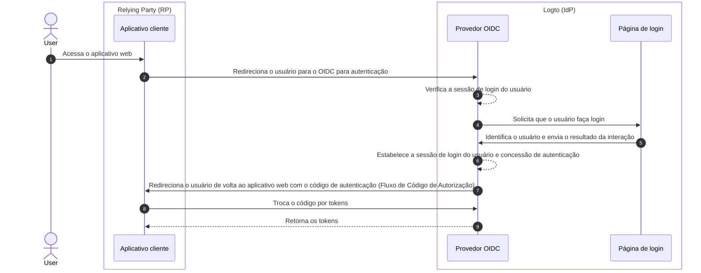

# Logout

O processo de logout no Logto (como um provedor de identidade baseado em OIDC) é um conceito multifacetado devido ao envolvimento tanto da sessão centralizada de login gerenciada pelo Logto quanto do status de autenticação distribuído gerenciado pelos aplicativos clientes.

## Sessão de login \{#sign-in-session}

Para entender melhor o processo de logout, é importante primeiro compreender como as sessões de login do usuário e seu status de autenticação são gerenciados no Logto.



1. O usuário acessa o aplicativo web (RP).
2. O aplicativo cliente redireciona o usuário para o Logto (IdP) para [autenticação (Authentication)](https://auth.wiki/authentication).
3. O provedor OIDC verifica o status da sessão de login do usuário. Se não existir sessão ou se a sessão tiver expirado, o usuário será solicitado a fazer login.
4. O usuário interage com a página de login para ser autenticado.
5. Após o login bem-sucedido, o Logto cria uma nova sessão para o usuário e redireciona de volta ao aplicativo cliente com um código de autorização.
6. O provedor OIDC cria uma nova sessão de login e concessão de autenticação para o usuário.
7. O provedor OIDC redireciona o usuário de volta ao cliente com um código de autenticação ([Fluxo de Código de Autorização](https://auth.wiki/authorization-code-flow)).
8. O cliente recebe o código de autenticação e o troca por tokens para acessar as informações do usuário.
9. Concede tokens ao aplicativo cliente.

## Componentes \{#components}

### Sessão de login centralizada gerenciada pelo Logto \{#centralized-sign-in-session-managed-by-logto}

No fluxo acima, a sessão de login centralizada é gerenciada pelo Logto. A sessão é criada quando o usuário faz login com sucesso e é destruída quando o usuário faz logout. A sessão também é destruída quando expira.

A sessão de login do Logto é gerenciada usando cookies de sessão. O cookie de sessão é definido quando o usuário faz login. Todas as solicitações de autenticação são validadas em relação ao cookie de sessão. Se o cookie de sessão estiver presente e válido, o usuário será autenticado automaticamente e redirecionado diretamente para o aplicativo cliente com o código de autorização. Caso contrário, o usuário será solicitado a fazer login.

1. Cookie de sessão compartilhado do Logto  
   Para um usuário que faz login em vários aplicativos clientes a partir do mesmo agente de usuário (por exemplo, navegador), o usuário terá um cookie de sessão compartilhado sob o domínio do Logto. Isso significa que o usuário só precisa fazer login uma vez e será autenticado automaticamente nos outros aplicativos clientes.

   ```mermaid
    flowchart TD
    subgraph User [Agente de usuário A]
      U[Usuário]

      subgraph Layer1 [Domínio do cliente A]
        A[Aplicativo Cliente A]
      end

      subgraph Layer1 [Domínio do cliente B]
        B[Aplicativo Cliente B]
      end

      subgraph Layer2 [Domínio Logto]
          C{{Sessão de login Logto?}}
          D[Página de login]
      end
    end

    U --> |Login| A
    A --> |Redireciona para Logto| C
    U --> |Login| B
    B --> |Redireciona para Logto| C
    C --> |Não| D
    D --> |Criar sessão| C
   ```

2. Cookie de sessão isolado do Logto  
   Para um usuário que faz login em diferentes aplicativos clientes a partir de diferentes dispositivos ou navegadores, o usuário terá cookies de sessão isolados sob o domínio do Logto. Isso significa que o usuário precisa fazer login separadamente para cada aplicativo cliente.

   ```mermaid
    flowchart TD
    U[Usuário]

    subgraph DeviceA [Agente de usuário A]
      subgraph Layer1 [Domínio do cliente A]
        A[Aplicativo Cliente A]
      end

      subgraph Layer2 [Domínio Logto]
          C{{Sessão de login Logto?}}
          D[Página de login]
      end
    end

    subgraph DeviceB [Agente de usuário B]
      subgraph Layer3 [Domínio do cliente B]
        B[Aplicativo Cliente B]
      end

      subgraph Layer4 [Domínio Logto]
          E{{Sessão de login Logto?}}
          F[Página de login]
      end
    end

    U --> |Login| A
    A --> |Redireciona para Logto| C
    U --> |Login| B
    B --> |Redireciona para Logto| E
    C --> |Não| D
    E --> |Não| F
    D --> |Criar sessão| C
    F --> |Criar sessão| E
   ```

## Status de autenticação distribuído gerenciado pelos aplicativos clientes \{#distributed-authentication-status-managed-by-the-client-applications}

Cada aplicativo cliente mantém seu próprio status de autenticação. Seja um aplicativo Nativo, SPA ou Web, todos têm sua própria maneira de gerenciar o status de autenticação do usuário.

Após o login bem-sucedido, o aplicativo cliente pode receber um [Token de ID (ID token)](https://auth.wiki/id-token) e um [Token de acesso (Access token)](https://auth.wiki/access-token). O aplicativo cliente pode usar o Token de ID para determinar a identidade do usuário e o Token de acesso para acessar os recursos do usuário. O status de autenticação do usuário é representado pelo tempo de expiração do Token de acesso.

- Aplicativos Nativos e SPA:  
  O aplicativo cliente precisa armazenar e gerenciar esses tokens de forma segura para manter o status de autenticação do usuário. Por exemplo, armazenar os tokens no local storage ou session storage, e limpar os tokens quando o usuário fizer logout.
- Aplicativos Web:  
  Aplicativos web, como aqueles construídos com frameworks como Next.js, geralmente gerenciam sua própria sessão para usuários autenticados juntamente com os tokens emitidos pelo Logto. Uma vez que o usuário faz login e o app web recebe os tokens do Logto, ele pode armazenar os tokens no lado do cliente como aplicativos SPA, ou pode armazenar os tokens no lado do servidor e gerenciar a sessão usando cookies ou outros mecanismos.

## Mecanismos de logout \{#sign-out-mechanisms}

### Limpar tokens e sessão local no lado do cliente \{#clear-tokens-and-local-session-at-the-client-side}

No lado do cliente, um logout simples envolve limpar a sessão local e remover os tokens (Token de ID, Token de acesso, Token de atualização) do local storage ou session storage. Isso resulta em um logout apenas do lado do cliente, onde a sessão centralizada permanece intacta. Usuários que fazem logout dessa maneira ainda podem acessar outros aplicativos sob a mesma sessão do servidor de autorização até que a sessão centralizada expire ou seja destruída ativamente.

### Limpar sessão de login no Logto \{#clear-sign-in-session-at-logto}

Para explicitamente fazer logout do usuário e limpar a sessão no Logto, o aplicativo cliente precisa redirecionar o usuário para o **endpoint de encerramento de sessão** do Logto.

Exemplo: `https://{your-logto-domain}/oidc/session/end`

O **endpoint de encerramento de sessão** é um endpoint padrão do OIDC que permite ao aplicativo cliente notificar o servidor de autorização de que o usuário fez logout. O endpoint irá limpar a sessão de login centralizada no Logto.

Uma vez que a sessão é limpa, qualquer solicitação de autorização subsequente exigirá que o usuário faça login novamente.

Se um **post-logout redirect URI** for fornecido, o usuário será redirecionado para o URI especificado após a sessão ser limpa. Caso contrário, o usuário será redirecionado para a página padrão de pós-logout hospedada pelo Logto.

## Logout federado: Back-channel logout \{#federated-sign-out-back-channel-logout}

Para um gerenciamento de logout mais consistente, o Logto suporta [back-channel logout](https://openid.net/specs/openid-connect-backchannel-1_0-final.html). O back-channel logout é um mecanismo que permite ao Logto notificar todos os aplicativos clientes sob a mesma sessão de login quando o usuário faz logout.

Isso é particularmente útil em cenários onde o usuário faz logout de um aplicativo cliente e espera ser desconectado de todos os outros aplicativos clientes sob a mesma sessão de login do Logto.

Para habilitar o back-channel logout para seus aplicativos clientes, vá até a página de detalhes do aplicativo no painel do Logto e registre um URI de back-channel logout. O Logto enviará um token de logout para todos os URIs registrados quando o usuário iniciar uma solicitação de logout de qualquer aplicativo cliente.

Se seu aplicativo cliente exigir que a sessão de login seja incluída no token de logout, ative a configuração `Is session required` na configuração de back-channel logout. Uma reivindicação `sid` será incluída no token de logout para identificar a sessão de login do usuário no Logto.

1. O usuário inicia uma solicitação de logout de um aplicativo cliente.
2. O Logto recebe a solicitação de encerramento de sessão, gera um token de logout e envia o token de logout para todos os URIs de back-channel logout registrados.
3. Cada aplicativo cliente recebe o token de logout e executa as ações de logout.

Ações de logout para cada aplicativo cliente ao receber o token de logout:

- Validar o token de logout.
- Limpar a sessão local e remover tokens do local storage ou session storage.

## Métodos de logout nos SDKs do Logto \{#sign-out-methods-in-logto-sdks}

Se você está integrando o Logto com seu aplicativo cliente usando os SDKs do Logto:

- Para aplicativos SPA e web, o método `client.signOut()` irá limpar o armazenamento local de tokens e redirecionar o usuário para o endpoint de encerramento de sessão do Logto. Você pode especificar um **post-logout redirect URI** para redirecionar o usuário após a sessão ser limpa.
- Para aplicativos nativos (incluindo apps híbridos como **React Native** e **Flutter**), apenas o armazenamento local de tokens é limpo. Isso ocorre porque, em aplicativos nativos, usamos o webview sem sessão para lidar com o processo de login. Nenhum cookie de sessão é armazenado no navegador nativo, então não há necessidade de limpar a sessão de login no Logto. Cada solicitação de autenticação é uma solicitação independente que não carrega cookies de sessão.

:::note
Para aplicativos nativos que não suportam webview sem sessão ou não reconhecem as configurações `emphasized` (aplicativo Android usando **React Native** ou **Flutter** SDK), você pode forçar o usuário a fazer login novamente passando o parâmetro `prompt=login` na solicitação de autorização.
:::

## Forçar reautenticação a cada acesso \{#enforce-re-authentication-on-every-access}

Em cenários de alta segurança — como verificar a identidade do usuário antes de ações sensíveis — você pode querer exigir que o usuário se reautentique a cada acesso. Para impor esse comportamento, inclua `prompt=login` em sua solicitação de autenticação.

Definir `prompt=login` força o Logto a sempre exibir a página de login, independentemente de o usuário ter uma sessão ativa ou ter feito login recentemente. Isso ignora o comportamento de autenticação única (SSO) e garante que o usuário seja solicitado a inserir suas credenciais toda vez.

Se seu aplicativo solicitar o escopo offline_access (para receber um token de atualização), a especificação OpenID Connect exige que você também inclua `prompt=consent`.  
Na maioria dos casos, para forçar a reautenticação e garantir a emissão do token de atualização, defina:

```
prompt=login consent
```

Isso garante que o usuário seja reautenticado e consinta explicitamente com o acesso offline.

## Perguntas frequentes \{#faqs}

<details>
  <summary>

### Não estou recebendo as notificações de back-channel logout. \{#im-not-receiving-the-back-channel-logout-notifications}

</summary>

- Certifique-se de que o URI de back-channel logout está corretamente registrado no painel do Logto.
- Certifique-se de que seu aplicativo cliente possui uma sessão de login ativa válida e que é a mesma sessão que iniciou a solicitação de logout.

</details>

## Recursos relacionados \{#related-resources}

<Url href="https://blog.logto.io/oidc-back-channel-logout/">
  Entendendo o back-channel logout do OIDC.
</Url>
