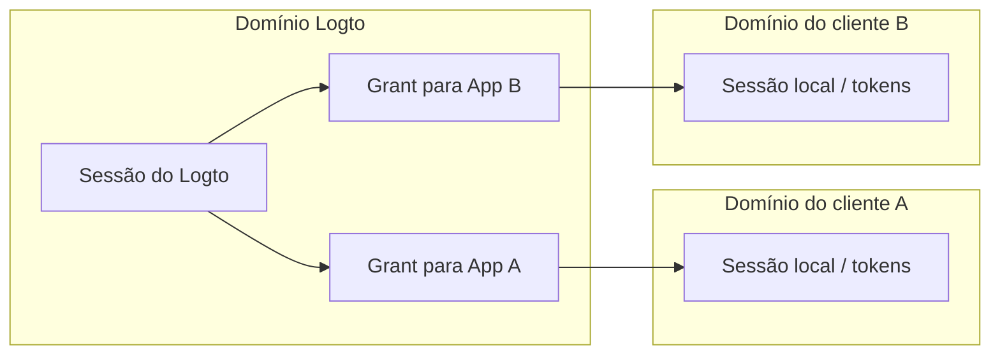
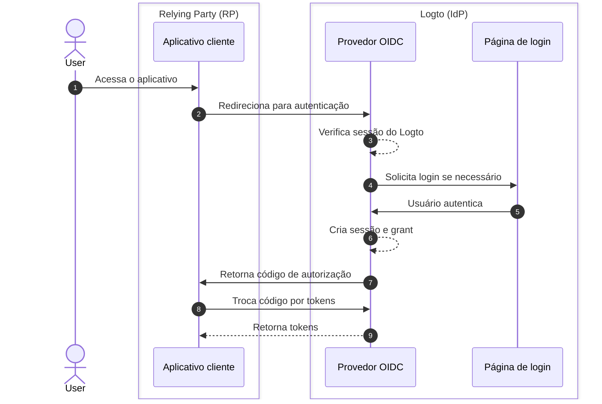
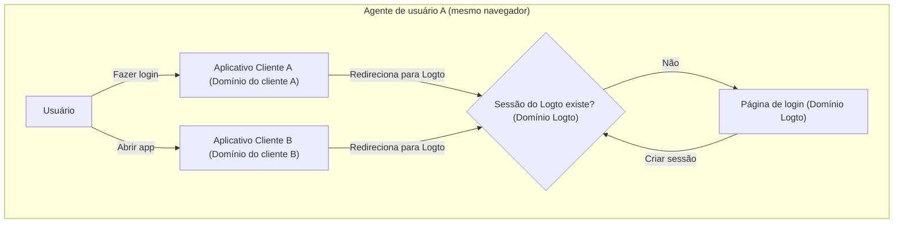
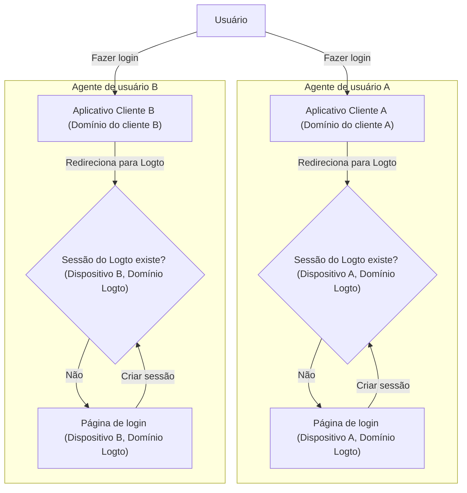
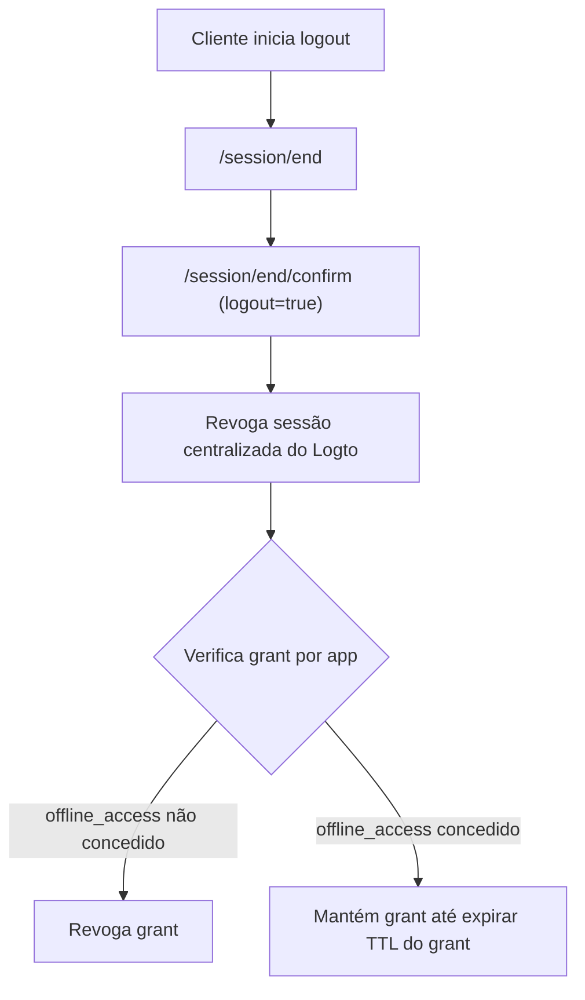

# Logout

O logout no Logto (como um provedor de identidade OIDC) envolve ambos:

- Uma **sessão centralizada do Logto** (cookie do navegador sob o domínio do Logto), e
- **Estado de autenticação distribuído no lado do cliente** (tokens e sessão local do app em cada aplicativo).

Para entender o comportamento de logout, ajuda separar essas duas camadas e depois ver como os **grants** as conectam.

## Conceitos principais \{#core-concepts}

### O que é uma sessão do Logto? \{#what-is-a-logto-session}

Uma sessão do Logto é o estado centralizado de login gerenciado pelo Logto. Ela é criada após uma autenticação bem-sucedida e representada por cookies sob o domínio do Logto.

Se o cookie de sessão for válido, o usuário pode ser autenticado silenciosamente (SSO) em vários aplicativos que confiam no mesmo tenant do Logto.

Se não existir uma sessão válida, o Logto exibe a página de login.

### O que são grants? \{#what-are-grants}

Um **grant** representa o status de autorização para uma combinação específica de usuário + aplicativo cliente.

- Uma sessão do Logto pode ter grants para vários aplicativos clientes.
- Um grant é o que associa os tokens emitidos.
- Neste conjunto de documentação, use **grant** como a unidade de autorização entre aplicativos.

### Como sessão, grants e status de autenticação do cliente se relacionam \{#how-session-grants-and-client-auth-status-relate}


```mermaid
flowchart LR
  subgraph Logto [Domínio Logto]
    S[Sessão do Logto]
    G1[Grant para App A]
    G2[Grant para App B]
  end

  subgraph AppA [Domínio do cliente A]
    A[Sessão local / tokens]
  end

  subgraph AppB [Domínio do cliente B]
    B[Sessão local / tokens]
  end

  S --> G1
  S --> G2
  G1 --> A
  G2 --> B
```

- **Sessão do Logto** controla a experiência centralizada de SSO.
- **Sessão/tokens locais do cliente** controlam se cada app atualmente trata o usuário como autenticado.
- **Grants** conectam esses dois mundos representando o estado de autorização específico do app.

## Recapitulação do login (por que o logout é multi-camadas) \{#sign-in-recap-why-sign-out-is-multi-layered}


```mermaid
sequenceDiagram
  autonumber
  actor User

  box Relying Party (RP)
    participant Client as Aplicativo cliente
  end

  box Logto (IdP)
    participant OIDC as Provedor OIDC
    participant SignIn as Página de login
  end

  User ->> Client: Acessa o aplicativo
  Client ->> OIDC: Redireciona para autenticação
  OIDC -->> OIDC: Verifica sessão do Logto
  OIDC ->> SignIn: Solicita login se necessário
  SignIn ->> OIDC: Usuário autentica
  OIDC -->> OIDC: Cria sessão e grant
  OIDC ->> Client: Retorna código de autorização
  Client ->> OIDC: Troca código por tokens
  OIDC -->> Client: Retorna tokens
```

## Topologia de sessão entre apps/dispositivos \{#session-topology-across-apps-devices}

### Cookie de sessão compartilhado (mesmo navegador/agente de usuário) \{#shared-session-cookie-same-browser-user-agent}

Se um usuário faz login em vários apps a partir do mesmo navegador, esses apps podem reutilizar o mesmo cookie de sessão do Logto e o comportamento de SSO se aplica.


```mermaid
flowchart TD
  U[Usuário]
  A["Aplicativo Cliente A (Domínio do cliente A)"]
  B["Aplicativo Cliente B (Domínio do cliente B)"]
  C{"Sessão do Logto existe? (Domínio Logto)"}
  D["Página de login (Domínio Logto)"]

  subgraph UA["Agente de usuário A (mesmo navegador)"]
    U
    A
    B
    C
    D
  end

  U -->|Fazer login| A
  A -->|Redireciona para Logto| C
  U -->|Abrir app| B
  B -->|Redireciona para Logto| C
  C -->|Não| D
  D -->|Criar sessão| C
```

### Cookies de sessão isolados (diferentes dispositivos/navegadores) \{#isolated-session-cookies-different-devices-browsers}

Navegadores/dispositivos diferentes mantêm cookies do Logto diferentes, então o estado da sessão de login é isolado.


```mermaid
flowchart TD
  U[Usuário]
  A["Aplicativo Cliente A (Domínio do cliente A)"]
  C{"Sessão do Logto existe? (Dispositivo A, Domínio Logto)"}
  D["Página de login (Dispositivo A, Domínio Logto)"]

  subgraph DeviceA["Agente de usuário A"]
    A
    C
    D
  end

  B["Aplicativo Cliente B (Domínio do cliente B)"]
  E{"Sessão do Logto existe? (Dispositivo B, Domínio Logto)"}
  F["Página de login (Dispositivo B, Domínio Logto)"]

  subgraph DeviceB["Agente de usuário B"]
    B
    E
    F
  end

  U -->|Fazer login| A
  A -->|Redireciona para Logto| C
  U -->|Fazer login| B
  B -->|Redireciona para Logto| E
  C -->|Não| D
  E -->|Não| F
  D -->|Criar sessão| C
  F -->|Criar sessão| E
```

## Mecanismos de logout \{#sign-out-mechanisms}

### 1) Logout apenas no lado do cliente \{#1-client-side-only-sign-out}

O app cliente limpa sua própria sessão local e tokens (tokens de ID / acesso / atualização). Isso faz o logout do usuário apenas do estado local desse app.

- A sessão do Logto pode ainda estar ativa.
- Outros apps sob a mesma sessão do Logto ainda podem usar SSO.

### 2) Encerrar sessão no Logto (logout global na implementação atual do Logto) \{#2-end-session-at-logto-global-sign-out-in-current-logto-implementation}

Para limpar a sessão centralizada do Logto, o app redireciona o usuário para o endpoint de encerramento de sessão, por exemplo:

`https://{seu-domínio-logto}/oidc/session/end`

No comportamento atual do SDK do Logto:

1. `signOut()` redireciona para `/session/end`.
2. Depois vai para `/session/end/confirm`.
3. O formulário de confirmação padrão faz auto-post com `logout=true`.

Como resultado, o logout pelo SDK atual é tratado como **logout global**.

### O que acontece durante o logout global \{#what-happens-during-global-sign-out}


```mermaid
flowchart TD
  A["Cliente inicia logout"] --> B["/session/end"]
  B --> C["/session/end/confirm (logout=true)"]
  C --> D["Revoga sessão centralizada do Logto"]
  D --> E{"Verifica grant por app"}
  E -->|"offline_access não concedido"| F["Revoga grant"]
  E -->|"offline_access concedido"| G["Mantém grant até expirar TTL do grant"]
```

Durante o logout global:

- A sessão centralizada do Logto é revogada.
- Grants relacionados aos apps são tratados conforme o estado de autorização do app:
  - Se `offline_access` **não** for concedido, os grants relacionados são revogados.
  - Se `offline_access` **for** concedido, os grants não são revogados pelo encerramento de sessão.
- Para casos de `offline_access`, tokens de atualização e grants permanecem válidos até a expiração do grant.

## Tempo de vida do grant e impacto do `offline_access` \{#grant-lifetime-and-offline-access-impact}

- O TTL padrão do grant do Logto é **180 dias**.
- Se `offline_access` for concedido, o encerramento de sessão não revoga esse grant do app por padrão.
- A cadeia de tokens de atualização associada a esse grant pode continuar até o grant expirar (ou ser explicitamente revogado).

## Logout federado: logout back-channel \{#federated-sign-out-back-channel-logout}

Para consistência entre apps, o Logto suporta [logout back-channel](https://openid.net/specs/openid-connect-backchannel-1_0-final.html).

Quando um usuário faz logout de um app, o Logto pode notificar todos os apps participantes da mesma sessão enviando um token de logout para o URI de logout back-channel registrado de cada app.

Se `Is session required` estiver habilitado nas configurações de back-channel do app, o token de logout inclui `sid` para identificar a sessão do Logto.

Fluxo típico:

1. O usuário inicia o logout em um app.
2. O Logto processa o encerramento de sessão e envia token(s) de logout para os URIs de logout back-channel registrados.
3. Cada app valida o token de logout e limpa sua própria sessão/tokens locais.

## Métodos de logout nos SDKs do Logto \{#sign-out-methods-in-logto-sdks}

- **SPA e web**: `client.signOut()` limpa o armazenamento local de tokens e redireciona para o endpoint de encerramento de sessão do Logto. Você pode fornecer um URI de redirecionamento pós-logout.
- **Nativo (incluindo React Native / Flutter)**: normalmente limpa apenas o armazenamento local de tokens. Webview sem sessão significa que não há cookie persistente do Logto no navegador para limpar.

:::note
Para aplicativos nativos que não suportam webview sem sessão ou não reconhecem as configurações `emphasized` (aplicativo Android usando **React Native** ou **Flutter** SDK), você pode forçar o prompt de login novamente passando o parâmetro `prompt=login` na solicitação de autenticação.
:::

## Forçar reautenticação a cada acesso \{#enforce-re-authentication-on-every-access}

Para ações de alta segurança, inclua `prompt=login` nas solicitações de autenticação para ignorar o SSO e forçar a entrada de credenciais toda vez.

Se solicitar `offline_access` (para receber tokens de atualização), inclua também `consent`, `prompt=login consent`.

Configuração típica combinada:

```txt
prompt=login consent
```

## Perguntas frequentes \{#faqs}

<details>
  <summary>

### Não estou recebendo as notificações de logout back-channel. \{#im-not-receiving-the-back-channel-logout-notifications}

</summary>

- Certifique-se de que o URI de logout back-channel está corretamente registrado no painel do Logto.
- Certifique-se de que seu app tem um estado de login ativo para o mesmo contexto de usuário/sessão.

</details>

## Recursos relacionados \{#related-resources}

<Url href="https://blog.logto.io/oidc-back-channel-logout/">
  Entendendo o logout back-channel do OIDC.
</Url>
