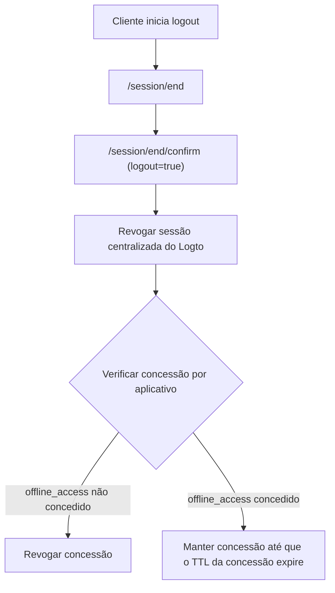

# Logout

O logout no Logto envolve duas camadas:

- **Logout da sessão Logto**: Encerra a sessão de login centralizada no domínio Logto.
- **Logout do aplicativo**: Limpa o estado da sessão local e tokens no seu aplicativo cliente.

Para entender melhor como as sessões funcionam no Logto, veja [Sessões](/sessions).

## Mecanismos de logout \{#sign-out-mechanisms}

### 1) Logout apenas no lado do cliente \{#1-client-side-only-sign-out}

O aplicativo cliente limpa sua própria sessão local e tokens (Tokens de ID / Tokens de acesso / Tokens de atualização). Isso faz com que o usuário saia apenas do estado local desse aplicativo.

- A sessão Logto pode ainda estar ativa.
- Outros aplicativos sob a mesma sessão Logto podem ainda usar SSO.

### 2) Encerrar sessão no Logto (logout global na implementação atual do Logto) \{#2-end-session-at-logto-global-sign-out-in-current-logto-implementation}

Para limpar a sessão centralizada do Logto, o aplicativo redireciona o usuário para o endpoint de encerramento de sessão, por exemplo:

`https://{your-logto-domain}/oidc/session/end`

No comportamento atual do Logto SDK:

1. `signOut()` redireciona para `/session/end`.
2. Em seguida, vai para `/session/end/confirm`.
3. O formulário de confirmação padrão auto-envia `logout=true`.

Como resultado, o logout atual do SDK é tratado como **logout global**.

:::note

- **Logout global**: Revogar a sessão centralizada do Logto.

:::

### O que acontece durante o logout global \{#what-happens-during-global-sign-out}


```mermaid
flowchart TD
  A["Cliente inicia logout"] --> B["/session/end"]
  B --> C["/session/end/confirm (logout=true)"]
  C --> D["Revogar sessão centralizada do Logto"]
  D --> E{"Verificar concessão por aplicativo"}
  E -->|"offline_access não concedido"| F["Revogar concessão"]
  E -->|"offline_access concedido"| G["Manter concessão até que o TTL da concessão expire"]
```

Durante o logout global:

- A sessão centralizada do Logto é revogada.
- As concessões de aplicativos relacionadas são tratadas por estado de autorização do aplicativo:
  - Se `offline_access` **não** for concedido, as concessões relacionadas são revogadas.
  - Se `offline_access` **for** concedido, as concessões não são revogadas pelo encerramento da sessão.
- Para casos de `offline_access`, tokens de atualização e concessões permanecem válidos até a expiração da concessão.

## Tempo de vida da concessão e impacto de `offline_access` \{#grant-lifetime-and-offline-access-impact}

- O TTL padrão da concessão do Logto é **180 dias**.
- Se `offline_access` for concedido, o encerramento da sessão não revoga essa concessão do aplicativo por padrão.
- A cadeia de tokens de atualização associada a essa concessão pode continuar até que a concessão expire (ou seja explicitamente revogada).

## Logout federado: logout de back-channel \{#federated-sign-out-back-channel-logout}

Para consistência entre aplicativos, o Logto suporta [logout de back-channel](https://openid.net/specs/openid-connect-backchannel-1_0-final.html).

Quando um usuário faz logout de um aplicativo, o Logto pode notificar todos os aplicativos participando da mesma sessão enviando um token de logout para o URI de logout de back-channel registrado de cada aplicativo.

Se `Is session required` estiver habilitado nas configurações de back-channel do aplicativo, o token de logout inclui `sid` para identificar a sessão Logto.

Fluxo típico:

1. O usuário inicia o logout de um aplicativo.
2. O Logto processa o encerramento da sessão e envia token(s) de logout para o(s) URI(s) de logout de back-channel registrado(s).
3. Cada aplicativo valida o token de logout e limpa sua própria sessão local / tokens.

## Métodos de logout nos SDKs do Logto \{#sign-out-methods-in-logto-sdks}

- **SPA e web**: `client.signOut()` limpa o armazenamento de tokens local e redireciona para o endpoint de encerramento de sessão do Logto. Você pode fornecer um URI de redirecionamento pós-logout.
- **Nativo (incluindo React Native / Flutter)**: geralmente limpa apenas o armazenamento de tokens local. Webview sem sessão significa que não há cookie persistente do navegador Logto para limpar.

:::note
Para aplicativos nativos que não suportam webview sem sessão ou não reconhecem as configurações `emphasized` (aplicativo Android usando SDK **React Native** ou **Flutter**), você pode forçar o prompt do usuário a fazer login novamente passando o parâmetro `prompt=login` na solicitação de autorização.
:::

## Forçar re-autenticação em cada acesso \{#enforce-re-authentication-on-every-access}

Para ações de alta segurança, inclua `prompt=login` nas solicitações de autenticação para ignorar o SSO e forçar a entrada de credenciais a cada vez.

Se estiver solicitando `offline_access` (para receber tokens de atualização), também inclua `consent`, `prompt=login consent`.

Configuração combinada típica:

```txt
prompt=login consent
```

## FAQs \{#faqs}

<details>
  <summary>

### Não estou recebendo as notificações de logout de back-channel. \{#im-not-receiving-the-back-channel-logout-notifications}

</summary>

- Certifique-se de que o URI de logout de back-channel esteja corretamente registrado no painel do Logto.
- Certifique-se de que seu aplicativo tenha um estado de login ativo para o mesmo contexto de usuário / sessão.

</details>

## Recursos relacionados \{#related-resources}

<Url href="https://blog.logto.io/oidc-back-channel-logout/">
  Entendendo o logout de back-channel OIDC.
</Url>
