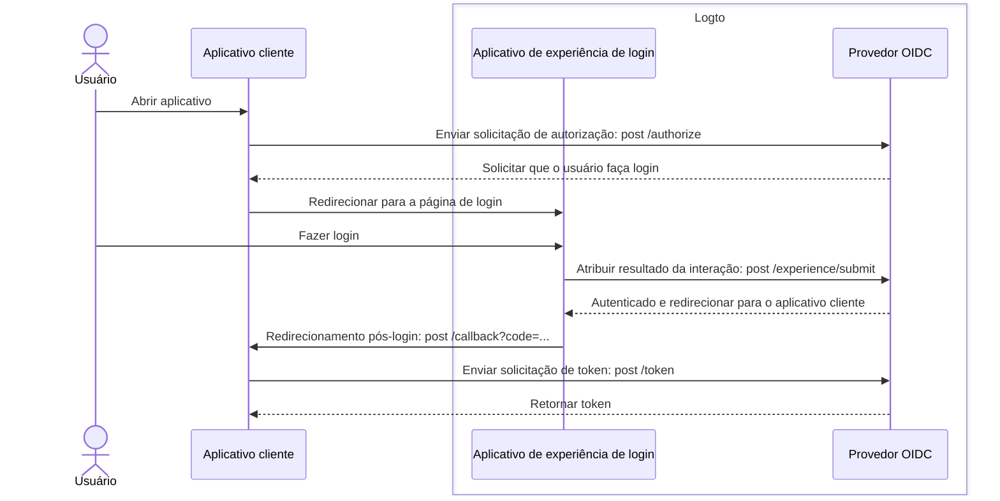
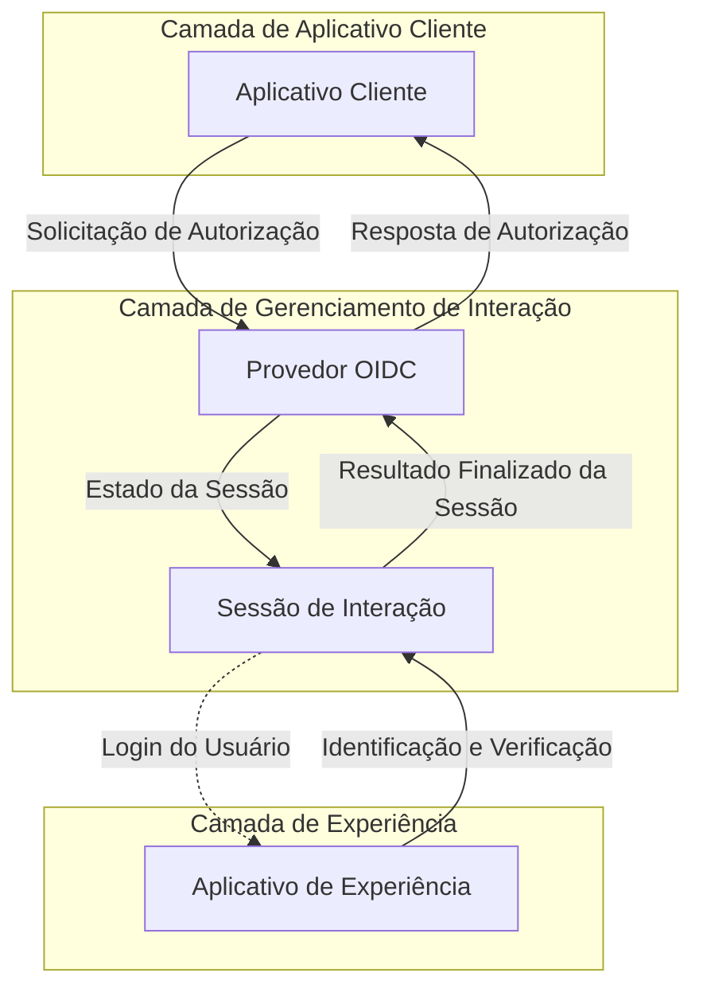

# Cadastro e login

Cadastro e login é o processo de interação central para usuários finais autenticarem e autorizarem o acesso a aplicativos clientes. Como uma plataforma centralizada de [CIAM](https://auth.wiki/iam) baseada em OIDC, o Logto fornece uma experiência de login universal para usuários em vários aplicativos e plataformas clientes.

## Fluxo do usuário

Em um fluxo de autenticação típico do [OIDC](https://auth.wiki/openid-connect), o usuário começa abrindo o aplicativo cliente. O aplicativo cliente envia uma [solicitação de autorização (authorization request)](https://auth.wiki/authorization-request) para o provedor OIDC do Logto. Se o usuário não tiver uma sessão ativa, o Logto irá direcionar o usuário para a página de experiência de login hospedada pelo Logto. O usuário interage com a página de experiência do Logto e é autenticado fornecendo as credenciais necessárias. Uma vez que o usuário é autenticado com sucesso, o Logto redireciona o usuário de volta para o aplicativo cliente com o [código de autorização (authorization code)](https://auth.wiki/authorization-code-flow#how-does-authorization-code-flow-work). O aplicativo cliente então envia uma [solicitação de token (token request)](https://auth.wiki/token-request) para o provedor OIDC do Logto com o código de autorização para obter os tokens.

## Interação do usuário

Uma **sessão de interação** é criada para cada interação do usuário quando um aplicativo cliente inicia uma solicitação de autorização. Esta sessão centraliza o status da interação do usuário em vários aplicativos clientes, permitindo que o Logto forneça uma experiência de login coesa. À medida que os usuários alternam entre aplicativos clientes, a sessão de interação permanece consistente, mantendo o status de autenticação do usuário e reduzindo a necessidade de logins repetidos em várias plataformas. Uma vez que a **sessão de interação** é estabelecida, o usuário é solicitado a fazer login no Logto.

O **aplicativo de experiência** no Logto é um aplicativo dedicado e hospedado que facilita a experiência de login. Quando os usuários precisam se autenticar, eles são direcionados para o **aplicativo de experiência**, onde completam seu login e interagem com o Logto. O **aplicativo de experiência** utiliza a sessão de interação ativa para rastrear e apoiar o progresso da interação do usuário.

Para apoiar e controlar essa jornada do usuário, o Logto apresenta um conjunto de **Experience APIs** baseadas em sessão. Essas APIs permitem que o **aplicativo de experiência** lide com uma ampla gama de métodos de identificação e verificação de usuários, atualizando e acessando o status da sessão de interação em tempo real.

Uma vez que o usuário atende a todos os requisitos de validação e verificação, a sessão de interação é concluída com uma submissão de resultado para o provedor OIDC, onde o usuário é totalmente autenticado e forneceu consentimento, finalizando o processo seguro de login.

## Personalização da experiência de login

O Logto fornece uma experiência de usuário flexível e personalizável para diversos requisitos de negócios. Incluindo personalização de marca, interface do usuário e fluxos de interação do usuário. O **aplicativo de experiência** pode ser adaptado para atender aos requisitos de marca e segurança do aplicativo cliente.

Continue aprendendo mais sobre a [configuração](/end-user-flows/sign-up-and-sign-in/sign-up) e [personalização](/customization) da experiência de login no Logto.

## Perguntas frequentes

  
Método ou personalização de experiência de login por aplicativo

Para aplicativos que exigem diferentes experiências de login ou personalização de marca, o Logto também suporta
personalização por aplicativo. Confira as [configurações do aplicativo](/customization/match-your-brand/#app-specific-branding) para mais detalhes.

  
Limitar domínio de email / endereço IP / Região

Para controle de acesso baseado em atributos, por exemplo, limitar o login com base no domínio de email, endereço IP ou região, você pode usar o recurso de [Reivindicações de token personalizadas](/developers/custom-token-claims/) no Logto para
rejeitar ou permitir solicitações de autorização com base nos atributos do usuário.

  
API sem interface para login e cadastro

Atualmente, o Logto não fornece uma API sem interface para login e cadastro. No entanto, você pode trazer
sua própria interface de login usando o [Traga sua própria interface](/customization/bring-your-ui/) para personalizar a experiência de login e
cadastro.

## Recursos relacionados

<Url href="https://blog.logto.io/deprecated-ropc-grant-type">
  Por que você deve descontinuar o tipo de concessão Resource Owner Password Credentials (ROPC)
</Url>

<Url href="https://blog.logto.io/implicit-flow-is-dead">
  Por que você deve usar o fluxo de código de autorização em vez do fluxo implícito?
</Url>

<Url href="https://blog.logto.io/token-based-authentication-vs-session-based-authentication">
  Comparando autenticação baseada em token e autenticação baseada em sessão
</Url>
