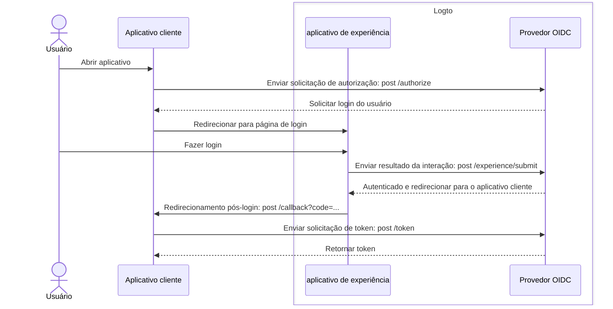
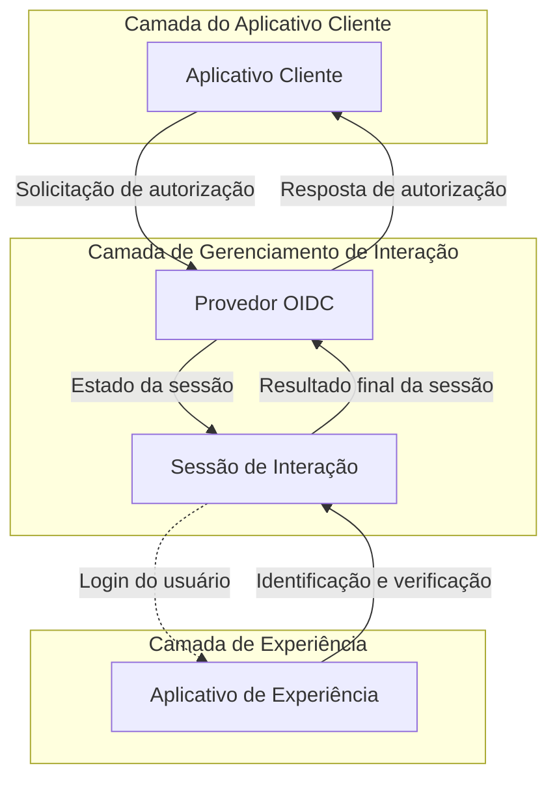

# Cadastro e login

O cadastro e login é o principal processo de interação para que usuários finais possam se autenticar e autorizar o acesso a aplicativos clientes. Como uma plataforma [CIAM](https://auth.wiki/iam) centralizada baseada em OIDC, o Logto oferece uma experiência universal de login para usuários em múltiplos aplicativos clientes e plataformas.

## Fluxo do usuário \{#user-flow}

Em um fluxo típico de autenticação [OIDC](https://auth.wiki/openid-connect), o usuário começa abrindo o aplicativo cliente. O aplicativo cliente envia uma [solicitação de autorização (authorization request)](https://auth.wiki/authorization-request) para o provedor OIDC do Logto. Se o usuário não tiver uma sessão ativa, o Logto irá direcioná-lo para a página de experiência de login hospedada pelo Logto. O usuário interage com a página de experiência do Logto e é autenticado ao fornecer as credenciais necessárias. Uma vez autenticado com sucesso, o Logto redireciona o usuário de volta ao aplicativo cliente com o [código de autorização (authorization code)](https://auth.wiki/authorization-code-flow#how-does-authorization-code-flow-work). O aplicativo cliente então envia uma [solicitação de token (token request)](https://auth.wiki/token-request) ao provedor OIDC do Logto com o código de autorização para obter os tokens.

```mermaid
sequenceDiagram
  actor user as Usuário
  participant client as Aplicativo cliente

  box Logto
    participant experience as aplicativo de experiência
    participant oidc as Provedor OIDC
  end

  user ->> client: Abrir aplicativo
  client ->> oidc: Enviar solicitação de autorização: post /authorize
  oidc -->> client: Solicitar login do usuário
  client ->> experience: Redirecionar para página de login
  user ->> experience: Fazer login
  experience ->> oidc: Enviar resultado da interação: post /experience/submit
  oidc -->> experience: Autenticado e redirecionar para o aplicativo cliente
  experience ->> client: Redirecionamento pós-login: post /callback?code=...
  client ->> oidc: Enviar solicitação de token: post /token
  oidc -->> client: Retornar token
```

## Interação do usuário \{#user-interaction}

Uma **sessão de interação** é criada para cada interação do usuário quando um aplicativo cliente inicia uma solicitação de autorização. Essa sessão centraliza o status da interação do usuário entre vários aplicativos clientes, permitindo que o Logto forneça uma experiência de login coesa. À medida que os usuários alternam entre aplicativos clientes, a sessão de interação permanece consistente, mantendo o status de autenticação do usuário e reduzindo a necessidade de múltiplos logins em diferentes plataformas. Uma vez que a **sessão de interação** é estabelecida, o usuário é solicitado a fazer login no Logto.

O **aplicativo de experiência (experience app)** no Logto é um aplicativo dedicado e hospedado que facilita a experiência de login. Quando os usuários precisam se autenticar, eles são direcionados ao **aplicativo de experiência**, onde concluem o login e interagem com o Logto. O **aplicativo de experiência** utiliza a sessão de interação ativa para acompanhar e dar suporte ao progresso da interação do usuário.

Para apoiar e controlar essa jornada do usuário, o Logto apresenta um conjunto de **Experience APIs** baseadas em sessão. Essas APIs permitem que o **aplicativo de experiência** lide com uma ampla variedade de métodos de identificação e verificação do usuário, atualizando e acessando o status da sessão de interação em tempo real.

Assim que o usuário atende a todos os requisitos de validação e verificação, a sessão de interação é concluída com o envio do resultado ao provedor OIDC, onde o usuário está totalmente autenticado e forneceu consentimento, finalizando o processo seguro de login.

```mermaid
flowchart TD
  %% Camadas
  subgraph Layer1 [Camada do Aplicativo Cliente]
      A[Aplicativo Cliente]
  end

  subgraph Layer2 [Camada de Gerenciamento de Interação]
      B[Provedor OIDC]
      C[Sessão de Interação]
  end

  subgraph Layer3 [Camada de Experiência]
      D[Aplicativo de Experiência]
  end

  %% Conexões
  A --> |Solicitação de autorização| B
  B --> |Estado da sessão| C
  C -.-> |Login do usuário| D
  D --> |Identificação e verificação| C
  C --> |Resultado final da sessão| B
  B --> |Resposta de autorização| A
```

:::note
As páginas de experiência são projetadas para serem acessadas apenas pelo fluxo de autenticação. Para evitar que mecanismos de busca indexem essas páginas e impedir o acesso direto, o Logto adiciona automaticamente `<meta name="robots" content="noindex, nofollow" />` à página HTML de experiência.
:::

## Personalização da experiência de login \{#sign-in-experience-customization}

O Logto oferece uma experiência de usuário flexível e personalizável para diversas necessidades de negócio. Incluindo personalização de marca, interface do usuário e fluxos de interação. O **aplicativo de experiência** pode ser ajustado para atender aos requisitos de marca e segurança do aplicativo cliente.

Continue aprendendo mais sobre a [configuração](/end-user-flows/sign-up-and-sign-in/sign-up) e [personalização](/customization) da experiência de login no Logto.

## Perguntas frequentes \{#faqs}

  

### Método ou marca de experiência de login por aplicativo \{#per-app-sign-in-experience-method-or-branding}

Para aplicativos ou organizações que exigem **UIs de login** distintas, o Logto suporta [personalização específica do aplicativo](/customization/match-your-brand#app-specific-branding) e [personalização específica da organização](/customization/match-your-brand#organization-specific-branding).

Se você precisa oferecer diferentes **métodos de login** com base no tipo de usuário ou site, basta usar [parâmetros de autenticação](/end-user-flows/authentication-parameters) (por exemplo, `first_screen` e `direct_sign_in`) para direcionar os usuários a uma página de login personalizada.

  

### Limitar domínio de email / endereço IP / região \{#limit-email-domain--ip-address--region}

Para controle de acesso baseado em atributos, por exemplo, limitar o login com base no domínio de email, endereço IP ou região, você pode usar o recurso de [Reivindicações personalizadas de token (Custom token claims)](/developers/custom-token-claims/) no Logto para rejeitar ou permitir solicitações de autorização com base nos atributos do usuário.

  

### API headless para login e cadastro \{#headless-api-for-sign-in-and-sign-up}

Atualmente, o Logto não oferece uma API headless para login e cadastro. No entanto, você pode criar sua própria interface de login usando o recurso [Traga sua própria UI (Bring your own UI)](/customization/bring-your-ui/) para personalizar a experiência de login e cadastro.

## Recursos relacionados \{#related-resources}

<Url href="https://blog.logto.io/deprecated-ropc-grant-type">
  Por que você deve descontinuar o tipo de concessão Resource Owner Password Credentials (ROPC)
</Url>

<Url href="https://blog.logto.io/implicit-flow-is-dead">
  Por que você deve usar o fluxo de código de autorização em vez do fluxo implícito?
</Url>

<Url href="https://blog.logto.io/token-based-authentication-vs-session-based-authentication">
  Comparando autenticação baseada em token e autenticação baseada em sessão
</Url>
