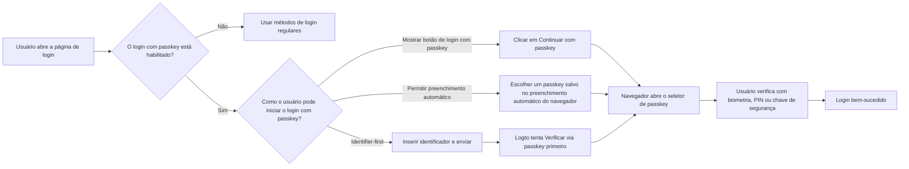
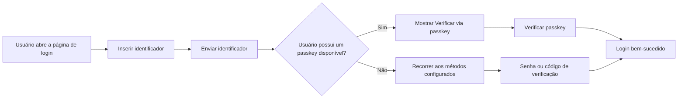
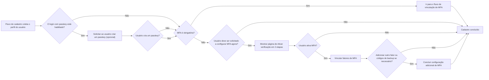

# Login com passkey

O login com passkey permite que os usuários se autentiquem com uma credencial WebAuthn diretamente durante o login, sem precisar inserir uma senha ou código de verificação primeiro. No Logto, a credencial usada para login com passkey é o mesmo modelo de credencial WebAuthn utilizado pela MFA, então as experiências de login e MFA estão intimamente conectadas.

Este documento explica como o login com passkey funciona na experiência de login integrada do Logto, como são os diferentes caminhos de entrada para os usuários finais e como ele interage com a MFA.

## Como funciona o login com passkey \{#how-passkey-sign-in-works}

Para usar o login com passkey, primeiro é necessário habilitá-lo na configuração da <CloudLink to="/sign-in-experience/sign-up-and-sign-in">experiência de login</CloudLink>. Depois de habilitado, o Logto pode oferecer o login com passkey de até três maneiras na página de login:

- Um botão dedicado `Continuar com passkey` na primeira tela de login.
- Um fluxo "identifier-first" que tenta `Verificar via passkey` após o usuário inserir seu e-mail, número de telefone ou nome de usuário.
- Preenchimento automático do navegador no campo de identificador, permitindo que o navegador sugira passkeys disponíveis diretamente do dispositivo atual.

De forma geral, a experiência se parece com isto:

## Três caminhos para login com passkey \{#three-passkey-sign-in-paths}

### 1. Mostrar botão "Continuar com passkey" habilitado \{#1-show-continue-with-passkey-button-enabled}

Quando a opção `Mostrar botão "Continuar com passkey"` está habilitada, a página de login exibe um botão `Continuar com passkey` na parte inferior da primeira tela.

O fluxo do usuário é:

1. Abrir a página de login.
2. Clicar em `Continuar com passkey`.
3. Selecionar um passkey no prompt do navegador ou sistema operacional.
4. Completar a verificação biométrica, PIN ou chave de hardware.
5. Login realizado com sucesso.

Este é o caminho mais direto. É ideal para usuários que já sabem que possuem um passkey salvo e desejam uma experiência de login em um passo.

### 2. Mostrar botão "Continuar com passkey" desabilitado \{#2-show-continue-with-passkey-button-disabled}

Quando a opção `Mostrar botão "Continuar com passkey"` está desabilitada, o Logto alterna para uma experiência "identifier-first" na primeira tela. A página solicita apenas o identificador do usuário inicialmente.

Após o usuário enviar o identificador:

1. O Logto verifica se o login com passkey está habilitado e se o usuário identificado possui um passkey utilizável.
2. Se um passkey estiver disponível, o Logto inicia primeiro o fluxo "Verificar via passkey".
3. O usuário pode concluir a verificação do passkey e fazer login imediatamente.
4. Se nenhum passkey estiver disponível, ou o usuário preferir outro método, o Logto recorre a outros métodos de verificação configurados.

Os métodos alternativos disponíveis dependem da configuração da experiência de login do tenant atual. Por exemplo, o usuário pode alternar para senha, código de verificação por e-mail ou código de verificação por telefone, dependendo de quais fatores estão habilitados para aquele identificador.

### 3. Permitir prompt e preenchimento automático \{#3-allow-prompting-and-autofill}

Quando a opção `Permitir prompt e preenchimento automático` está habilitada, navegadores compatíveis podem exibir os passkeys pré-salvos diretamente no campo de identificador.

O fluxo do usuário é:

1. Focar o campo de identificador na página de login.
2. O navegador sugere passkeys salvos para o domínio atual.
3. O usuário seleciona um passkey da lista de preenchimento automático.
4. O navegador solicita que o usuário verifique com biometria, PIN ou chave de hardware.
5. Login realizado com sucesso.

Esse fluxo é especialmente útil em dispositivos onde os passkeys já estão sincronizados pela plataforma, pois os usuários podem fazer login sem precisar ir manualmente para uma segunda página ou clicar em um botão dedicado de passkey.

## Fluxo de cadastro e vinculação de passkey \{#sign-up-and-passkey-binding-flow}

O login com passkey não é apenas um ponto de entrada para login. Ele também afeta o que acontece após o cadastro, pois a mesma credencial WebAuthn pode ser reutilizada posteriormente tanto para login quanto para MFA.

Após o usuário concluir as etapas normais de cadastro, o Logto pode solicitar que o usuário crie um passkey. Essa solicitação é opcional para os usuários finais, mas, uma vez criado o passkey, o próximo passo depende da política de MFA do tenant e do status de MFA do próprio usuário.

A lógica principal é:

## Relação entre login com passkey e MFA \{#relationship-between-passkey-sign-in-and-mfa}

### Login com passkey pula automaticamente a verificação de MFA \{#passkey-sign-in-automatically-skips-mfa-verification}

Um passkey usado para login com passkey é respaldado por uma credencial WebAuthn, e essa credencial também é tratada como um fator de MFA WebAuthn. Por isso, login com passkey e MFA WebAuthn são efetivamente equivalentes do ponto de vista da credencial.

Isso leva a dois comportamentos importantes:

- Se o usuário fizer login com um passkey, o Logto pula a etapa separada de verificação de MFA.
- Se o usuário já havia vinculado o WebAuthn como fator de MFA antes do login com passkey ser habilitado, essa credencial existente pode ser reutilizada como credencial de login com passkey do usuário. Não é necessário vinculá-la novamente.

Em outras palavras, um login com passkey bem-sucedido já satisfaz a verificação de identidade baseada em WebAuthn que seria exigida durante a MFA.

### Vincular um passkey não ativa automaticamente a MFA para tenants controlados pelo usuário \{#binding-a-passkey-does-not-automatically-force-mfa-for-user-controlled-tenants}

Para usuários em tenants onde a MFA não é obrigatória, vincular um passkey durante o cadastro ou configuração da conta não ativa automaticamente a MFA para a conta.

Em vez disso, após a criação do passkey, o Logto exibe uma página de confirmação intitulada "Ativar verificação em 2 etapas".

Nessa página, o usuário pode:

- Clicar no botão "Ativar verificação em 2 etapas" para ativar explicitamente a MFA e continuar para as próximas etapas de vinculação.
- Ignorar o aviso e concluir o fluxo atual sem ativar a MFA.

Se o usuário optar por ativar a MFA, o Logto então continua com o fluxo normal de configuração de MFA e pode solicitar ao usuário que vincule fatores adicionais, dependendo da configuração de MFA do tenant. Por exemplo, se outros fatores de MFA estiverem habilitados para o tenant, o Logto pode continuar com a vinculação de outro fator ou códigos de backup.

### O que acontece quando o login com passkey é desabilitado posteriormente \{#what-happens-when-passkey-sign-in-is-disabled-later}

Se o login com passkey for desativado posteriormente, o passkey vinculado anteriormente ainda é uma credencial WebAuthn. Isso significa que ele pode continuar funcionando como um fator de MFA enquanto a MFA WebAuthn permanecer disponível para o tenant.

Desabilitar o login com passkey remove o passkey como ponto de entrada direto para login, mas não invalida a credencial de MFA WebAuthn subjacente.

## Limitações e compatibilidade \{#limitations-and-compatibility}

- O login com passkey não está disponível para usuários de SSO corporativo (Enterprise SSO).
- O login com passkey depende do suporte a WebAuthn do navegador e da plataforma.
- "Permitir prompt e preenchimento automático" só funciona em navegadores e ambientes que suportam preenchimento automático de passkey / UI condicional.
- Passkeys são vinculados à origem. Um passkey registrado para um domínio não pode ser usado em outro domínio.

## Perguntas e respostas \{#q-a}

  

### O login com passkey ainda exige verificação de MFA? \{#does-passkey-sign-in-still-require-mfa-verification}

  

Não. Um login com passkey bem-sucedido já satisfaz o requisito de verificação baseada em WebAuthn, então o Logto pula a etapa separada de verificação de MFA.

  

### Um passkey vinculado para login com passkey ainda pode ser usado como fator de MFA após o login com passkey ser desabilitado? \{#can-a-passkey-bound-for-passkey-sign-in-still-be-used-as-an-mfa-factor-after-passkey-sign-in-is-disabled}

  

Sim. O login com passkey e a MFA WebAuthn são baseados no mesmo modelo de credencial subjacente. Se o login com passkey for desabilitado posteriormente, o passkey vinculado ainda pode ser usado como fator de MFA WebAuthn.

  

### Usuários de SSO corporativo (Enterprise SSO) podem usar login com passkey? \{#can-enterprise-sso-users-use-passkey-sign-in}

  

Não. Usuários de SSO corporativo (Enterprise SSO) não são elegíveis para login com passkey.

  

### O login com passkey ainda exige CAPTCHA? \{#does-passkey-sign-in-still-require-captcha}

  

Não. O login com passkey em si não exige uma etapa extra de CAPTCHA. O CAPTCHA ainda pode ser aplicado a outras ações de login na página, como envio baseado em senha ou código de verificação, mas não ao fluxo de verificação do passkey.

