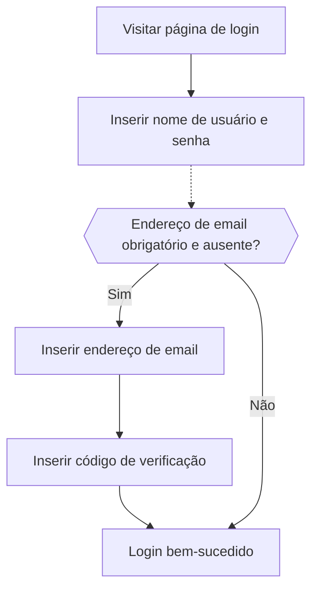

# Login por email / telefone / nome de usuário

## Configure o fluxo de login por identificador \{#configure-the-identifier-sign-in-flow}

Como mencionado anteriormente, vários tipos de identificadores podem ser coletados dos usuários durante o [fluxo de cadastro](/end-user-flows/sign-up-and-sign-in/sign-up) ou [criação direta de conta no Logto](/user-management/manage-users#add-users). Além disso, os usuários podem inserir e completar informações adicionais à medida que exploram e utilizam o produto. Esses identificadores podem ser usados para identificar exclusivamente os usuários no sistema do Logto e permitir que sejam autenticados e façam login nos aplicativos integrados ao Logto.

Seja utilizando a página de login pré-construída hospedada pelo Logto ou planejando [construir sua própria interface de login personalizada](/customization#custom-ui), você precisará configurar os métodos de login disponíveis e as configurações de verificação para seus usuários finais.

## Configure os identificadores e as configurações de autenticação \{#set-up-the-identifier-and-authentication-settings}

### 1. Defina os identificadores de login suportados \{#1-set-the-supported-sign-in-identifiers}

Você pode adicionar vários identificadores suportados a partir da lista suspensa como métodos de login habilitados para os usuários finais. As opções disponíveis são:

- **Nome de usuário**
- **Endereço de email**
- **Número de telefone**

Reordenar os identificadores mudará a ordem em que são exibidos na página de login. O primeiro identificador será o método principal de login para os usuários.

### 2. Defina as configurações de autenticação \{#2-set-the-authentication-settings}

Para cada identificador de login, você precisará configurar pelo menos um fator de verificação eficaz para verificar a identidade do usuário. Existem dois fatores que você pode escolher:

- **Senha**: Disponível para todos os tipos de identificadores de login. Uma vez habilitado, os usuários devem fornecer uma senha para concluir o processo de login.
- **Código de verificação**: Disponível apenas para os identificadores **Endereço de email** e **Número de telefone**. Uma vez habilitado, os usuários devem inserir um código de verificação enviado para seu email ou número de telefone para concluir o processo de login.

Se ambos os fatores estiverem habilitados, os usuários podem escolher qualquer um dos métodos para concluir o processo de login. Você também pode reordenar os fatores para alterar a ordem em que são exibidos na página de login. O primeiro fator será usado como método principal de verificação para os usuários e o segundo será exibido como um link alternativo.

## Experiência do usuário no fluxo de login por identificador \{#identifier-sign-in-flow-user-experience}

A experiência de login se adapta com base no identificador escolhido e nos fatores de autenticação disponíveis.

- **Entrada inteligente para múltiplos identificadores:**
  Se mais de um método de login por identificador estiver habilitado, a página de login incorporada do Logto detectará automaticamente o tipo de identificador inserido pelo usuário e exibirá as opções de verificação correspondentes. Por exemplo, se tanto **Endereço de email** quanto **Número de telefone** estiverem habilitados, a página de login detectará automaticamente o tipo de identificador inserido pelo usuário e exibirá as opções de verificação correspondentes. Ela alterna para o formato de número de telefone com código de região se números forem inseridos consecutivamente ou para o formato de email quando um símbolo "@" for usado.
  - O código do país do número de telefone é definido por padrão de acordo com o idioma do navegador do usuário; os usuários podem alterar manualmente. Você pode usar o parâmetro [`ui_locales`](/end-user-flows/authentication-parameters/ui-locales) para definir um código de país padrão específico. Veja [Idiomas localizados](/customization/localized-languages#how-can-i-set-a-default-phone-number-country-code-for-the-sign-in-experience) para mais detalhes.
- **Fatores de verificação habilitados:**
  - **Apenas senha:** Os campos de identificador e senha serão exibidos na primeira tela.
  - **Apenas código de verificação:** O campo de identificador aparece na primeira tela, seguido pelo campo de código de verificação na segunda tela.
  - **Senha e código de verificação:** O campo de identificador é inserido inicialmente na primeira tela, seguido pelos passos para inserir a senha ou o código de verificação na segunda tela, conforme a ordem de verificação. Um link de alternância é fornecido para permitir que os usuários alternem entre os dois métodos de verificação.

### Exemplos \{#examples}

  

### Exemplo 1: Endereço de email com verificação por senha \{#example-1-email-address-with-password-verification}

Adicione o **Endereço de email** como identificador de login e habilite o fator **Senha** para verificação.

  

### Exemplo 2: Email/Telefone com senha (primário) e código de verificação (alternativo) habilitados \{#example-2-emailphone-with-passwordprimary-and-verification-code-alternative-verification-enabled}

Adicione tanto o **Endereço de email** quanto o **Número de telefone** como identificadores de login.
Habilite os fatores **Senha** e **Código de verificação** para ambos os identificadores.

## Coletar informações adicionais do perfil do usuário no login \{#collect-additional-user-profile-on-sign-in}

No fluxo de login do Logto, um processo de preenchimento de perfil pode ser acionado se as configurações de identificador de cadastro forem atualizadas. Isso garante que todos os usuários, inclusive os já existentes, forneçam quaisquer identificadores recém-exigidos.

Quando um desenvolvedor adiciona um novo identificador (como um endereço de email), ele se torna obrigatório para todos os usuários. Se um usuário recorrente fizer login com um identificador existente (como um nome de usuário), será solicitado que forneça e verifique o novo identificador caso ele esteja ausente em seu perfil. Somente após concluir essa etapa ele poderá acessar o aplicativo, garantindo uma transição suave e consistente para os novos requisitos.

Detalhando o processo:

1. **Nome de usuário** foi previamente definido como identificador de cadastro com a configuração **Crie sua senha** habilitada automaticamente.
2. **Endereço de email** é posteriormente definido como identificador de cadastro. O identificador **Endereço de email** é automaticamente adicionado como uma opção de login habilitada.
3. Um usuário recorrente faz login com seu nome de usuário e senha.
4. O usuário é solicitado a fornecer e verificar um endereço de email após a etapa inicial de login.

O mesmo processo se aplica às configurações de cadastro **Crie sua senha**. Se as configurações **Crie sua senha** forem habilitadas recentemente no fluxo de cadastro, o fator **Senha** será automaticamente habilitado para todos os identificadores de login que você escolher. Todos os usuários recorrentes sem senha serão solicitados a criar uma durante o processo de login.

:::note
Nota: Para fluxos de login personalizados, consulte o recurso [Traga sua UI](/customization/bring-your-ui/).
:::

## Perguntas frequentes \{#faqs}

  

### Experiência de login auto-hospedada (login incorporado) \{#self-hosted-sign-in-experience-embedded-sign-in}

O Logto atualmente não oferece suporte a API headless para login e cadastro. No entanto, você pode usar o recurso [Traga sua UI](/customization/bring-your-ui/) para enviar seu formulário de login personalizado ao Logto. Também oferecemos suporte a vários parâmetros de login que você pode usar para pré-preencher o formulário de login com o identificador do usuário coletado do seu aplicativo ou fazer login diretamente com um provedor de login social ou SSO corporativo de terceiros. Saiba mais em [Parâmetros de autenticação](/end-user-flows/authentication-parameters/).

## Recursos relacionados \{#related-resources}

<Url href="https://www.youtube.com/watch?v=64rBXpWbScc">
  Experiência de cadastro e login por email
</Url>

<Url href="https://www.youtube.com/watch?v=chQxCJX6e6w">
  Experiência de cadastro e login por nome de usuário
</Url>
