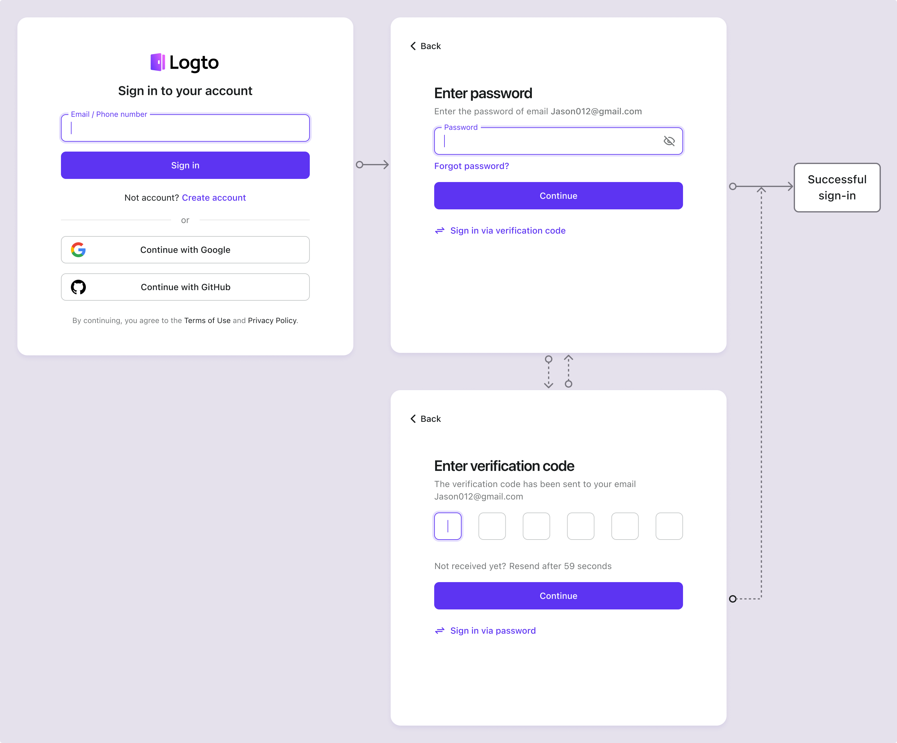

# Login por email / telefone / nome de usuário

## Configurar o fluxo de login por identificador

Como mencionado anteriormente, vários tipos de identificadores podem ser coletados dos usuários ao longo do [fluxo de inscrição](/end-user-flows/sign-up-and-sign-in/sign-up) ou [criação direta de conta no Logto](/user-management/manage-users#add-users). Além disso, os usuários podem inserir e completar informações adicionais à medida que exploram e utilizam o produto. Esses identificadores podem ser usados para identificar exclusivamente os usuários no sistema do Logto e permitir que eles sejam autenticados e façam login nos aplicativos integrados ao Logto.

Seja você optando por usar a página de login pré-construída hospedada pelo Logto ou planejando [construir sua própria interface de login personalizada](/customization#custom-ui), você precisará configurar os métodos de login disponíveis e as configurações de verificação para seus usuários finais.

## Configurar o identificador e as configurações de autenticação

### 1. Definir os identificadores de login suportados

Você pode adicionar vários identificadores suportados a partir da lista suspensa como métodos de login habilitados para os usuários finais. As opções disponíveis são:

- **Nome de usuário**
- **Endereço de email**
- **Número de telefone**

Reordenar os identificadores mudará a ordem em que eles são exibidos na página de login. O primeiro identificador será o método de login principal para os usuários.

### 2. Definir as configurações de autenticação

Para cada identificador de login, você precisará configurar pelo menos um fator de verificação eficaz para verificar a identidade do usuário. Existem dois fatores que você pode escolher:

- **Senha**: Disponível para todos os tipos de identificadores de login. Uma vez habilitado, os usuários devem fornecer uma senha para completar o processo de login.
- **Código de verificação**: Disponível apenas para identificadores de **Endereço de email** e **Número de telefone**. Uma vez habilitado, os usuários devem inserir um código de verificação enviado para seu email ou número de telefone para completar o processo de login.

Se ambos os fatores estiverem habilitados, os usuários podem escolher qualquer método para completar o processo de login. Você também pode reordenar os fatores para mudar a ordem em que eles são exibidos na página de login. O primeiro fator será usado como o método de verificação principal para os usuários e o segundo será exibido como um link alternativo.

## Experiência do usuário no fluxo de login por identificador

A experiência de login se adapta com base no identificador escolhido e nos fatores de autenticação disponíveis.

- **Entrada inteligente para múltiplos identificadores:**
  Se mais de um método de login por identificador estiver habilitado, a página de login integrada do Logto detectará automaticamente o tipo de identificador inserido pelo usuário e exibirá as opções de verificação correspondentes. Por exemplo, se tanto **Endereço de email** quanto **Número de telefone** estiverem habilitados, a página de login detectará automaticamente o tipo de identificador inserido pelo usuário e exibirá as opções de verificação correspondentes. Ela muda para um formato de número de telefone com código de região se números forem inseridos consecutivamente ou um formato de email quando um símbolo “@” for usado.
- **Fatores de verificação habilitados:**
  - **Apenas senha:** Tanto o campo de identificador quanto o de senha serão exibidos na primeira tela.
  - **Apenas código de verificação:** O campo de identificador aparece na primeira tela, seguido pelo campo de código de verificação na segunda tela.
  - **Senha e código de verificação:** O campo de identificador é inserido inicialmente na primeira tela, seguido por etapas para inserir a senha ou o código de verificação na segunda tela com base na ordem de verificação. Um link de troca é fornecido para permitir que os usuários alternem entre os dois métodos de verificação.

### Exemplos

  
Exemplo 1: Endereço de email com verificação por senha

Adicione o **Endereço de email** como o identificador de login e habilite o fator **Senha** para verificação.

  
Exemplo 2: Email/Telefone com senha (primária) e código de verificação (alternativa) habilitados

Adicione tanto **Endereço de email** quanto **Número de telefone** como identificadores de login.
Habilite os fatores **Senha** e **Código de verificação** para ambos os identificadores.

## Coletar perfil adicional do usuário no login

No fluxo de login do Logto, um processo de preenchimento de perfil pode ser acionado se as configurações de identificador de inscrição forem atualizadas. Isso garante que todos os usuários, incluindo os existentes, forneçam quaisquer identificadores recém-requeridos.

Quando um desenvolvedor adiciona um novo identificador (como um endereço de email), ele se torna obrigatório para todos os usuários. Se um usuário retornante fizer login com um identificador existente (como um nome de usuário), ele será solicitado a fornecer e verificar o novo identificador se ele estiver ausente em seu perfil. Somente após completar esta etapa, ele poderá acessar o aplicativo, garantindo uma transição suave e consistente para os requisitos atualizados.

Desmembrando o processo:

1. **Nome de usuário** foi previamente definido como o identificador de inscrição com a configuração **Crie sua senha** habilitada automaticamente.
2. **Endereço de email** é posteriormente definido como o identificador de inscrição. O identificador **Endereço de email** é automaticamente adicionado como uma opção de login habilitada.
3. Um usuário retornante faz login com seu nome de usuário e senha.
4. O usuário é solicitado a fornecer e verificar um endereço de email após sua etapa inicial de login.

O mesmo processo se aplica às configurações de inscrição **Crie sua senha** também. Se as configurações **Crie sua senha** forem recém-habilitadas no fluxo de inscrição, o fator **Senha** será automaticamente habilitado para todos os identificadores de login que você escolher. Todos os usuários retornantes sem uma senha serão solicitados a criar uma durante o processo de login.

:::note
Nota: Para fluxos de login personalizados, consulte o recurso de [Traga sua UI](/customization/bring-your-ui/).
:::

## FAQs

  
Experiência de login auto-hospedada (login embutido)

O Logto atualmente não suporta API sem interface para login e inscrição. No entanto, você pode usar nosso recurso [Traga sua UI](/customization/bring-your-ui/) para carregar seu formulário de login personalizado no Logto. Também suportamos múltiplos parâmetros de login que você pode usar para pré-preencher o formulário de login com o identificador do usuário coletado do seu aplicativo ou fazer login diretamente com um provedor de SSO social ou corporativo de terceiros. Saiba mais em [Parâmetros de autenticação](/end-user-flows/authentication-parameters/).

## Recursos relacionados

<Url href="https://www.youtube.com/watch?v=64rBXpWbScc">
  Experiência de inscrição e login por email
</Url>

<Url href="https://www.youtube.com/watch?v=chQxCJX6e6w">
  Experiência de inscrição e login por nome de usuário
</Url>
