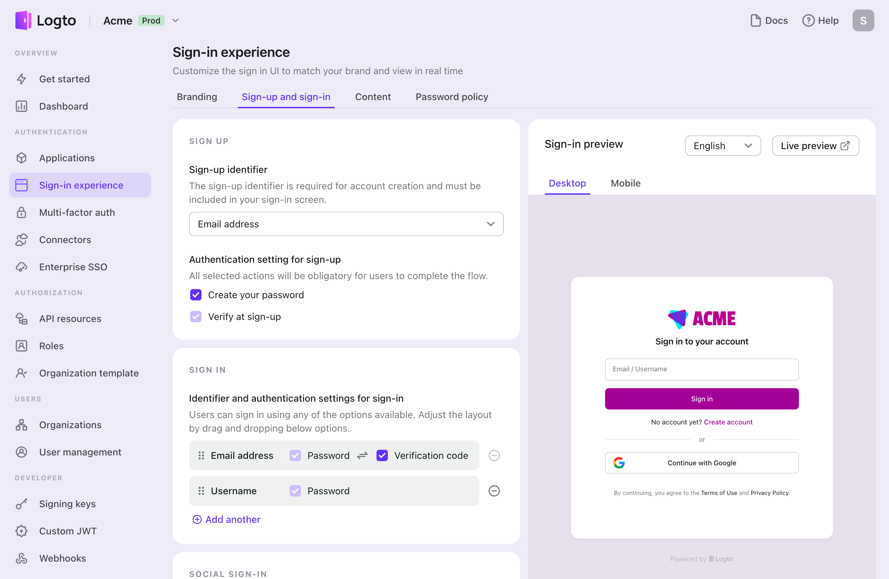
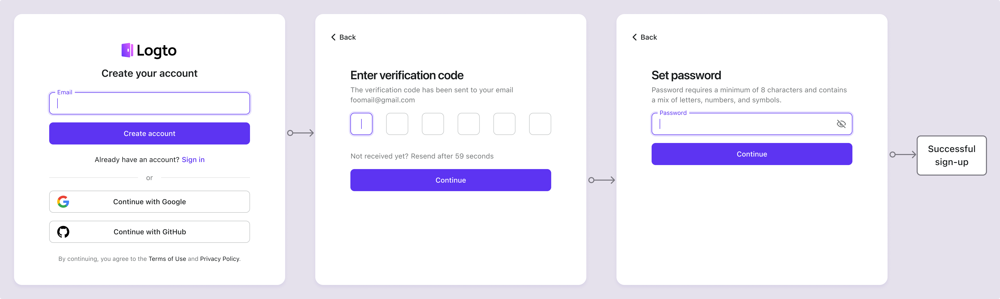

# Cadastro por email / telefone / nome de usuário

O registro de usuário é o primeiro passo para os usuários se envolverem com seu aplicativo. Logto suporta uma variedade de métodos de cadastro, incluindo nome de usuário e senha, verificação de email ou número de telefone, cadastro social e SSO corporativo. Você pode configurar os métodos de cadastro que melhor atendem aos requisitos do seu aplicativo.

Visite <CloudLink to="/sign-in-experience/sign-up-and-sign-in">Console > Experiência de login > Cadastro e login</CloudLink> para começar a configurar o fluxo de cadastro de identificadores.

## Configurar o identificador de cadastro

Para criar com sucesso uma nova conta de usuário no Logto, os usuários devem fornecer um **identificador** que os identifique exclusivamente dentro do sistema do Logto. Como primeiro passo, defina o **identificador** que você precisa coletar dos usuários durante o processo de cadastro. As opções disponíveis são:

- **Nome de usuário**: Um nome de usuário único que o usuário pode usar para fazer login no aplicativo.
- **Endereço de email**: Um endereço de email válido que o usuário pode usar para fazer login no aplicativo.
- **Número de telefone**: Um número de telefone válido que o usuário pode usar para fazer login no aplicativo.
- **Endereço de email ou número de telefone**: Permitir que os usuários se cadastrem com um endereço de email ou número de telefone válido.
- **Não aplicável**: Nenhum identificador de cadastro está habilitado. Isso se aplica aos métodos de cadastro apenas social ou apenas SSO corporativo.

Todos os identificadores coletados durante o processo de cadastro devem ser únicos entre os usuários sob o mesmo locatário. Eles serão armazenados no perfil do usuário e podem ser usados para fazer login nos aplicativos integrados ao Logto.

## Configurar as configurações de verificação de cadastro

Para garantir a segurança do cadastro do usuário e do processo de login futuro, você também precisa configurar as configurações de verificação para os identificadores que você coleta durante o processo de cadastro. As configurações disponíveis são:

- **Crie sua senha:** Exigir que os usuários criem uma senha durante o cadastro que esteja em conformidade com a política de senha configurada nas configurações de experiência de login. Esta senha, juntamente com o identificador do usuário, serve como sua credencial para fazer login no aplicativo. Se você definir **Nome de usuário** como o identificador de cadastro, esse requisito é automaticamente habilitado, pois o **Nome de usuário** só pode ser usado com uma senha para verificar efetivamente a identidade do usuário.
- **Verificar no cadastro**: Exigir que os usuários verifiquem seu endereço de email ou número de telefone durante o cadastro. Atualmente, o Logto só aceita emails e números de telefone verificados como identificadores. Esta configuração é automaticamente habilitada quando um **Endereço de email** ou **Número de telefone** é usado como o identificador de cadastro. Os usuários devem confirmar a propriedade inserindo um código de verificação enviado para seu email ou número de telefone durante o processo de cadastro.

| Identificador               | Criar senha do usuário | Verificar no cadastro |
| --------------------------- | ---------------------- | --------------------- |
| Nome de usuário             | Obrigatório            | N/A                   |
| Endereço de email           | Opcional               | Obrigatório           |
| Número de telefone          | Opcional               | Obrigatório           |
| Email ou número de telefone | Opcional               | Obrigatório           |
| Não aplicável               | N/A                    | N/A                   |

## Exemplos de fluxo de cadastro

  
Tipo 1: Nome de usuário com criação de senha

Selecione o **Nome de usuário** como o identificador de cadastro. Criar sua senha é forçado a ser habilitado.

  
Tipo 2: Endereço de email ou número de telefone com fluxo de verificação

Selecione o **Endereço de email ou número de telefone** como o identificador de cadastro. **Verificar no cadastro** é forçado a ser habilitado.

  
Tipo 3: Endereço de email com verificação e criação de senha

Selecione o **Endereço de email** como o identificador de cadastro. **Verificar no cadastro** é forçado a ser habilitado. Habilite **Crie sua senha** para exigir que os usuários criem uma senha durante o cadastro. (O mesmo se aplica ao fluxo de cadastro com número de telefone)

## Cadastro com social ou SSO corporativo

Além desses métodos tradicionais de cadastro por identificador, o Logto também suporta cadastro sem senha com provedores de identidade social e SSO corporativo, tornando o processo de integração mais fluido e amigável.

Uma vez que um conector social ou conector de SSO corporativo é configurado e habilitado no Logto, os usuários podem facilmente se cadastrar usando sua identidade social ou corporativa existente fornecida pelo conector. Os métodos de cadastro social e SSO corporativo permitem que os usuários evitem etapas extras, como criar uma senha ou verificar seu endereço de email ou número de telefone. O Logto sincronizará automaticamente as informações do usuário através de sua identidade social ou corporativa verificada e as armazenará no perfil do usuário.

Confira as seções de [login social](/end-user-flows/sign-up-and-sign-in/social-sign-in/) e [SSO corporativo](/end-user-flows/enterprise-sso/) para saber mais sobre o fluxo de cadastro com conectores sociais e SSO corporativo.

:::note
Nota: Para fluxos de cadastro personalizados, consulte o recurso de [Traga sua UI](/customization/bring-your-ui/).
:::

## Perguntas frequentes

  
Coletar informações adicionais do usuário no cadastro

  
Para coletar informações adicionais do perfil do usuário (por exemplo, Nome completo, Data de nascimento, Nome da empresa) durante o cadastro, você tem duas opções:

- **Fluxos de integração auto-hospedados**: Redirecione os usuários para seu próprio fluxo de integração após o cadastro bem-sucedido para coleta de dados personalizável.
- **Traga sua própria UI**: Personalize seu próprio fluxo de cadastro usando nosso recurso de traga sua própria UI com a API de configurações de perfil do usuário (em breve).

  
 Usuários criados por administradores / Usuários convidados

Saiba como implementar o [fluxo de cadastro apenas por convite.](/end-user-flows/sign-up-and-sign-in/disable-user-registration/#implement-an-invitation-only-sign-up-flow)

  
 Formulários de cadastro incorporados em seu site

  
Atualmente, o Logto não suporta API sem interface para login e cadastro. Você pode usar o recurso [Traga sua UI](/customization/bring-your-ui/) para enviar seu próprio formulário de cadastro para o Logto ou usar os parâmetros de login para preencher informações do usuário no Logto a partir do seu site. Saiba mais sobre a população de identificadores de usuário em [Parâmetros de autenticação](/end-user-flows/authentication-parameters/).

  
Enviando emails de boas-vindas para novos usuários

Assine o evento de webhook `User.Created` para acionar um email de boas-vindas para novos usuários. Saiba mais sobre [eventos de webhook](/developers/webhooks/webhooks-events/#data-mutation-hook-events).

  
 Pular verificação de email no cadastro

Atualmente, o Logto só suporta emails e números de telefone verificados como identificadores. O processo de verificação é necessário para garantir a segurança e a propriedade do identificador do usuário.
O suporte para emails ou números de telefone não verificados está em nosso roteiro. Fique atento para atualizações!

## Recursos relacionados

<Url href="https://www.youtube.com/watch?v=64rBXpWbScc">
  Experiência de cadastro e login por email
</Url>

<Url href="https://www.youtube.com/watch?v=chQxCJX6e6w">
  Experiência de cadastro e login por nome de usuário
</Url>
