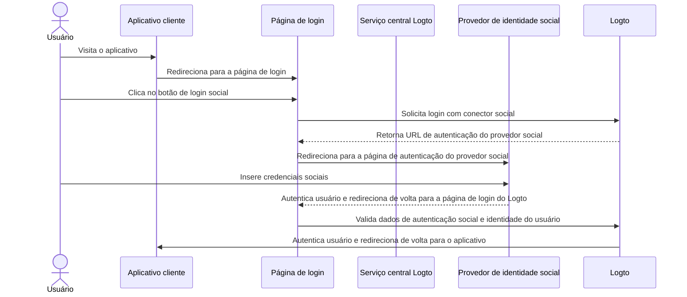

# Login social

O login social é um método de autenticação amplamente utilizado que permite aos usuários fazer login e cadastro usando suas contas existentes de redes sociais, como Google, Facebook, Twitter e LinkedIn.

Benefícios do login social:

- **Processo de onboarding simplificado**: O login social permite que os usuários se cadastrem ou façam login com um único clique, sem precisar criar uma nova conta ou lembrar outra senha. Isso reduz a fricção e aumenta o engajamento do usuário.
- **Maior confiança e segurança**: Ao aproveitar plataformas estabelecidas e confiáveis como Google ou Facebook, os usuários se sentem mais confiantes em seu aplicativo.
- **Enriquecimento de dados do usuário**: O login social permite que você colete informações adicionais do perfil da plataforma social, como nome, endereço de e-mail, foto do perfil e mais.

## Implementar login social \{#implement-social-sign-in}

1. **Configure seus conectores sociais**:<br/>
   Navegue até <CloudLink to="/connectors/social">Console > Conectores > Conectores sociais</CloudLink>. Clique no botão “Adicionar conector social” e localize o conector social que deseja adicionar (por exemplo, Google ou Github). Consulte [conector social](/connectors/social-connectors/) para instruções detalhadas.
2. **Adicione botões de login social**:<br/>
   Por padrão, seu conector social recém-adicionado não ficará visível na página de login do usuário final. Para adicionar botões de login social à página de login, você precisa habilitar o conector social nas configurações da experiência de login.

   Navegue até <CloudLink to="/sign-in-experience/sign-up-and-sign-in">Console > Experiência de login > Cadastro e login</CloudLink>. Clique no botão “Adicionar conector social” para integrar botões de login social nas suas páginas de cadastro e login. Use arrastar e soltar para organizar a ordem deles na interface.

3. **Defina opções de vinculação de conta**:<br/>
   Para novos usuários que se cadastram com [identidades sociais](/user-management/user-data#social-identities), o Logto permite vincular sua conta social a uma conta de e-mail ou número de telefone existente dentro do sistema Logto. Por padrão, uma página relacionada de [vinculação de conta](#account-linking) é exibida aos usuários durante o cadastro social, permitindo que eles vinculem sua conta social a uma conta existente ou criem uma nova.

   Para simplificar esse processo, você pode habilitar a opção **Vinculação automática de conta** nas configurações da experiência de login. Isso irá vincular automaticamente a conta social a uma conta existente se o e-mail ou número de telefone coincidir.

4. **Salve as alterações**: <br/>
   Revise cuidadosamente suas alterações e salve para aplicar a configuração.

## Experiência do usuário no login social \{#user-experience-of-social-sign-in}

Com o login social, os processos de cadastro e login no Logto são simplificados para os usuários.



1. **Login com social**: O usuário clica no botão de login social exibido na página de login.
2. **Redirecionamento**: O usuário é redirecionado para a página de autenticação do provedor de identidade social.
3. **Autenticação social**: O usuário insere suas credenciais sociais e se autentica com o provedor social. Se o usuário já estiver logado no provedor social, pode ser autenticado automaticamente. Se múltiplas sessões de login forem detectadas, o usuário pode ser solicitado a escolher a conta correta (por exemplo, múltiplas contas Google).
   :::note
   Os parâmetros “prompt” do Google podem ser definidos no conector Google, permitindo personalizar a experiência do usuário na seleção de conta e tela de consentimento para login Google.
   :::
4. **Retorno ao Logto**: Após autenticação bem-sucedida, o provedor social redireciona o usuário de volta para a página de login do Logto com os dados de autenticação.
5. **Validação da identidade social**: O Logto valida os dados de autenticação social e a identidade do usuário. Se não existir uma conta de usuário associada à identidade social, uma nova conta será criada.
6. **Autenticação do usuário**: O Logto autentica o usuário e o redireciona de volta para o aplicativo cliente para concluir o processo de autenticação.

## Vinculação de conta \{#account-linking}

Como mencionado acima, o Logto permite que os usuários vinculem suas contas sociais a contas de e-mail ou número de telefone existentes dentro do sistema Logto. Esse processo é essencial para manter uma conta de usuário unificada entre diferentes métodos de autenticação e provedores de identidade.

- **Criação de nova conta**:
  Quando um usuário faz login com uma [identidade social](/user-management/user-data#social-identities) que não existe no sistema Logto, e o e-mail ou número de telefone fornecido não corresponde a nenhuma conta de usuário existente, uma nova conta será criada diretamente no Logto.
- **Vinculação a conta existente**:
  Se o e-mail ou número de telefone fornecido pela identidade social já estiver associado a uma conta existente no Logto, oferecemos um processo flexível de vinculação de conta.

  - **Vinculação automática de conta:** Se a opção “Vinculação automática de conta” estiver habilitada nas configurações da sua <CloudLink to="/sign-in-experience/sign-up-and-sign-in">Experiência de login</CloudLink>, o Logto irá vincular automaticamente a conta social à conta existente com base na correspondência de e-mail ou número de telefone. Os usuários não serão solicitados a vincular as contas e serão autenticados instantaneamente em sua conta existente. A conta social será vinculada, permitindo que o usuário faça login por qualquer método no futuro.
  - **Vinculação manual de conta**: Se a opção “Vinculação automática de conta” estiver desabilitada, os usuários serão solicitados a vincular sua conta social à conta existente durante o processo de login. Eles podem escolher vincular as contas ou criar uma nova.

    

    ```mermaid
    flowchart TD
    A[Autenticar com identidade social] --> B{{Identidade social existe no Logto?}}
    B -- Sim --> C[Login com conta existente]
    B -- Não --> D{{E-mail/telefone corresponde a alguma conta existente?}}
    D -- Sim --> E{{Vinculação automática de conta habilitada?}}
    E -- Sim --> G[Vincular identidade social à conta existente]
    G --> C
    D -- Não --> H[Criar nova conta e fazer login]
    E -- Não --> I{{Vincular conta social?}}
    I -- Sim --> G
    I -- Não --> H
    ```

:::note
Se uma conta relacionada for localizada durante o processo de cadastro social com um e-mail ou número de telefone que corresponda a uma conta existente, e o usuário optar por não vincular as contas, o e-mail ou número de telefone não será sincronizado com a nova conta no Logto. Isso garante que o e-mail e o número de telefone permaneçam únicos em todas as contas de usuário.

Se o e-mail ou número de telefone for um identificador obrigatório de cadastro, o usuário será solicitado a fornecer outro e-mail ou número de telefone durante o processo de cadastro. Veja [Coletar informações adicionais do perfil do usuário](#collect-additional-user-profile-data) para mais detalhes.
:::

## Coletar informações adicionais do perfil do usuário \{#collect-additional-user-profile-data}

Durante o processo de cadastro social, dependendo das configurações dos identificadores obrigatórios de cadastro (**endereço de e-mail**, **número de telefone** e **nome de usuário**) que você configurou, os usuários podem ser solicitados a fornecer informações adicionais verificadas para concluir o processo de cadastro ou login após serem autenticados pelo provedor social.

Por exemplo, **Endereço de e-mail** e **Nome de usuário** foram definidos como identificadores obrigatórios de cadastro:

1. **Cadastro com identidade social que fornece um endereço de e-mail verificado**

   Se um endereço de e-mail verificado for fornecido pela identidade social, o endereço de e-mail será sincronizado com o perfil do usuário e o usuário será solicitado a fornecer um nome de usuário para concluir o cadastro.

   ```mermaid
   flowchart TD
      A[Autenticar com identidade social] --> B{{Contém endereço de e-mail verificado?}}
      B -- Sim --> C[Inserir nome de usuário]
      C --> D[Cadastro bem-sucedido]
   ```

2. **Cadastro com identidade social que não fornece um endereço de e-mail verificado**

   Se a identidade social não fornecer um endereço de e-mail verificado, o usuário será solicitado a fornecer um endereço de e-mail durante o cadastro. O usuário deve verificar o endereço de e-mail inserindo um código de verificação enviado para o e-mail fornecido.

   ```mermaid
   flowchart TD
      A[Autenticar com identidade social] --> B{{Contém endereço de e-mail verificado?}}
      B -- Não --> C[Inserir endereço de e-mail]
      C --> D[Inserir código de verificação]
      D --> E[Inserir nome de usuário]
      E --> F[Cadastro bem-sucedido]
   ```

3. **Cadastro com identidade social que fornece um endereço de e-mail já registrado**

   Se a identidade social fornecer um endereço de e-mail que já está registrado no sistema Logto, o usuário será solicitado a vincular a conta social à conta existente ou criar uma nova conta. Se o usuário optar por criar uma nova conta, será solicitado a fornecer um novo endereço de e-mail e verificá-lo.

   ```mermaid
      flowchart TD
       A[Autenticar com identidade social] --> B{{Endereço de e-mail corresponde a alguma conta existente?}}
       B -- Sim --> C{{Vincular conta social?}}
       C -- Sim --> D[Vincular identidade social à conta existente]
       D --> E[Login bem-sucedido]
       C -- Não --> F[Inserir novo endereço de e-mail]
       F --> G[Inserir código de verificação]
       G --> H[Inserir nome de usuário]
       H --> I[Cadastro bem-sucedido]
       B -- Não --> H
   ```

## Google One-tap \{#google-one-tap}

O Logto também suporta o método de login [Google One-tap](https://developers.google.com/identity/gsi/web/guides/features) para o conector Google, permitindo que os usuários façam login com um único clique. Esse recurso simplifica ainda mais o processo de login, eliminando a necessidade de redirecionar os usuários para a página de autenticação do Google.

Para habilitar o login Google One-tap, siga as instruções nas configurações do [conector Google](/integrations/google). Uma vez habilitado, os usuários verão um popup "Entrar com Google" ao acessar a página de login. Ao clicar, serão autenticados automaticamente com sua conta Google e redirecionados de volta para o aplicativo.


## Vincular ou desvincular contas sociais \{#link-or-unlink-social-accounts}

Após o login social inicial, os usuários podem gerenciar suas contas sociais conectadas através das configurações da conta. Isso permite que os usuários vinculem contas sociais adicionais ao perfil existente ou removam conexões sociais que não desejam mais usar.

Os usuários podem acessar esses recursos por meio de um centro de autoatendimento da conta, que oferece flexibilidade para:

- **Vincular novas contas sociais**: Conectar provedores sociais adicionais ao mesmo perfil de usuário
- **Desvincular contas sociais existentes**: Remover conexões sociais mantendo o acesso por outros métodos
- **Visualizar contas conectadas**: Ver todas as identidades sociais atualmente vinculadas

Saiba mais sobre a implementação de recursos de gerenciamento de conta na documentação de [configurações da conta](/end-user-flows/account-settings).

## Armazenar tokens e chamar APIs de terceiros \{#store-tokens-and-call-third-party-apis}

Você pode, opcionalmente, habilitar o armazenamento de tokens de terceiros para conectores sociais suportados para que, após o usuário autenticar e conceder permissões, os tokens de acesso e atualização emitidos pelo provedor sejam armazenados com segurança no cofre secreto do Logto. Seu aplicativo (via Account API) pode recuperá-los e usá-los posteriormente para chamar APIs do provedor (por exemplo, permitir que seu app adicione eventos ao Google Agenda) em nome do usuário sem exigir nova autenticação social. Veja [armazenamento de tokens de terceiros](/secret-vault/federated-token-set) para detalhes de configuração.

## Perguntas frequentes \{#faqs}

<details>
  <summary>

### Como adicionar botões de login social e fazer login diretamente com social no meu site? \{#how-to-add-social-login-buttons-and-directly-sign-in-with-social-on-my-website}

</summary>

O Logto permite adicionar botões de login social ao seu site e iniciar o processo de login social diretamente sem exibir o formulário padrão de login. Confira nosso guia de [Login direto](/end-user-flows/authentication-parameters/direct-sign-in/) para instruções detalhadas.

</details>

<details>
  <summary>

### Por que meus e-mails ou números de telefone não são preenchidos após o cadastro com social? \{#why-my-emails-or-phone-numbers-are-not-populated-after-signing-up-with-social}

</summary>

No Logto, o endereço de e-mail e o número de telefone podem ser usados como identificadores de login para identificar usuários de forma única. Apenas endereços de e-mail e números de telefone verificados são aceitos como identificadores. Se a identidade social não fornecer a reivindicação `email_verified` ou `phone_number_verified`, o endereço de e-mail ou número de telefone não será sincronizado com o perfil do usuário. Você ainda pode encontrá-los nos dados de identidades sociais no perfil do usuário.

O suporte a e-mail ou número de telefone não verificado como perfil de usuário estará disponível em breve.

</details>

## Recursos relacionados \{#related-resources}

<Url href="https://www.youtube.com/watch?v=sv60N9eW8Ew">Experiência de login social</Url>

<Url href="https://blog.logto.io/maximize-google-sign-in-conversions">
  Maximize conversões de login Google com 6 configurações
</Url>
