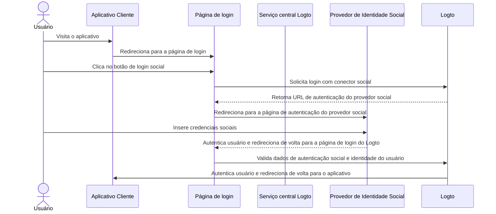
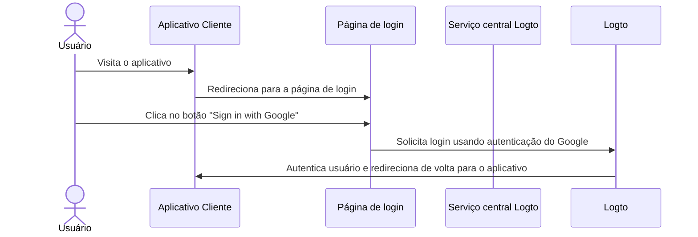

# Login social

O login social é um método de autenticação amplamente utilizado que permite aos usuários fazer login e se inscrever usando suas contas de mídia social existentes, como Google, Facebook, Twitter e LinkedIn.

Benefícios do login social:

- **Processo de integração simplificado**: O login social permite que os usuários se inscrevam ou façam login com um único clique, sem precisar criar uma nova conta ou lembrar outra senha. Isso reduz o atrito e aumenta o engajamento do usuário.
- **Aumento da confiança e segurança**: Ao aproveitar plataformas estabelecidas e confiáveis, como Google ou Facebook, os usuários se sentem mais confiantes em seu aplicativo.
- **Enriquecimento de dados do usuário**: O login social permite que você colete informações adicionais de perfil da plataforma social, como nome, endereço de email, foto de perfil e mais.

## Implementar login social \{#implement-social-sign-in}

1. **Configure seus conectores sociais**:<br/>
   Navegue até <CloudLink to="/connectors/social">Console > Conectores > Conectores sociais</CloudLink>. Clique no botão “Adicionar Conector Social” e localize o conector social que deseja adicionar (por exemplo, Google ou Github). Consulte nossa documentação para instruções detalhadas sobre como adicionar um [conector social](/connectors/social-connectors/).
2. **Adicione botões de login social**:<br/>
   Por padrão, seu novo conector social adicionado não será visível na página de login do usuário final. Para adicionar botões de login social à página de login, você precisa habilitar o conector social nas configurações de experiência de login.

   Navegue até <CloudLink to="/sign-in-experience/sign-up-and-sign-in">Console > Experiência de login > Inscrição e login</CloudLink>. Clique no botão “Adicionar conector social” para integrar botões de login social nas suas páginas de inscrição e login. Use arrastar e soltar para organizar a ordem deles na interface do usuário.

3. **Defina opções de vinculação de conta**:<br/>
   Para novos usuários que se inscrevem com [identidades sociais](/user-management/user-data#social-identities), o Logto permite vincular sua conta social a uma conta de email ou número de telefone existente dentro do sistema Logto. Por padrão, uma página de [vinculação de conta](#account-linking) relacionada é mostrada aos usuários durante a inscrição social, permitindo que eles vinculem sua conta social a uma conta existente ou criem uma nova.

   Para simplificar esse processo, você pode habilitar a opção **Vinculação automática de conta** nas configurações de experiência de login. Isso vinculará automaticamente a conta social a uma conta existente se o email ou número de telefone corresponder.

4. **Salve as alterações**: <br/>
   Revise suas alterações cuidadosamente e salve-as para aplicar a configuração.

## Experiência do usuário com login social \{#user-experience-of-social-sign-in}

Com o login social, os processos de inscrição e login no Logto são simplificados para os usuários.



1. **Login com social**: O usuário clica no botão de login social exibido na página de login.
2. **Redirecionamento**: O usuário é redirecionado para a página de autenticação do provedor de identidade social.
3. **Autenticação social**: O usuário insere suas credenciais sociais e se autentica com o provedor social. Se o usuário já estiver logado no provedor social, ele pode ser autenticado automaticamente. Se várias sessões de login forem detectadas, o usuário pode ser solicitado a escolher a conta correta (por exemplo, várias contas do Google).
   :::note
   Os parâmetros de "prompt" do Google podem ser configurados no conector do Google, permitindo personalizar a experiência do usuário na seleção de conta e tela de consentimento para login no Google.
   :::
4. **Retorno ao Logto**: Após a autenticação bem-sucedida, o provedor social redireciona o usuário de volta para a página de login do Logto com os dados de autenticação.
5. **Validação de identidade social**: O Logto valida os dados de autenticação social e a identidade do usuário. Se não existir uma conta de usuário associada à identidade social, uma nova conta será criada.
6. **Autenticação do usuário**: O Logto autentica o usuário e o redireciona de volta para o aplicativo cliente para completar o processo de autenticação.

### Google One-tap \{#google-one-tap}

O Logto também suporta o método de login [Google One-tap](https://developers.google.com/identity/gsi/web/guides/features) para o conector do Google, permitindo que os usuários façam login com um único clique. Esse recurso simplifica ainda mais o processo de login, removendo a necessidade de os usuários serem redirecionados para a página de autenticação do Google.

Para habilitar o login Google One-tap, siga as instruções nas configurações do [conector do Google](/integrations/google). Uma vez habilitado, os usuários verão um popup "Sign in with Google" quando acessarem a página de login. Ao clicar, eles serão automaticamente autenticados com sua conta do Google e redirecionados de volta para o aplicativo.




## Vinculação de conta \{#account-linking}

Como mencionado acima, o Logto permite que os usuários vinculem suas contas sociais a contas de email ou número de telefone existentes dentro do sistema Logto. Esse processo é essencial para manter uma conta de usuário unificada em diferentes métodos de autenticação e provedores de identidade.

- **Criação de nova conta**:
  Quando um usuário faz login com uma [identidade social](/user-management/user-data#social-identities) que não existe no sistema Logto, e o email ou número de telefone fornecido não corresponde a nenhuma conta de usuário existente, uma nova conta será criada diretamente no Logto.
- **Vinculação de conta existente**:
  Se o email ou número de telefone fornecido pela identidade social já estiver associado a uma conta existente no Logto, oferecemos um processo de vinculação de conta flexível.

  - **Vinculação automática de conta:** Se a opção “Vinculação automática de conta” estiver habilitada nas suas configurações de <CloudLink to="/sign-in-experience/sign-up-and-sign-in">Experiência de login</CloudLink>, o Logto vinculará automaticamente a conta social à conta existente com base em um email ou número de telefone correspondente. Os usuários não serão solicitados a vincular as contas e serão instantaneamente logados em sua conta existente. A conta social será vinculada, permitindo que o usuário faça login usando qualquer método no futuro.
  - **Vinculação manual de conta**: Se a opção “Vinculação automática de conta” estiver desabilitada, os usuários serão solicitados a vincular sua conta social à conta existente durante o processo de login. Eles podem optar por vincular as contas ou criar uma nova.

    

    ```mermaid
    flowchart TD
    A[Autenticar com identidade social] --> B{{Identidade social existe no Logto?}}
    B -- Sim --> C[Logado com conta existente]
    B -- Não --> D{{Email / telefone corresponde a alguma conta existente?}}
    D -- Sim --> E{{Vinculação automática de conta habilitada?}}
    E -- Sim --> G[Vincular identidade social à conta existente]
    G --> C
    D -- Não --> H[Criar nova conta e fazer login]
    E -- Não --> I{{Vincular conta social?}}
    I -- Sim --> G
    I -- Não --> H
    ```

:::note
Se uma conta relacionada for localizada durante o processo de inscrição social com um email ou número de telefone que corresponda a uma conta existente, e o usuário optar por não vincular as contas, o email ou número de telefone não será sincronizado com a nova conta no Logto. Isso garante que o email e o número de telefone permaneçam únicos em todas as contas de usuário.

Se o email ou número de telefone for um identificador de inscrição obrigatório, o usuário será solicitado a fornecer outro email ou número de telefone durante o processo de inscrição. Veja [Coletar perfil adicional do usuário](#collect-additional-user-profile-data) para mais detalhes.
:::

## Coletar dados adicionais de perfil do usuário \{#collect-additional-user-profile-data}

Durante o processo de inscrição social, dependendo das configurações de identificadores de inscrição obrigatórios (**endereço de email**, **número de telefone** e **nome de usuário**) que você configurou, os usuários podem ser solicitados a fornecer informações verificadas adicionais para completar o processo de inscrição ou login após serem autenticados com o provedor social.

Por exemplo, **Endereço de email** e **Nome de usuário** foram definidos como identificadores de inscrição obrigatórios:

1. **Inscrição com identidade social que fornece um endereço de email verificado**

   Se um endereço de email verificado for fornecido pela identidade social, o endereço de email será sincronizado com o perfil do usuário e o usuário será solicitado a fornecer um nome de usuário para completar o processo de inscrição.

   ```mermaid
   flowchart TD
      A[Autenticar com identidade social] --> B{{Contém endereço de email verificado?}}
      B -- Sim --> C[Insira o nome de usuário]
      C --> D[Inscrição bem-sucedida]
   ```

2. **Inscrição com identidade social que não fornece um endereço de email verificado**

   Se a identidade social não fornecer um endereço de email verificado, o usuário será solicitado a fornecer um endereço de email durante o processo de inscrição. O usuário deve verificar o endereço de email inserindo um código de verificação enviado para o endereço de email fornecido.

   ```mermaid
   flowchart TD
      A[Autenticar com identidade social] --> B{{Contém endereço de email verificado?}}
      B -- Não --> C[Insira o endereço de email]
      C --> D[Insira o código de verificação]
      D --> E[Insira o nome de usuário]
      E --> F[Inscrição bem-sucedida]
   ```

3. **Inscrição com identidade social que fornece um endereço de email registrado**

   Se a identidade social fornecer um endereço de email que já está registrado no sistema Logto, o usuário será solicitado a vincular a conta social à conta existente ou criar uma nova conta. Se o usuário optar por criar uma nova conta, ele será solicitado a fornecer um novo endereço de email e verificá-lo.

   ```mermaid
      flowchart TD
       A[Autenticar com identidade social] --> B{{Endereço de email corresponde a alguma conta existente?}}
       B -- Sim --> C{{Vincular conta social?}}
       C -- Sim --> D[Vincular identidade social à conta existente]
       D --> E[Login bem-sucedido]
       C -- Não --> F[Insira novo endereço de email]
       F --> G[Insira o código de verificação]
       G --> H[Insira o nome de usuário]
       H --> I[Inscrição bem-sucedida]
       B -- Não --> H
   ```

## Perguntas frequentes \{#faqs}

<details>
  <summary>

### Como adicionar botões de login social e fazer login diretamente com social no meu site? \{#how-to-add-social-login-buttons-and-directly-sign-in-with-social-on-my-website}

</summary>

O Logto permite que você adicione botões de login social ao seu site e inicie o processo de login social diretamente sem mostrar o formulário de login padrão. Confira nosso guia de [Login direto](/end-user-flows/authentication-parameters/direct-sign-in/) para instruções detalhadas.

</details>

<details>
  <summary>

### Por que meus emails ou números de telefone não são preenchidos após se inscrever com social? \{#why-my-emails-or-phone-numbers-are-not-populated-after-signing-up-with-social}

</summary>

No Logto, o endereço de email e o número de telefone podem ser usados como identificadores de login para identificar exclusivamente os usuários. Apenas endereços de email e números de telefone verificados são aceitos como identificadores. Se a identidade social não fornecer a reivindicação `email_verified` ou `phone_number_verified`, o endereço de email ou número de telefone não será sincronizado com o perfil do usuário. Você ainda pode encontrá-los nos dados de identidades sociais no perfil do usuário.

O suporte para email ou número de telefone não verificado como perfil de usuário estará disponível em breve.

</details>

## Recursos relacionados \{#related-resources}

<Url href="https://www.youtube.com/watch?v=sv60N9eW8Ew">Experiência de login social</Url>

<Url href="https://blog.logto.io/maximize-google-sign-in-conversions">
  Maximize as conversões de login do Google com 6 configurações
</Url>
