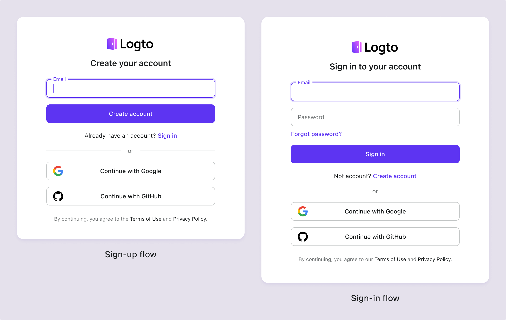

# Termos e privacidade

Para garantir que seu produto permaneça aberto e transparente, adicione links para seus Termos de Uso e Política de Privacidade nas páginas de login e cadastro. Isso permite que você atenda aos requisitos de conformidade específicos do seu setor.

## Configurar termos e privacidade \{#configure-terms--privacy}

1. Navegue até <CloudLink to="/sign-in-experience/content">Console > Experiência de login > Conteúdo</CloudLink>.
2. Adicione os links externos para seus "Termos de uso" e "Política de privacidade".
3. Defina a política para "Concordar com os termos" com base nas suas necessidades de conformidade para regiões ou setores específicos.

:::note
Se o valor estiver vazio, você não precisa gerenciar acordos de termos e privacidade nos fluxos de login do Logto. Você pode tratar disso após o usuário ter feito login no seu aplicativo.
:::

## Experiência do usuário ao concordar com os termos \{#user-experience-for-agreeing-to-terms}

Logto fornece vários fluxos pré-construídos para lidar com a experiência do usuário ao concordar com os termos com base em seus diferentes requisitos de conformidade:

### Opção 1: Concordar com os termos automaticamente ao continuar o login/cadastro \{#option-1-agree-to-terms-automatically-on-continue-sign-insign-up}

Esta política oferece a experiência do usuário mais suave ao concordar automaticamente com os termos quando o usuário continua com o processo de login ou cadastro.
O usuário não será solicitado a concordar explicitamente com os termos.

### Opção 2: Concordar com os termos apenas no cadastro \{#opetion-2-agree-to-terms-on-sign-up-only}

Esta política exige que novos usuários concordem manualmente com os **Termos e Políticas de Privacidade**. Sob o [GDPR](https://gdpr-info.eu/art-4-gdpr/) da UE e o [CCPA](https://oag.ca.gov/privacy/ccpa) da Califórnia, as empresas devem obter o consentimento informado dos usuários antes de coletar informações pessoais.

Quando os usuários usam pela primeira vez o registro social (por exemplo, Google ou GitHub), um pop-up solicitará que eles consintam com os **Termos e Políticas de Privacidade** após serem redirecionados para o Logto. Esse consentimento não é necessário para logins sociais subsequentes.

### Opção 3: Concordar com os termos no login e no cadastro \{#option-3-agree-to-terms-on-sign-in-and-sign-up}

Esta política exige que os usuários concordem com os **Termos e Políticas de Privacidade** sempre que fizerem login ou cadastro. Esta política é adequada para aplicativos que exigem que os usuários concordem com os termos toda vez que fizerem login. Os usuários devem marcar a caixa para concordar com os termos antes de prosseguir. Esta abordagem está em conformidade com a PIPL da China e a LGPD do Brasil.

