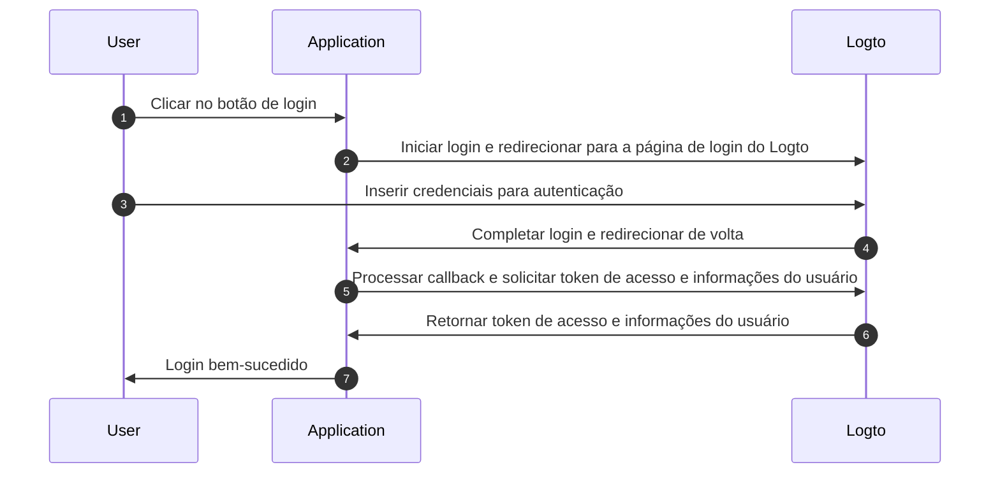
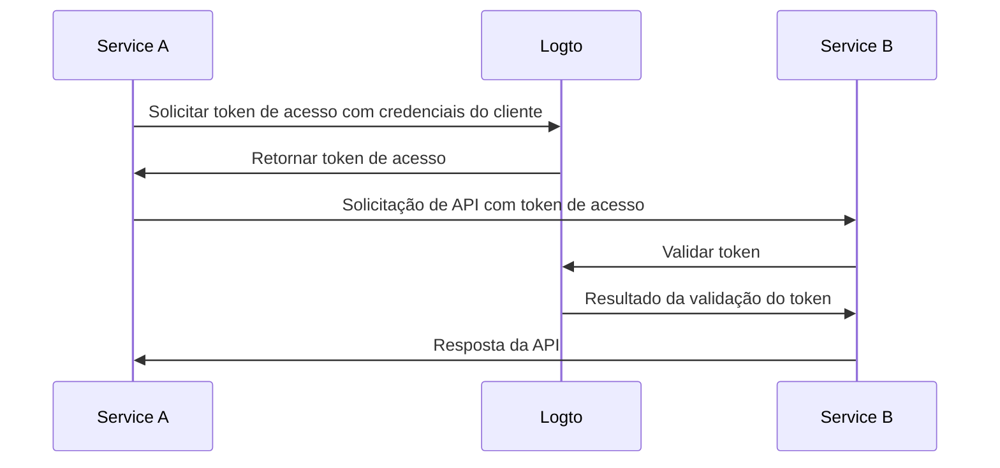

# Compreender o fluxo de autenticação

Logto é construído com base nos padrões [OAuth 2.0](https://auth.wiki/oauth-2.0) e [OpenID Connect (OIDC)](https://auth.wiki/openid-connect). Compreender esses padrões de autenticação tornará o processo de integração mais suave e direto.

### Fluxo de autenticação do usuário \{#user-authentication-flow}

Veja o que acontece quando um usuário faz login com Logto:

Neste fluxo, vários conceitos-chave são essenciais para o processo de integração:

- `Application`: Isso representa seu aplicativo no Logto. Você criará uma configuração de aplicativo no Logto Console para estabelecer uma conexão entre seu aplicativo real e os serviços Logto. Saiba mais sobre [Application](/integrate-logto/application-data-structure/#introduction).
- `Redirect URI`: Após os usuários completarem a autenticação na página de login do Logto, Logto os redireciona de volta para seu aplicativo através deste URI. Você precisará configurar o Redirect URI nas configurações do seu Application. Para mais detalhes, veja [Redirect URIs](/integrate-logto/application-data-structure/#redirect-uris).
- `Handle sign-in callback`: Quando Logto redireciona os usuários de volta para seu aplicativo, seu app precisa processar os dados de autenticação e solicitar tokens de acesso e informações do usuário. Não se preocupe - o Logto SDK cuida disso automaticamente.

Esta visão geral cobre o essencial para uma integração rápida. Para uma compreensão mais profunda, confira nosso guia [Sign-in experience explained](/concepts/sign-in-experience/).

### Fluxo de autenticação máquina para máquina \{#machine-to-machine-authentication-flow}

Logto fornece o tipo de [aplicativo máquina para máquina (M2M)](/quick-starts/m2m) para habilitar a autenticação direta entre serviços, com base no [fluxo de credenciais do cliente OAuth 2.0](https://auth.wiki/client-credentials-flow):

Este fluxo de autenticação máquina para máquina (M2M) é projetado para aplicativos que precisam se comunicar diretamente com recursos sem interação do usuário (portanto, sem UI), como um serviço de API atualizando dados de usuário no Logto ou um serviço de estatísticas extraindo pedidos diários.

Neste fluxo, os serviços se autenticam usando credenciais do cliente - uma combinação de [Application ID](/integrate-logto/application-data-structure/#application-id) e [Application Secret](/integrate-logto/application-data-structure/#application-secret) que identifica e autentica exclusivamente o serviço. Essas credenciais servem como a identidade do serviço ao solicitar [tokens de acesso](https://auth.wiki/access-token) do Logto.

## Recursos relacionados \{#related-resources}

<Url href="https://blog.logto.io/secure-cloud-apps-with-oauth-and-openid-connect">
  Blog: Proteja aplicativos baseados em nuvem com OAuth 2.0 e OpenID Connect
</Url>

<Url href="https://blog.logto.io/sso-is-better">
  Por que a autenticação única (SSO) para múltiplos aplicativos é melhor
</Url>

<Url href="https://blog.logto.io/centralized-identity-system">
  Por que você precisa de um sistema de identidade centralizado para um negócio com múltiplos
  aplicativos
</Url>
