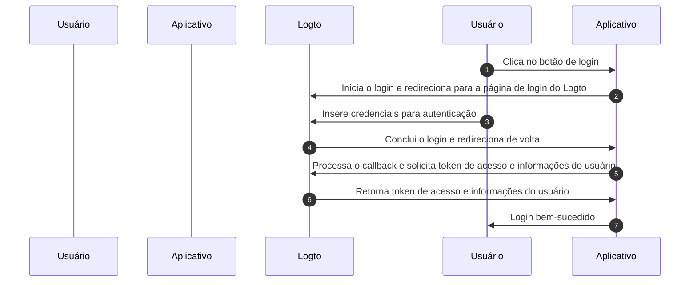
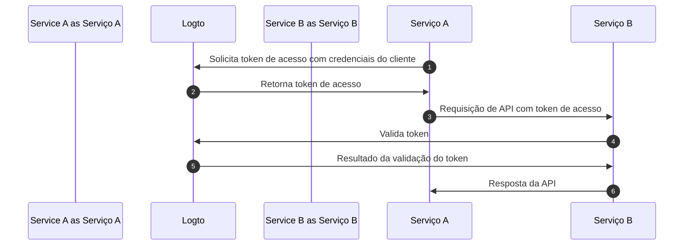
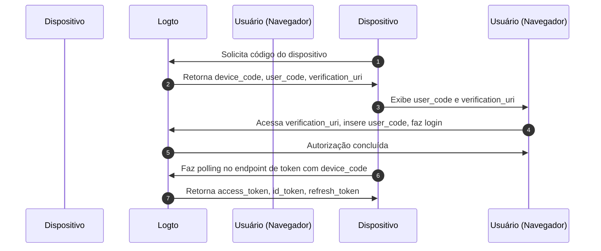
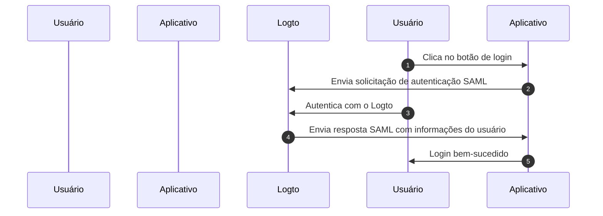

# Entenda o fluxo de autenticação OIDC

O Logto é construído com base nos padrões [OAuth 2.0](https://auth.wiki/oauth-2.0) e [OpenID Connect (OIDC)](https://auth.wiki/openid-connect). Compreender esses padrões de autenticação tornará o processo de integração mais suave e direto.

### Fluxo de autenticação do usuário \{#user-authentication-flow}

Veja o que acontece quando um usuário faz login com o Logto:

```mermaid
sequenceDiagram
    autonumber
    participant User as Usuário
    participant Application as Aplicativo
    participant Logto

    Usuário->>Aplicativo: Clica no botão de login
    Aplicativo->>Logto: Inicia o login e redireciona para a página de login do Logto
    Usuário->>Logto: Insere credenciais para autenticação
    Logto->>Aplicativo: Conclui o login e redireciona de volta
    Aplicativo->>Logto: Processa o callback e solicita token de acesso e informações do usuário
    Logto->>Aplicativo: Retorna token de acesso e informações do usuário
    Aplicativo->>Usuário: Login bem-sucedido
```

Neste fluxo, vários conceitos-chave são essenciais para o processo de integração:

- `Application`: Representa seu aplicativo no Logto. Você criará uma configuração de aplicativo no Logto Console para estabelecer uma conexão entre seu aplicativo real e os serviços do Logto. Saiba mais sobre [Application](/integrate-logto/application-data-structure/#introduction).
- `Redirect URI`: Após os usuários concluírem a autenticação na página de login do Logto, o Logto os redireciona de volta para seu aplicativo através deste URI. Você precisará configurar o Redirect URI nas configurações do seu Application. Para mais detalhes, veja [Redirect URIs](/integrate-logto/application-data-structure/#redirect-uris).
- `Handle sign-in callback`: Quando o Logto redireciona os usuários de volta para seu aplicativo, seu app precisa processar os dados de autenticação e solicitar tokens de acesso e informações do usuário. Não se preocupe — o SDK do Logto faz isso automaticamente.

Esta visão geral cobre o essencial para uma integração rápida. Para um entendimento mais profundo, confira nosso guia [Experiência de login explicada](/concepts/sign-in-experience/).

### Fluxo de autenticação máquina para máquina \{#machine-to-machine-authentication-flow}

O Logto fornece o tipo [aplicativo máquina para máquina (M2M)](/quick-starts/m2m) para permitir autenticação direta entre serviços, com base no [fluxo de credenciais do cliente OAuth 2.0](https://auth.wiki/client-credentials-flow):

```mermaid
sequenceDiagram
    autonumber
    participant Service A as Serviço A
    participant Logto
    participant Service B as Serviço B

    Serviço A->>Logto: Solicita token de acesso com credenciais do cliente
    Logto->>Serviço A: Retorna token de acesso
    Serviço A->>Serviço B: Requisição de API com token de acesso
    Serviço B->>Logto: Valida token
    Logto->>Serviço B: Resultado da validação do token
    Serviço B->>Serviço A: Resposta da API
```

Este fluxo de autenticação máquina para máquina (M2M) é projetado para aplicativos que precisam se comunicar diretamente com recursos sem interação do usuário (portanto, sem interface gráfica), como um serviço de API atualizando dados de usuário no Logto ou um serviço de estatísticas puxando pedidos diários.

Neste fluxo, os serviços se autenticam usando credenciais do cliente — uma combinação de [Application ID](/integrate-logto/application-data-structure/#application-id) e [Application Secret](/integrate-logto/application-data-structure/#application-secret) que identifica e autentica exclusivamente o serviço. Essas credenciais servem como identidade do serviço ao solicitar [tokens de acesso](https://auth.wiki/access-token) ao Logto.

### Fluxo de dispositivo (dispositivos com entrada limitada) \{#device-flow}

Para dispositivos com capacidades de entrada limitadas (por exemplo, smart TVs, consoles de jogos, ferramentas CLI, dispositivos IoT), o Logto suporta o [OAuth 2.0 Device Authorization Grant](https://auth.wiki/device-flow). O dispositivo exibe um código e uma URL, enquanto o usuário conclui a autenticação em outro dispositivo com navegador:

```mermaid
sequenceDiagram
    autonumber
    participant Device as Dispositivo
    participant Logto
    participant User as Usuário (Navegador)

    Dispositivo->>Logto: Solicita código do dispositivo
    Logto->>Dispositivo: Retorna device_code, user_code, verification_uri
    Dispositivo->>Usuário (Navegador): Exibe user_code e verification_uri
    Usuário (Navegador)->>Logto: Acessa verification_uri, insere user_code, faz login
    Logto->>Usuário (Navegador): Autorização concluída
    Dispositivo->>Logto: Faz polling no endpoint de token com device_code
    Logto->>Dispositivo: Retorna access_token, id_token, refresh_token
```

Neste fluxo:

- O dispositivo solicita um código de dispositivo ao Logto, recebendo um `user_code` curto e um `verification_uri`.
- O usuário acessa a URL de verificação em outro dispositivo (celular, laptop), insere o código e faz login.
- O dispositivo faz polling no endpoint de token até o usuário concluir a autorização, então recebe os tokens.

Diferente do fluxo padrão do usuário, o fluxo de dispositivo não requer Redirect URIs ou capacidades de navegador no próprio dispositivo. Saiba mais no [Guia rápido do fluxo de dispositivo](/quick-starts/device-flow).

### Fluxo de autenticação SAML \{#saml-authentication-flow}

Além do OAuth 2.0 e OIDC, o Logto também suporta autenticação SAML (Security Assertion Markup Language), atuando como um Provedor de Identidade (IdP) para permitir integração com aplicativos corporativos. Atualmente, o Logto suporta o fluxo de autenticação iniciado pelo SP:

#### Fluxo iniciado pelo SP \{#saml-authentication-flow-sp-init}

No fluxo iniciado pelo SP, o processo de autenticação começa a partir do Provedor de Serviço (seu aplicativo):

```mermaid
sequenceDiagram
    autonumber
    participant User as Usuário
    participant Application as Aplicativo
    participant Logto

    Usuário->>Aplicativo: Clica no botão de login
    Aplicativo->>Logto: Envia solicitação de autenticação SAML
    Usuário->>Logto: Autentica com o Logto
    Logto->>Aplicativo: Envia resposta SAML com informações do usuário
    Aplicativo->>Usuário: Login bem-sucedido
```

Neste fluxo:

- O usuário inicia o processo de autenticação a partir do seu aplicativo (Provedor de Serviço)
- Seu aplicativo gera uma solicitação SAML e redireciona o usuário para o Logto (Provedor de Identidade)
- Após autenticação bem-sucedida no Logto, uma resposta SAML é enviada de volta para seu aplicativo
- Seu aplicativo processa a resposta SAML e conclui a autenticação

#### Fluxo iniciado pelo IdP \{#saml-authentication-flow-idp-init}

O Logto oferecerá suporte ao fluxo iniciado pelo IdP em versões futuras, permitindo que os usuários iniciem o processo de autenticação diretamente pelo portal do Logto. Fique atento para novidades sobre esse recurso.

Essa integração SAML permite que aplicativos corporativos utilizem o Logto como seu provedor de identidade, suportando tanto provedores de serviço modernos quanto legados baseados em SAML.

## Recursos relacionados \{#related-resources}

<Url href="https://blog.logto.io/secure-cloud-apps-with-oauth-and-openid-connect">
  Blog: Aplicativos em nuvem seguros com OAuth 2.0 e OpenID Connect
</Url>

<Url href="https://blog.logto.io/sso-is-better">
  Por que a autenticação única (SSO) para múltiplos aplicativos é melhor
</Url>

<Url href="https://blog.logto.io/centralized-identity-system">
  Por que você precisa de um sistema de identidade centralizado para um negócio com múltiplos
  aplicativos
</Url>
