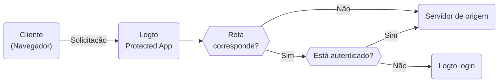

# Protected App — Integração de autenticação sem SDK

O Protected App foi projetado para eliminar a complexidade das [integrações de SDK](/quick-starts) separando a [autenticação](https://auth.wiki/authentication) do seu aplicativo. Nós cuidamos da autenticação, permitindo que você se concentre na sua funcionalidade principal. Uma vez que um usuário é autenticado, o Protected App serve o conteúdo do seu servidor.

## Como o Protected App funciona \{#how-protected-app-works}

O Protected App, alimentado pelo Cloudflare, opera globalmente em redes de borda, garantindo baixa latência e alta disponibilidade para o seu aplicativo.

O Protected App mantém o estado da sessão e as informações do usuário. Se um usuário não estiver autenticado, o Protected App os redireciona para a página de login. Uma vez autenticado, o Protected App envolve a solicitação do usuário com autenticação e informações do usuário, e então a encaminha para o servidor de origem.

Este processo é visualizado no seguinte fluxograma:



## Proteja seu servidor de origem \{#protect-your-origin-server}

O servidor de origem, que pode ser um dispositivo físico ou virtual não pertencente ao Protected App do Logto, é onde reside o conteúdo do seu aplicativo. Semelhante a um servidor de Rede de Distribuição de Conteúdo (CDN), o Protected App gerencia processos de autenticação e recupera conteúdo do seu servidor de origem. Portanto, se os usuários obtiverem acesso direto ao seu servidor de origem, eles podem contornar a autenticação e seu aplicativo não estará mais protegido.

Portanto, é importante proteger as conexões de origem, isso impede que invasores descubram e acessem seu servidor de origem sem autenticação. Existem várias maneiras de fazer isso:

1. Validação de Cabeçalho HTTP
2. Validação de JSON Web Tokens (JWT)

### Validação de Cabeçalho HTTP \{#http-header-validation}

Proteger seu servidor de origem pode ser alcançado usando [HTTP Basic Authentication](https://developer.mozilla.org/en-US/docs/Web/HTTP/Authentication#basic_authentication_scheme) para proteger seu servidor de origem.

Cada solicitação do Protected App inclui o seguinte cabeçalho:

```
Authorization: Basic base64(appId:appSecret)
```

Ao validar este cabeçalho, você pode confirmar que a solicitação vem do Protected App e negar quaisquer solicitações que não incluam este cabeçalho.

Se você estiver usando Nginx ou Apache, pode consultar os seguintes guias para implementar HTTP Basic Authentication no seu servidor de origem:

1. Nginx: [Configuring HTTP Basic Authentication](https://docs.nginx.com/nginx/admin-guide/security-controls/configuring-http-basic-authentication/)
2. Apache: [Authentication and Authorization](https://httpd.apache.org/docs/2.4/howto/auth.html)

Para verificar os cabeçalhos dentro do seu aplicativo, consulte o [exemplo de HTTP Basic Authentication](https://developers.cloudflare.com/workers/examples/basic-auth/) fornecido pela Cloudflare para aprender como restringir o acesso usando o esquema HTTP Basic.

### Validação de JSON Web Tokens (JWT) \{#json-web-tokens-jwt-validation}

Outra maneira de proteger seu servidor de origem é usando JSON Web Tokens (JWT).

Cada solicitação autenticada do Protected App inclui o seguinte cabeçalho:

```
Logto-ID-Token: <JWT>
```

O JWT é chamado de [Token de ID](https://auth.wiki/id-token), que é assinado pelo Logto e contém informações do usuário. Ao validar este JWT, você pode confirmar que a solicitação vem do Protected App e negar quaisquer solicitações que não incluam este cabeçalho.

O token é criptografado e assinado como um token [JWS](https://auth.wiki/jws).

Os passos de validação:

1. [Validando um JWT](https://datatracker.ietf.org/doc/html/rfc7519#section-7.2)
2. [Validando a assinatura JWS](https://datatracker.ietf.org/doc/html/rfc7515#section-5.2)
3. O emissor do token é `https://<your-logto-domain>/oidc` (emitido pelo seu servidor de autenticação Logto)

```js
const express = require('express');
const jwksClient = require('jwks-rsa');
const jwt = require('jsonwebtoken');

const ISSUER = 'https://<your-logto-domain>/oidc';
const CERTS_URL = 'https://<your-logto-domain>/oidc/jwks';

const client = jwksClient({
  jwksUri: CERTS_URL,
});

const getKey = (header, callback) => {
  client.getSigningKey(header.kid, function (err, key) {
    callback(err, key?.getPublicKey());
  });
};

const verifyToken = (req, res, next) => {
  const token = req.headers['Logto-ID-Token'];

  // Certifique-se de que a solicitação recebida tenha nosso cabeçalho de token
  if (!token) {
    return res
      .status(403)
      .send({ status: false, message: 'missing required Logto-ID-Token header' });
  }

  jwt.verify(token, getKey, { issuer: ISSUER }, (err, decoded) => {
    if (err) {
      return res.status(403).send({ status: false, message: 'invalid id token' });
    }

    req.user = decoded;
    next();
  });
};

const app = express();

app.use(verifyToken);

app.get('/', (req, res) => {
  res.send('Hello World!');
});

app.listen(3000);
```

## Obter estado de autenticação e informações do usuário \{#get-authentication-state-and-user-information}

Se você precisar obter autenticação e informações do usuário para seu aplicativo, também pode usar o cabeçalho `Logto-ID-Token`.

Se você apenas quiser decodificar o token, pode usar o seguinte código:

```js
const express = require('express');

const decodeIdToken = (req, res, next) => {
  const token = req.headers['Logto-ID-Token'];

  if (!token) {
    return res.status(403).send({
      status: false,
      message: 'missing required Logto-ID-Token header',
    });
  }

  const parts = token.split('.');
  if (parts.length !== 3) {
    throw new Error('Invalid ID token');
  }

  const payload = parts[1];
  const decodedPayload = atob(payload.replace(/-/g, '+').replace(/_/g, '/'));
  const claims = JSON.parse(decodedPayload);

  req.user = claims;
  next();
};

const app = express();

app.use(decodeIdToken);

app.get('/', (req, res) => {
  res.json(req.user);
});

app.listen(3000);
```

## Obter o host original \{#get-the-original-host}

Se você precisar obter o host original solicitado pelo cliente, pode usar o cabeçalho `Logto-Host` ou `x-forwarded-host`.

## Personalizar regras de autenticação \{#customize-authentication-rules}

Por padrão, o Protected App protegerá todas as rotas. Se você precisar personalizar as regras de autenticação, pode definir o campo "Regras de autenticação personalizadas" no Console.

Ele suporta expressões regulares, aqui estão dois cenários de caso:

1. Para proteger apenas as rotas `/admin` e `/privacy` com autenticação: `^/(admin|privacy)/.*`
2. Para excluir imagens JPG da autenticação: `^(?!.*\.jpg$).*$`

## Desenvolvimento local \{#local-development}

O Protected App foi projetado para funcionar com seu servidor de origem. No entanto, se seu servidor de origem não for acessível publicamente, você pode usar uma ferramenta como [ngrok](https://ngrok.com/) ou [Cloudflare Tunnels](https://developers.cloudflare.com/pages/how-to/preview-with-cloudflare-tunnel/) para expor seu servidor local à internet.

## Transição para integração com SDK \{#transition-to-sdk-integration}

O Protected App foi projetado para simplificar o processo de autenticação. No entanto, se você decidir fazer a transição para a integração com SDK para melhor controle e personalização, pode [criar um novo aplicativo](/integrate-logto/integrate-logto-into-your-application) no Logto e configurar a [integração com SDK](/quick-starts). E para uma transição suave, você pode reutilizar as configurações do aplicativo do Protected App. O Protected App é, na verdade, um "Aplicativo Web Tradicional" no Logto, você pode encontrar o "[AppId](/integrate-logto/application-data-structure#application-id)" e o "[AppSecret](/integrate-logto/application-data-structure#application-secret)" nas configurações do aplicativo. Após a conclusão da transição, você pode remover o Protected App do seu aplicativo.

## Recursos relacionados \{#related-resources}

<Url href="https://www.youtube.com/watch?v=ZBrXW3iZyKY">
  Protected App: Construa a autenticação do seu aplicativo em cliques. Nenhum código necessário.
</Url>

<Url href="https://blog.logto.io/protected-app">A motivação por trás do Protected App</Url>

<Url href="https://blog.logto.io/fastest-way-to-build-auth-system">
  A maneira mais rápida de construir um sistema de autenticação
</Url>
