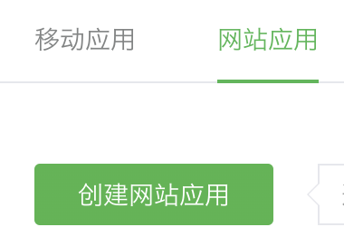

import GuideTip from '../../fragments/_guide-tip.mdx';

# Configurar login social com WeChat (Web)

O conector oficial do Logto para login social com WeChat em aplicativos web.

<GuideTip />

## Introdução

Se você não conhece o conceito de conector ou não sabe como adicionar este conector à sua experiência de login, consulte o [tutorial do Logto](/connectors/social-connectors).

> **⚠️ Atenção**
>
> Este conector é apenas para aplicativos web. Se você está procurando o método para fazer login com WeChat em aplicativos nativos, consulte o [conector nativo do WeChat](/integrations/wechat-native).

## Criar um aplicativo web na Plataforma Aberta do WeChat

> 💡 **Dica**
>
> Você pode pular algumas seções se já tiver concluído.

### Criar uma conta

Abra https://open.weixin.qq.com/, clique no botão "Sign Up" no canto superior direito e conclua o processo de inscrição.

### Criar um aplicativo web

Faça login com a conta que você acabou de criar. Na aba "Web Application" (网页应用), clique no grande botão verde "Create a web app" (创建网页应用).

Vamos preencher as informações necessárias no formulário de inscrição.

#### Informações básicas

A maioria delas é bastante direta. Após concluir o formulário, clique em "Next step" para prosseguir.

#### Informações do site

Preencha "Authorization callback domain" (授权回调域) com seu domínio Logto. Por exemplo, `logto.io`.

#### Aguardando o resultado da revisão

Após completar as informações do site, clique em "Submit Review" para continuar. Normalmente, a revisão é rápida, terminando em 1-2 dias.

Suspeitamos que o revisor seja alocado aleatoriamente em cada submissão, já que o padrão é variável. Você pode ser rejeitado na primeira vez, mas não desista! Explique sua situação atual e pergunte ao revisor como modificá-la.

### Configurar seu conector WeChat

Preencha o campo `clientId` e `clientSecret` com o _Client ID_ e _Client Secret_ que você obteve das páginas de detalhes do aplicativo OAuth.

Preencha o campo `scope` com 'snsapi_userinfo' ou 'snsapi_base'. Você pode deixar este campo em branco, pois é OPCIONAL. O valor padrão é 'snsapi_userinfo'. Você pode conferir a [diferença](https://developers.weixin.qq.com/doc/offiaccount/OA_Web_Apps/Wechat_webpage_authorization.html) entre os diferentes valores.

### Testar o conector web do WeChat

É isso. Não se esqueça de [Habilitar o conector social na experiência de login](/connectors/social-connectors/#enable-social-sign-in).

Uma vez que o conector web do WeChat esteja habilitado, você pode fazer login no seu aplicativo novamente para ver se funciona.
