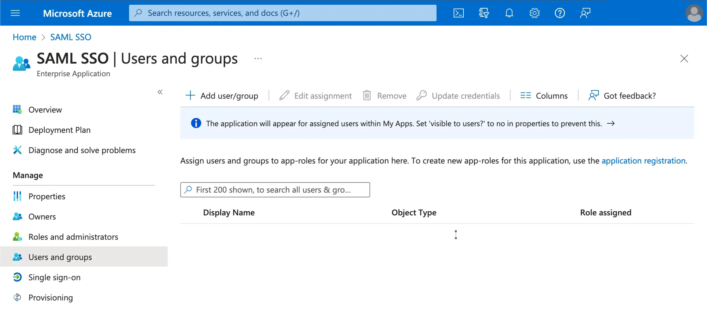

import GuideTip from '../../fragments/_sso_guide_tip.mdx';

# Configurar Single Sign-On com Microsoft Entra ID (SAML)

Com esforços mínimos de configuração, este conector permite a integração com o Microsoft Entra ID (anteriormente Azure AD) para SSO corporativo.

<GuideTip />

## Passo 1: Criar um aplicativo SSO no Azure AD

Inicie a integração SSO do Azure AD criando um aplicativo SSO no lado do Azure AD.

1. Acesse o [portal do Azure](https://portal.azure.com/) e faça login como administrador.
2. Selecione o serviço `Microsoft Entra ID`.
3. Navegue até `Enterprise applications` usando o menu lateral. Clique em `New application` e selecione `Create your own application`.

1. Insira o nome do aplicativo e selecione `Integrate any other application you don't find in the gallery (Non-gallery)`.
2. Selecione `Setup single sign-on` > `SAML`.

1. Siga as instruções; como primeiro passo, você precisará preencher a configuração básica do SAML usando as seguintes informações fornecidas pelo Logto.

- **Audience URI(SP Entity ID)**: Representa um identificador globalmente único para o seu serviço Logto, funcionando como o EntityId para SP durante solicitações de autenticação ao IdP. Este identificador é fundamental para a troca segura de afirmações SAML e outros dados relacionados à autenticação entre o IdP e o Logto.
- **ACS URL**: A URL do Assertion Consumer Service (ACS) é o local onde a afirmação SAML é enviada com uma solicitação POST. Esta URL é usada pelo IdP para enviar a afirmação SAML para o Logto. Atua como uma URL de callback onde o Logto espera receber e consumir a resposta SAML contendo as informações de identidade do usuário.

Clique em `Save` para continuar.

## Passo 2: Configurar SAML SSO no Logto

Para que a integração SAML SSO funcione, você precisará fornecer os metadados do IdP de volta ao Logto. Vamos voltar para o lado do Logto e navegar até a aba `Connection` do seu conector SSO do Azure AD.

O Logto oferece três maneiras diferentes de configurar os metadados do IdP. A maneira mais fácil é fornecendo a `metadata URL` do aplicativo SSO do Azure AD.

Copie a `App Federation Metadata Url` da seção `SAML Certificates` do seu aplicativo SSO do Azure AD e cole no campo `Metadata URL` no Logto.

O Logto buscará os metadados da URL e configurará a integração SAML SSO automaticamente.

## Passo 3: Configurar mapeamento de atributos do usuário

O Logto oferece uma maneira flexível de mapear os atributos do usuário retornados do IdP para os atributos do usuário no Logto. O Logto sincronizará os seguintes atributos do usuário do IdP por padrão:

- id: O identificador único do usuário. O Logto lerá a reivindicação `nameID` da resposta SAML como o id de identidade SSO do usuário.
- email: O endereço de email do usuário. O Logto lerá a reivindicação `email` da resposta SAML como o email principal do usuário por padrão.
- name: O nome do usuário.

Você pode gerenciar a lógica de mapeamento de atributos do usuário tanto no lado do Azure AD quanto no lado do Logto.

1. Mapear os atributos do usuário do AzureAD para os atributos do usuário do Logto no lado do Logto.

   Visite a seção `Attributes & Claims` do seu aplicativo SSO do Azure AD.

   Copie os seguintes nomes de atributos (com prefixo de namespace) e cole nos campos correspondentes no Logto.

   - `http://schemas.xmlsoap.org/ws/2005/05/identity/claims/emailaddress`
   - `http://schemas.xmlsoap.org/ws/2005/05/identity/claims/name` (Recomendação: atualize este valor de atributo para `user.displayname` para uma melhor experiência do usuário)

1. Mapear os atributos do usuário do AzureAD para os atributos do usuário do Logto no lado do AzureAD.

   Visite a seção `Attributes & Claims` do seu aplicativo SSO do Azure AD.

   Clique em `Edit` e atualize os campos `Additional claims` com base nas configurações de atributos do usuário do Logto:

   - atualize o valor do nome da reivindicação com base nas configurações de atributos do usuário do Logto.
   - remova o prefixo de namespace.
   - clique em `Save` para continuar.

   Deve terminar com as seguintes configurações:

Você também pode especificar atributos adicionais do usuário no lado do Azure AD. O Logto manterá um registro dos atributos originais do usuário retornados do IdP no campo `sso_identity` do usuário.

## Passo 4: Atribuir usuários ao aplicativo SSO do Azure AD

Visite a seção `Users and groups` do seu aplicativo SSO do Azure AD. Clique em `Add user/group` para atribuir usuários ao aplicativo SSO do Azure AD. Somente usuários atribuídos ao seu aplicativo SSO do Azure AD poderão se autenticar através do conector SSO do Azure AD.

## Passo 5: Definir domínios de email e habilitar o conector SSO

Forneça os `domínios de email` da sua organização na aba `SSO experience` do conector do Logto. Isso habilitará o conector SSO como um método de autenticação para esses usuários.

Usuários com endereços de email nos domínios especificados serão redirecionados para usar o conector SAML SSO como seu único método de autenticação.

Por favor, consulte a [documentação](https://learn.microsoft.com/en-us/entra/identity/enterprise-apps/add-application-portal-setup-sso) oficial do Azure AD para mais detalhes sobre a integração SSO do Azure AD.
