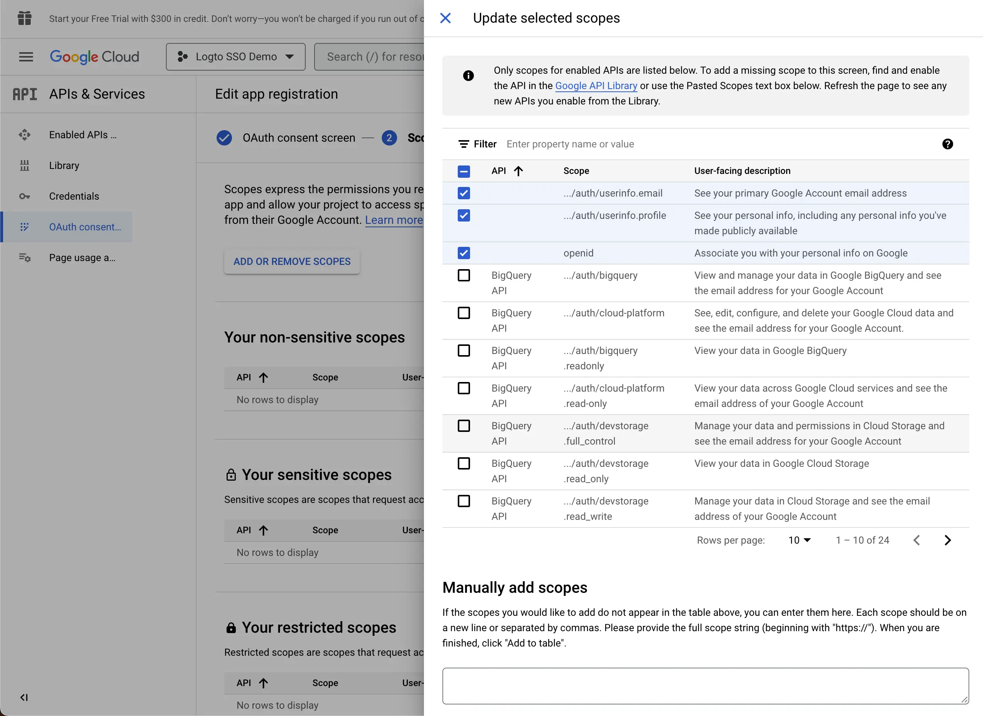

import GuideTip from '../../fragments/_sso_guide_tip.mdx';

# Configurar Single Sign-On com Google Workspace

Com esforços mínimos de configuração, este conector permite a integração com o Microsoft Entra ID para SSO corporativo.

<GuideTip />

## Passo 1: Crie um novo projeto no Google Cloud Platform \{#step-1-create-a-new-project-on-google-cloud-platform}

Antes de poder usar o Google Workspace como um provedor de autenticação, você deve configurar um projeto no [Google API Console](https://console.developers.google.com/) para obter credenciais OAuth 2.0. Se você já tem um projeto, pode pular esta etapa. Caso contrário, crie um novo projeto sob sua organização Google.

## Passo 2: Configure a tela de consentimento para seu aplicativo \{#step-2-config-the-consent-screen-for-your-application}

Para criar uma nova credencial OIDC, você precisa configurar a tela de consentimento para seu aplicativo.

1. Navegue até a página [Tela de consentimento OAuth](https://console.cloud.google.com/apis/credentials/consent) e selecione o tipo de usuário `Interno`. Isso tornará o aplicativo OAuth disponível apenas para usuários dentro de sua organização.

2. Preencha as configurações da `Tela de Consentimento` seguindo as instruções na página. Você precisa fornecer as seguintes informações mínimas:

- **Nome do aplicativo**: O nome do seu aplicativo. Ele será exibido na tela de consentimento.
- **Email de suporte**: O email de suporte do seu aplicativo. Ele será exibido na tela de consentimento.

3. Defina os `Escopos` para seu aplicativo. Para recuperar corretamente as informações de identidade e endereço de email do usuário do IdP, os conectores SSO do Logto precisam conceder os seguintes escopos do IdP:

- **openid**: Este escopo é necessário para autenticação OIDC. Ele é usado para recuperar o Token de ID e obter acesso ao endpoint userInfo do IdP.
- **profile**: Este escopo é necessário para acessar as informações básicas do perfil do usuário.
- **email**: Este escopo é necessário para acessar o endereço de email do usuário.

Clique no botão `Salvar` para salvar as configurações da tela de consentimento.

## Passo 3: Crie uma nova credencial OAuth \{#step-3-create-a-new-oauth-credential}

Navegue até a página [Credenciais](https://console.cloud.google.com/apis/credentials) e clique no botão `Criar Credenciais`. Selecione a opção `ID do cliente OAuth` no menu suspenso para criar uma nova credencial OAuth para seu aplicativo.

Continue configurando a credencial OAuth preenchendo as seguintes informações:

1. Selecione `Aplicativo Web` como o tipo de aplicativo.
2. Preencha o `Nome` do seu aplicativo cliente, `Logto SSO Connector`, por exemplo. Isso ajudará você a identificar as credenciais no futuro.
3. Preencha os `URIs de redirecionamento autorizados` com o URI de callback do Logto. Este é o URI para o qual o Google redirecionará o navegador do usuário após a autenticação bem-sucedida. Após um usuário autenticar-se com sucesso no IdP, o IdP redireciona o navegador do usuário de volta para este URI designado junto com um código de autorização. O Logto completará o processo de autenticação com base no código de autorização recebido deste URI.
4. Preencha as `Origens JavaScript autorizadas` com a origem do URI de callback do Logto. Isso garante que apenas seu aplicativo Logto possa enviar solicitações para o servidor OAuth do Google.
5. Clique no botão `Criar` para criar a credencial OAuth.

## Passo 4: Configure o conector Logto com as credenciais do cliente \{#step-4-set-up-logto-connector-with-the-client-credentials}

Após criar com sucesso a credencial OAuth, você receberá um modal de prompt com o ID do cliente e o segredo do cliente.

Copie o `ID do Cliente` e o `Segredo do Cliente` e preencha os campos correspondentes na aba `Conexão` do conector SSO do Logto.

Agora você configurou com sucesso um conector SSO do Google Workspace no Logto.

## Passo 5: Escopos Adicionais (Opcional) \{#step-5-additional-scopes-optional}

Use o campo `Escopo` para adicionar escopos adicionais à sua solicitação OAuth. Isso permitirá que você solicite mais informações do servidor OAuth do Google. Consulte a documentação [Escopos OAuth do Google](https://developers.google.com/identity/protocols/oauth2/scopes) para mais informações.

Independentemente das configurações de escopo personalizadas, o Logto sempre enviará os escopos `openid`, `profile` e `email` para o IdP. Isso é para garantir que o Logto possa recuperar corretamente as informações de identidade e endereço de email do usuário.

## Passo 6: Defina domínios de email e habilite o conector SSO \{#step-6-set-email-domains-and-enable-the-sso-connector}

Forneça os `domínios de email` de sua organização na aba `Experiência SSO` do conector do Logto. Isso habilitará o conector SSO como um método de autenticação para esses usuários.

Usuários com endereços de email nos domínios especificados serão redirecionados para usar seu conector SSO como seu único método de autenticação.

Para mais informações sobre o conector SSO do Google Workspace, consulte [Google OpenID Connector](https://developers.google.com/identity/openid-connect/openid-connect).
