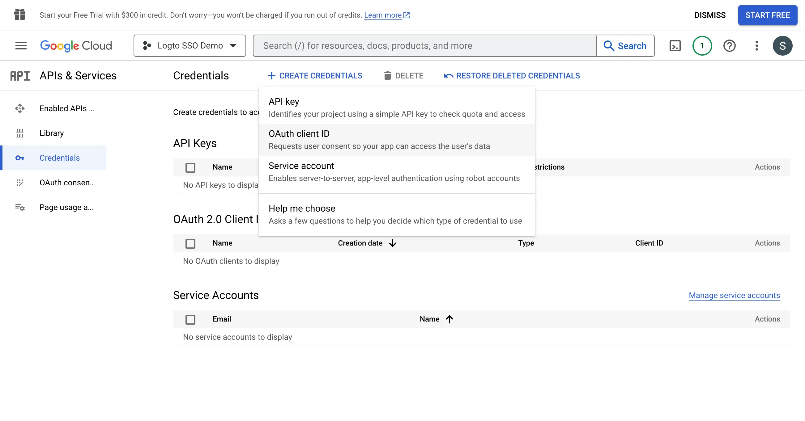

Navegue até a página de [Credenciais](https://console.cloud.google.com/apis/credentials) e clique no botão `Create Credentials`. Selecione a opção `OAuth client ID` no menu suspenso para criar uma nova credencial OAuth para seu aplicativo.

Continue configurando a credencial OAuth preenchendo as seguintes informações:

1. Selecione `Web application` como o tipo de aplicativo.
2. Preencha o `Name` do seu aplicativo cliente, `Logto SSO Connector`, por exemplo. Isso ajudará você a identificar as credenciais no futuro.
3. Preencha os `Authorized redirect URIs` com o URI de callback do Logto. Este é o URI para o qual o Google redirecionará o navegador do usuário após a autenticação bem-sucedida. Após um usuário autenticar-se com sucesso com o IdP, o IdP redireciona o navegador do usuário de volta para este URI designado junto com um código de autorização. O Logto completará o processo de autenticação com base no código de autorização recebido deste URI.
4. Preencha os `Authorized JavaScript origins` com a origem do URI de callback do Logto. Isso garante que apenas seu aplicativo Logto possa enviar solicitações para o servidor OAuth do Google.
5. Clique no botão `Create` para criar a credencial OAuth.
