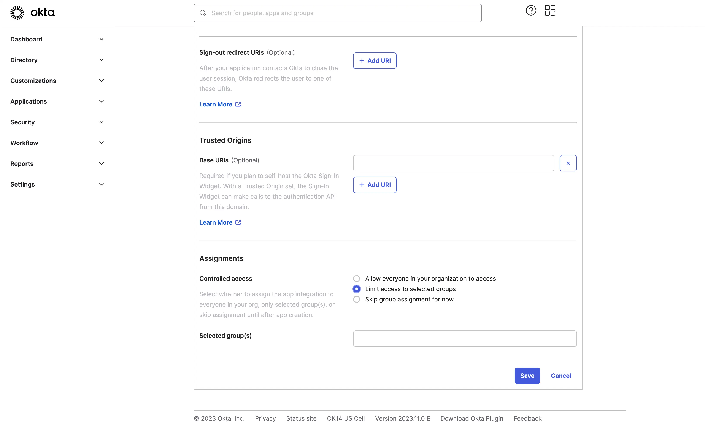

import GuideTip from '../../fragments/_sso_guide_tip.mdx';

# Configurar Single Sign-On com Okta

Com esforços mínimos de configuração, este conector permite a integração com Okta para SSO corporativo.

<GuideTip />

## Etapa 1: Criar um aplicativo OIDC no portal de administração do Okta \{#step-1-create-an-oidc-application-on-okta-admin-portal}

- Visite o portal de administração do Okta e faça login como administrador.
- Navegue até a página `Applications`/`Applications` usando o menu lateral.
- Clique no botão `Create App Integration` para criar um novo aplicativo OIDC.
- Selecione a opção `OIDC - OpenID Connect` como o `Sign-in method`.
- Selecione a opção `Web Application` como o `Application type`.

Clique no botão `Next` para continuar.

## Etapa 2: Configurar as configurações do aplicativo \{#step-2-configure-the-application-settings}

1. Forneça um `App integration name`. Ele será usado como o identificador do seu aplicativo OIDC.
2. Adicione um novo `Sign-in redirect URIs` usando a URL de callback do conector SSO do Logto.

Este é o URI para o qual o Okta redirecionará o navegador do usuário após a autenticação bem-sucedida. Após um usuário autenticar-se com sucesso com o IdP, o IdP redireciona o navegador do usuário de volta para este URI designado junto com um código de autorização. O Logto completará o processo de autenticação com base no código de autorização recebido deste URI.

3. Atribua usuários ao aplicativo.

Com base nas configurações de `Assignments`, você pode escolher atribuir o aplicativo a todos os usuários ou a usuários/grupos específicos.

Clique no botão `Save` para salvar as configurações do aplicativo.

## Etapa 3: Configurar o conector Logto com as credenciais do cliente \{#step-3-set-up-logto-connector-with-the-client-credentials}

Após criar com sucesso o aplicativo OIDC, você será redirecionado para a página de detalhes do aplicativo.

Copie o `client ID` e o `client secret` e preencha os campos correspondentes na aba `Connection` do conector SSO do Logto.

Use seu domínio Okta como o `issuer`. Exemplo: `https://dev-12345678.okta.com`. Depois de preencher todos os campos, clique no botão `Save` para salvar as configurações do conector.

Se o link do `issuer` que você forneceu for válido, você verá uma lista completa de configurações do IdP Okta analisadas abaixo do campo `issuer`.

## Etapa 4: Escopos adicionais (Opcional) \{#step-4-additional-scopes-optional}

Use o campo `Scope` para adicionar escopos adicionais à sua solicitação OAuth. Isso permitirá que você solicite mais informações do servidor OAuth do Okta. Consulte a [documentação do Okta](https://developer.okta.com/docs/reference/api/oidc/#scopes) para mais detalhes sobre os escopos disponíveis.

Independentemente das configurações de escopo personalizadas, o Logto sempre enviará os escopos `openid`, `profile` e `email` para o IdP. Isso é para garantir que o Logto possa recuperar corretamente as informações de identidade e o endereço de email do usuário.

## Etapa 5: Definir domínios de email e habilitar o conector SSO \{#step-5-set-email-domains-and-enable-the-sso-connector}

Forneça os `email domains` da sua organização na aba `SSO experience` do conector do Logto. Isso habilitará o conector SSO como um método de autenticação para esses usuários.

Usuários com endereços de email nos domínios especificados serão redirecionados para usar seu conector SSO como seu único método de autenticação.

Para mais detalhes sobre como criar integração OIDC com Okta, consulte [Create OIDC App Integrations](https://help.okta.com/oie/en-us/content/topics/apps/apps_app_integration_wizard_oidc.htm).
