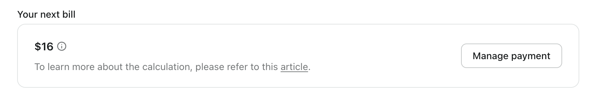

# Faturamento e preços

No Logto, nosso [plano Pro](https://logto.io/pricing) é totalmente self-service, projetado para transparência para que você possa entender e gerenciar facilmente seu faturamento.

## Entenda a estrutura \{#understand-the-structure}

A estrutura básica é assim:

```math
\begin{align*}
\text{Sua próxima fatura} &= \$16 \text{(preço base)} \\
&+ \text{custo adicional (uso não faturado)} \\
&+ \text{custo adicional (cobrança do próximo ciclo)}
\end{align*}
```

No console, você encontrará uma seção "Sua próxima fatura" na seção de configurações do locatário, onde pode monitorar e controlar suas cobranças futuras.



## Detalhamento dos itens \{#item-breakdown}

Lembre-se de que apenas alguns recursos fazem parte da estrutura de complementos.

Ao mesmo tempo, o Logto também oferece um modelo de preços pay-as-you-go e pro-rata para garantir que você aproveite ao máximo nosso serviço de forma conveniente.

|                                      | Cota incluída | Custo adicional          |
| ------------------------------------ | ------------- | ------------------------ |
| **Tokens**                           | 100K          | $0,08 por mês / 100 após |
| **Aplicativos máquina para máquina** | 1             | $8 **_cada_** por mês    |
| **Recursos de API**                  | 3             | $4 **_cada_** por mês    |
| **SSO corporativo**                  | 0             | $48 **_cada_** por mês   |
| **Autenticação multifatorial**       | _N/A_         | $48 por mês              |
| **Organização**                      | Ilimitado     | $48 por mês              |
| **Membros do locatário**             | 3             | $8 **_cada_** por mês    |

Se considerarmos esses fatores, o algoritmo é

```math
\begin{align*}
\text{Sua próxima fatura} &= \$16 \\
&+ \text{preço unitário do complemento} \times \\
\quad & (\text{quantidade adicionada} \times \text{tempo pro-rata restante na criação} \\
\quad &- \text{quantidade removida} \times \text{tempo pro-rata restante na exclusão}) \\
\quad &+ \text{preço unitário do complemento} \times \text{quantidade restante}
\end{align*}
```

1. **preço unitário do complemento**: O preço unitário deste complemento
2. **quantidade adicionada**: A quantidade de complemento adicionada pelo usuário no ciclo de faturamento **_atual_**
3. **quantidade removida**: A quantidade de complemento removida pelo usuário no ciclo de faturamento **_atual_**
4. **tempo pro-rata restante na criação**: tempo pro-rata restante no ciclo **_atual_** quando você CRIA os recursos
5. **tempo pro-rata restante na exclusão**: tempo pro-rata restante no ciclo **_atual_** quando você EXCLUI os recursos
6. **quantidade restante**: a quantidade necessária para faturamento consistente no ciclo **_próximo_**

Vamos ver dois exemplos de como isso funciona.

### Exemplo 1: Faturamento consistente sem alterações \{#example-1-consistent-billing-with-no-changes}

Sua fatura permanecerá consistente se você não fizer alterações, como adicionar ou remover itens.

Por exemplo, se você estiver no plano Pro e tiver 2 serviços de SSO em uso, sua fatura permanecerá consistente enquanto você não fizer alterações.

```math
\text{Sua próxima fatura} = \$ 16 + \$ 48 \times 2 = \$ 112
```

### Exemplo 2: Adicionar complementos ou fazer alterações afetará suas próximas faturas \{#example-2-adding-add-ons-or-making-changes-will-affect-your-upcoming-bills}

Isso fará com que sua próxima fatura seja um pouco diferente com base em diferentes casos. O algoritmo ainda funciona.

**Caso 1: Você assinou o plano Pro sem nenhum complemento e apenas testou o SSO corporativo por 10 dias.**

Se sua assinatura for renovada no dia 5 de cada mês e você adicionar um SSO corporativo no dia 20, você o usará por 15 dias naquele mês. Se você excluir o SSO corporativo no dia 30, isso significa que você o usou por apenas 10 dias.

```math
\$16 + \$48 \times (1 \times 15 / 30) - \$48 \times (1 \times 5 / 30) = \$32
```

**Caso 2: Você assinou o plano Pro sem nenhum complemento. Após adicionar e remover recursos de API, você acabou usando 5 recursos de API**

Neste caso, você atualizou os recursos de complemento durante este ciclo de faturamento, então as alterações aparecerão na sua próxima fatura. O primeiro mês após a alteração pode ser ligeiramente mais alto. Sua fatura incluirá o preço base de $16, custos de complementos para uso não faturado e a cobrança total para o próximo ciclo recorrente.

Seu ciclo de faturamento começa no dia 1 de cada mês, e você usou os primeiros 3 recursos de API gratuitos. Este mês, você realizou duas ações:

1. No dia 5, você adicionou 4 recursos a mais.
2. No dia 15, você excluiu 2 desses recursos.

Como resultado, você terá consistentemente 2 recursos de API disponíveis para o próximo ciclo.

```math
\$16 + \$8 \times (4 \times 25 - 2 \times 15) / 30 + 2 \times \$8 = \$50,67
```

### Como é determinado o tempo de uso do complemento? \{#how-is-the-add-on-usage-time-determined}

Usamos um modelo pay-as-you-go, e você pode se perguntar o que acontece se você adicionar ou remover recursos com frequência. O complemento é considerado em uso pelo tempo exato em que está ativo. Não se preocupe—nosso sistema, alimentado pelo Stripe, calcula seu uso até o segundo, garantindo faturamento preciso com base exatamente no tempo em que cada recurso está em uso.

Se você cancelar a assinatura do plano Pro, reembolsaremos o custo do complemento não utilizado, e o valor será deduzido da sua fatura final.

## Upgrade ou downgrade \{#upgrade-or-downgrade}

### Upgrade do plano gratuito para o Pro \{#free-plan-upgrade-to-pro}

Upgrades e downgrades se aplicam apenas ao locatário de produção. Aqui estão situações em que você pode precisar considerar o upgrade do plano gratuito:

1. Se seu uso de MAU ou Token exceder a cota, enviaremos um alerta por e-mail no momento apropriado, notificando você sobre a necessidade de upgrade.
2. Se você quiser acessar recursos disponíveis apenas no plano premium.

### Upgrade do plano Pro para o Enterprise \{#pro-plan-upgrade-to-enterprise}

Se o plano Pro não atender às suas necessidades e você estiver procurando por suporte completo em nível empresarial, por favor, [entre em contato conosco](https://logto.io/contact) para discutir um plano empresarial personalizado.

### Downgrade do plano Pro para o plano gratuito \{#pro-plan-downgrade-to-free-plan}

Se você optar por parar de usar o plano Pro, pode mudar para o plano gratuito, mas precisará ajustar seu uso para se adequar à cota do plano gratuito.

## Mudança futura no plano de preços \{#future-pricing-plan-change}

Para fornecer a você uma experiência de faturamento estável e previsível, manteremos seu plano atual sempre que ocorrerem mudanças de preços.

## FAQs \{#faqs}

<details>

<summary>

### Qual é a conexão entre consumo de tokens e MAU? \{#what-is-the-connection-between-token-consumption-and-mau}

</summary>

Logto usa autenticação baseada em tokens. Um único usuário fazendo login uma vez pode envolver o consumo de dois ou três tokens: Token de ID, Token de acesso e Token de atualização. Se você usar recursos como M2M ou Organização, tokens adicionais, como tokens M2M ou tokens de organização, também podem estar envolvidos. O consumo de tokens depende de como os usuários interagem com seu sistema. Para ajudá-lo a acompanhar isso, oferecemos monitoramento em tempo real do uso de tokens no <CloudLink to="/dashboard">Console > Dashboard</CloudLink>. Aqui está um exemplo: nosso plano gratuito oferece 100k tokens gratuitamente, o que pode suportar aproximadamente entre 30k-50k MAU (Usuários Ativos Mensais).

</details>
