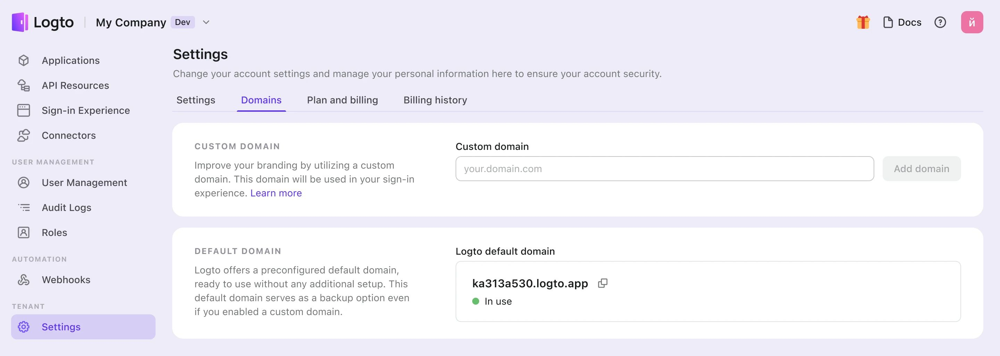

# Domínio personalizado

Seu locatário Logto vem com um domínio gratuito padrão `{{tenant-id}}.app.logto`. No entanto, você pode elevar sua experiência de usuário e reconhecimento de marca usando um domínio personalizado, como `auth.example.com`.

Seu domínio personalizado é usado para várias funções:

- URLs da [página de login e registro](/end-user-flows/sign-up-and-sign-in)
- URLs de vinculação de [Passkey](/end-user-flows/mfa/webauthn) (Alterar o domínio após os usuários terem vinculado Passkeys pode bloquear sua autenticação).
- URIs de callback para [conectores sociais](/connectors/social-connectors) ou [conectores de SSO corporativo](/connectors/enterprise-connectors).
- [Endpoint do SDK](/integrate-logto/application-data-structure#openid-provider-configuration-endpoint) para integrar o Logto com seu aplicativo.

:::note
Alterar o domínio após publicar seu serviço pode causar problemas porque o código do seu aplicativo e integrações podem ainda referenciar o domínio antigo. Para garantir uma transição suave, **configure seu domínio personalizado no início** durante a criação de um locatário de Produção.
:::

## Configurar domínio personalizado no Console

Para adicionar um novo domínio personalizado no Console do Logto, siga estas etapas:

1. Navegue até <CloudLink to="/tenant-settings/domains">Console > Configurações > Domínios</CloudLink>.
2. Na seção "Domínio Personalizado", insira o nome do seu domínio e clique em "adicionar domínio".

   

3. Copie o valor CNAME na tabela e vá para o provedor de DNS do seu domínio para adicionar o registro.

   

4. Aguarde a verificação e o processo de SSL.
   1. Verificaremos automaticamente seus registros a cada 10 segundos até que o domínio personalizado seja adicionado. Apenas certifique-se de que o nome do domínio inserido ou os Registros DNS estejam corretos.
   2. A verificação geralmente leva alguns minutos, mas pode levar até 24 horas, dependendo do provedor de DNS. Sinta-se à vontade para navegar para longe durante o processo.

## Solução de problemas

<details>
<summary>

### Problemas com certificado SSL

</summary>

Se você encontrar problemas com o certificado SSL ao configurar seu domínio personalizado, isso pode estar relacionado a registros CAA na sua configuração de DNS. Registros CAA especificam quais Autoridades Certificadoras (CAs) estão autorizadas a emitir certificados para seu domínio.

Para solucionar e resolver problemas de certificado SSL relacionados a registros CAA, consulte a [documentação da Cloudflare](https://developers.cloudflare.com/ssl/edge-certificates/caa-records/) sobre Registros CAA.

</details>

<details>
<summary>

### Erro "O nome do host está associado a uma zona retida"

</summary>

Se você encontrar a mensagem de erro "O nome do host está associado a uma zona retida, por favor, entre em contato com o proprietário para remover a retenção" ao adicionar um domínio personalizado, isso significa que o domínio já está na zona da Cloudflare e está definido para o status "Zone Hold". Veja esta [documentação da Cloudflare](https://developers.cloudflare.com/fundamentals/setup/account/account-security/zone-holds/) para mais informações.

Para resolver esse problema, você precisará liberar a retenção da zona. Siga o link acima para instruções sobre como liberar a retenção da zona na Cloudflare.

</details>

## Usar domínio personalizado

Depois de configurar suas configurações, tanto o nome do seu domínio personalizado quanto o nome do domínio padrão do Logto estarão disponíveis para seu locatário. No entanto, certas configurações são necessárias para ativar seu nome de domínio personalizado.

:::note
Neste artigo, assumimos que seu domínio personalizado é `auth.example.com`.


:::

### Atualizando o endpoint do SDK para aplicativos

Altere seu código de inicialização para o SDK do Logto modificando o nome do domínio do endpoint.

```typescript
const client = new LogtoClient({
  ...,// outras opções
  endpoint: 'https://auth.example.com',
});
```

### Modificando endpoints de autenticação para outros aplicativos

Se você tiver aplicativos que não estão usando o SDK do Logto, é necessário atualizar seus endpoints de autenticação.

Você pode localizar os endpoints de autenticação na URL bem conhecida:

```
https://auth.example.com/oidc/.well-known/openid-configuration
```

### Atualizando o URI de callback do conector social

O URI de callback do conector social será atualizado automaticamente se seus usuários estiverem usando o domínio personalizado. Você precisa ir ao console do desenvolvedor do provedor social para atualizar o URI de callback.

Quando seus usuários estiverem usando o domínio personalizado, o URI de callback do conector social usará o novo domínio. Portanto, você precisa navegar até o console do desenvolvedor do provedor social para atualizar manualmente o URI de callback.
