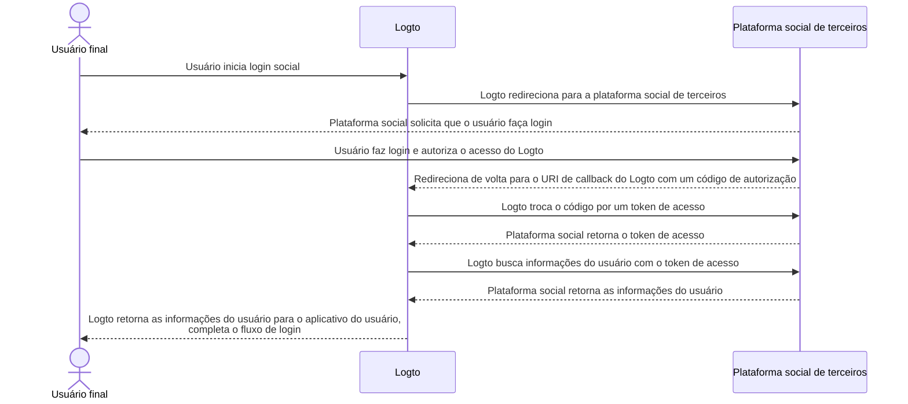

# Implementar conectores

Após analisar a estrutura de arquivos do conector, vamos discutir a implementação e a ideia principal de desenvolver um conector.

Vamos passar por um exemplo simples para conectores sociais e sem senha, para que você possa construir seu conector com quase a mesma ideia.

Nesta parte, não vamos nos aprofundar nos detalhes de parâmetros específicos (como `config`), pois não é o objetivo deste guia. Os desenvolvedores que implementam novos conectores devem ler os documentos fornecidos pelos fornecedores de serviços de terceiros, e esses documentos devem detalhar os parâmetros.

## Construir um conector social

Vamos tomar o conector do GitHub como exemplo.

A maioria dos fluxos de autorização dos conectores sociais obedece ao [Fluxo de Código de Autorização OAuth](https://openid.net/specs/openid-connect-basic-1_0.html).

:::note
A maioria dos _conectores sociais_, ao obter um perfil de usuário com a autenticação dos usuários finais, segue um esquema de duas etapas (assumindo que todas as etapas sejam bem-sucedidas):

1. Iniciar uma solicitação de autenticação e obter a autenticação do usuário.
2. Buscar `accessToken` usando um `authCode` concedido pelo fornecedor do conector.
3. Solicitar um perfil de usuário publicamente acessível usando `accessToken`.

:::



Para realizar o fluxo, precisamos ter os seguintes três métodos:

### getAuthorizationUri

`getAuthorizationUri` gera uma URL de redirecionamento que pode direcionar os usuários finais para a página que requer a autenticação dos usuários.

A interface é definida como `GetAuthorizationUri` em [`@logto/connector-kit`](https://github.com/logto-io/logto/blob/master/packages/toolkit/connector-kit/src/types/social.ts).

Você pode armazenar informações essenciais relacionadas ao login usando `setSession` (o segundo parâmetro de entrada de `GetAuthorizationUri`) para o método `getUserInfo`.

Os parâmetros listados são necessários:

- `authorizationEndpoint` pode ser encontrado no site de documentação do OAuth do GitHub, que é a página onde o usuário final deve ir para autenticação
- `config`, que inclui `clientId` e `clientSecret` no cenário do GitHub
- `state`, uma string aleatória para provar CSRF
- `redirectUri` da página de destino após a autenticação bem-sucedida do usuário final

```typescript
const getAuthorizationUri = async ({ state, redirectUri }) => {
  const queryParameters = new URLSearchParams({
    client_id: config.clientId, // `config` contém suas credenciais de aplicativo do GitHub
    redirect_uri: redirectUri,
    state,
  });

  return `${authorizationEndpoint}?${queryParameters.toString()}`;
};
```

### getAccessToken

`getAccessToken` obtém o token de acesso com o código de autorização emitido após a autenticação bem-sucedida dos usuários finais.

Além do `config` mencionado no método `getAuthorizationUri` anterior, também queremos obter:

- `code` de autorização dos parâmetros trazidos para a página de destino de redirecionamento
- `accessTokenEndpoint`, que é o endpoint para obter o token de acesso com o código de autorização

```typescript
const getAccessToken = async (config: GithubConfig, code: string) => {
  const { clientId: client_id, clientSecret: client_secret } = config;

  const httpResponse = await got.post({
    url: accessTokenEndpoint,
    json: {
      client_id,
      client_secret,
      code,
    },
    timeout: defaultTimeout,
  });

  const result = accessTokenResponseGuard.safeParse(qs.parse(httpResponse.body));

  if (!result.success) {
    throw new ConnectorError(ConnectorErrorCodes.InvalidResponse, result.error);
  }

  const { access_token: accessToken } = result.data;

  assert(accessToken, new ConnectorError(ConnectorErrorCodes.SocialAuthCodeInvalid));

  return { accessToken };
};
```

### getUserInfo

`getUserInfo` busca informações do usuário com o token de acesso obtido na etapa anterior.

A interface é definida como `GetUserInfo` em [`@logto/connector-kit`](https://github.com/logto-io/logto/blob/master/packages/toolkit/connector-kit/src/types/social.ts).

Para fins de login, você pode recuperar informações necessárias usando a função `getSession`.

`userInfoEndpoint` é o endpoint usado para obter informações do usuário.

Você pode verificar documentos oficiais para encontrar informações específicas do usuário que podem ser acessadas no endpoint de informações do usuário e o escopo correspondente.

`id` atribuído pelo provedor de identidade do conector (neste caso, GitHub) é necessário; outras informações são opcionais. Se você puder obter `email` ou `phone` do perfil do usuário, CERTIFIQUE-SE de que eles estão "verificados". Você também precisa alinhar as chaves de retorno com os nomes dos campos no [perfil de usuário do Logto](/user-management/user-data/#basic-data).

```typescript
const getUserInfo = async (
  data: { code: string; config: GithubConfig },
  getSession: GetSession,
  { set: SetStorageValue, get: GetStorageValue }
) => {
  const { code, config } = data;
  const { accessToken } = await getAccessToken(config, code);

  try {
    const httpResponse = await got.get(userInfoEndpoint, {
      headers: {
        authorization: `token ${accessToken}`,
      },
      timeout: defaultTimeout,
    });

    const result = userInfoResponseGuard.safeParse(parseJson(httpResponse.body));

    if (!result.success) {
      throw new ConnectorError(ConnectorErrorCodes.InvalidResponse, result.error);
    }

    const { id, avatar_url: avatar, email, name } = result.data;

    return {
      id: String(id),
      avatar: conditional(avatar),
      email: conditional(email),
      name: conditional(name),
    };
  } catch (error: unknown) {
    if (error instanceof HTTPError) {
      const { statusCode, body: rawBody } = error.response;

      if (statusCode === 401) {
        throw new ConnectorError(ConnectorErrorCodes.SocialAccessTokenInvalid);
      }

      throw new ConnectorError(ConnectorErrorCodes.General, JSON.stringify(rawBody));
    }

    throw error;
  }
};
```

Você pode encontrar a implementação completa [aqui](https://github.com/logto-io/connectors/blob/master/packages/connector-github/src/index.ts).

Para mais detalhes sobre parâmetros configuráveis, consulte o README do conector do GitHub ou os documentos oficiais do GitHub.

:::note
O exemplo que discutimos é baseado no tipo de concessão de Código de Autorização do protocolo OAuth, que é usado no conector do GitHub do Logto. No entanto, vale destacar que outro tipo de concessão, o tipo de concessão Implícita, também pode ser usado para recuperar o perfil de um usuário e, de fato, fornece um access_token diretamente na resposta de autenticação. Apesar dessa conveniência, o tipo de concessão de Código de Autorização é geralmente recomendado em vez do tipo Implícito devido à sua segurança mais robusta.

Você também pode construir um conector baseado em OIDC ou em alguns outros protocolos abertos, depende do seu caso de uso, bem como da compatibilidade do fornecedor social que você deseja conectar.
:::

## Construir um conector sem senha

Vamos passar pela implementação do conector de email direto da Aliyun para entender o processo de construção de um conector sem senha.

Conectores sem senha são usados para enviar um código aleatório para o email ou telefone dos usuários finais. Como resultado, um método `sendMessage` é necessário.

### sendMessage

Para enviar uma mensagem, precisamos que `config` e `endpoint` estejam configurados corretamente.

- `endpoint` é o endpoint para o qual suas chamadas de API se conectam
- `config` contém `templates` (modelos de conteúdo para enviar código de acesso em diferentes fluxos de usuário), `clientId` e `clientSecret` (para acessar solicitações de API)

```typescript
const sendMessage = async (data, inputConfig) => {
  const { to, type, payload } = data;
  const config = inputConfig ?? (await getConfig(defaultMetadata.id));
  validateConfig<AliyunDmConfig>(config, aliyunDmConfigGuard);
  const { accessKeyId, accessKeySecret, accountName, fromAlias, templates } = config;
  const template = templates.find((template) => template.usageType === type);

  assert(
    template,
    new ConnectorError(
      ConnectorErrorCodes.TemplateNotFound,
      `Cannot find template for type: ${type}`
    )
  );

  const parameters = {
    AccessKeyId: accessKeyId,
    AccountName: accountName,
    ReplyToAddress: 'false',
    AddressType: '1',
    ToAddress: to,
    FromAlias: fromAlias,
    Subject: template.subject,
    HtmlBody:
      typeof payload.code === 'string'
        ? template.content.replace(/{{code}}/g, payload.code)
        : template.content,
  };

  try {
    const httpResponse = await request(
      endpoint,
      { Action: 'SingleSendMail', ...staticConfigs, ...parameters },
      accessKeySecret
    );

    const result = sendEmailResponseGuard.safeParse(parseJson(httpResponse.body));

    if (!result.success) {
      throw new ConnectorError(ConnectorErrorCodes.InvalidResponse, result.error);
    }

    return result.data;
  } catch (error: unknown) {
    if (error instanceof HTTPError) {
      const {
        response: { body: rawBody },
      } = error;

      assert(typeof rawBody === 'string', new ConnectorError(ConnectorErrorCodes.InvalidResponse));

      errorHandler(rawBody);
    }

    throw error;
  }
};

const request = async (
  url: string,
  parameters: PublicParameters & Record<string, string>,
  accessKeySecret: string
) => {
  const finalParameters: Record<string, string> = {
    ...parameters,
    SignatureNonce: String(Math.random()),
    Timestamp: new Date().toISOString(),
  };
  const signature = getSignature(finalParameters, accessKeySecret, 'POST');

  const payload = new URLSearchParams();

  for (const [key, value] of Object.entries(finalParameters)) {
    payload.append(key, value);
  }
  payload.append('Signature', signature);

  return got.post({
    url,
    headers: {
      'Content-Type': 'application/x-www-form-urlencoded',
    },
    form: payload,
  });
};
```

Você pode encontrar a implementação completa [aqui](https://github.com/logto-io/connectors/blob/master/packages/connector-aliyun-dm/src/index.ts).

Para mais detalhes sobre parâmetros configuráveis, consulte o README do conector de email direto da Aliyun ou os documentos oficiais do email direto da Aliyun.

## O que mais?

Para ver a definição dos métodos do conector e construir uma imagem do design da interface do conector, veja [`@logto/connector-kit`](https://github.com/logto-io/logto/tree/master/packages/toolkit/connector-kit). Você também pode encontrar a referência _ConnectorMetadata_ em "[Connectors - ConnectorMetadata](/connectors/connector-data-structure/#connectors-local-storage-connectormetadata)" e "[Estrutura de arquivo do conector](/logto-oss/develop-your-connector/connector-file-structure/)" pode ajudá-lo a entender como organizar sua implementação.

- O esquema _Zod_ de configuração de um conector é obrigatório para todos os conectores. Isso é bastante importante, pois fazemos verificação de tipo antes de salvar `config` no banco de dados e chamar APIs que requerem informações de `config`.
- Todos os _conectores de SMS_ e _conectores de email_ requerem um método `sendMessage` para chamar as APIs de envio de mensagens dos provedores de serviço usando configurações do banco de dados. Os desenvolvedores também podem reutilizar esse método para enviar uma mensagem de teste com configuração não salva ao configurar conectores no Console de Administração.
- O gerador de URL de autorização `getAuthorizationUri` e o recuperador de perfil de usuário `getUserInfo` são necessários para todos os _conectores sociais_ (`getAccessToken` é considerado uma etapa opcional em `getUserInfo`).
- Todos os métodos dos conectores funcionam por meio de chamadas de API, como resultado, os desenvolvedores de conectores precisam verificar documentos e lidar com possíveis respostas malsucedidas de chamadas de API.

## Instalar seus próprios conectores

Assumimos que você já terminou de construir seu próprio conector. Siga os passos a seguir para instalá-lo manualmente:

1. Copie a pasta do conector que você implementou para o diretório `/packages/connectors` de [`logto-io/logto`](https://github.com/logto-io/logto).
2. Instale as dependências do repositório do conector digitando `pnpm pnpm:devPreinstall && pnpm i` no caminho raiz da pasta logto.
3. Construa o conector com `pnpm connectors build`.
4. Vincule conectores locais usando `pnpm cli connector link`.
5. Reinicie a instância do Logto com `pnpm dev` no diretório raiz de `logto-io/logto`, e você poderá encontrar os conectores instalados com sucesso.

Agora você pode testar e experimentar seu conector para ver se ele funciona conforme o esperado.

Se você quiser adicionar conectores que já foram publicados no NPM ou conectores oficiais do Logto, você pode verificar [Usando Logto CLI - Gerenciar conectores](/logto-oss/using-cli/manage-connectors/#add-connectors).
