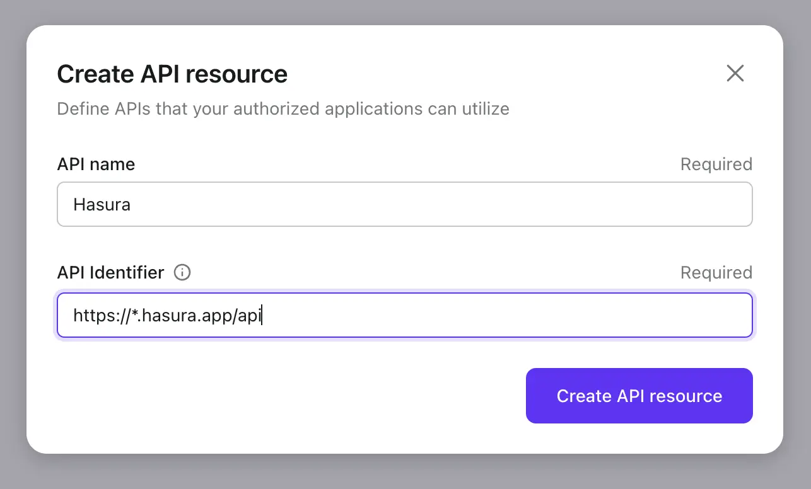

# Adicionar autenticação ao seu aplicativo Hasura

[Hasura](https://hasura.io/) é uma ferramenta que pode rapidamente fornecer APIs GraphQL e REST correspondentes aos seus dados. Considerando a segurança dos dados, Hasura também oferece a capacidade de ajustar o controle de acesso para cada API diferente.

Normalmente, os usuários do Hasura utilizam outros serviços de gerenciamento de identidade e autenticação, sendo o Logto um dos mais populares entre eles.

Neste post do blog, assumiremos que você já está usando os serviços do Hasura. Vamos introduzir como integrar Hasura e Logto para maximizar a segurança dos seus dados. Se você não tem uma conta Logto, inscreva-se e comece a usar agora!

## Contexto

Hasura emprega [gerenciamento de acesso baseado em papel](https://hasura.io/docs/latest/auth/overview/), enquanto Logto usa o padrão [Controle de acesso baseado em papel (RBAC)](/authorization/role-based-access-control).

No modelo e nas melhores práticas do Logto para RBAC, aconselhamos os usuários a usarem `escopo` para corresponder à granularidade mais fina das permissões, usar `papel` como um conjunto de `escopo`s para operações em lote convenientes, e, por fim, verificar `escopo` (geralmente do lado dos provedores de recursos) para verificar se um usuário pode realizar uma operação específica.

No Hasura, um `papel` corresponde à granularidade mais fina das permissões, e as verificações de permissão são realizadas contra `papéis`. Portanto, durante a configuração do Logto, recomendamos mapear um `papel` para exatamente um `escopo`. Essa abordagem pode vincular as permissões do Logto e do Hasura para evitar confusão e uso indevido.

Hasura pode suportar controle de acesso usando Webhooks ou JWT. Nosso [post anterior no blog](https://blog.logto.io/logto-x-hasura) introduziu como usar Webhooks, e nas seções seguintes, explicaremos como utilizar o controle de acesso no modo JWT do Hasura.

## Começar

Vamos começar com um exemplo simples. Suponha que um usuário já tenha duas APIs no Hasura, `GET /user` e `PATCH /user`, correspondendo a dois papéis: `user:reader` e `user:maintainer`, respectivamente.

### 1. Criar recurso de API Hasura no Logto

Crie um recurso de API Hasura no Logto.



### 2. Criar papéis de acordo com a configuração do Hasura no Logto

Precisamos criar dois `escopo`s para o recurso de API Hasura mencionado no passo 1, a saber, `read:user` e `maintain:user`, e então criar dois papéis: `user:reader` (contendo o escopo `read:user`) e `user:maintainer` (incluindo o escopo `maintain:user`) para corresponder um a um com os papéis do Hasura. E atribuir esses papéis aos usuários do Logto conforme necessário.


### 3. Configurar a variável de ambiente do Hasura `HASURA_GRAPHQL_JWT_SECRET` para habilitar o modo JWT

Ao analisar as [opções de configuração JWT do Hasura](https://hasura.io/docs/latest/auth/authentication/jwt/#hasura-jwt-configuration-options), precisamos adicionar e configurar a variável de ambiente `HASURA_GRAPHQL_JWT_SECRET` antes de podermos usar JWT para controle de acesso.

Existem muitas opções diferentes que podem ser configuradas, mas aqui introduzimos o caso mais simples: apenas o `jwk_url` precisa ser configurado. Este valor pode ser obtido do endpoint de configuração OpenID do seu Logto (https://your.logto.domain/oidc/.well-known/openid-configuration).


### 4. Personalizar reivindicações extras do token de acesso do usuário

Usando o recurso de reivindicações personalizadas de token do Logto, personalize a lógica para adicionar reivindicações extras ao token de acesso do usuário.


Personalize o método `getCustomJwtClaims` para adicionar dados no JWT dos quais o Hasura depende para implementar o controle de acesso. Isso pode incluir dados relacionados ao usuário sendo autorizado durante aquela instância, incluindo `papéis` que eles possuem, que podem ser acessados através de `context`.

Também definimos uma variável de ambiente `USER_DEFAULT_ROLE_NAMES` para evitar codificação fixa.

### 5. Integrar Logto SDK

Após configurar Logto e Hasura, integre seu aplicativo com o Logto SDK. Aqui usamos um exemplo em React para visualizar o token de acesso do usuário emitido pelo Logto após o login do usuário.


Primeiro, atribuímos os papéis `user:reader` e `user:maintainer` criados anteriormente ao usuário, e então fazemos login como esse usuário.

```tsx
const config: LogtoConfig = {
  endpoint: 'http://localhost:3001',
  appId: '<your-application-id>',
  appSecret: '<your-application-secret>',
  scopes: [
    ...// escopos existentes
    'read:user',
    'maintain:user',
  ],
  resources: [
    ...// recursos existentes
    'https://*.hasura.app/api',
  ],
};
```

Obtenha o token de acesso do usuário e solicite as APIs do Hasura:

```tsx
const accessToken = await logto.getAccessToken('https://*.hasura.app/api');

// Antes de enviar a solicitação para o Hasura
request.headers.set('Authorization', `Bearer ${accessToken}`);
request.headers.set('x-Hasura-Role', '<required-role-for-the-endpoint>');
```

## Conclusão

Neste artigo, fornecemos outro método de controle de acesso baseado em JWT suportado pelo Hasura, além do Webhook.

Comparando os processos de controle de acesso do Hasura por [Webhook](https://hasura.io/docs/latest/auth/authentication/webhook/) e [JWT](https://hasura.io/docs/latest/auth/authentication/jwt/), podemos ver que a abordagem Webhook envia um Webhook para o Logto e aguarda uma resposta com cada solicitação do Hasura; enquanto a abordagem baseada em JWT pode ser usada continuamente até que o JWT expire.

A abordagem JWT pode reduzir a carga de rede e eliminar a latência de rede trazida pelos Webhooks; enquanto isso, a abordagem Webhook pode sincronizar mudanças nas permissões do usuário em tempo real.

Os usuários podem escolher a abordagem apropriada com base nessas conclusões, combinadas com suas necessidades reais de negócios.
