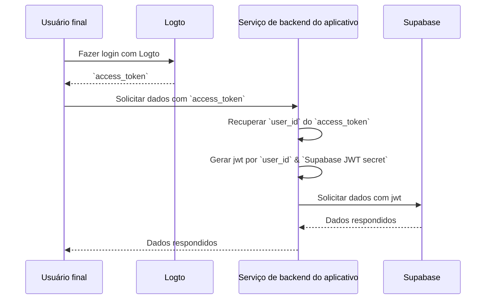

import createGetUserIdFunctionImage from '@site/docs/quick-starts/database/supabase/create-get-user-id-function.webp';
import createRlsPolicyImage from '@site/docs/quick-starts/database/supabase/create-rls-policy.webp';
import postsTableImage from '@site/docs/quick-starts/database/supabase/posts-table.webp';
import serviceRoleSecretImage from '@site/docs/quick-starts/database/supabase/service-role-secret.webp';
import supabaseApiSettingsImage from '@site/docs/quick-starts/database/supabase/supabase-api-settings.webp';

# Adicionar autenticação ao seu aplicativo Supabase

## Noções básicas do Supabase \{#supabase-basics}

Supabase utiliza [Segurança em Nível de Linha do Postgres](https://www.postgresql.org/docs/current/ddl-rowsecurity.html) para controlar permissões de acesso a dados. Em termos simples, ao criar políticas de Segurança em Nível de Linha para tabelas no banco de dados, podemos restringir e gerenciar quem pode ler, escrever e atualizar dados em uma tabela.

Vamos supor que você tenha uma tabela chamada "posts" no seu banco de dados, com o seguinte conteúdo:


O campo `user_id` na tabela representa o usuário ao qual cada dado de post pertence. Você pode restringir cada usuário a acessar apenas seus próprios dados de post com base no campo `user_id`.

No entanto, antes que isso possa ser implementado, o Supabase precisa ser capaz de identificar o usuário atual acessando o banco de dados.

### Adicionar dados do usuário às solicitações do Supabase \{#add-user-data-to-the-supabase-requests}

Graças ao suporte do Supabase para JWT, quando nosso aplicativo interage com o Supabase, podemos gerar um JWT contendo dados do usuário usando o segredo JWT fornecido pelo Supabase. Em seguida, usamos esse JWT como o cabeçalho de Autenticação ao fazer solicitações. Ao receber a solicitação, o Supabase verifica automaticamente a validade do JWT e permite o acesso aos dados contidos nele durante os processos subsequentes.

Primeiramente, podemos obter o segredo JWT fornecido pelo Supabase nas "Configurações do Projeto" no painel do Supabase:


Então, quando usamos o SDK do Supabase para fazer solicitações ao Supabase, utilizamos esse segredo para gerar nosso JWT e anexá-lo como o cabeçalho de Autenticação à solicitação. (Observe que esse processo ocorre dentro do serviço de backend do seu aplicativo, e o segredo JWT nunca deve ser exposto a terceiros).

```jsx
import { createClient } from '@supabase/supabase-js';
import { sign } from 'jsonwebtoken';

/*
 * Nota:
 * Você pode encontrar o SUPABASE_URL, SUPABASE_ANON_KEY no mesmo lugar onde encontra o Segredo JWT.
 */
const SUPABASE_URL = process.env.SUPABASE_URL;
const SUPABASE_ANON_KEY = process.env.SUPABASE_ANON_KEY;

const SUPABASE_JWT_SECRET = process.env.SUPABASE_JWT_SECRET;

export const getSupabaseClient = (userId) => {
  const jwtPayload = {
    userId,
  };

  const jwt = sign(jwtPayload, SUPABASE_JWT_SECRET, {
    expiresIn: '1h', // Apenas para demonstração
  });

  const client = createClient(SUPABASE_URL, SUPABASE_ANON_KEY, {
    global: {
      headers: {
        Authorization: `Bearer ${jwt}`,
      },
    },
  });

  return client;
};
```

Em seguida, navegue até o Editor SQL no painel do Supabase e crie uma função para recuperar o userId carregado na solicitação:


O código usado na imagem é o seguinte:

```sql
create or replace function auth.user_id() returns text as $$
  select nullif(current_setting('request.jwt.claims', true)::json->>'userId', '')::text;
$$ language sql stable;
```

Como o código mostra, no Supabase, você pode recuperar o payload do JWT que geramos chamando `request.jwt.claims`. O campo `userId` dentro do payload é o valor que definimos.

Com essa função, o Supabase pode determinar o usuário que está atualmente acessando o banco de dados.

### Criar política de Segurança em Nível de Linha \{#create-row-level-security-policy}

Em seguida, podemos criar uma política de Segurança em Nível de Linha para restringir cada usuário a acessar apenas seus próprios dados de post com base no campo `user_id` na tabela de posts.

1. Navegue até a página do Editor de Tabelas no painel do Supabase e selecione a tabela de posts.
2. Clique em "Adicionar Política RLS" no topo da tabela.
3. Na janela solicitada, clique em "Criar política".
4. Insira um Nome de Política e escolha o comando de Política SELECT.
5. No bloco `using` do código abaixo, insira:

```sql
auth.user_id() = user_id
```


Ao aproveitar essas políticas, o controle de acesso a dados dentro do Supabase é alcançado.

Em aplicações do mundo real, você criaria várias políticas para restringir ações do usuário, como inserção e modificação de dados. No entanto, isso está além do escopo deste artigo. Para mais informações sobre Segurança em Nível de Linha (RLS), consulte [Proteja seus dados usando Segurança em Nível de Linha do Postgres](https://supabase.com/docs/guides/database/postgres/row-level-security).

### Processo básico de integração com Logto \{#basic-integration-process-with-logto}

Como mencionado anteriormente, porque o Supabase utiliza RLS para seu controle de acesso, a chave para integrar com Logto (ou qualquer outro serviço de autenticação) está em obter o id do usuário autorizado e enviá-lo para o Supabase. Todo o processo é ilustrado no diagrama abaixo:



Em seguida, explicaremos como integrar Logto com Supabase com base neste diagrama de processo.

## Integração com Logto \{#logto-integration}

Logto oferece guias de integração para vários frameworks e linguagens de programação.

Geralmente, aplicativos construídos com esses frameworks e linguagens se enquadram em categorias como aplicativos Nativos, SPA (aplicativos de página única), aplicativos web tradicionais e aplicativos M2M (máquina para máquina). Você pode visitar a página de [Inícios rápidos do Logto](/quick-starts) para integrar Logto ao seu aplicativo com base na pilha de tecnologia que você está usando. Depois, siga as instruções abaixo para integrar Logto ao seu projeto com base no tipo do seu aplicativo.

### Aplicativo Nativo ou SPA \{#native-app-or-spa}

Tanto aplicativos nativos quanto SPAs rodam no seu dispositivo, e as credenciais (token de acesso) obtidas após o login são armazenadas localmente no seu dispositivo.

Portanto, ao integrar seu aplicativo com Supabase, você precisa interagir com o Supabase através do seu serviço de backend porque você não pode expor informações sensíveis (como o segredo JWT do Supabase) no dispositivo de cada usuário.

Vamos supor que você esteja construindo seu SPA usando React e Express. Você integrou Logto com sucesso ao seu aplicativo seguindo o [Guia do Logto React SDK](/quick-starts/react) (você pode consultar o código em nosso [exemplo react](https://github.com/logto-io/js/tree/master/packages/react-sample)). Além disso, você adicionou a validação do token de acesso do Logto ao seu servidor backend de acordo com a documentação [Proteja sua API no Node (Express)](/authorization/api-resources/node-express).

Em seguida, você usará o token de acesso obtido do Logto para solicitar dados do usuário ao seu servidor backend:

```jsx
import { useLogto } from '@logto/react';
import { useState, useEffect } from 'react';
import PostList from './PostList';

const endpoint = '<https://www.mysite.com/api/posts>';
const resource = '<https://www.mysite.com/api>';

function PostPage() {
  const { isAuthenticated, getAccessToken } = useLogto();
  const [posts, setPosts] = useState();

  useEffect(() => {
    const fetchPosts = async () => {
      const response = await fetch(endpoint, {
        headers: {
          Authorization: `Bearer ${await getAccessToken(resource)}`,
        },
      });
      setPosts(response.json());
    };

    if (isAuthenticated) {
      void fetchPosts();
    }
  }, [isAuthenticated, getAccessToken]);

  return <PostList posts={posts} />;
}

export default PostPage;
```

No seu servidor backend, você já extraiu o id do usuário logado do token de acesso usando middleware:

```jsx
// auth-middleware.ts
import { createRemoteJWKSet, jwtVerify } from 'jose';

//...

export const verifyAuthFromRequest = async (ctx, next) => {
  // Extrair o token
  const token = extractBearerTokenFromHeaders(ctx.request.headers);

  const { payload } = await jwtVerify(
    token, // O Token Bearer bruto extraído do cabeçalho da solicitação
    createRemoteJWKSet(new URL('https://<your-logto-domain>/oidc/jwks')), // gerar um jwks usando jwks_uri consultado do servidor Logto
    {
      // emissor esperado do token, deve ser emitido pelo servidor Logto
      issuer: 'https://<your-logto-domain>/oidc',
      // token de audiência esperado, deve ser o indicador de recurso da API atual
      audience: '<your request listener resource indicator>',
    }
  );

  // se você estiver usando RBAC
  assert(payload.scope.includes('some_scope'));

  // lógica de payload personalizada
  ctx.auth = {
    userId: payload.sub,
  };

  return next();
};
```

Agora, você pode usar o `getSupabaseClient` descrito acima para anexar o `userId` ao JWT usado em solicitações subsequentes ao Supabase. Alternativamente, você pode criar um middleware para criar um cliente Supabase para solicitações que precisam interagir com o Supabase:

```jsx
export const withSupabaseClient = async (ctx, next) => {
  ctx.supabase = getSupabaseClient(ctx.auth.userId);

  return next();
};
```

No fluxo de processamento subsequente, você pode chamar diretamente `ctx.supabase` para interagir com o Supabase:

```jsx
const fetchPosts = async (ctx) => {
  const { data } = await ctx.supabase.from('posts').select('*');

  return data;
};
```

Neste código, o Supabase retornará apenas os dados de post pertencentes ao usuário atual com base nas políticas definidas anteriormente.

### Aplicativo web tradicional \{#traditional-web-app}

A principal diferença entre um aplicativo web tradicional e um aplicativo Nativo ou SPA é que um aplicativo web tradicional renderiza e atualiza páginas exclusivamente no servidor web. Portanto, as credenciais do usuário são gerenciadas diretamente pelo servidor web, enquanto em aplicativos Nativos e SPAs, elas residem no dispositivo do usuário.

Ao integrar Logto com um aplicativo web tradicional no Supabase, você pode recuperar diretamente o id do usuário logado do backend.

Tomando um projeto Next.js como exemplo, após integrar Logto ao seu projeto seguindo o [Guia do SDK Next.js](/quick-starts/next-app-router), você pode usar o SDK do Logto para recuperar informações do usuário e construir o JWT correspondente para interagir com o Supabase.

```jsx
import { getLogtoContext } from '@logto/next-server-actions';
import { logtoConfig } from '@/logto';
import { getSupabaseClient } from '@/utils';
import PostList from './PostList';

export default async function PostPage() {
  const { claims } = await getLogtoContext(logtoConfig);

  // O valor `sub` em `claims` é o id do usuário.
  const supabase = getSupabaseClient(claims.sub);

  const { data: posts } = await supabase.from('posts').select('*');

  return <PostList posts={posts} />;
}
```

### Aplicativo máquina para máquina \{#machine-to-machine-app}

Máquina para máquina (M2M) é frequentemente usado quando seu aplicativo precisa se comunicar diretamente com servidores de recursos, como um serviço estático que busca posts diários, etc.

Você pode usar o guia [Máquina para máquina: Autenticação com Logto](/quick-starts/m2m) para autenticação de aplicativos máquina para máquina. A integração entre Supabase e aplicativos máquina para máquina é semelhante à de aplicativos Nativos e SPAs (como descrito na seção "[Aplicativo Nativo ou SPA](#native-app-or-spa)"). Envolve obter um token de acesso do Logto e depois validá-lo através de uma API backend protegida.

No entanto, é importante notar que aplicativos Nativos e SPAs são tipicamente projetados para usuários finais, então o id do usuário obtido representa o próprio usuário. No entanto, o token de acesso para aplicativos máquina para máquina representa o próprio aplicativo, e o campo `sub` no payload do token de acesso é o id do cliente do aplicativo M2M, não um usuário específico. Portanto, durante o desenvolvimento, é crucial distinguir quais dados são destinados a aplicativos M2M.

Além disso, se você quiser que um aplicativo M2M específico acesse o Supabase em nome de todo o serviço para contornar as restrições de RLS, você pode usar o segredo `service_role` do Supabase para criar um cliente Supabase. Isso é útil quando você deseja realizar algumas tarefas administrativas ou automatizadas que exigem acesso a todos os dados sem serem restringidas pelas políticas de Segurança em Nível de Linha configuradas para usuários individuais.

O segredo `service_role` pode ser encontrado na mesma página que o segredo JWT:


Ao criar um cliente Supabase, use o segredo `service_role`, então este cliente pode acessar todos os dados no banco de dados:

```jsx
import { createClient } from '@supabase/supabase-js';

// ...
const SUPABASE_SERVICE_ROLE_SECRET = process.env.SUPABASE_SERVICE_ROLE_SECRET;

const client = createClient(SUPABASE_URL, SUPABASE_SERVICE_ROLE_SECRET, {
  // ...opções
});
```
