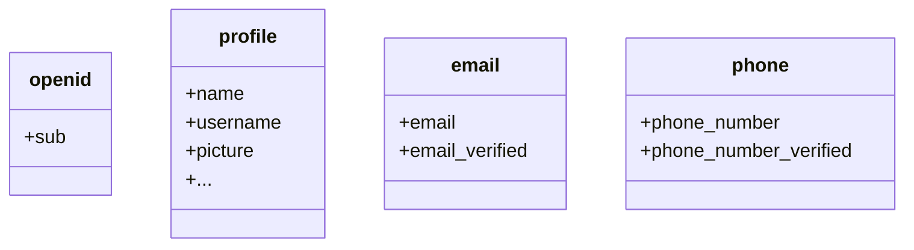

Por padrão, reivindicações limitadas são retornadas. Se você precisar de mais informações, pode solicitar escopos adicionais para acessar mais reivindicações.

:::info
Uma "reivindicação (Claim)" é uma afirmação feita sobre um sujeito; um "escopo (Scope)" é um grupo de reivindicações. No caso atual, uma reivindicação é uma informação sobre o usuário.
:::

Aqui está um exemplo não normativo da relação escopo - reivindicação:

:::tip
A reivindicação "sub" significa "sujeito (Subject)", que é o identificador único do usuário (ou seja, ID do usuário).
:::

O Logto SDK sempre solicitará três escopos: `openid`, `profile` e `offline_access`.
