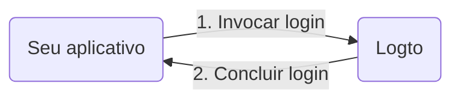

import RegardingRedirectBasedSignIn from './_regarding-redirect-based-sign-in.mdx';

Antes de mergulharmos nos detalhes, aqui está uma visão geral rápida da experiência do usuário final. O processo de login pode ser simplificado da seguinte forma:

1. Seu aplicativo invoca o método de login.
2. O usuário é redirecionado para a página de login do Logto. Para aplicativos nativos, o navegador do sistema é aberto.
3. O usuário faz login e é redirecionado de volta para o seu aplicativo (configurado como o URI de redirecionamento).

<RegardingRedirectBasedSignIn />

---
