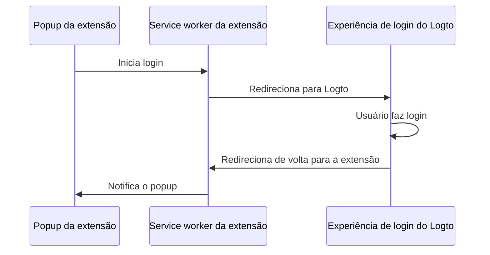

import extensionPopupImage from '@site/docs/quick-starts/framework/chrome-extension/extension-popup.webp';

import RegardingRedirectBasedSignIn from '../../fragments/_regarding-redirect-based-sign-in.mdx';

### O fluxo de autenticação \{#the-authentication-flow}

Supondo que você coloque um botão "Sign in" no popup da sua extensão Chrome, o fluxo de autenticação será assim:



Para outras páginas interativas na sua extensão, você só precisa substituir o participante `Popup da extensão` pelo nome da página. Neste tutorial, vamos focar na página de popup.

<RegardingRedirectBasedSignIn />

### Atualizar o `manifest.json` \{#update-the-manifestjson}

O Logto SDK requer as seguintes permissões no `manifest.json`:

```json title="manifest.json"
{
  "permissions": ["identity", "storage"],
  "host_permissions": ["https://*.logto.app/*"]
}
```

- `permissions.identity`: Necessário para a Chrome Identity API, que é usada para login e logout.
- `permissions.storage`: Necessário para armazenar a sessão do usuário.
- `host_permissions`: Necessário para o Logto SDK se comunicar com as APIs do Logto.

:::note
Se você estiver usando um domínio personalizado no Logto Cloud, você precisa atualizar o `host_permissions` para corresponder ao seu domínio.
:::

### Configurar um script de fundo (service worker) \{#set-up-a-background-script-service-worker}

No script de fundo da sua extensão Chrome, inicialize o Logto SDK:

```js title="service-worker.js"
import LogtoClient from '@logto/chrome-extension';

export const logtoClient = new LogtoClient({
  endpoint: '<your-logto-endpoint>'
  appId: '<your-logto-app-id>',
});
```

Substitua `<your-logto-endpoint>` e `<your-logto-app-id>` pelos valores reais. Você pode encontrar esses valores na página do aplicativo que você acabou de criar no Logto Console.

Se você não tiver um script de fundo, pode seguir o [guia oficial](https://developer.chrome.com/docs/extensions/develop/concepts/service-workers/basics) para criar um.

:::info
**Por que precisamos de um script de fundo?**

Páginas normais de extensão, como o popup ou a página de opções, não podem ser executadas em segundo plano e podem ser fechadas durante o processo de autenticação. Um script de fundo garante que o processo de autenticação possa ser tratado adequadamente.
:::

Em seguida, precisamos ouvir a mensagem de outras páginas de extensão e lidar com o processo de autenticação:

```js title="service-worker.js"
chrome.runtime.onMessage.addListener((message, sender, sendResponse) => {
  // No código abaixo, como retornamos `true` para cada ação, precisamos chamar `sendResponse`
  // para notificar o remetente. Você também pode lidar com erros aqui ou usar outras maneiras de notificar o remetente.

  if (message.action === 'signIn') {
    const redirectUri = chrome.identity.getRedirectURL('/callback');
    logtoClient.signIn(redirectUri).finally(sendResponse);
    return true;
  }

  if (message.action === 'signOut') {
    const redirectUri = chrome.identity.getRedirectURL();
    logtoClient.signOut(redirectUri).finally(sendResponse);
    return true;
  }

  return false;
});
```

Você pode notar que há dois URIs de redirecionamento usados no código acima. Ambos são criados por `chrome.identity.getRedirectURL`, que é uma [API integrada do Chrome](https://developer.chrome.com/docs/extensions/reference/api/identity#method-getRedirectURL) para gerar um URL de redirecionamento para fluxos de autenticação. Os dois URIs serão:

- `https://<extension-id>.chromiumapp.org/callback` para login.
- `https://<extension-id>.chromiumapp.org/` para logout.

Observe que esses URIs não são acessíveis e são usados apenas para o Chrome acionar ações específicas para o processo de autenticação.

### Atualizar configurações do aplicativo Logto \{#update-logto-application-settings}

Agora precisamos atualizar as configurações do aplicativo Logto para permitir os URIs de redirecionamento que acabamos de criar.

1. Vá para a página do aplicativo no Logto Console.
2. Na seção "Redirect URIs", adicione o URI: `https://<extension-id>.chromiumapp.org/callback`.
3. Na seção "Post sign-out redirect URIs", adicione o URI: `https://<extension-id>.chromiumapp.org/`.
4. Na seção "CORS allowed origins", adicione o URI: `chrome-extension://<extension-id>`. O SDK na extensão Chrome usará essa origem para se comunicar com as APIs do Logto.
5. Clique em **Save changes**.

Lembre-se de substituir `<extension-id>` pelo seu ID de extensão real. Você pode encontrar o ID da extensão na página `chrome://extensions`.

### Adicionar botões de login e logout ao popup \{#add-sign-in-and-sign-out-buttons-to-the-popup}

Estamos quase lá! Vamos adicionar os botões de login e logout e outras lógicas necessárias à página de popup.

No arquivo `popup.html`:

```html title="popup.html"
<button id="sign-in">Sign in</button> <button id="sign-out">Sign out</button>
```

No arquivo `popup.js` (supondo que `popup.js` esteja incluído no `popup.html`):

```js title="popup.js"
document.getElementById('sign-in').addEventListener('click', async () => {
  await chrome.runtime.sendMessage({ action: 'signIn' });
  // Login concluído (ou falhou), você pode atualizar a UI aqui.
});

document.getElementById('sign-out').addEventListener('click', async () => {
  await chrome.runtime.sendMessage({ action: 'signOut' });
  // Logout concluído (ou falhou), você pode atualizar a UI aqui.
});
```

### Ponto de verificação: Testar o fluxo de autenticação \{#checkpoint-test-the-authentication-flow}

Agora você pode testar o fluxo de autenticação na sua extensão Chrome:

1. Abra o popup da extensão.
2. Clique no botão "Sign in".
3. Você será redirecionado para a página de login do Logto.
4. Faça login com sua conta Logto.
5. Você será redirecionado de volta para o Chrome.

### Verificar estado de autenticação \{#check-authentication-state}

Como o Chrome fornece APIs de armazenamento unificadas, além do fluxo de login e logout, todos os outros métodos do Logto SDK podem ser usados diretamente na página de popup.

No seu `popup.js`, você pode reutilizar a instância `LogtoClient` criada no script de fundo ou criar uma nova com a mesma configuração:

```js title="popup.js"
import LogtoClient from '@logto/chrome-extension';

const logtoClient = new LogtoClient({
  endpoint: '<your-logto-endpoint>'
  appId: '<your-logto-app-id>',
});

// Ou reutilize a instância logtoClient criada no script de fundo
import { logtoClient } from './service-worker.js';
```

Em seguida, você pode criar uma função para carregar o estado de autenticação e o perfil do usuário:

```js title="popup.js"
const loadAuthenticationState = async () => {
  const isAuthenticated = await logtoClient.isAuthenticated();
  // Atualize a UI com base no estado de autenticação

  if (isAuthenticated) {
    const user = await logtoClient.getIdTokenClaims(); // { sub: '...', email: '...', ... }
    // Atualize a UI com o perfil do usuário
  }
};
```

Você também pode combinar a função `loadAuthenticationState` com a lógica de login e logout:

```js title="popup.js"
document.getElementById('sign-in').addEventListener('click', async () => {
  await chrome.runtime.sendMessage({ action: 'signIn' });
  await loadAuthenticationState();
});

document.getElementById('sign-out').addEventListener('click', async () => {
  await chrome.runtime.sendMessage({ action: 'signOut' });
  await loadAuthenticationState();
});
```

Aqui está um exemplo da página de popup com o estado de autenticação:


### Outras considerações \{#other-considerations}

- **Empacotamento do service worker**: Se você usar um empacotador como Webpack ou Rollup, precisa definir explicitamente o alvo como `browser` ou similar para evitar o empacotamento desnecessário de módulos Node.js.
- **Resolução de módulos**: O SDK de extensão Chrome do Logto é um módulo somente ESM.

Veja nosso [projeto de exemplo](https://github.com/logto-io/js/tree/HEAD/packages/chrome-extension-sample) para um exemplo completo com TypeScript, Rollup e outras configurações.
