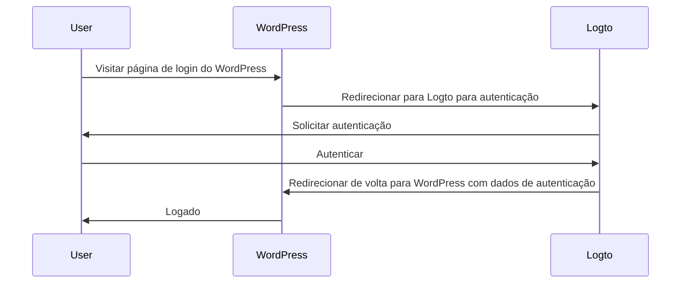
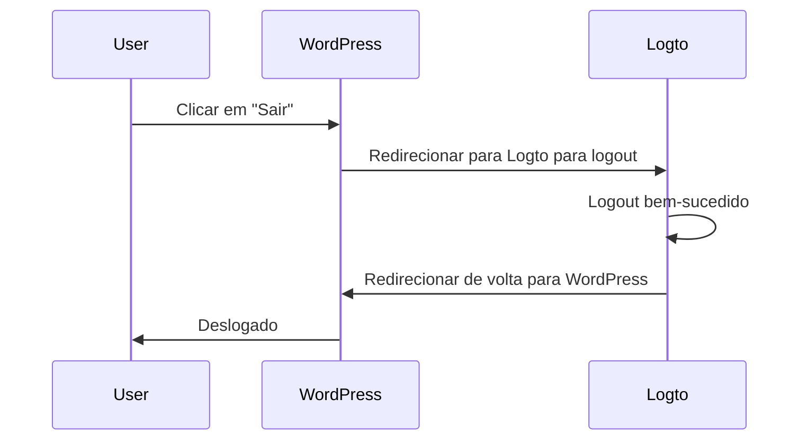

import TabItem from '@theme/TabItem';
import Tabs from '@theme/Tabs';

import FurtherReadings from '../../fragments/_further-readings.md';

# Adicionar autenticação ao seu site WordPress com o plugin Logto

Este tutorial mostrará como integrar o Logto ao seu site [WordPress](https://wordpress.org) com nosso plugin oficial do WordPress.

## Pré-requisitos \{#prerequisites}

- Uma conta [Logto Cloud](https://cloud.logto.io) ou um [Logto auto-hospedado](/introduction/set-up-logto-oss).
- Uma aplicação tradicional Logto criada.
- Um projeto WordPress: siga o guia oficial de [instalação do WordPress](https://wordpress.org/support/article/how-to-install-wordpress/) para configurar seu site WordPress antes de prosseguir.

## Integração \{#integration}

### Instalar o plugin \{#install-the-plugin}

:::info
No momento, nosso plugin ainda está em revisão e não está disponível no diretório de plugins do WordPress. Atualizaremos esta página assim que estiver disponível.
:::

<Tabs>

{/* Descomente o bloco a seguir quando o plugin estiver disponível no diretório de plugins do WordPress */}
{/* <TabItem value="admin-panel" label="Do painel de administração do WordPress"> */}

{/* 1. Vá para **Plugins** > **Adicionar Novo**. */}
{/* 2. Pesquise por "Logto". */}
{/* 3. Clique em **Instalar Agora**. */}
{/* 4. Clique em **Ativar**. */}

{/* </TabItem> */}

<TabItem value="upload" label="Por upload">

1. Baixe o plugin Logto WordPress de um dos seguintes links:
   - [Última versão](https://github.com/logto-io/wordpress/releases): Baixe o arquivo cujo nome está no formato `logto-plugin-<version>.zip`.
     {/* Descomente a linha a seguir quando o plugin estiver disponível no diretório de plugins do WordPress */}
     {/* - [Diretório de plugins do WordPress](https://wordpress.org/plugins) e pesquise por "Logto". */}
2. Baixe o arquivo ZIP do plugin.
3. Vá para **Plugins** > **Adicionar Novo** no painel de administração do WordPress.
4. Clique em **Enviar Plugin**.
5. Selecione o arquivo ZIP baixado e clique em **Instalar Agora**.
6. Clique em **Ativar**.

</TabItem>

</Tabs>

### Configurar o plugin \{#configure-the-plugin}

Agora você deve ver o menu Logto na barra lateral do painel de administração do WordPress. Clique em **Logto** > **Configurações** para configurar o plugin.

:::note
Você deve ter uma aplicação **web tradicional** criada no Logto Console antes de configurar o plugin. Se você ainda não criou uma, consulte [Integrar Logto ao seu aplicativo](/integrate-logto/integrate-logto-into-your-application) para mais informações.
:::

A configuração mínima para começar com o plugin é:

- Endpoint do Logto: O endpoint do seu tenant Logto.
- App ID: O ID do aplicativo do seu Logto.
- App secret: Um dos segredos válidos do aplicativo do seu Logto.

Todos os valores podem ser encontrados na página de detalhes do aplicativo no Logto Console.

Após preencher os valores, clique em **Salvar Alterações** (role até o final da página se não encontrar o botão).

### Configurar URI de redirecionamento \{#configure-redirect-uri}

O URI de redirecionamento é a URL para a qual o Logto redirecionará os usuários após serem autenticados; e o URI de redirecionamento pós logout é a URL para a qual o Logto redirecionará os usuários após saírem.

Aqui está um diagrama de sequência não normativo para ilustrar o fluxo de login:

Aqui está como o fluxo de logout se parece em um diagrama de sequência não normativo:

Para saber mais sobre por que o redirecionamento é necessário, veja [Experiência de login explicada](/concepts/sign-in-experience).

No nosso caso, precisamos configurar ambos os URIs de redirecionamento no seu Logto Console. Para encontrar o URI de redirecionamento, vá para a página **Logto** > **Configurações** no painel de administração do WordPress. Você verá os campos **Redirect URI** e **Post sign-out redirect URI**.

1. Copie os valores de **Redirect URI** e **Post sign-out redirect URI** e cole-os nos campos **Redirect URIs** e **Post sign-out redirect URIs** no seu Logto Console.
2. Clique em **Salvar alterações** no Logto Console.

### Ponto de verificação: Teste seu site WordPress \{#checkpoint-test-your-website}

Agora você pode testar sua integração Logto no seu site WordPress:

1. Abra uma janela de navegador anônima, se necessário.
2. Visite seu site WordPress e clique no link **Log in**, se aplicável; ou visite diretamente a página de login (por exemplo, `https://example.com/wp-login.php`).
3. A página deve redirecioná-lo para a página de login do Logto.
4. Complete o processo de login ou cadastro.
5. Após a autenticação bem-sucedida, você deve ser redirecionado de volta para o seu site WordPress e logado automaticamente.
6. Clique no link **Log out** para sair do seu site WordPress.
7. Você deve ser redirecionado para a página de logout do Logto e, em seguida, de volta para o seu site WordPress.
8. Você deve estar deslogado do seu site WordPress.

## Configurações de autenticação \{#authentication-settings}

Embora o plugin funcione imediatamente, você pode personalizar as configurações de autenticação na página de configurações do plugin Logto para melhor atender às suas necessidades.

### Escopos \{#scopes}

O Logto usa escopos para controlar quais informações são compartilhadas com seu aplicativo. O plugin Logto WordPress usa o [Logto PHP SDK](https://github.com/logto-io/php) para lidar com o processo de autenticação, que inclui os seguintes escopos por padrão:

- `openid`: O escopo básico necessário para OpenID Connect.
- `profile`: Para obter as informações básicas do perfil do usuário.
- `offline_access`: Para obter um token de atualização para acesso offline.

Para mais informações sobre escopos, veja [Escopos e reivindicações](/quick-starts/php#scopes-and-claims).

O plugin também adiciona dois escopos adicionais por padrão:

- `email`: Para obter o endereço de email do usuário.
- `roles`: Para obter os papéis do usuário no Logto.

Esses dois escopos são usados para mapear o email e os papéis do Logto para o email e os papéis do WordPress. Você pode personalizar os escopos editando o campo **Scopes** nas configurações do plugin.

:::warning
Se você remover o escopo `email` ou `roles`, alguns recursos do plugin não funcionarão corretamente.
:::

### Parâmetros extras \{#extra-params}

Você pode querer adicionar alguns parâmetros extras à solicitação de autenticação para personalizar o processo de autenticação. Por exemplo, você pode adicionar o parâmetro `first_screen` para decidir qual tela mostrar primeiro no processo de autenticação.

Para mais informações sobre parâmetros extras, veja [Parâmetros de autenticação](/end-user-flows/authentication-parameters).

### Exigir email verificado \{#require-verified-email}

Por padrão, o plugin exige que os usuários tenham um endereço de email verificado no Logto para fazer login no seu site WordPress. Se um usuário tentar fazer login sem um endereço de email verificado, o plugin lançará um erro.

Você pode desativar esse recurso desmarcando a opção **Exigir email verificado** nas configurações do plugin.

### Exigir ID da organização \{#require-organization-id}

Você pode exigir que os usuários tenham uma associação específica de organização no Logto para fazer login no seu site WordPress. Quando um ID de organização é especificado, o plugin verificará se o usuário possui o ID de organização especificado em seu token de ID. Caso contrário, um erro será lançado.

Para saber mais sobre organizações, veja [Organizações](/organizations).

## Configurações de autorização \{#authorization-settings}

Além da autenticação, o Logto também fornece recursos de autorização, como [controle de acesso baseado em papel (RBAC)](/authorization/role-based-access-control). Embora seja necessário algum código personalizado para implementar o RBAC se você estiver desenvolvendo seu próprio aplicativo, o plugin Logto WordPress fornece uma maneira integrada de mapear papéis do Logto para [papéis do WordPress](https://wordpress.org/documentation/article/roles-and-capabilities/).

### Mapeamento de papéis \{#role-mapping}

O plugin Logto WordPress permite mapear papéis do Logto para papéis do WordPress. Isso significa que você pode atribuir diferentes papéis aos usuários no Logto, e o plugin atribuirá automaticamente os papéis correspondentes do WordPress a esses usuários quando eles fizerem login.

Para mapear papéis, clique em **Adicionar** na seção **Mapeamento de papéis** para adicionar um novo mapeamento de papéis. Por exemplo, se você quiser mapear o papel `group:editors` no Logto para o papel `Editor` no WordPress, você pode fazer isso adicionando um novo mapeamento de papéis com os seguintes valores:

- Papel Logto: `group:editors`
- Papel WordPress: `editor` (o slug do papel `Editor` no WordPress)

Você pode encontrar os slugs de papel de todos os papéis do WordPress na documentação de [Papéis e Capacidades](https://wordpress.org/documentation/article/roles-and-capabilities/).

:::note
Os slugs de papel são sensíveis a maiúsculas e minúsculas. Se você digitar o nome do papel como `Editor` em vez de `editor`, o mapeamento de papéis não funcionará.
:::

Agora, vá para o Logto Console e clique em **Papéis** na barra lateral esquerda. Crie um novo papel chamado `group:editors` e atribua-o a um usuário. Em seguida, faça login no seu site WordPress com esse usuário. Você deve ver que o usuário foi atribuído ao papel `Editor` no WordPress.

:::note
Se o usuário já tiver feito login no seu site WordPress, o mapeamento de papéis não terá efeito até que o usuário saia e faça login novamente.
:::

Você também pode adicionar múltiplos mapeamentos de papéis para mapear múltiplos papéis do Logto para papéis do WordPress. No momento, o plugin tentará mapear os papéis com a ordem de precedência. Por exemplo, se você tiver os seguintes mapeamentos de papéis:

- Papel Logto: `group:editors`, Papel WordPress: `editor`
- Papel Logto: `group:authors`, Papel WordPress: `author`
- Papel Logto: `group:subscribers`, Papel WordPress: `subscriber`

E um usuário tiver os papéis `group:editors` e `group:authors` no Logto, o usuário será atribuído ao papel `Editor` no WordPress.

## Configurações avançadas \{#advanced-settings}

### Lembrar sessão \{#remember-session}

Por padrão, o plugin lembrará a sessão do usuário por 2 semanas. Isso significa que se um usuário fizer login no seu site WordPress, ele não será solicitado a fazer login novamente por 2 semanas. Você pode reduzir esse tempo para 2 dias desmarcando a opção **Lembrar sessão** nas configurações do plugin.

### Sincronizar perfil \{#sync-profile}

Por padrão, o plugin sincronizará o perfil do usuário a cada login. Isso significa que se um usuário fizer login no seu site WordPress, seu perfil será atualizado com as informações mais recentes do Logto. Você pode desativar esse recurso desmarcando a opção **Sincronizar perfil** nas configurações do plugin.

:::warning
Se você desativar esse recurso, o mapeamento de papéis só terá efeito quando o usuário fizer login pela primeira vez.
:::

### Login com formulário do WordPress \{#wordpress-form-login}

Por padrão, você pode adicionar `?form=1` à URL de login do WordPress para usar o login com formulário do WordPress. Isso é útil para fins de teste, mas você pode desativar esse recurso se não quiser permitir que os usuários façam login com o formulário do WordPress.

### Estratégia de nome de usuário \{#username-strategy}

Existem várias maneiras de gerar um nome de usuário para um usuário no WordPress. É seguro usar a estratégia padrão quando você confia no email como o identificador único de um usuário.

## Solução de problemas \{#troubleshooting}

### URL de callback mostra 404 \{#callback-url-shows-404}

Se a URL de callback mostrar um erro 404, é provável que suas regras de reescrita do WordPress estejam desatualizadas e precisem ser atualizadas manualmente. Para fazer isso, vá para **Configurações** > **Links Permanentes** no painel de administração do WordPress (ou visite `/wp-admin/options-permalink.php` diretamente) e clique em **Salvar Alterações**.

## Perguntas frequentes \{#frequently-asked-questions}

### Como posso acionar o fluxo de esqueci minha senha? \{#how-can-i-trigger-the-forgot-password-flow}

Existem duas maneiras de acionar o fluxo de esqueci minha senha:

1. Clique no link de esqueci minha senha na página de login do Logto.
2. Adicione `?action=lostpassword` à URL de login do WordPress. Por exemplo, `https://example.com/wp-login.php?action=lostpassword`.
   Isso o redirecionará para a página de esqueci minha senha do Logto.

### Como posso usar o login com formulário do WordPress? \{#how-can-i-use-the-wordpress-form-login}

Por padrão, você pode adicionar `?form=1` à URL de login do WordPress para usar o login com formulário do WordPress. Por exemplo, `https://example.com/wp-login.php?form=1`.

Se você quiser desativar esse recurso, pode desmarcar a opção **Login com formulário do WordPress** nas configurações do plugin.

## Leituras adicionais \{#further-readings}

<FurtherReadings />
