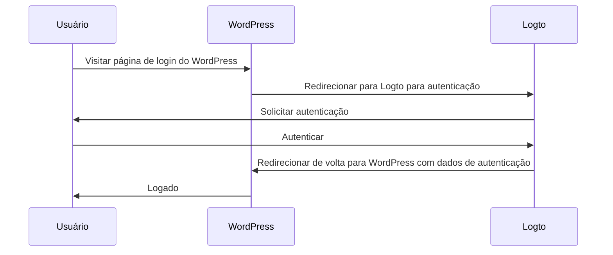
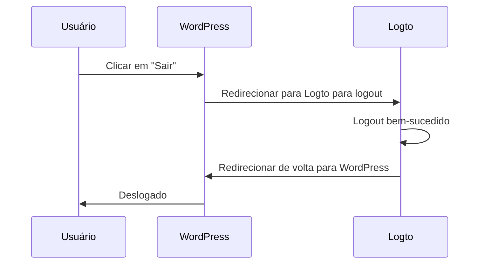

import TabItem from '@theme/TabItem';
import Tabs from '@theme/Tabs';

### Instalar o plugin \{#install-the-plugin}

<Tabs>

<TabItem value="admin-panel" label="Do painel de administração do WordPress">

1. Vá para **Plugins** > **Adicionar Novo**.
2. Procure por "Logto", ou insira https://wordpress.org/plugins/logto/ na caixa de pesquisa.
3. Clique em **Instalar Agora**.
4. Clique em **Ativar**.

</TabItem>

<TabItem value="upload" label="A partir do upload">

1. Baixe o plugin Logto para WordPress de um dos seguintes links:
   - [Última versão](https://github.com/logto-io/wordpress/releases): Baixe o arquivo cujo nome está no formato `logto-plugin-<version>.zip`.
   - [Diretório de plugins do WordPress](https://wordpress.org/plugins/logto/): Baixe o arquivo clicando no botão **Download**.
2. Baixe o arquivo ZIP do plugin.
3. Vá para **Plugins** > **Adicionar Novo** no painel de administração do WordPress.
4. Clique em **Enviar Plugin**.
5. Selecione o arquivo ZIP baixado e clique em **Instalar Agora**.
6. Clique em **Ativar**.

</TabItem>

</Tabs>

### Configurar o plugin \{#configure-the-plugin}

Agora você deve conseguir ver o menu Logto na barra lateral do painel de administração do WordPress. Clique em **Logto** > **Configurações** para configurar o plugin.

:::note
Você deve ter um aplicativo **web tradicional** criado no Logto Console antes de configurar o plugin. Se você ainda não criou um, consulte [Integrar Logto ao seu aplicativo](/integrate-logto/integrate-logto-into-your-application) para mais informações.
:::

A configuração mínima para começar a usar o plugin é:

- Endpoint do Logto: O endpoint do seu tenant Logto.
- ID do aplicativo: O ID do aplicativo do seu Logto.
- Segredo do aplicativo: Um dos segredos válidos do seu aplicativo Logto.

Todos os valores podem ser encontrados na página de detalhes do aplicativo no Logto Console.

Após preencher os valores, clique em **Salvar Alterações** (role para baixo até o final da página se não encontrar o botão).

### Configurar URI de redirecionamento \{#configure-redirect-uri}

O URI de redirecionamento é a URL para a qual o Logto redirecionará os usuários após serem autenticados; e o URI de redirecionamento pós logout é a URL para a qual o Logto redirecionará os usuários após saírem.

Aqui está um diagrama de sequência não normativo para ilustrar o fluxo de login:

Aqui está como o fluxo de logout se parece em um diagrama de sequência não normativo:

Para saber mais sobre por que o redirecionamento é necessário, veja [Experiência de login explicada](/concepts/sign-in-experience).

No nosso caso, precisamos configurar ambos os URIs de redirecionamento no seu Logto Console. Para encontrar o URI de redirecionamento, vá para a página **Logto** > **Configurações** no painel de administração do WordPress. Você verá os campos **Redirect URI** e **Post sign-out redirect URI**.

1. Copie os valores de **Redirect URI** e **Post sign-out redirect URI** e cole-os nos campos **Redirect URIs** e **Post sign-out redirect URIs** no seu Logto Console.
2. Clique em **Salvar alterações** no Logto Console.

### Ponto de verificação: Testar seu site WordPress \{#checkpoint-test-your-website}

Agora você pode testar sua integração Logto no seu site WordPress:

1. Abra uma janela de navegador anônima, se necessário.
2. Visite seu site WordPress e clique no link **Log in**, se aplicável; ou visite diretamente a página de login (por exemplo, `https://example.com/wp-login.php`).
3. A página deve redirecioná-lo para a página de login do Logto.
4. Complete o processo de login ou cadastro.
5. Após a autenticação bem-sucedida, você deve ser redirecionado de volta para o seu site WordPress e logado automaticamente.
6. Clique no link **Log out** para sair do seu site WordPress.
7. Você deve ser redirecionado para a página de logout do Logto e, em seguida, de volta para o seu site WordPress.
8. Você deve estar deslogado do seu site WordPress.