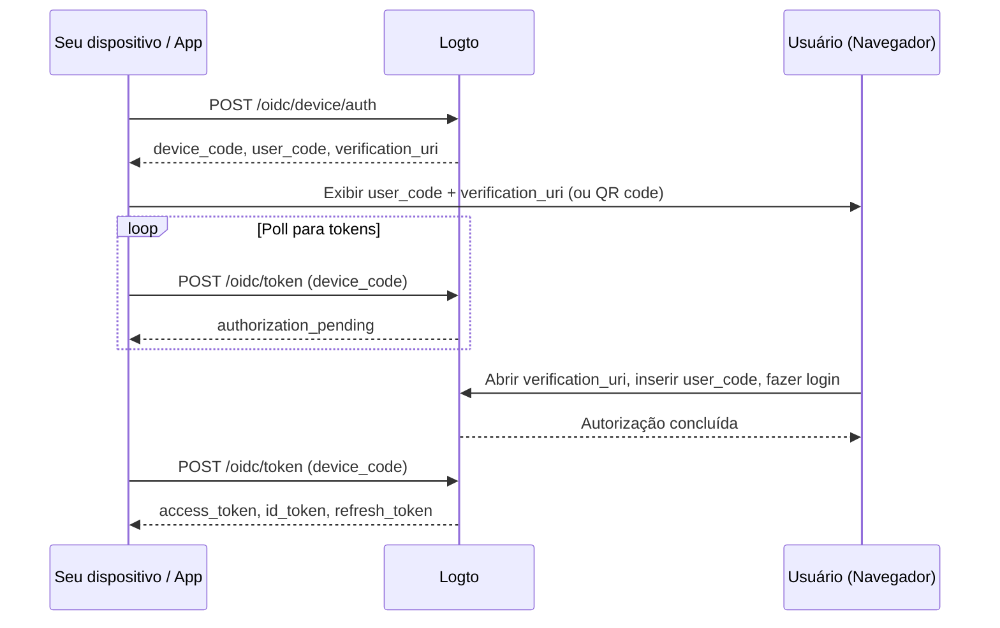

import ApiResourcesDescription from '../../fragments/_api-resources-description.md';
import FurtherReadings from '../../fragments/_further-readings.md';
import ScopeClaimList from '../../fragments/_scope-claim-list.md';
import ScopesAndClaimsIntroduction from '../../fragments/_scopes-claims-introduction.md';

# Device flow: Autenticação com Logto

:::note
Este guia assume que você criou um Aplicativo do tipo "Nativo" com device flow como o fluxo de autorização no Logto Console.
:::

## Introdução \{#introduction}

O [device authorization grant do OAuth 2.0](https://auth.wiki/device-flow) (device flow) foi projetado para dispositivos com capacidades de entrada limitadas, como smart TVs, consoles de jogos, ferramentas CLI e dispositivos IoT. Ele permite que os usuários iniciem o processo de login no dispositivo, mas concluam a autenticação em outro dispositivo com navegador, como um celular ou laptop.

Como o próprio dispositivo não pode lidar com um fluxo de login baseado em navegador, o dispositivo exibe um código curto e uma URL. O usuário acessa essa URL em outro dispositivo, insere o código e faz login. Enquanto isso, o dispositivo original faz polling no Logto até que a autorização seja concluída.



## Obtenha as credenciais do aplicativo \{#get-application-credentials}

No seu Logto Console, navegue até a página de detalhes do seu aplicativo para obter as seguintes credenciais:

- **App ID**: O identificador único do seu aplicativo (também conhecido como `client_id`).
- **Endpoint do Logto**: O endpoint do seu servidor de autorização Logto. Você pode encontrá-lo no Logto Console em "Detalhes do aplicativo".

Para Logto Cloud, o endpoint é `https://{your-tenant-id}.logto.app`.

:::note
Apps com device flow são clientes públicos, portanto, não é necessário App Secret.
:::

## Solicite um device code \{#request-a-device-code}

Inicie o device flow enviando uma requisição `POST` para o endpoint de autorização do dispositivo:

```bash
curl --request POST 'https://your.logto.endpoint/oidc/device/auth' \
  --header 'Content-Type: application/x-www-form-urlencoded' \
  --data-urlencode 'client_id=your-application-id' \
  --data-urlencode 'scope=openid offline_access profile'
```

A resposta inclui:

| Campo                       | Descrição                                                                                                                                                                      |
| --------------------------- | ------------------------------------------------------------------------------------------------------------------------------------------------------------------------------ |
| `device_code`               | Um código único para seu app usar ao fazer polling no endpoint de token.                                                                                                       |
| `user_code`                 | Um código curto para exibir ao usuário inserir no navegador.                                                                                                                   |
| `verification_uri`          | A URL onde o usuário insere o `user_code`.                                                                                                                                     |
| `verification_uri_complete` | Uma URL com o `user_code` pré-preenchido. Usuários podem acessar essa URL diretamente para pular a digitação manual — você pode apresentá-la como QR code, link clicável, etc. |
| `expires_in`                | O tempo de vida em segundos de `device_code` e `user_code`. Pare de fazer polling após esse tempo expirar.                                                                     |

## Exiba a URL de verificação para o usuário \{#display-verification-url}

Mostre o `user_code` e o `verification_uri` na tela do seu dispositivo.

Alternativamente, você pode usar o `verification_uri_complete`, que já tem o código preenchido — o usuário só precisa confirmar. Como apresentar isso fica a seu critério: QR code, link clicável, etc.

## Poll para tokens \{#poll-for-tokens}

Enquanto o usuário conclui a autenticação no navegador, seu dispositivo deve fazer polling no endpoint de token. Seu app deve aguardar pelo menos **5 segundos** entre as requisições de polling:

```bash
curl --request POST 'https://your.logto.endpoint/oidc/token' \
  --header 'Content-Type: application/x-www-form-urlencoded' \
  --data-urlencode 'client_id=your-application-id' \
  --data-urlencode 'grant_type=urn:ietf:params:oauth:grant-type:device_code' \
  --data-urlencode 'device_code=DEVICE_CODE'
```

Substitua `DEVICE_CODE` pelo valor de `device_code` da resposta de autorização do dispositivo.

**Pare o polling** quando:

- Você receber uma resposta de token bem-sucedida.
- O tempo `expires_in` da resposta do device code expirar.
- Você receber um erro não-repetível como `expired_token` ou `access_denied`.

### Resposta de token \{#token-response}

Após a aprovação do usuário, a resposta inclui:

| Campo           | Descrição                                                                                                                                |
| --------------- | ---------------------------------------------------------------------------------------------------------------------------------------- |
| `access_token`  | O token de acesso. Por padrão, é uma string opaca; quando um `resource` é solicitado, é um JWT com `aud` definido para o URI do recurso. |
| `id_token`      | O token de ID contendo reivindicações de identidade do usuário. Presente apenas quando o escopo `openid` é solicitado.                   |
| `refresh_token` | Usado para obter novos tokens sem reautenticação. Presente apenas quando o escopo `offline_access` é solicitado.                         |
| `token_type`    | Sempre `Bearer`.                                                                                                                         |
| `expires_in`    | Tempo de vida do token em segundos.                                                                                                      |
| `scope`         | Os escopos concedidos pelo servidor de autorização.                                                                                      |

## Checkpoint: Teste seu device flow \{#checkpoint}

Agora, teste a integração do seu device flow:

1. Execute seu app e acione o device flow para obter um `device_code` e `user_code`.
2. Abra o `verification_uri` em um navegador e insira o `user_code`, ou use o `verification_uri_complete` para pular a digitação manual.
3. Conclua o processo de login no navegador.
4. Verifique se seu app recebe os tokens após o polling.

## Obtenha informações do usuário \{#get-user-information}

### Decodifique as reivindicações do ID token \{#decode-id-token-claims}

O `id_token` retornado na resposta de token é um [JSON Web Token (JWT)](https://auth.wiki/jwt) padrão. Você pode decodificar o payload Base64URL (a segunda parte do JWT, separada por `.`) para acessar reivindicações básicas do usuário sem uma requisição de rede adicional.

O payload decodificado contém reivindicações como `sub` (ID do usuário), `name`, `email`, etc., dependendo dos escopos solicitados.

:::tip
Para uso em produção, você deve validar a assinatura do JWT antes de confiar nas reivindicações. Use o JWKS do seu endpoint Logto (`https://your.logto.endpoint/oidc/jwks`) para verificar o token.
:::

### Buscar no endpoint userinfo \{#fetch-from-userinfo-endpoint}

O ID token contém reivindicações básicas com base nos escopos solicitados. Algumas reivindicações estendidas (como `custom_data`, `identities`) estão disponíveis apenas via [endpoint OIDC UserInfo](https://openid.net/specs/openid-connect-core-1_0.html#UserInfo):

```bash
curl --request GET 'https://your.logto.endpoint/oidc/me' \
  --header 'Authorization: Bearer ACCESS_TOKEN'
```

Substitua `ACCESS_TOKEN` pelo token de acesso opaco (não o token JWT de recurso) obtido na resposta de token. A resposta é um objeto JSON contendo as reivindicações do usuário com base nos escopos concedidos.

### Solicite reivindicações adicionais \{#request-additional-claims}

Você pode perceber que algumas informações do usuário estão ausentes no ID token. Isso ocorre porque OAuth 2.0 e OpenID Connect (OIDC) são projetados para seguir o princípio do menor privilégio (PoLP), e o Logto é construído sobre esses padrões.

<ScopesAndClaimsIntroduction />

Para solicitar escopos adicionais, inclua-os no parâmetro `scope` da requisição de autorização do dispositivo. Por exemplo, para solicitar email e telefone do usuário:

```bash
curl --request POST 'https://your.logto.endpoint/oidc/device/auth' \
  --header 'Content-Type: application/x-www-form-urlencoded' \
  --data-urlencode 'client_id=your-application-id' \
  --data-urlencode 'scope=openid offline_access profile email phone'
```

### Escopos e reivindicações \{#scopes-and-claims}

<ScopeClaimList />

## Recursos de API e organizações \{#api-resources-and-organizations}

<ApiResourcesDescription />

### Solicite acesso para recursos de API \{#request-access-for-api-resources}

Para acessar um recurso de API específico, inclua o parâmetro `resource` na requisição de autorização do dispositivo:

```bash
curl --request POST 'https://your.logto.endpoint/oidc/device/auth' \
  --header 'Content-Type: application/x-www-form-urlencoded' \
  --data-urlencode 'client_id=your-application-id' \
  --data-urlencode 'scope=openid offline_access' \
  --data-urlencode 'resource=https://your-api-resource-indicator'
```

Depois que o usuário concluir a autorização e você receber um refresh token, você pode buscar tokens de acesso JWT para o recurso de API:

```bash
curl --request POST 'https://your.logto.endpoint/oidc/token' \
  --header 'Content-Type: application/x-www-form-urlencoded' \
  --data-urlencode 'client_id=your-application-id' \
  --data-urlencode 'grant_type=refresh_token' \
  --data-urlencode 'refresh_token=REFRESH_TOKEN' \
  --data-urlencode 'resource=https://your-api-resource-indicator'
```

A resposta conterá um `access_token` JWT com `aud` definido para o indicador do seu recurso de API.

:::note
O `refresh_token` só está disponível quando o escopo `offline_access` é incluído na requisição inicial de autorização do dispositivo. Sempre armazene e use o último `refresh_token`, pois o Logto utiliza rotação de tokens.
:::

### Buscar tokens de organização \{#fetch-organization-tokens}

Se [organizações](/organizations) é novo para você, leia [🏢 Organizações (Multi-tenancy)](/organizations) para começar.

Para solicitar informações relacionadas à organização, adicione o escopo `urn:logto:scope:organizations` na requisição de autorização do dispositivo:

```bash
curl --request POST 'https://your.logto.endpoint/oidc/device/auth' \
  --header 'Content-Type: application/x-www-form-urlencoded' \
  --data-urlencode 'client_id=your-application-id' \
  --data-urlencode 'scope=openid offline_access urn:logto:scope:organizations' \
  --data-urlencode 'resource=urn:logto:resource:organizations'
```

Depois que o usuário fizer login, você pode buscar tokens de organização usando o refresh token:

```bash
curl --request POST 'https://your.logto.endpoint/oidc/token' \
  --header 'Content-Type: application/x-www-form-urlencoded' \
  --data-urlencode 'client_id=your-application-id' \
  --data-urlencode 'grant_type=refresh_token' \
  --data-urlencode 'refresh_token=REFRESH_TOKEN' \
  --data-urlencode 'organization_id=your-organization-id'
```

A resposta conterá um token de acesso com escopo para a organização especificada.

#### Recursos de API da organização \{#organization-api-resources}

Para buscar um token de acesso para um recurso de API dentro de uma organização, inclua ambos os parâmetros `resource` e `organization_id`:

```bash
curl --request POST 'https://your.logto.endpoint/oidc/token' \
  --header 'Content-Type: application/x-www-form-urlencoded' \
  --data-urlencode 'client_id=your-application-id' \
  --data-urlencode 'grant_type=refresh_token' \
  --data-urlencode 'refresh_token=REFRESH_TOKEN' \
  --data-urlencode 'organization_id=your-organization-id' \
  --data-urlencode 'resource=https://your-api-resource-indicator'
```

## Leituras adicionais \{#further-readings}

<FurtherReadings />
