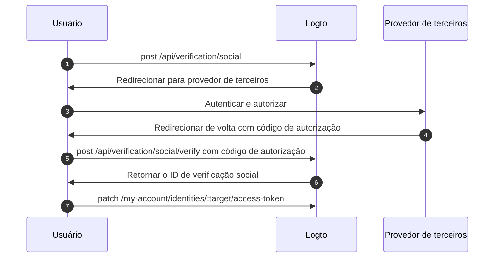

import Availability from '@components/Availability';

<Availability cloud oss={{ major: 1, minor: 31 }} />

O conjunto de tokens de terceiros (também conhecido como conjunto de tokens federados) é um tipo de segredo armazenado no [cofre de segredos](/secret-vault) do Logto, usado para gerenciar com segurança tokens de acesso e atualização emitidos por provedores de identidade de terceiros. Quando um usuário se autentica via um conector social ou SSO corporativo, o Logto armazena os tokens emitidos no cofre. Esses tokens podem ser recuperados posteriormente para acessar APIs de terceiros em nome do usuário, sem exigir nova autenticação.

## Casos de uso comuns \{#common-use-cases}

Essa capacidade é essencial para aplicativos modernos como agentes de IA, plataformas SaaS, ferramentas de produtividade e aplicativos de clientes que precisam interagir com serviços de terceiros em nome dos usuários. Aqui estão alguns exemplos práticos:

**📅 Aplicativos de gerenciamento de calendário**: Após um usuário fazer login com o Google, seu aplicativo de produtividade pode sincronizar automaticamente os eventos do calendário, criar novas reuniões e enviar convites sem pedir que ele se autentique novamente.

**🤖 Assistentes de IA**: Um agente de IA pode acessar os repositórios do GitHub de um usuário para analisar código, criar pull requests ou gerenciar issues. Tudo com o consentimento único do usuário durante o login ou vinculação de conta.

**📊 Dashboards de análise**: Plataformas SaaS podem extrair dados das contas de redes sociais conectadas dos usuários (Facebook, LinkedIn) para gerar insights e relatórios sem interromper o fluxo de trabalho com solicitações repetidas de login.

## Ativar armazenamento de tokens de terceiros \{#enable-third-party-token-storage}

### Conectores sociais \{#social-connectors}

Esse recurso está disponível para [conectores sociais](/connectors/social-connectors) que suportam armazenamento de tokens. Os tokens de terceiros podem ser armazenados durante o [login social](/end-user-flows/sign-up-and-sign-in/social-sign-in), [vinculação de conta social](/end-user-flows/account-settings/by-account-api#link-a-new-social-connection) e [ao renovar tokens para acesso à API de terceiros](/secret-vault/federated-token-set#reauthentication-and-token-renewal). Os conectores atualmente suportados incluem: [GitHub](/integrations/github), [Google](/integrations/google), [Facebook](/integrations/facebook), [OAuth 2.0 padrão](/integrations/oauth2) e [OIDC padrão](/integrations/oidc). O suporte para conectores adicionais será lançado gradualmente.

1. Navegue até <CloudLink to="/connectors/social">Console > Conectores > Conectores Sociais</CloudLink>.
2. Selecione o conector social para o qual deseja ativar o armazenamento de tokens de terceiros.
3. Siga os tutoriais de configuração para configurar o conector, incluindo a adição dos escopos necessários para acessar APIs de terceiros específicas.
4. Na página "Configuração", ative a opção **Armazenar tokens para acesso persistente à API**.

### Conectores SSO corporativos \{#enterprise-sso-connectors}

O armazenamento de tokens está disponível para todos os [conectores corporativos OIDC](/connectors/enterprise-connectors). Tokens de acesso e atualização podem ser armazenados durante o [Single Sign-On corporativo](/end-user-flows/enterprise-sso). Os conectores atualmente suportados incluem: [Google Workspace](/integrations/google-workspace), [Microsoft Entra ID (OIDC)](/integrations/entra-id-oidc), [Okta](/integrations/okta) e [OIDC (Enterprise)](/integrations/oidc-sso).

1. Navegue até <CloudLink to="/enterprise-sso">Console > SSO Corporativo</CloudLink>.
2. Selecione o conector SSO corporativo para o qual deseja ativar o armazenamento de tokens de terceiros.
3. Siga os tutoriais de configuração para configurar o conector, incluindo a adição dos escopos necessários para acessar APIs de terceiros específicas.
4. Na guia "Experiência SSO", ative a opção **Armazenar tokens para acesso persistente à API**.

Certifique-se de salvar suas alterações.

## Armazenamento de tokens \{#token-storage}

Uma vez que o armazenamento de tokens de terceiros está ativado, o Logto armazena automaticamente os tokens de acesso e atualização emitidos pelo provedor de identidade federado sempre que um usuário se autentica por meio de um conector social ou SSO corporativo. Isso inclui:

- [Login e cadastro social](/end-user-flows/sign-up-and-sign-in/social-sign-in)
- [Login e cadastro SSO corporativo](/end-user-flows/enterprise-sso)
- [Vinculação de conta social via Account API](/end-user-flows/account-settings/by-account-api#link-a-new-social-connection)

Os tokens armazenados são vinculados à identidade social ou SSO corporativa do usuário, permitindo que eles recuperem os tokens posteriormente para acesso à API sem exigir nova autenticação.

### Verificando o status do armazenamento de tokens \{#checking-token-storage-status}

Você pode verificar o status do armazenamento de tokens de terceiros de um usuário no Console do Logto:

1. Navegue até <CloudLink to="/users">Console > Usuários</CloudLink>.
2. Clique no usuário que deseja inspecionar. Isso o levará à página de detalhes do usuário.
3. Role até a seção **Conexões**. Esta área lista todas as conexões sociais e SSO corporativas associadas ao usuário.
4. Cada entrada de conexão mostra um rótulo de status do token indicando se os tokens estão armazenados para essa conexão.
5. Clique na entrada da conexão para ver mais detalhes, incluindo metadados do token de acesso armazenado e disponibilidade do token de atualização (se disponível).

Você também pode verificar as identidades de terceiros do usuário e o status do armazenamento de tokens via Management API:

- `GET /api/users/{userId}/identities/{target}?includeTokenSecret=true`: Recupera a identidade social de um usuário e o status do armazenamento de tokens associado à identidade por um determinado target de conector (por exemplo, `github`, `google`, etc.).
- `GET /api/users/{userId}/sso-identities/{ssoConnectorId}?includeTokenSecret=true`: Recupera a identidade SSO corporativa de um usuário e o status do armazenamento de tokens associado à identidade por um determinado ID de conector SSO.

### Status do armazenamento de tokens \{#token-storage-status}

- **Ativo**: O token de acesso está armazenado e ativo.
- **Expirado**: O token de acesso está armazenado, mas expirou. Se um token de atualização estiver disponível, ele pode ser usado para obter um novo token de acesso.
- **Inativo**: Nenhum token de acesso está armazenado para esta conexão. Isso pode acontecer se o usuário não se autenticou por meio desta conexão ou se o armazenamento do token foi excluído.
- **Não aplicável**: O conector não suporta armazenamento de tokens.

### Metadados do token \{#token-metadata}

Para integridade e segurança dos dados, todos os tokens são criptografados antes de serem armazenados no cofre de segredos. Os valores reais dos tokens só são acessíveis ao usuário final com a devida autorização. Os desenvolvedores, por outro lado, só podem recuperar os metadados do conjunto de tokens para entender o estado dos tokens armazenados sem expor conteúdo sensível.

- `createdAt`: O timestamp de quando a conexão foi estabelecida pela primeira vez e o conjunto de tokens foi inicialmente armazenado no cofre de segredos.
- `updatedAt`: A última vez que o conjunto de tokens foi atualizado.
  - Se nenhum token de atualização estiver disponível, esse valor será o mesmo que **createdAt**.
  - Se houver um token de atualização, esse valor reflete a última vez que o token de acesso foi atualizado.
- `hasRefreshToken`: Indica se um token de atualização está disponível.
  Se o conector suportar acesso offline e a solicitação de autorização estiver devidamente configurada, o Logto armazena o token de atualização quando ele é emitido pelo provedor de identidade junto com o token de acesso.
  Quando o token de acesso expira e existe um token de atualização válido, o Logto tenta automaticamente obter um novo token de acesso usando o token de atualização armazenado sempre que o usuário solicita acesso ao provedor conectado.
- `expiresAt`: O tempo estimado de expiração do token de acesso em **segundos**.
  Isso é calculado com base no valor `expires_in` retornado pelo endpoint de token do provedor de identidade. (Este campo só está disponível se o provedor incluir `expires_in` na resposta do token.)
- `scope`: O escopo do token de acesso, indicando as permissões concedidas pelo provedor de identidade.
  Isso é útil para entender quais ações podem ser realizadas com o token de acesso armazenado. (Este campo só está disponível se o provedor incluir `scope` na resposta do token.)
- `tokenType`: O tipo do token de acesso, normalmente "Bearer".
  (Este campo só está disponível se o provedor incluir `token_type` na resposta do token.)

## Recuperação de tokens \{#token-retrieval}

Uma vez que o armazenamento de tokens está ativado e os tokens estão armazenados com segurança no cofre de segredos do Logto, os usuários finais podem recuperar seus tokens de acesso de terceiros a partir do seu aplicativo cliente integrando com a [Account API](/end-user-flows/account-settings/by-account-api) do Logto.

- `GET /my-account/identities/:target/access-token`: Recupera o token de acesso para uma identidade social especificando o target do conector (por exemplo, github, google).

- `GET /my-account/sso-identities/:connectorId/access-token`: Recupera o token de acesso para uma identidade SSO corporativa especificando o ID do conector.

:::info
Para recuperar tokens de acesso de terceiros, você deve primeiro ativar a Account API para usuários finais em <CloudLink to="/sign-in-experience/account-center">Console > Login & Conta > Central da conta</CloudLink>. Saiba como [ativar a Account API](/end-user-flows/account-settings/by-account-api#how-to-enable-account-api) e [acessá-la usando um token de acesso emitido pelo Logto](/end-user-flows/account-settings/by-account-api#access-account-api-using-access-token).
:::

### Rotação de tokens \{#token-rotation}

Os endpoints de recuperação de tokens retornam:

- `200` OK: Se o token de acesso for recuperado com sucesso e ainda estiver válido.
- `404` Não encontrado: Se o usuário não tiver uma identidade social ou SSO corporativa associada ao target ou ID de conector especificado, ou se o token de acesso não estiver armazenado.
- `401` Não autorizado: Se o token de acesso estiver expirado.

Se o token de acesso estiver expirado e um token de atualização estiver disponível, o Logto tentará automaticamente atualizar o token de acesso e retornará o novo token de acesso na resposta. O armazenamento do token no cofre de segredos também será atualizado com o novo token de acesso e seus metadados.

## Exclusão do armazenamento de tokens \{#token-storage-deletion}

O armazenamento de tokens de terceiros está diretamente vinculado a cada conexão social ou SSO corporativa do usuário. Isso significa que o conjunto de tokens armazenado será automaticamente excluído nos seguintes casos:

- A identidade social ou SSO corporativa associada é removida da conta do usuário.
- A conta do usuário é excluída do seu tenant.
- O conector social ou SSO corporativo é excluído do seu tenant.

### Revogando tokens \{#revoking-tokens}

Você também pode excluir manualmente o conjunto de tokens de terceiros de um usuário para revogar o acesso:

- Pelo Console:
  Navegue até a página de detalhes da identidade do usuário. Role até a seção **Token de acesso** (se o armazenamento de tokens estiver disponível) e clique no botão **Excluir tokens** ao final da seção.
- Via Management API:
  - `DELETE /api/secret/:id`: Exclui um segredo específico pelo seu ID, que pode ser obtido nos detalhes da identidade do usuário.

Revogar o conjunto de tokens forçará o usuário a se autenticar novamente com o provedor de terceiros para obter um novo token de acesso antes de poder acessar APIs de terceiros novamente.

## Reautenticação e renovação de tokens \{#reauthentication-and-token-renewal}

Em cenários onde um token de acesso armazenado expirou ou quando um aplicativo precisa solicitar escopos adicionais de API, os usuários finais podem se reautenticar com o provedor de terceiros para obter um novo token de acesso — sem precisar fazer login novamente no Logto.
Isso pode ser feito através da [Social Verification API](https://openapi.logto.io/operation/operation-createverificationbysocial) do Logto, que permite aos usuários reiniciar um fluxo de autorização social federado e atualizar seu conjunto de tokens armazenado.

:::note
A reinicialização da autorização federada está atualmente limitada a conectores sociais.
Para conectores SSO corporativos, a reautenticação e renovação de tokens exigem que o usuário inicie novamente um fluxo completo de autenticação Logto, pois a reautorização direta com o provedor SSO corporativo não é suportada após o login.
:::


```mermaid
sequenceDiagram
    autonumber

    participant User as Usuário
    participant Logto as Logto
    participant Provider as Provedor de terceiros

    User->>Logto: post /api/verification/social
    Logto->>User: Redirecionar para provedor de terceiros
    User->>Provider: Autenticar e autorizar
    Provider->>User: Redirecionar de volta com código de autorização
    User->>Logto: post /api/verification/social/verify com código de autorização
    Logto->>User: Retornar o ID de verificação social
    User->>Logto: patch /my-account/identities/:target/access-token
```

1. O usuário inicia uma solicitação de verificação social chamando o endpoint `POST /api/verification/social`. O usuário pode especificar escopos personalizados para solicitar permissões adicionais do provedor de terceiros.

   ```sh
   curl -X POST https://<seu-domínio-logto>/api/verification/social \
     -H "Authorization: Bearer <access_token>" \
     -H "Content-Type: application/json" \
     -d '{
       "state": "<state>",
       "connectorId": "<logto_connectorId>",
       "redirectUri": "<redirect_uri>",
       "scope": "<custom_scope>"
     }'
   ```

   - **authorization header**: O token de acesso do usuário emitido pelo Logto.
   - **connectorId**: O ID do conector social no Logto.
   - **redirectUri**: O URI para redirecionar o usuário de volta ao seu aplicativo após a autenticação. Você precisará registrar esse URI nas configurações do aplicativo do provedor.
   - **scope**: (Opcional) Escopos personalizados para solicitar permissões adicionais do provedor de terceiros. Se não especificado, os escopos padrão configurados no conector serão usados.

2. O Logto cria um novo registro de verificação social e retorna o ID de verificação social junto com a URL de autorização para redirecionar o usuário ao provedor de terceiros para autenticação.

   A resposta será semelhante a:

   ```json
   {
     "verificationRecordId": "<social_verification_id>",
     "authorizationUri": "<authorization_url>",
     "expiresAt": "<expiration_time>"
   }
   ```

3. Redirecione o usuário para a URL de autorização. O usuário se autentica com o provedor de terceiros e concede permissões.

4. O provedor de terceiros redireciona o usuário de volta ao seu aplicativo cliente com um código de autorização.

5. Trate o callback de autorização encaminhando o código de autorização para o endpoint de verificação do Logto:

   ```sh
   curl -X POST https://<seu-domínio-logto>/api/verification/social/verify \
     -H "Authorization: Bearer <access_token>" \
     -d '{
       "verificationRecordId": "<social_verification_id>",
       "connectorData": {
         "code": "<authorization_code>",
         "state": "<state>",
         "redirectUri": "<redirect_uri>"
       }
     }'
   ```

   - **authorization header**: O token de acesso do usuário emitido pelo Logto.
   - **verificationRecordId**: O ID de verificação social retornado na etapa anterior.
   - **connectorData**: O código de autorização e quaisquer outros dados retornados pelo provedor de terceiros durante o callback.

   :::note
   Não se esqueça de validar o parâmetro `state` para evitar ataques CSRF.
   :::

6. O Logto verifica o código de autorização e o troca por um novo token de acesso e token de atualização do provedor de terceiros, retornando o ID de verificação social na resposta.

7. Por fim, atualize o armazenamento de tokens do usuário chamando o endpoint `PATCH /my-account/identities/:target/access-token` com o ID de verificação social:

   ```sh
   curl -X PATCH https://<seu-domínio-logto>/my-account/identities/<target>/access-token \
     -H "Authorization: Bearer <access_token>" \
     -H "Content-Type: application/json" \
     -d '{
       "socialVerificationId": "<social_verification_id>"
     }'
   ```

   - **authorization header**: O token de acesso do usuário emitido pelo Logto.
   - **socialVerificationId**: O ID do registro de verificação social verificado retornado na etapa anterior.

   Isso atualizará o armazenamento do conjunto de tokens do usuário no cofre de segredos do Logto com o novo token de acesso e token de atualização, permitindo que o usuário acesse APIs de terceiros sem precisar fazer login novamente no Logto.

   O token de acesso atualizado será retornado.
