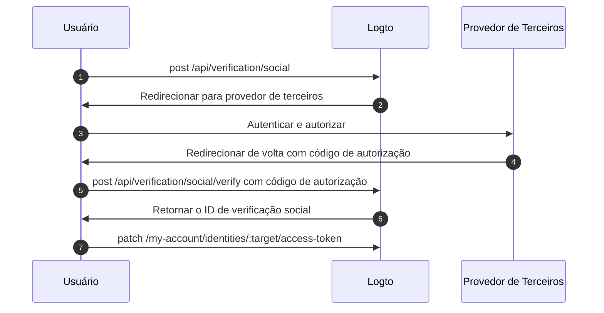

import Availability from '@components/Availability';

<Availability cloud oss={{ major: 1, minor: 31 }} />

O conjunto de tokens federados é um tipo de segredo armazenado no Cofre de Segredos do Logto, usado para gerenciar com segurança tokens de acesso e atualização emitidos por provedores de identidade de terceiros federados. Quando um usuário se autentica via um conector social ou SSO corporativo, o Logto armazena os tokens emitidos no cofre. Esses tokens podem ser recuperados posteriormente para acessar APIs de terceiros em nome do usuário, sem exigir nova autenticação.

## Habilitar armazenamento de tokens federados \{#enable-federated-token-storage}

### Conectores sociais \{#social-connectors}

:::Info
Este recurso está disponível apenas para conectores que suportam armazenamento de tokens. Os conectores atualmente suportados incluem: [GitHub](/integrations/github), [Google](/integrations/google), [Facebook](/integrations/facebook), [OAuth 2.0 padrão](/integrations/oauth2) e [OIDC padrão](/integrations/oidc). O suporte para conectores adicionais será disponibilizado gradualmente.
:::

1. Navegue até <CloudLink to="/connectors/social">Console > Conectores > Conectores Sociais</CloudLink>.
2. Selecione o conector social para o qual deseja habilitar o armazenamento de tokens federados.
3. Na página "Configuração", habilite a opção **Armazenar tokens para acesso persistente à API**.

### Conectores SSO corporativos \{#enterprise-sso-connectors}

:::Info
O armazenamento de tokens está disponível para todos os conectores OIDC corporativos.
:::

1. Navegue até <CloudLink to="/enterprise-sso">Console > SSO Corporativo</CloudLink>.
2. Selecione o conector SSO corporativo para o qual deseja habilitar o armazenamento de tokens federados.
3. Na guia "Experiência SSO", habilite a opção **Armazenar tokens para acesso persistente à API**.

Certifique-se de salvar suas alterações.

## Armazenamento de tokens \{#token-storage}

Uma vez habilitado o armazenamento de tokens federados, o Logto armazena automaticamente os tokens de acesso e atualização emitidos pelo provedor de identidade federado sempre que um usuário se autentica por meio de um conector social ou SSO corporativo. Isso inclui:

- [Login e cadastro social](/end-user-flows/sign-up-and-sign-in/social-sign-in)
- [Login e cadastro via SSO corporativo](/end-user-flows/enterprise-sso)
- [Vinculação de conta social via Account API](/end-user-flows/account-settings/by-account-api#link-a-new-social-connection)

Os tokens armazenados são vinculados à identidade social ou SSO corporativa do usuário, permitindo que ele recupere os tokens posteriormente para acesso à API sem exigir nova autenticação.

### Verificando o status do armazenamento de tokens \{#checking-token-storage-status}

Você pode verificar o status do armazenamento de tokens federados de um usuário no Console do Logto:

1. Navegue até <CloudLink to="/users">Console > Usuários</CloudLink>.
2. Clique no usuário que deseja inspecionar. Isso o levará à página de detalhes do usuário.
3. Role até a seção **Conexões**. Esta área lista todas as conexões sociais e SSO corporativas associadas ao usuário.
4. Cada entrada de conexão mostra um rótulo de status do token indicando se os tokens estão armazenados para essa conexão.
5. Clique na entrada da conexão para ver mais detalhes, incluindo metadados do token de acesso armazenado e disponibilidade do token de atualização (se disponível).

Você também pode verificar as identidades de terceiros do usuário e o status do armazenamento de tokens via Management API:

- `GET /api/users/{userId}/identities/{target}?includeTokenSecret=true`: Recupera a identidade social de um usuário e o status do armazenamento de tokens associado à identidade por um determinado conector (por exemplo, `github`, `google`, etc.).
- `GET /api/users/{userId}/sso-identities/{ssoConnectorId}?includeTokenSecret=true`: Recupera a identidade SSO corporativa de um usuário e o status do armazenamento de tokens associado à identidade por um determinado ID de conector SSO.

### Status do armazenamento de tokens \{#token-storage-status}

- **Ativo**: O token de acesso está armazenado e ativo.
- **Expirado**: O token de acesso está armazenado, mas expirou. Se um token de atualização estiver disponível, ele pode ser usado para obter um novo token de acesso.
- **Inativo**: Nenhum token de acesso está armazenado para esta conexão. Isso pode ocorrer se o usuário não se autenticou por meio desta conexão ou se o armazenamento do token foi excluído.
- **Não aplicável**: O conector não suporta armazenamento de tokens.

### Metadados do token \{#token-metadata}

Para integridade e segurança dos dados, todos os tokens são criptografados antes de serem armazenados no Cofre de Segredos. Os valores reais dos tokens só são acessíveis ao usuário final com a devida autorização. Os desenvolvedores, por outro lado, podem apenas recuperar os metadados do conjunto de tokens para entender o estado dos tokens armazenados sem expor conteúdo sensível.

- `createdAt`: O timestamp de quando a conexão foi estabelecida pela primeira vez e o conjunto de tokens foi inicialmente armazenado no Cofre de Segredos.
- `updatedAt`: A última vez que o conjunto de tokens foi atualizado.
  - Se não houver token de atualização disponível, este valor será o mesmo que **createdAt**.
  - Se houver um token de atualização, este valor reflete o momento mais recente em que o token de acesso foi atualizado.
- `hasRefreshToken`: Indica se há um token de atualização disponível.
  Se o conector suportar acesso offline e a solicitação de autorização estiver devidamente configurada, o Logto armazena o token de atualização quando ele é emitido pelo provedor de identidade juntamente com o token de acesso.
  Quando o token de acesso expira e existe um token de atualização válido, o Logto tenta automaticamente obter um novo token de acesso usando o token de atualização armazenado sempre que o usuário solicita acesso ao provedor conectado.
- `expiresAt`: O tempo estimado de expiração do token de acesso em **segundos**.
  Isso é calculado com base no valor `expires_in` retornado pelo endpoint de token do provedor de identidade. (Este campo só está disponível se o provedor incluir `expires_in` na resposta do token.)
- `scope`: O escopo do token de acesso, indicando as permissões concedidas pelo provedor de identidade.
  Isso é útil para entender quais ações podem ser realizadas com o token de acesso armazenado. (Este campo só está disponível se o provedor incluir `scope` na resposta do token.)
- `tokenType`: O tipo do token de acesso, normalmente "Bearer".
  (Este campo só está disponível se o provedor incluir `token_type` na resposta do token.)

## Recuperação de tokens \{#token-retrieval}

Uma vez que o armazenamento de tokens está habilitado e os tokens estão armazenados com segurança no Cofre de Segredos do Logto, os usuários finais podem recuperar seus tokens de acesso de terceiros a partir do seu aplicativo cliente integrando com a [Account API](/end-user-flows/account-settings/by-account-api) do Logto.

- `GET /my-account/identities/:target/access-token`: Recupera o token de acesso para uma identidade social especificando o conector (por exemplo, github, google).

- `GET /my-account/sso-identities/:connectorId/access-token`: Recupera o token de acesso para uma identidade SSO corporativa especificando o ID do conector.

:::info
Saiba como [habilitar](/end-user-flows/account-settings/by-account-api#how-to-enable-account-api) e [acessar](/end-user-flows/account-settings/by-account-api#access-account-api-using-access-token) a Account API usando o token de acesso emitido pelo Logto.
:::

### Rotação de tokens \{#token-rotation}

Os endpoints de recuperação de tokens retornam:

- `200` OK: Se o token de acesso for recuperado com sucesso e ainda estiver válido.
- `404` Não encontrado: Se o usuário não tiver uma identidade social ou SSO corporativa associada ao conector ou ID especificado, ou se o token de acesso não estiver armazenado.
- `401` Não autorizado: Se o token de acesso estiver expirado.

Se o token de acesso estiver expirado e um token de atualização estiver disponível, o Logto tentará automaticamente atualizar o token de acesso e retornará o novo token de acesso na resposta. O armazenamento do token no Cofre de Segredos também será atualizado com o novo token de acesso e seus metadados.

## Exclusão do armazenamento de tokens \{#token-storage-deletion}

O armazenamento de tokens federados está diretamente vinculado a cada conexão social ou SSO corporativa do usuário. Isso significa que o conjunto de tokens armazenado será automaticamente excluído nos seguintes casos:

- A identidade social ou SSO corporativa associada é removida da conta do usuário.
- A conta do usuário é excluída do seu tenant.
- O conector social ou SSO corporativo é excluído do seu tenant.

### Revogando tokens \{#revoking-tokens}

Você também pode excluir manualmente o conjunto de tokens de terceiros de um usuário para revogar o acesso:

- Pelo Console:
  Navegue até a página de detalhes da identidade do usuário. Role até a seção **Token de acesso** (se o armazenamento de tokens estiver disponível) e clique no botão **Excluir tokens** ao final da seção.
- Via Management API:
  - `DELETE /api/secret/:id`: Exclui um segredo específico pelo seu ID, que pode ser obtido nos detalhes da identidade do usuário.

Revogar o conjunto de tokens forçará o usuário a se autenticar novamente com o provedor de terceiros para obter um novo token de acesso antes de poder acessar as APIs de terceiros novamente.

## Reautenticação e renovação de tokens \{#reauthentication-and-token-renewal}

Em cenários onde um token de acesso armazenado expirou ou quando um aplicativo precisa solicitar escopos adicionais de API, os usuários finais podem se reautenticar com o provedor de terceiros para obter um novo token de acesso—sem precisar fazer login novamente no Logto.
Isso pode ser feito por meio da [Social Verification API](https://openapi.logto.io/operation/operation-createverificationbysocial) do Logto, que permite aos usuários reiniciar um fluxo de autorização social federada e atualizar seu conjunto de tokens armazenado.

:::note
A reinicialização da autorização federada está atualmente limitada a conectores sociais.
Para conectores SSO corporativos, a reautenticação e renovação de tokens exigem que o usuário inicie novamente todo o fluxo de autenticação do Logto, pois a reautorização direta com o provedor SSO corporativo não é suportada após o login.
:::



1. O usuário inicia uma solicitação de verificação social chamando o endpoint `POST /api/verification/social`. O usuário pode especificar escopos personalizados para solicitar permissões adicionais ao provedor de terceiros.

   ```sh
   curl -X POST https://<your-logto-domain>/api/verification/social \
     -H "Authorization: Bearer <access_token>" \
     -H "Content-Type: application/json" \
     -d '{
       "state": "<state>",
       "connectorId": "<logto_connectorId>",
       "redirectUri": "<redirect_uri>",
       "scope": "<custom_scope>"
     }'
   ```

   - **authorization header**: O token de acesso do usuário emitido pelo Logto.
   - **connectorId**: O ID do conector social no Logto.
   - **redirectUri**: O URI para redirecionar o usuário de volta ao seu aplicativo após a autenticação. Você precisará registrar este URI nas configurações do aplicativo do provedor.
   - **scope**: (Opcional) Escopos personalizados para solicitar permissões adicionais ao provedor de terceiros. Se não especificado, os escopos padrão configurados no conector serão usados.

2. O Logto cria um novo registro de verificação social e retorna o ID de verificação social junto com a URL de autorização para redirecionar o usuário ao provedor de terceiros para autenticação.

   A resposta será semelhante a:

   ```json
   {
     "verificationRecordId": "<social_verification_id>",
     "authorizationUri": "<authorization_url>",
     "expiresAt": "<expiration_time>"
   }
   ```

3. Redirecione o usuário para a URL de autorização. O usuário se autentica com o provedor de terceiros e concede permissões.

4. O provedor de terceiros redireciona o usuário de volta ao seu aplicativo cliente com um código de autorização.

5. Trate o callback de autorização encaminhando o código de autorização para o endpoint de verificação do Logto:

   ```sh
   curl -X POST https://<your-logto-domain>/api/verification/social/verify \
     -H "Authorization: Bearer <access_token>" \
     -d '{
       "verificationRecordId": "<social_verification_id>",
       "connectorData": {
         "code": "<authorization_code>",
         "state": "<state>",
         "redirectUri": "<redirect_uri>"
       }
     }'
   ```

   - **authorization header**: O token de acesso do usuário emitido pelo Logto.
   - **verificationRecordId**: O ID de verificação social retornado na etapa anterior.
   - **connectorData**: O código de autorização e quaisquer outros dados retornados pelo provedor de terceiros durante o callback.

   :::note
   Não se esqueça de validar o parâmetro `state` para evitar ataques CSRF.
   :::

6. O Logto verifica o código de autorização e o troca por um novo token de acesso e token de atualização do provedor de terceiros, retornando o ID de verificação social na resposta.

7. Por fim, atualize o armazenamento de tokens do usuário chamando o endpoint `PATCH /my-account/identities/:target/access-token` com o ID de verificação social:

   ```sh
   curl -X PATCH https://<your-logto-domain>/my-account/identities/<target>/access-token \
     -H "Authorization: Bearer <access_token>" \
     -H "Content-Type: application/json" \
     -d '{
       "socialVerificationId": "<social_verification_id>"
     }'
   ```

   - **authorization header**: O token de acesso do usuário emitido pelo Logto.
   - **socialVerificationId**: O ID do registro de verificação social verificado retornado na etapa anterior.

   Isso atualizará o armazenamento do conjunto de tokens do usuário no Cofre de Segredos do Logto com o novo token de acesso e token de atualização, permitindo que o usuário acesse APIs de terceiros sem precisar fazer login novamente no Logto.

   O token de acesso atualizado será retornado.
