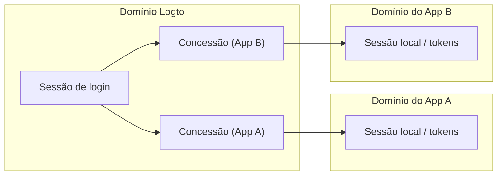
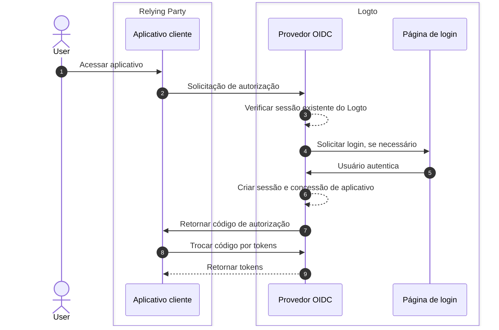
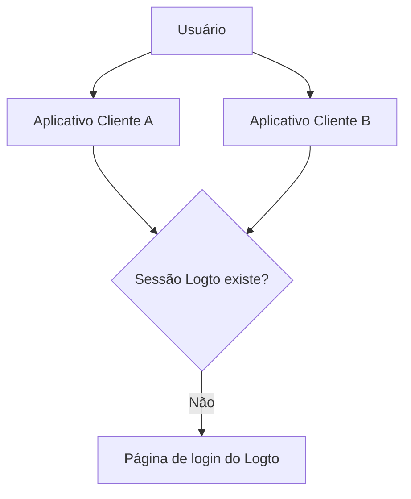

# Sessões

As sessões no Logto definem como o estado de autenticação é criado, compartilhado, atualizado e revogado entre aplicativos, navegadores e dispositivos.

Na prática, os usuários experimentam "logado" como um estado único, mas o estado do sistema é dividido em várias camadas. Compreender essas camadas é a chave para projetar comportamentos previsíveis de SSO, renovação de tokens e logout.

## Modelo de sessão no Logto \{#session-model-in-logto}

- **Sessão de login do Logto**: Estado de login centralizado armazenado como cookies de domínio Logto. Isso controla a disponibilidade de SSO no contexto do navegador atual.
- **Concessão (Grant)**: Estado de autorização específico do aplicativo para `usuário + aplicativo cliente`. As concessões são a ponte entre o login centralizado e a emissão de tokens do aplicativo.
- **Sessão/tokens locais do aplicativo**: Estado de autenticação local em cada aplicativo (tokens de ID/acesso/atualização, cookie de sessão do aplicativo, etc.).

## Conceitos principais \{#core-concepts}

### O que é uma sessão do Logto? \{#what-is-a-logto-session}

Uma sessão do Logto é o estado de autenticação centralizado criado após um login bem-sucedido. Se ainda for válida, o Logto pode autenticar usuários silenciosamente para outros aplicativos no mesmo locatário. Se não existir, os usuários devem fazer login novamente.

### O que são concessões? \{#what-are-grants}

Uma concessão é um estado de autorização em nível de aplicativo vinculado a um usuário específico e aplicativo cliente.

- Uma sessão do Logto pode ter concessões para vários aplicativos.
- Tokens para um aplicativo são emitidos sob a concessão desse aplicativo.
- Revogar uma concessão afeta a capacidade desse aplicativo de continuar o acesso baseado em token.

### Como sessão, concessões e estado de autenticação do aplicativo se relacionam \{#how-session-grants-and-app-auth-state-relate}

- **Sessão** responde: "Este navegador pode fazer SSO com o Logto agora?"
- **Concessão** responde: "Este usuário está autorizado para este aplicativo cliente?"
- **Sessão local do aplicativo** responde: "Este aplicativo atualmente trata o usuário como logado?"

## Criação de login e sessão \{#sign-in-and-session-creation}

## Topologia de sessão entre aplicativos e dispositivos \{#session-topology-across-apps-and-devices}

### Mesmo navegador: sessão Logto compartilhada \{#same-browser-shared-logto-session}

Aplicativos no mesmo navegador podem compartilhar o estado de sessão centralizado do Logto, para que o SSO possa ocorrer sem a necessidade de inserir credenciais repetidamente.

### Navegadores ou dispositivos diferentes: sessões Logto isoladas \{#different-browsers-or-devices-isolated-logto-sessions}

Cada navegador/dispositivo possui armazenamento de cookies separado. Uma sessão válida no Dispositivo A não implica uma sessão válida no Dispositivo B.

## Ciclo de vida da sessão \{#session-lifecycle}

### 1. Criar \{#1-create}

Após a autenticação do usuário, o Logto cria uma sessão centralizada e uma concessão específica do aplicativo.

### 2. Reutilizar (SSO) \{#2-reuse-sso}

Enquanto os cookies de sessão forem válidos no mesmo navegador, novas solicitações de autorização podem frequentemente ser concluídas silenciosamente.

### 3. Renovar tokens \{#3-renew-tokens}

O acesso ao aplicativo geralmente continua através de fluxos de atualização de tokens (quando habilitado). Isso é continuidade em nível de aplicativo, separado de se a sessão centralizada do Logto ainda existe.

### 4. Revogar/expirar \{#4-revokeexpire}

A revogação pode ocorrer em diferentes camadas:

- Logout local do aplicativo remove tokens/sessão local do aplicativo.
- Encerrar sessão remove a sessão centralizada do Logto.
- Revogação de concessão remove a continuidade de autorização em nível de aplicativo.

## Recomendações de design \{#design-recommendations}

- Mantenha o tratamento de sessão local do aplicativo explícito no código do seu aplicativo.
- Trate a sessão do Logto, concessões e sessão local do aplicativo como camadas separadas.
- Escolha se o logout deve ser apenas local do aplicativo ou global.
- Use [logout de back-channel](/end-user-flows/sign-out#federated-sign-out-back-channel-logout) quando a consistência entre múltiplos aplicativos for necessária.
- Para detalhes sobre comportamento e implementação de logout, veja [Logout](/end-user-flows/sign-out).

## Melhores práticas para revogar acesso \{#best-practices-for-revoking-access}

Use diferentes estratégias de revogação com base no seu objetivo:

- **Revogar acesso dos seus aplicativos de primeira parte**:
  Revogue a sessão alvo com `revokeGrantsTarget=firstParty`.
  Isso desconecta o usuário em aplicativos de primeira parte associados a essa sessão, criando uma experiência de logout consistente.
  Ao mesmo tempo, concessões para aplicativos de terceiros que têm `offline_access` concedido podem permanecer disponíveis para integrações contínuas.
  Veja [Gerenciar sessões de usuário](/sessions/manage-user-sessions) para detalhes sobre revogação de sessão.

- **Revogar acesso a aplicativos de terceiros**:
  Escolha uma das seguintes opções:

  - Revogue a sessão com `revokeGrantsTarget=all` para revogar todas as concessões associadas a essa sessão.
  - Revogue concessões específicas diretamente através das APIs de gerenciamento de concessões para remover autorizações de aplicativos de terceiros sem forçar o logout completo da sessão.
    Veja [Gerenciar aplicativos autorizados do usuário (concessões)](/sessions/grants-management) para estratégias de revogação específicas de concessões.

- **Ao usar o Logto Console**:
  Na página de detalhes do usuário, o Logto fornece tanto o gerenciamento de sessões quanto o gerenciamento de aplicativos de terceiros autorizados prontos para uso.
  - Revogar uma sessão também revoga concessões de aplicativos de primeira parte, para manter o comportamento de logout de primeira parte consistente.
  - Revogar uma autorização de aplicativo de terceiros revoga concessões para esse aplicativo de terceiros enquanto mantém o status original da sessão inalterado.

## Recursos relacionados \{#related-resources}

<Url href="/sessions/manage-user-sessions">Gerenciar sessões de usuário</Url>
<Url href="/sessions/grants-management">
  Gerenciar aplicativos autorizados do usuário (concessões)
</Url>
<Url href="/sessions/session-configs">Configuração de sessão</Url>
<Url href="/end-user-flows/sign-out">Logout</Url>
<Url href="/end-user-flows/sign-up-and-sign-in">Cadastro e login</Url>
<Url href="/integrate-logto/integrate-logto-into-your-application/understand-authentication-flow">
  Compreender o fluxo de autenticação
</Url>
