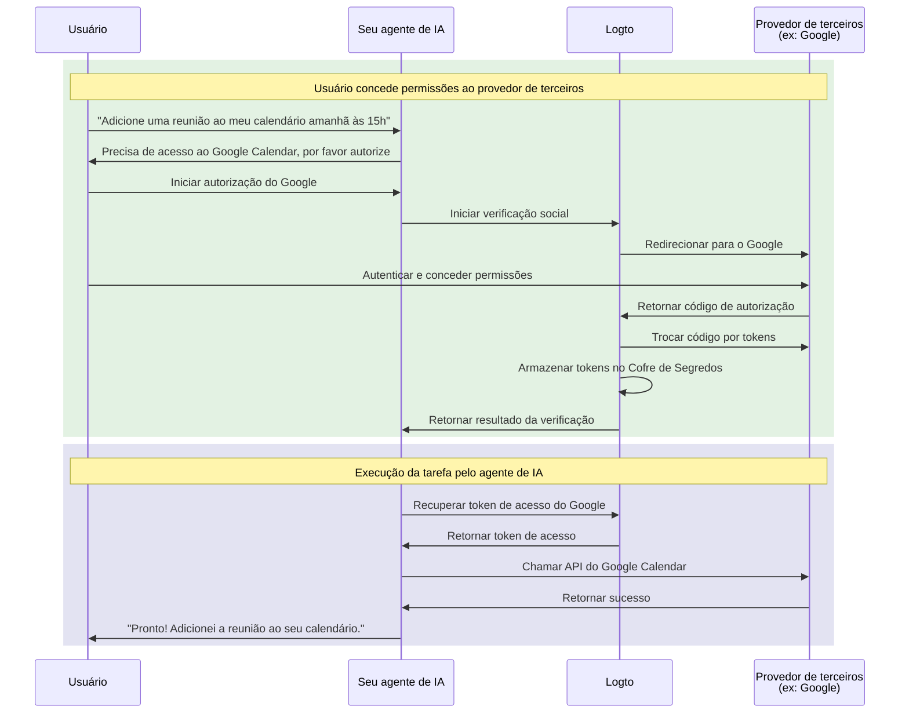

# Conecte seu agente de IA a APIs de terceiros

Este guia mostra como habilitar seu agente de IA para acessar APIs de terceiros (por exemplo, Google Calendar, GitHub, etc.) em nome dos usuários. Aproveitando os conectores sociais do Logto e o Cofre de Segredos (Secret Vault), você pode armazenar e gerenciar tokens de acesso com segurança, permitindo que seu agente execute tarefas automatizadas sem solicitar repetidamente que os usuários se autentiquem novamente.

Você aprenderá como:

- Configurar conectores sociais com armazenamento de tokens de terceiros.
- Solicitar permissões mínimas durante o login inicial.
- Solicitar permissões adicionais progressivamente conforme necessário.
- Recuperar e usar tokens armazenados para acessar APIs de terceiros.

## Por que seu agente de IA precisa de acesso a APIs de terceiros \{#why-your-ai-agent-needs-third-party-api-access}

Agentes de IA estão sendo cada vez mais usados para automatizar tarefas que exigem interação com serviços externos. Por exemplo:

- **📅 Gerenciamento de calendário**: Seu agente de IA pode agendar reuniões automaticamente, adicionar eventos ou ajustar compromissos no Google Calendar.
- **📧 Automação de e-mails**: Envie e-mails de acompanhamento, organize caixas de entrada ou redija respostas usando as APIs do Gmail.
- **💻 Gerenciamento de código**: Crie issues no GitHub, revise pull requests ou gerencie repositórios.
- **📁 Gerenciamento de arquivos**: Faça upload, organize ou compartilhe arquivos no Google Drive ou Dropbox.

Para executar essas tarefas, seu agente de IA precisa de acesso seguro às APIs de terceiros autorizadas pelo usuário, o que significa lidar corretamente e com segurança com tokens OAuth.

## Como funciona \{#how-it-works}

Aqui está uma visão geral rápida do fluxo:



1. **Usuário solicita uma tarefa**: O usuário pede ao agente de IA para executar uma tarefa que exige acesso a uma API de terceiros (por exemplo, adicionar um evento ao calendário).
2. **Solicitação de autorização**: O agente detecta a necessidade de acesso de terceiros e solicita autorização ao usuário.
3. **Tokens armazenados**: Após a autorização do usuário, o Logto armazena com segurança os tokens de acesso e atualização no Cofre de Segredos.
4. **Execução da tarefa**: O agente recupera o token armazenado e chama a API de terceiros para concluir a tarefa.

Uma vez autorizado, o usuário pode realizar várias tarefas sem precisar autorizar novamente. O Logto armazena os tokens com segurança e os atualiza automaticamente quando necessário, proporcionando uma experiência contínua para as interações do agente de IA.

## Pré-requisitos \{#prerequisites}

Antes de começar, certifique-se de ter:

- Um tenant do [Logto Cloud](https://cloud.logto.io) (ou Logto self-hosted v1.31+)
- Uma conta de provedor de terceiros com acesso à API (por exemplo, [Google Cloud Console](https://console.cloud.google.com))
- Um aplicativo de agente de IA integrado ao Logto SDK (os usuários podem fazer login no seu agente de IA)

## Configure o conector social com armazenamento de tokens \{#set-up-social-connector-with-token-storage}

Para permitir que seu agente de IA acesse APIs de terceiros, você precisa configurar um conector social com armazenamento de tokens ativado. Isso permite que o Logto armazene e gerencie tokens de acesso quando os usuários autorizam serviços de terceiros durante a interação com seu agente de IA.

Vamos usar o Google como exemplo:

1. Navegue até <CloudLink to="/connectors/social">Console > Conectores > Conectores sociais</CloudLink>.
2. Clique em **Adicionar conector social** e selecione **Google**.
3. Siga o [guia de configuração do conector Google](/integrations/google) para configurar suas credenciais OAuth.
4. Nas configurações do conector:
   - Ative **Armazenar tokens para acesso persistente à API** para armazenar tokens no Cofre de Segredos.
   - Defina **Prompts** para incluir `consent` para garantir que os usuários vejam a solicitação de permissão.
   - Ative **Acesso offline** para receber tokens de atualização para acesso prolongado à API.
5. Salve suas alterações.

:::info
Você não precisa adicionar este conector à sua experiência de login. O conector será usado para autorização sob demanda quando seu agente de IA precisar acessar APIs de terceiros, não para login do usuário.
:::

## Solicite autorização e acesse APIs de terceiros \{#request-authorization-and-access-third-party-apis}

Quando seu agente de IA precisar acessar uma API de terceiros (por exemplo, Google Calendar), ele deve primeiro verificar se o usuário já autorizou o acesso. Caso contrário, solicite a autorização do usuário.

:::info Ative o Account API
Antes de prosseguir, ative o Account API em <CloudLink to="/sign-in-experience/account-center">Console > Experiência de login > Central da conta</CloudLink>. Saiba mais sobre [como ativar o Account API](/end-user-flows/account-settings/by-account-api#how-to-enable-account-api).
:::

### Passo 1: Verifique se já existe autorização \{#step-1-check-for-existing-authorization}

Primeiro, tente recuperar o token de acesso armazenado para ver se o usuário já autorizou:

```tsx
async function getGoogleAccessToken(userAccessToken: string) {
  const response = await fetch(
    'https://[tenant-id].logto.app/my-account/identities/google/access-token',
    {
      headers: {
        Authorization: `Bearer ${userAccessToken}`,
      },
    }
  );

  return response.json();
}
```

### Passo 2: Solicite autorização se necessário \{#step-2-request-authorization-if-needed}

Se não existir token, o token expirou ou você precisa ampliar o escopo do token de acesso, use a [API de Verificação Social](/secret-vault/federated-token-set#reauthentication-and-token-renewal) do Logto para iniciar o fluxo de autorização:

```tsx
async function requestGoogleAuthorization(userAccessToken: string, scopes: string) {
  // Gere um estado aleatório para proteção CSRF
  const state = crypto.randomUUID();
  sessionStorage.setItem('oauth_state', state);

  // Inicie a verificação social
  const response = await fetch('https://[tenant-id].logto.app/api/verification/social', {
    method: 'POST',
    headers: {
      Authorization: `Bearer ${userAccessToken}`,
      'Content-Type': 'application/json',
    },
    body: JSON.stringify({
      connectorId: '<google_connector_id>',
      state,
      redirectUri: 'https://your-ai-agent.com/callback',
      scope: scopes,
    }),
  });

  const { verificationRecordId, authorizationUri } = await response.json();

  // Armazene verificationRecordId para uso posterior
  sessionStorage.setItem('verificationRecordId', verificationRecordId);

  // Redirecione o usuário para o Google para autorização
  window.location.href = authorizationUri;
}
```

### Passo 3: Trate o callback de autorização \{#step-3-handle-the-authorization-callback}

Após o usuário conceder permissões, o Google redireciona de volta para seu app. Complete a verificação e armazene os tokens:

```tsx
async function handleAuthorizationCallback(
  userAccessToken: string,
  callbackParams: URLSearchParams
) {
  const verificationRecordId = sessionStorage.getItem('verificationRecordId');
  const storedState = sessionStorage.getItem('oauth_state');
  const code = callbackParams.get('code');
  const state = callbackParams.get('state');

  // Valide o estado para evitar ataques CSRF
  if (state !== storedState) {
    throw new Error('Parâmetro de estado inválido');
  }

  // Verifique a autorização
  await fetch('https://[tenant-id].logto.app/api/verification/social/verify', {
    method: 'POST',
    headers: {
      Authorization: `Bearer ${userAccessToken}`,
      'Content-Type': 'application/json',
    },
    body: JSON.stringify({
      verificationRecordId,
      connectorData: {
        code,
        state,
        redirectUri: 'https://your-ai-agent.com/callback',
      },
    }),
  });

  // Armazene os tokens no Cofre de Segredos do Logto
  await fetch('https://[tenant-id].logto.app/my-account/identities/google/access-token', {
    method: 'PUT',
    headers: {
      Authorization: `Bearer ${userAccessToken}`,
      'Content-Type': 'application/json',
    },
    body: JSON.stringify({
      verificationRecordId,
    }),
  });

  // Limpeza
  sessionStorage.removeItem('verificationRecordId');
  sessionStorage.removeItem('oauth_state');
}
```

### Passo 4: Chame a API de terceiros \{#step-4-call-the-third-party-api}

Agora seu agente de IA pode recuperar o token e chamar a API:

```tsx
async function addCalendarEvent(userAccessToken: string, eventDetails: EventDetails) {
  // Obtenha o token de acesso do Google armazenado
  const tokenData = await getGoogleAccessToken(userAccessToken);

  if (!tokenData) {
    // Usuário não autorizou, solicite autorização com escopo de calendário
    await requestGoogleAuthorization(
      userAccessToken,
      'https://www.googleapis.com/auth/calendar.events'
    );
    return; // Continuará após o redirecionamento
  }

  // Chame a API do Google Calendar
  const response = await fetch('https://www.googleapis.com/calendar/v3/calendars/primary/events', {
    method: 'POST',
    headers: {
      Authorization: `Bearer ${tokenData.accessToken}`,
      'Content-Type': 'application/json',
    },
    body: JSON.stringify(eventDetails),
  });

  return response.json();
}
```

O Logto lida com a atualização do token automaticamente. Se o token de acesso estiver expirado, mas existir um token de atualização, o Logto obterá um novo token de acesso de forma transparente ao chamar o endpoint de recuperação.

## Solicite permissões adicionais \{#request-additional-permissions}

À medida que seu agente de IA assume mais tarefas, pode ser necessário solicitar permissões adicionais. Por exemplo, se o usuário inicialmente autorizou apenas acesso de leitura ao calendário, mas agora deseja criar eventos, você precisará de permissões de escrita.

### Por que autorização incremental? \{#why-incremental-authorization}

- **Melhor experiência do usuário**: Os usuários têm mais probabilidade de conceder permissões quando entendem por que são necessárias no contexto.
- **Taxas de conversão mais altas**: Menos permissões iniciais significam menos atrito.
- **Construção de confiança**: Usuários confiam em aplicativos que pedem apenas o que realmente precisam.

### Exemplo: Atualizando de leitura para escrita \{#example-upgrading-from-read-to-write-access}

```tsx
async function createCalendarEvent(userAccessToken: string, eventDetails: EventDetails) {
  const tokenData = await getGoogleAccessToken(userAccessToken);

  if (!tokenData) {
    // Ainda não autorizado, solicite permissão de escrita no calendário diretamente
    await requestGoogleAuthorization(userAccessToken, 'https://www.googleapis.com/auth/calendar');
    return;
  }

  // Tente criar o evento
  const response = await fetch('https://www.googleapis.com/calendar/v3/calendars/primary/events', {
    method: 'POST',
    headers: {
      Authorization: `Bearer ${tokenData.accessToken}`,
      'Content-Type': 'application/json',
    },
    body: JSON.stringify(eventDetails),
  });

  if (response.status === 403) {
    // Permissões insuficientes, solicite escopo adicional
    await requestGoogleAuthorization(
      userAccessToken,
      'https://www.googleapis.com/auth/calendar' // Acesso total ao calendário
    );
    return;
  }

  return response.json();
}
```

:::tip
Ao solicitar escopos adicionais, o usuário verá uma tela de consentimento mostrando apenas as novas permissões solicitadas. As permissões já concedidas serão preservadas.
:::

## Gerencie o status dos tokens \{#manage-token-status}

O Console do Logto fornece visibilidade sobre o status dos tokens de cada usuário:

1. Navegue até <CloudLink to="/users">Console > Gerenciamento de usuários</CloudLink>.
2. Clique em um usuário para ver seus detalhes.
3. Role até a seção **Conexões** para ver todas as contas sociais vinculadas.
4. Cada conexão mostra o status do token:
   - **Ativo**: O token de acesso é válido e pronto para uso.
   - **Expirado**: O token de acesso expirou. Se existir um token de atualização, ele será renovado automaticamente na próxima recuperação.
   - **Inativo**: Não há tokens armazenados para esta conexão.

## Melhores práticas de segurança \{#security-best-practices}

Ao construir agentes de IA que acessam APIs de terceiros, mantenha estas práticas de segurança em mente:

- **Solicite escopos mínimos**: Solicite apenas as permissões que seu agente realmente precisa.
- **Use autorização incremental**: Solicite permissões adicionais no contexto, não todas de uma vez.
- **Trate a expiração dos tokens de forma adequada**: Sempre trate casos em que os tokens possam estar expirados ou revogados.
- **Proteja os tokens de acesso do usuário**: O token de acesso do Logto do usuário é a chave para recuperar tokens de terceiros. Proteja-o adequadamente.
- **Audite o acesso à API**: Registre quando seu agente de IA acessa APIs de terceiros para solução de problemas e conformidade.

## Recursos relacionados \{#related-resources}

<Url href="/secret-vault/federated-token-set">Armazenamento de tokens de terceiros</Url>
<Url href="/connectors/social-connectors">Conectores sociais</Url>
<Url href="/end-user-flows/sign-up-and-sign-in/social-sign-in">Login social</Url>
<Url href="/end-user-flows/account-settings/by-account-api">Account API</Url>
