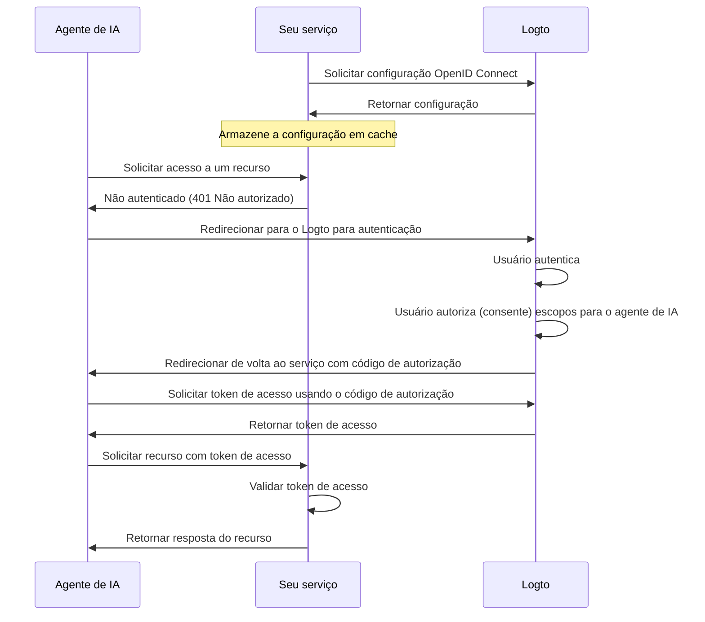

import ConfigureThirdPartyAiAgent from './fragments/_configure-third-party-ai-agent.mdx';

# Habilitar acesso de agente de IA de terceiros ao seu app

Este guia orienta você na integração do Logto com seu serviço e na habilitação do acesso de agentes de IA a ele.

Você aprenderá como:

- Configurar o Logto como o servidor de autorização para seu serviço.
- Obter um token de acesso (Access token) para o agente de IA acessar seu serviço.
- Testar o fluxo com um agente de IA.

## Diferença entre agente de IA de terceiros e seu próprio agente de IA (ou app) \{#difference-between-third-party-ai-agent-and-your-own-ai-agent-or-app}

Vamos analisar um exemplo. Imagine que você é um desenvolvedor que oferece um serviço de dados meteorológicos.

**App meteorológico oficial (Seu próprio agente de IA / app)**

- Você fornece um app meteorológico oficial para os usuários consultarem o clima.
- Como funciona: O app meteorológico oficial conecta-se ao seu serviço usando o Logto para autenticar os usuários. Quando Alice faz login, ela automaticamente tem acesso aos dados meteorológicos, sem telas extras de permissão, já que é seu app confiável.

**Agente de IA de terceiros**

- Você está construindo um ecossistema em torno do seu serviço, então outro desenvolvedor cria o "WeatherBot" (um assistente de IA que pode fornecer atualizações e previsões do tempo) integrando-o como um agente de IA de terceiros.
- Como funciona: O WeatherBot (agente de IA de terceiros) deseja acessar os dados meteorológicos do usuário via seu serviço. Quando Alice faz login no WeatherBot usando sua conta:
  - Ela vê uma tela de consentimento (Consent screen), pedindo permissão para o WeatherBot acessar seus dados meteorológicos.
  - Alice pode permitir ou negar esse acesso.
  - Apenas os dados aos quais ela consentiu são compartilhados com o WeatherBot, e o WeatherBot não pode acessar dados adicionais sem um novo consentimento explícito.

Esse controle de acesso (permissão) garante a segurança dos dados do usuário: mesmo que seu serviço gerencie todos os dados, agentes de IA de terceiros como o WeatherBot só podem acessar o que o usuário permitiu explicitamente. Eles não podem burlar esse processo, pois ele é imposto pela sua implementação de controle de acesso no serviço.

**Resumo**

| Tipo de cliente           | Exemplo                  | Consentimento necessário? | Quem controla?         |
| ------------------------- | ------------------------ | ------------------------- | ---------------------- |
| App meteorológico oficial | Seu próprio app do tempo | Não                       | Você (o desenvolvedor) |
| Agente de IA de terceiros | Assistente WeatherBot    | Sim                       | Outro desenvolvedor    |

:::note
Se você deseja integrar seu serviço com seu próprio agente de IA ou app, consulte nossos [guias de início rápido](/quick-starts) para mais informações.
:::

## Pré-requisitos \{#prerequisites}

- Um tenant do [Logto Cloud](https://cloud.logto.io) (ou auto-hospedado)
- Um serviço que exponha endpoints de API para serem acessados pelo agente de IA

### Entendendo o fluxo \{#understanding-the-flow}

- **Serviço**: O serviço que você deseja expor ao agente de IA.
- **Agente de IA**: O agente de IA que irá acessar seu serviço.
- **Logto**: Atua como o provedor OpenID Connect (servidor de autorização) e gerencia as identidades dos usuários.

Um diagrama de sequência não normativo ilustra o fluxo geral do processo:

## Configurar agente de IA de terceiros \{#set-up-third-party-ai-agent}

Para configurar um agente de IA de terceiros para acessar seu serviço, siga estes passos:

1. **Registrar o agente de IA no Logto**: Crie um aplicativo no Logto para representar o agente de IA.
2. **Configurar o agente de IA**: Garanta que o agente de IA possa fazer requisições ao seu serviço e lidar com a resposta 401 Não autorizado.
3. **Implementar o fluxo de autorização**: O agente de IA deve ser capaz de lidar com o fluxo de autorização OAuth 2.0 para obter um token de acesso (Access token) do Logto.
4. **Testar a integração**: Use o agente de IA para acessar seu serviço e verifique se ele consegue autenticar e autorizar as requisições com sucesso.

<ConfigureThirdPartyAiAgent />

## Configurar autorização em seu serviço \{#set-up-authorization-in-your-service}

Para habilitar o controle de acesso em seu serviço, você precisa implementar o seguinte:

1. **Definir recursos de API (API resources) no Logto**: Crie recursos de API no Logto que representem os endpoints que seu agente de IA irá acessar.
2. **Implementar lógica de controle de acesso**: Em seu serviço, implemente a lógica para validar o token de acesso recebido do agente de IA e verificar se o usuário possui as permissões necessárias para acessar o recurso solicitado.
3. **Responder ao agente de IA**: Se o token de acesso for válido e o usuário tiver permissão, retorne o recurso solicitado. Caso contrário, retorne uma resposta 401 Não autorizado.

Para saber mais sobre como implementar o controle de acesso em seu serviço, consulte nosso [Guia de autorização](/authorization).

## Testar a integração \{#test-the-integration}

1. Inicie seu serviço.
2. Inicie o agente de IA.
3. No agente de IA, invoque o endpoint de API para acessar seu serviço.
4. O agente de IA deve lidar com a resposta 401 Não autorizado e redirecionar o usuário para o Logto para autenticação.
5. Após a autenticação bem-sucedida, o agente de IA deve receber um token de acesso e usá-lo para fazer requisições ao seu serviço.
6. O agente de IA deve ser capaz de recuperar o recurso do seu serviço usando o token de acesso.
