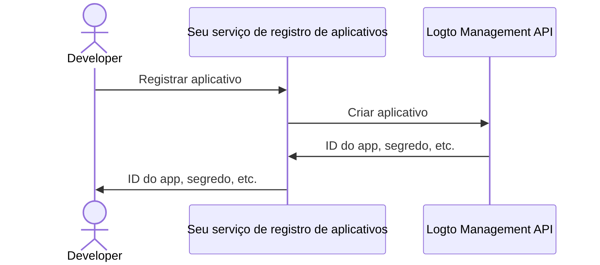

import QuickStartsReference from '../../../quick-starts/third-party/oidc/_quick-starts-reference.md';

## Configurar agente de IA de terceiros no Logto \{#configure-third-party-ai-agent-in-logto}

Para permitir que o agente de IA de terceiros acesse {props.serviceName ?? 'seu serviço'}, você precisa configurar um **aplicativo de terceiros** no Logto. Este aplicativo será usado para representar o agente de IA e obter as credenciais necessárias para autenticação e autorização.

### Permitir que desenvolvedores criem aplicativos de terceiros no Logto \{#allow-developers-to-create-third-party-apps-in-logto}

Se você está construindo um marketplace ou deseja permitir que desenvolvedores criem aplicativos de terceiros no Logto, pode utilizar a [Logto Management API](/integrate-logto/interact-with-management-api) para criar aplicativos de terceiros programaticamente. Isso permite que os desenvolvedores registrem seus aplicativos e obtenham as credenciais necessárias para autenticação.

Você precisará hospedar seu próprio serviço para lidar com o processo de registro do cliente. Este serviço irá interagir com a Logto Management API para criar aplicativos de terceiros em nome dos desenvolvedores.

Alternativamente, você pode criar aplicativos de terceiros manualmente no Logto Console para se familiarizar com o processo.

### Criar manualmente um aplicativo de terceiros no Logto \{#manually-create-a-third-party-app-in-logto}

Você pode criar manualmente um aplicativo de terceiros no Logto Console para fins de teste ou integrações pontuais. Isso é útil quando você deseja testar rapidamente a integração sem implementar um fluxo completo de registro de cliente.

1. Faça login no seu Logto Console.
2. Vá em <CloudLink to="/applications">**Aplicativos**</CloudLink> → **Criar aplicativo** → **Aplicativo de terceiros** -> **OIDC**.
3. Preencha o nome do aplicativo e outros campos obrigatórios, depois clique em **Criar aplicativo**.
4. Clique na guia **Permissões**, na seção **Usuário**, clique em "Adicionar".
5. Na janela aberta -> **Dados do usuário** -> selecione as permissões **`profile`**, **`email`**, depois clique em **Salvar**.
6. No aplicativo de terceiros, configure os escopos para solicitar as permissões (escopos) `openid profile email`.

   **Observação**: `openid` é obrigatório para OIDC, e `profile` e `email` são as permissões que você adicionou na etapa anterior.

7. Configure o **redirect URI** do seu aplicativo de terceiros conforme necessário. Lembre-se de atualizar o redirect URI também no Logto.

---

<QuickStartsReference />
