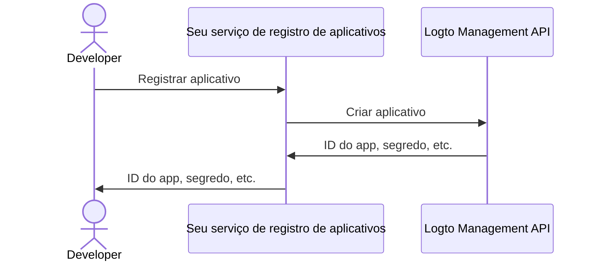
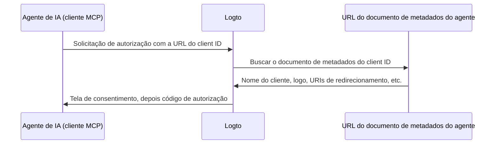

import QuickStartsReference from '../../../quick-starts/third-party/oidc/_quick-starts-reference.md';

## Configurar agente de IA de terceiros no Logto \{#configure-third-party-ai-agent-in-logto}

Para permitir que o agente de IA de terceiros acesse seu {props.serviceName ?? 'serviço'}, você precisa configurar um **aplicativo de terceiros** no Logto. Este aplicativo será usado para representar o agente de IA e obter as credenciais necessárias para autenticação e autorização.

:::info[O que é um aplicativo de terceiros?]
Um **aplicativo de terceiros** é um aplicativo criado por desenvolvedores externos (que não são os proprietários do recurso) e que precisa do consentimento do usuário para acessar recursos protegidos. Diferente dos aplicativos de primeira parte (seus próprios aplicativos), aplicativos de terceiros exibem uma tela de consentimento solicitando que os usuários aprovem permissões específicas antes de acessar seus dados. Isso garante que os usuários tenham controle sobre quais dados compartilham com serviços externos.

Para saber mais, veja [Aplicativos de terceiros](/integrate-logto/third-party-applications).
:::

Existem três maneiras de integrar agentes de IA:

- [Criar manualmente o aplicativo no Console](#manually-create-a-third-party-app-in-logto), para testes ou alguns agentes conhecidos.
- [Construir um serviço de registro usando a Management API](#allow-developers-to-create-third-party-apps-in-logto), se você quiser controlar quem recebe credenciais.
- [Habilitar aplicativo dinâmico](#let-any-ai-agent-connect-without-pre-registration), se qualquer agente puder se conectar e você não quiser uma etapa de registro.

### Permitir que desenvolvedores criem aplicativos de terceiros no Logto \{#allow-developers-to-create-third-party-apps-in-logto}

Se você está construindo um marketplace ou deseja permitir que desenvolvedores criem aplicativos de terceiros no Logto, pode utilizar a [Logto Management API](/integrate-logto/interact-with-management-api) para criar aplicativos de terceiros programaticamente. Isso permite que desenvolvedores registrem seus aplicativos e obtenham as credenciais necessárias para autenticação.

Você precisará hospedar seu próprio serviço para lidar com o processo de registro do cliente. Esse serviço irá interagir com a Logto Management API para criar aplicativos de terceiros em nome dos desenvolvedores.

```mermaid
sequenceDiagram
  actor Developer
  participant Server as Seu serviço de registro de aplicativos
  participant Logto as Logto Management API
  Developer->>Server: Registrar aplicativo
  Server->>Logto: Criar aplicativo
  Logto->>Server: ID do app, segredo, etc.
  Server->>Developer: ID do app, segredo, etc.
```

Alternativamente, você pode criar manualmente aplicativos de terceiros no Logto Console para se familiarizar com o processo.

### Permitir que qualquer agente de IA se conecte sem pré-registro \{#let-any-ai-agent-connect-without-pre-registration}

Em um ecossistema MCP aberto, geralmente você não conhece os agentes com antecedência. [Aplicativo dinâmico](/integrate-logto/third-party-applications/dynamic-apps) remove a etapa de registro: o agente usa uma URL HTTPS pública que serve seu próprio documento de metadados de cliente como seu `client_id`, e o Logto resolve isso quando a solicitação de autorização chega.

```mermaid
sequenceDiagram
  participant Agent as Agente de IA (cliente MCP)
  participant Logto
  participant Metadata as URL do documento de metadados do agente
  Agent->>Logto: Solicitação de autorização com a URL do client ID
  Logto->>Metadata: Buscar o documento de metadados do client ID
  Metadata->>Logto: Nome do cliente, logo, URIs de redirecionamento, etc.
  Logto->>Agent: Tela de consentimento, depois código de autorização
```

Você ainda controla o que os agentes podem solicitar através das permissões concedidas ao aplicativo dinâmico, e toda autorização passa pela tela de consentimento do usuário.

### Criar manualmente um aplicativo de terceiros no Logto \{#manually-create-a-third-party-app-in-logto}

Você pode criar manualmente um aplicativo de terceiros no Logto Console para fins de teste ou integrações pontuais. Isso é útil quando você deseja testar rapidamente a integração sem implementar um fluxo completo de registro de cliente.

1. Faça login no seu Logto Console.
2. Vá em <CloudLink to="/applications">**Aplicativos**</CloudLink> → **Criar aplicativo** → **Aplicativo de terceiros** -> **OIDC**.
3. Preencha o nome do aplicativo e outros campos obrigatórios, depois clique em **Criar aplicativo**.
4. Clique na guia **Permissões** para conceder [permissões](/integrate-logto/third-party-applications/permission-management) ao aplicativo:

   - Seção **Usuário**: permissões de dados do usuário como **`profile`** e **`email`**, para reivindicações básicas de identidade.
   - Seção **Recurso de API (API resource)**: permissões (escopos) dos [recursos de API](/authorization/global-api-resources) que você definiu no Logto, por exemplo, o recurso de API que representa seu {props.serviceName ?? 'serviço'}.
   - Seção **Organização (Organization)**: permissões de organização, se você usar organizações do Logto.

5. No aplicativo de terceiros, configure os escopos para solicitar as permissões que você concedeu, por exemplo, `openid profile email` mais os escopos dos recursos de API.

   **Nota**: `openid` é obrigatório para OIDC. Para receber um token de acesso vinculado a um recurso de API, o aplicativo também deve incluir o parâmetro `resource` na solicitação de autorização. Clientes MCP que seguem a especificação MCP mais recente fazem isso automaticamente com base nos metadados do recurso protegido.

6. Configure o **redirect URI** do seu aplicativo de terceiros conforme necessário. Lembre-se de atualizar o redirect URI também no Logto.

---

<QuickStartsReference />
