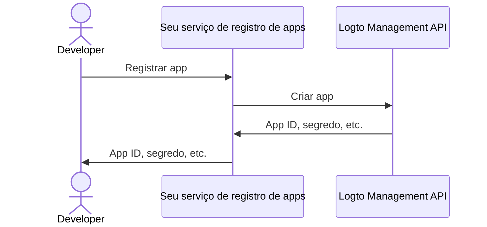

import thirdPartyAppPermissions from '../../../../../../docs/use-cases/ai/assets/third-party-app-permissions.png';
import QuickStartsReference from '../../quick-starts/third-party/oidc/_quick-starts-reference.md';

import Prerequisites from './fragments/_mcp-prerequisites.mdx';
import SampleCode from './fragments/_mcp-sample-code.mdx';
import SetUpServer from './fragments/_mcp-set-up-server.mdx';

# Permitir acesso de agente de IA de terceiros ao seu servidor MCP

Este guia orienta você na integração do Logto com seu servidor MCP usando o [mcp-auth](https://mcp-auth.dev), permitindo autenticar usuários e recuperar com segurança suas informações de identidade usando o fluxo padrão do OpenID Connect.

Você aprenderá como:

- Configurar o Logto como servidor de autorização para seu servidor MCP.
- Configurar uma ferramenta “whoami” em seu servidor MCP para retornar as reivindicações de identidade do usuário atual.
- Testar o fluxo com um agente de IA de terceiros (cliente MCP).

Após este tutorial, seu servidor MCP irá:

- Autenticar usuários em seu tenant Logto.
- Retornar reivindicações de identidade (`sub`, `username`, `name`, `email`, etc.) para a invocação da ferramenta "whoami".

## Diferença entre agente de IA de terceiros (cliente MCP) e seu próprio cliente MCP \{#difference-between-third-party-ai-agent-mcp-client-and-your-own-mcp-client}

Vamos analisar um exemplo. Imagine que você é um desenvolvedor executando um servidor MCP para gerenciar acesso e automação de e-mails.

**Aplicativo de e-mail oficial (Seu próprio cliente MCP)**

- Você fornece um aplicativo de e-mail oficial para os usuários lerem e gerenciarem seus e-mails.
- Como funciona: O aplicativo de e-mail oficial conecta-se ao seu servidor MCP usando Logto para autenticar usuários. Quando Alice faz login, ela automaticamente tem acesso aos seus e-mails, sem telas extras de permissão, já que é seu aplicativo confiável.

**Agente de IA de terceiros (Cliente MCP de terceiros)**

- Você está construindo um ecossistema em torno do seu servidor MCP, então outro desenvolvedor cria o “SmartMail AI” (um assistente de IA que pode resumir e-mails e agendar reuniões automaticamente), integrando-o como um cliente de terceiros.
- Como funciona: O SmartMail AI (cliente MCP de terceiros) deseja acessar os e-mails do usuário via seu servidor MCP. Quando Alice faz login no SmartMail AI usando sua conta:
  - Ela vê uma tela de consentimento, solicitando permissão para o SmartMail AI ler seus e-mails e calendário.
  - Alice pode permitir ou negar esse acesso.
  - Somente os dados aos quais ela consentiu são compartilhados com o SmartMail AI, e o SmartMail AI não pode acessar dados adicionais sem um novo consentimento explícito.

Esse controle de acesso (permissão) garante a segurança dos dados do usuário, mesmo que seu servidor MCP gerencie todos os dados, aplicativos de terceiros como o SmartMail AI só podem acessar o que o usuário permitiu explicitamente. Eles não podem contornar esse processo, pois ele é imposto pela sua implementação de controle de acesso no servidor MCP.

**Resumo**

| Tipo de cliente              | Exemplo                          | Consentimento necessário? | Quem controla?         |
| ---------------------------- | -------------------------------- | ------------------------- | ---------------------- |
| Aplicativo de e-mail oficial | Seu próprio aplicativo de e-mail | Não                       | Você (o desenvolvedor) |
| Agente de IA de terceiros    | Assistente SmartMail AI          | Sim                       | Outro desenvolvedor    |

:::note
Se você deseja integrar seu servidor MCP com seu próprio agente de IA ou aplicativo, consulte o guia [Habilitar autenticação para seus apps com MCP usando Logto](./mcp-server-add-auth).
:::

<Prerequisites isThirdParty />

## Configurar agente de IA de terceiros \{#set-up-third-party-ai-agent}

Para permitir que o agente de IA de terceiros acesse seu servidor MCP, você precisa configurar o seguinte:

1. O cliente deve ser capaz de fazer requisições MCP para invocar as ferramentas expostas pelo servidor MCP.
2. O cliente deve ser capaz de lidar com a resposta 401 Não autorizado. Veja [Etapas do fluxo de autorização](https://modelcontextprotocol.io/specification/2025-03-26/basic/authorization#2-5-authorization-flow-steps) para mais detalhes.
3. Após a autenticação bem-sucedida, o cliente deve ser capaz de fazer requisições ao servidor MCP com o token de acesso obtido do Logto.

## Configurar agente de IA no Logto \{#set-up-ai-agent-in-logto}

Para permitir que o agente de IA de terceiros acesse seu servidor MCP, você precisa configurar um **aplicativo de terceiros** no Logto. Este aplicativo será usado para representar o agente de IA e obter as credenciais necessárias para autenticação e autorização.

### Permitir que desenvolvedores criem aplicativos de terceiros no Logto \{#allow-developers-to-create-third-party-apps-in-logto}

Se você está construindo um marketplace ou deseja permitir que desenvolvedores criem aplicativos de terceiros no Logto, pode utilizar a [Logto Management API](/integrate-logto/interact-with-management-api) para criar aplicativos de terceiros programaticamente. Isso permite que desenvolvedores registrem seus aplicativos e obtenham as credenciais necessárias para autenticação.

Você precisará hospedar seu próprio serviço para lidar com o processo de registro de clientes. Esse serviço irá interagir com a Logto Management API para criar aplicativos de terceiros em nome dos desenvolvedores.

Alternativamente, você pode criar aplicativos de terceiros manualmente no Logto Console para se familiarizar com o processo.

### Criar manualmente um aplicativo de terceiros no Logto \{#manually-create-a-third-party-app-in-logto}

Você pode criar manualmente um aplicativo de terceiros no Logto Console para fins de teste ou integrações pontuais. Isso é útil quando você deseja testar rapidamente a integração sem implementar um fluxo completo de registro de clientes.

1. Faça login no seu Logto Console.
2. Vá em <CloudLink to="/applications">**Aplicativos**</CloudLink> → **Criar aplicativo** → **Aplicativo de terceiros** -> **OIDC**.
3. Preencha o nome do aplicativo e outros campos obrigatórios, depois clique em **Criar aplicativo**.
4. Clique na aba **Permissões**, na seção **Usuário**, clique em "Adicionar".
5. Na janela aberta -> **Dados do usuário** -> selecione as permissões **`profile`**, **`email`**, depois clique em **Salvar**.
6. No aplicativo de terceiros, configure os escopos para solicitar as permissões `openid profile email`.
7. Configure o **redirect URI** do seu aplicativo de terceiros conforme necessário. Lembre-se de atualizar o redirect URI também no Logto.

---

<QuickStartsReference />

<SetUpServer />

## Testar a integração \{#test-the-integration}

1. Inicie o servidor MCP.
2. Inicie o agente de IA.
3. No cliente, invoque a ferramenta `whoami` para recuperar as reivindicações de identidade do usuário atual.
4. O cliente deve lidar com a resposta 401 Não autorizado e redirecionar o usuário para o Logto para autenticação.
5. Após a autenticação bem-sucedida, o cliente deve receber um token de acesso e usá-lo para fazer requisições ao servidor MCP.
6. O cliente deve ser capaz de recuperar as reivindicações de identidade do servidor MCP usando o token de acesso.

<SampleCode />
