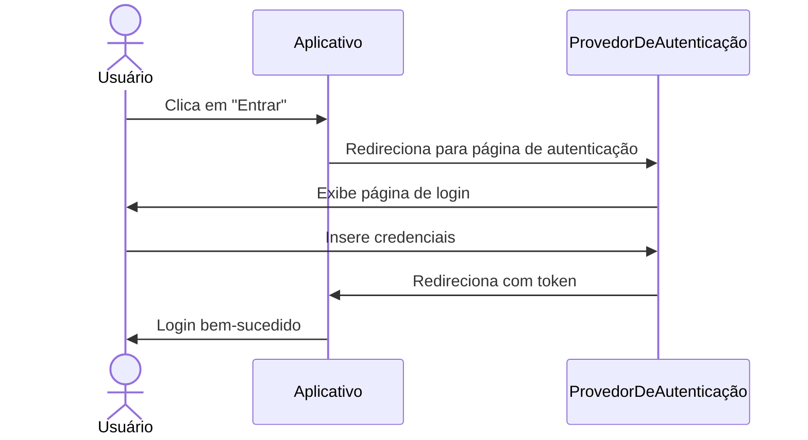
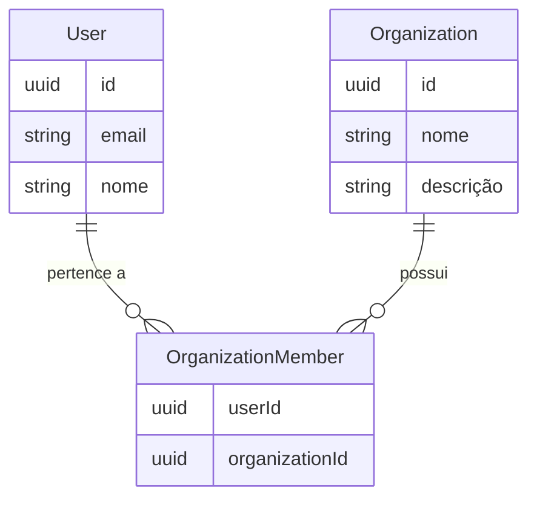
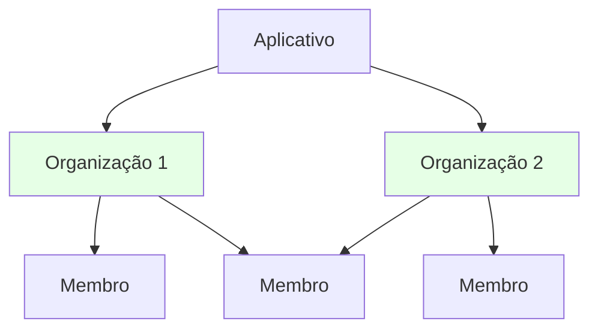
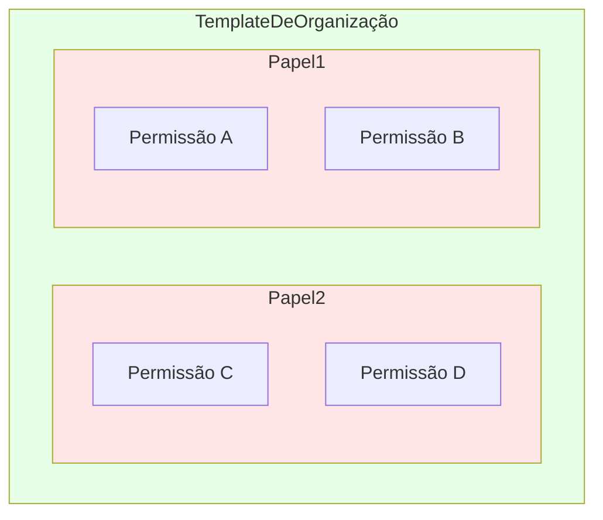
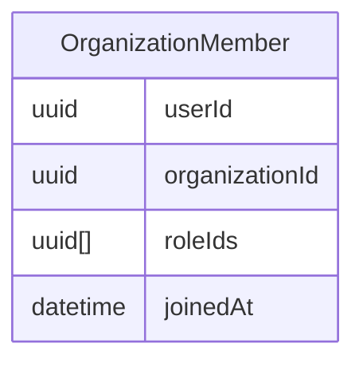
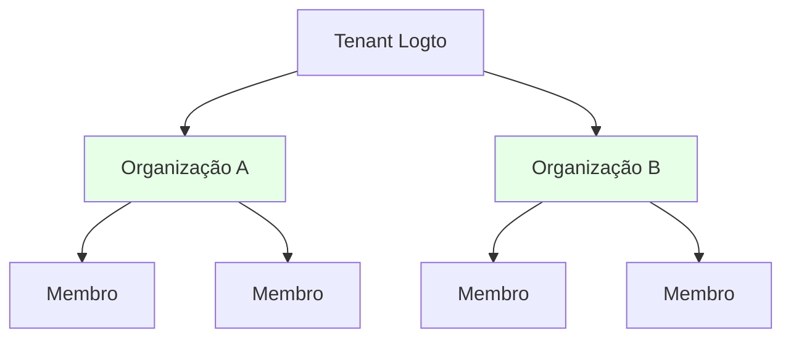
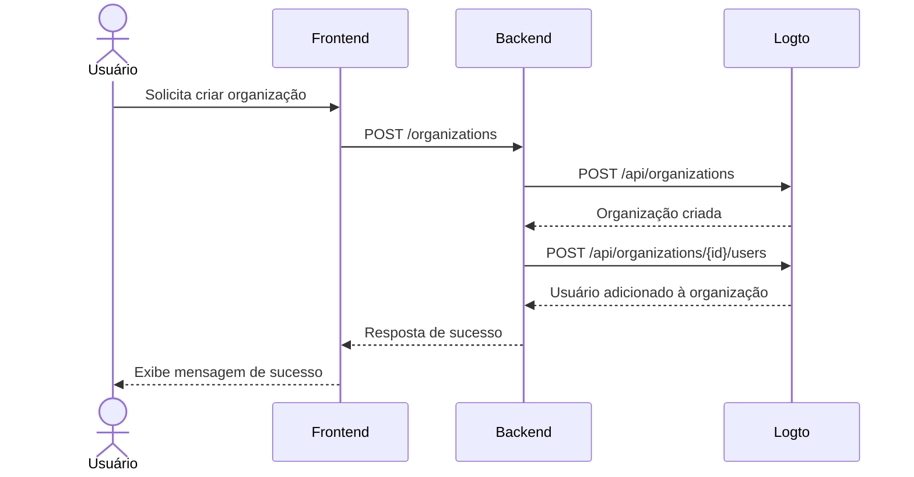

<head>
  <link rel="canonical" href="https://blog.logto.io/build-multi-tenant-saas-application" />
</head>

<style>
  {`
    .twoColumn {
      display: grid;
      grid-template-columns: 1fr 1fr;
      gap: 24px;
    }
    .twoColumn + .twoColumn {
      margin-top: 24px;
    }
  `}
</style>

# Guia completo para construir um aplicativo SaaS multi-inquilino: do design à implementação

Como aplicativos como Notion, Slack ou Figma são construídos? Esses aplicativos SaaS multi-inquilino parecem simples de usar, mas construir um você mesmo? É outra história.

Quando pensei pela primeira vez em construir algo tão complexo, minha cabeça explodiu:

- Usuários precisam de múltiplas opções de login (email, Google, GitHub)
- Cada usuário pode criar e pertencer a múltiplas organizações
- Diferentes níveis de permissão dentro de cada organização
- Organizações corporativas exigindo auto-entrada para domínios de email específicos
- Requisitos de MFA para operações sensíveis
- E mais...

"Chefe, vamos falar sobre design de produto em duas semanas. Estou atolado agora."

Mas quando realmente comecei a trabalhar nisso, **descobri que não é tão assustador quanto parece.**

Eu simplesmente **construí um sistema com todos esses recursos com surpreendentemente pouco esforço!**


<div className="twoColumn">
  
  
</div>

Vou mostrar exatamente como projetar e implementar um sistema assim do zero — e você ficará surpreso com a simplicidade em 2025 com as ferramentas modernas e a abordagem arquitetural certa.

> **O código-fonte completo está disponível neste [repositório do Github](https://github.com/logto-io/multi-tenant-saas-sample). Vamos lá!**

Vamos começar com um produto SaaS de documentação com IA chamado DocuMind.

DocuMind é um produto SaaS de documentação com IA projetado com um modelo multi-inquilino para suportar usuários individuais, pequenas empresas e grandes corporações.

A plataforma oferece recursos avançados de IA para gerenciamento de documentos, incluindo geração automática de resumos, extração de pontos-chave e recomendações inteligentes de conteúdo dentro das organizações.

## Quais recursos são necessários para autenticação e autorização SaaS? \{#what-features-are-required-for-saas-authentication-and-authorization}

Primeiro, vamos revisar os requisitos necessários. Quais recursos você precisa?

### Arquitetura multi-inquilino \{#multi-tenant-architecture}

Para habilitar uma arquitetura multi-inquilino, você precisará de uma camada de entidade chamada **organização (Organization)**. Imagine ter um único pool de usuários que pode acessar múltiplos espaços de trabalho. Cada organização representa um espaço de trabalho, e os usuários mantêm uma única identidade enquanto acessam diferentes espaços de trabalho (organizações) com base nos papéis atribuídos.


É um recurso amplamente utilizado em provedores de autenticação. Uma organização em um sistema de gerenciamento de identidade corresponde ao workspace, projeto ou inquilino do seu aplicativo SaaS.


### Membro (Membership) \{#membership}

Um membro é um conceito temporário usado para indicar o status de associação de uma identidade dentro de uma organização.

Por exemplo, Sarah se cadastra no seu aplicativo usando o email **sarah@gmail.com**. Ela pode pertencer a diferentes espaços de trabalho. Se Sarah faz parte do **Workspace A** mas não do **Workspace B**, ela é considerada membro do **Workspace A** mas não do **Workspace B**.

### Design de papéis e permissões \{#role-and-permission-design}

Em uma arquitetura multi-inquilino, os usuários precisam de **papéis (Roles)** com **permissões (Permissions)** específicas para acessar os recursos do inquilino.
Permissões são controles de acesso detalhados que definem ações específicas, como `read: order` ou `write: order`. Elas determinam quais ações podem ser realizadas em determinados recursos.

Papéis são um conjunto de permissões atribuídas a membros em um ambiente multi-inquilino.

Você precisará definir esses papéis e permissões, depois atribuir papéis aos usuários, e às vezes isso pode incluir processos automatizados. Por exemplo:

1. Usuários que entram em uma organização recebem automaticamente o papel de **membro**.
2. O primeiro usuário a criar um espaço de trabalho recebe automaticamente o papel de **admin**.

### Fluxo de cadastro e login \{#sign-up-and-login-flow}

Garanta um processo de registro e autenticação amigável e seguro, incluindo opções básicas de login e cadastro:

1. **Login com email e senha**: Método tradicional de login com email e senha.
2. **Login sem senha**: Use códigos de verificação por email para acesso fácil e seguro.
3. **Gerenciamento de conta**: Um centro de contas onde os usuários podem atualizar email, senha e outros detalhes.
4. **Login social**: Opções como Google e GitHub para login rápido.
5. **Autenticação multifatorial (MFA)**: Aumente a segurança permitindo login via aplicativos autenticadores como Duo.

### Criação de inquilino e convite \{#tenant-creation-and-invitation}

Em um aplicativo SaaS multi-inquilino, uma diferença fundamental no fluxo do usuário é a necessidade de suportar a criação de inquilinos e convites de membros. Esse processo requer planejamento e execução cuidadosos, pois desempenha um papel fundamental na ativação e crescimento do produto.

Aqui estão alguns fluxos típicos de uso que você precisa considerar:

| Tipo de usuário                                     | Ponto de entrada                                                 |
| --------------------------------------------------- | ---------------------------------------------------------------- |
| Nova conta                                          | Entrar pela página de login e cadastro para criar novo inquilino |
| Conta existente                                     | Criar outro inquilino dentro do produto                          |
| Conta existente recebeu convite para novo inquilino | Entrar pela página de login e cadastro                           |
| Conta existente recebeu convite para novo inquilino | Entrar pelo email de convite                                     |
| Nova conta recebeu convite para novo inquilino      | Entrar pela página de login e cadastro                           |
| Nova conta recebeu convite para novo inquilino      | Entrar pelo email de convite                                     |

Aqui estão alguns cenários comuns encontrados em quase todos os aplicativos SaaS. Use-os como referência para inspirar seu time de produto e design, e sinta-se à vontade para criar seus próprios fluxos conforme necessário.

<div className="twoColumn">
  
  
</div>

<div className="twoColumn">
  
  
</div>

<div className="twoColumn">
  
  
</div>

## Arquitetura técnica e design do sistema \{#technical-architecture-and-system-design}

Depois de entender todos os requisitos do produto, vamos para a implementação.

### Definir estratégia de autenticação \{#define-authentication-strategy}

Autenticação parece assustador. Usuários precisam de:

- Cadastro/login com email e senha
- Login com um clique via Google/Github
- Redefinição de senha quando esquecem
- Login em toda a equipe para clientes corporativos
- ...

Implementar apenas esses recursos básicos poderia levar semanas de desenvolvimento.

Mas agora, **não precisamos construir NADA disso nós mesmos!**

Provedores de autenticação modernos (vou escolher o [Logto](https://logto.io/) desta vez) já empacotaram todos esses recursos para nós. O fluxo de autenticação é direto:



**De semanas de desenvolvimento para 15 minutos de configuração**, o Logto cuida de todos os fluxos complexos para nós! Vamos abordar os passos de integração na seção de implementação mais adiante. Agora podemos focar em construir os recursos principais do DocuMind!

### Estabelecer arquitetura multi-inquilino \{#establish-multi-tenant-architecture}

O sistema de organizações permite que usuários criem e entrem em múltiplas organizações. Vamos entender os relacionamentos principais:



Neste sistema, cada usuário pode pertencer a múltiplas organizações, e cada organização pode ter múltiplos membros.



### Habilitar controle de acesso no app multi-inquilino \{#enable-access-control-in-multi-tenant-app}

O Controle de Acesso Baseado em Papel (RBAC) é importante para garantir segurança e escalabilidade em aplicativos SaaS multi-inquilino.

Em um app multi-inquilino, o design de permissões e papéis geralmente é consistente, pois deriva do design do produto. Por exemplo, em múltiplos workspaces, normalmente há um papel de admin e um papel de membro. O Logto, como provedor de autenticação, possui o seguinte design de controle de acesso baseado em papel no nível da organização:

1. **Definições unificadas de permissões**: Permissões são definidas no nível do sistema e aplicadas de forma consistente em todas as organizações, garantindo gerenciamento de permissões sustentável e consistente
2. **Templates de organização**: Combinações pré-definidas de papéis e permissões através de templates de organização, simplificando a inicialização da organização

A relação de permissões fica assim:



Como cada usuário precisa de seu(s) próprio(s) papel(is) dentro de cada organização, a relação entre papéis e organizações deve refletir os papéis atribuídos a cada usuário:



Projetamos o sistema de organizações e o sistema de controle de acesso, agora podemos começar a construir nosso produto!

## Stack de tecnologia \{#tech-stack}

Escolhi um stack amigável para iniciantes e portátil:

1. **Frontend**: React (facilmente transferível para Vue/Angular/Svelte)
2. **Backend**: Express (API simples e intuitiva)

Por que separar frontend e backend? Porque tem uma arquitetura clara, fácil de aprender e simples de trocar de stack. E para provedores de autenticação, uso o Logto como exemplo.

E para os próximos guias, **os padrões aqui funcionam com: qualquer frontend, qualquer backend e qualquer sistema de autenticação.**

## Adicione fluxo básico de autenticação ao seu app \{#add-basic-authentication-flow-to-your-app}

Este é o passo mais fácil. Só precisamos integrar o Logto ao nosso projeto. Depois podemos configurar métodos de login/cadastro de usuários no Logto Console conforme nossas necessidades.

### Instale Logto no seu app \{#install-logto-to-your-app}

Primeiro, acesse o [Logto Cloud](https://cloud.logto.io/). Você pode criar uma conta gratuita se ainda não tiver uma. Crie um Tenant de Desenvolvimento para testes.

No Tenant Console, clique no botão "Application" à esquerda. Depois selecione React para começar a construir nosso aplicativo.

Siga o guia na página. Você pode completar a integração do Logto em cerca de 5 minutos!

Aqui está meu código de integração:

```jsx
const config: LogtoConfig = {
  endpoint: "<YOUR_LOGTO_ENDPOINT>",
  appId: "<YOUR_LOGTO_APP_ID>",
};

function App() {
  return (
    <LogtoProvider config={config}>
      <div className="min-h-screen bg-gradient-to-b from-gray-50 to-gray-100">
        <Routes>
          {/* Este callback lida com o redirecionamento de login do usuário vindo do Logto */}
          <Route path="/callback" element={<Callback />} />
          <Route path="/*" element={<AppContent />} />
        </Routes>
      </div>
    </LogtoProvider>
  );
}

function AppContent() {
  const { isAuthenticated } = useLogto();

  if (!isAuthenticated) {
    // Exibe página inicial para usuários não autenticados
    return <Landing />;
  }

  // Exibe app principal para usuários autenticados
  return (
    <Routes>
      {/* Dashboard mostra todas as organizações disponíveis */}
      <Route path="/" element={<Dashboard />} />

      {/* Página da organização após clicar em uma organização no Dashboard */}
      <Route path="/:orgId" element={<Organization />} />
    </Routes>
  );
}
```


Aqui vai uma dica útil: Nossa página de login tem botões de Entrar e Registrar. O botão Registrar leva direto para a página de cadastro do Logto. Isso funciona através do recurso [primeira tela](/end-user-flows/authentication-parameters/first-screen) do Logto. Ele determina qual etapa do fluxo de autenticação o usuário vê primeiro.

Você pode definir a página de cadastro como padrão quando seu produto espera muitos novos usuários.

```jsx
function LandingPage() {
  const { signIn } = useLogto();

  return (
    <div className="landing-container">
      <div className="auth-buttons">
        <button
          className="sign-in-button"
          onClick={() => {
            signIn({
              redirectUri: '<YOUR_APP_CALLBACK_URL>',
            });
          }}
        >
          Entrar
        </button>

        <button
          className="register-button"
          onClick={() => {
            signIn({
              redirectUri: '<YOUR_APP_CALLBACK_URL>',
              firstScreen: 'register',
            });
          }}
        >
          Registrar
        </button>
      </div>
    </div>
  );
}
```

Após clicar em login, você irá para a página de login do Logto. Após login (ou cadastro) bem-sucedido, parabéns! Seu app tem seu primeiro usuário (você)!

E chame a função `signOut` do hook `useLogto` para sair do usuário quando quiser.

```jsx
function SignOutButton() {
  const { signOut } = useLogto();

  return <button onClick={() => signOut('<YOUR_POST_LOGOUT_REDIRECT_URL>')}>Sair</button>;
}
```

### Personalize métodos de login e cadastro \{#customize-sign-in-and-sign-up-methods}

No Logto Console, clique em "Sign-in Experience" no menu à esquerda. Depois clique na aba "Sign-up and sign-in".
Nesta página, siga as instruções para configurar os métodos de login/cadastro do Logto.


E o fluxo de login ficará assim:


### Habilite autenticação multifatorial \{#enable-multi-factor-authentication}

Com o Logto, habilitar MFA é simples. Basta clicar no botão "Multi-factor auth" no Logto Console. Depois ative na página de autenticação multifatorial.


E o fluxo de MFA ficará assim:

<div className="twoColumn">
  
  
</div>

Tudo é tão simples! Configuramos um sistema complexo de autenticação de usuários em apenas alguns minutos!

## Adicionando experiência multi-inquilino de organização \{#adding-multi-tenant-organization-experience}

Agora temos nosso primeiro usuário! Porém, esse usuário ainda não pertence a nenhuma organização, e não criamos nenhuma organização.

O Logto oferece suporte nativo para multi-tenancy. Você pode criar qualquer número de organizações no Logto. Cada organização pode ter múltiplos membros.



Cada usuário pode obter suas informações de organização do Logto. Isso habilita o suporte a multi-tenancy.

### Obter informações de organização do usuário \{#get-a-user-s-organization-information}

Para obter as informações de organização de um usuário no Logto, siga estes dois passos:

Declare o acesso às informações de organização no Logto Config. Isso é feito configurando os `scopes` e `resources` apropriados.

```jsx
import { UserScope, ReservedResource } from "@logto/react";
const config: LogtoConfig = {
  endpoint: "<YOUR_LOGTO_ENDPOINT>",
  appId: "<YOUR_LOGTO_APP_ID>",
  scopes: [UserScope.Organizations], // Valor: "urn:logto:scope:organizations"
  resources: [ReservedResource.Organization], // Valor: "urn:logto:resource:organizations"
};

```

Use o método `fetchUserInfo` do Logto para obter informações do usuário, incluindo dados de organização.

```jsx
function Dashboard() {
  // Obter informações do usuário
  const { fetchUserInfo } = useLogto();
  const [organizations, setOrganizations] = useState<OrganizationData[]>([]);
  const [loading, setLoading] = useState(false);

  useEffect(() => {
    const loadOrganizations = async () => {
      try {
        setLoading(true);
        // Obter informações do usuário
        const userInfo = await fetchUserInfo();
        // Obter informações de organização do usuário
        const organizationData = userInfo?.organization_data || [];
        setOrganizations(organizationData);
      } catch (error) {
        console.error('Falha ao buscar organizações:', error);
      } finally {
        setLoading(false);
      }
    };

    loadOrganizations();
  }, [fetchUserInfo]);

  if (loading) {
    return <div>Carregando...</div>;
  }

  if (organizations.length === 0) {
    return <div>Você ainda não é membro de nenhuma organização</div>;
  }

  return <div>Organizações: {organizations.map(org => org.name).join(', ')}</div>;
}

```

Após completar esses passos, você precisa sair e entrar novamente. Isso é necessário porque modificamos o escopo e o recurso solicitados.

Neste momento, você ainda não criou nenhuma organização. O usuário também não entrou em nenhuma organização. O dashboard mostrará "Você ainda não tem nenhuma organização".


Em seguida, vamos criar uma organização para nossos usuários e adicioná-los a ela.

Graças ao Logto, não precisamos construir relacionamentos complexos de organização. Só precisamos criar uma organização no Logto e adicionar usuários a ela. O Logto cuida de toda a complexidade para nós. Existem duas formas de criar Organizações:

1. Criar organizações manualmente pelo Logto Console
2. Usar a Management API do Logto para criar organizações, especialmente ao projetar um fluxo SaaS que permite que usuários criem suas próprias organizações (workspaces).

### Criar organização no Logto Console \{#create-organization-in-logto-console}

Clique no menu "Organizations" no lado esquerdo do Logto Console. Crie uma organização.

Agora você tem sua primeira organização.


Em seguida, vamos adicionar o usuário a essa organização.

Vá para a página de detalhes da organização. Troque para a aba Members. Clique no botão "+ Add member". Selecione seu usuário logado na lista à esquerda. Clique no botão "Add members" no canto inferior direito. Agora você adicionou o usuário com sucesso a essa organização.


Atualize a página do seu APP. Você verá que o usuário agora pertence a uma organização!


## Implementar experiência de criação de organização self-service \{#implement-self-serve-organization-creation-experience}

Criar uma organização no console não é suficiente. Seu app SaaS precisa de um fluxo que permita aos usuários finais criar e gerenciar facilmente seus próprios workspaces. Para implementar essa funcionalidade, use a Management API do Logto.

Para orientação, confira a documentação [Interaja com a Management API](/integrate-logto/interact-with-management-api) para configurar a comunicação da API com o Logto.

### Entenda o fluxo de interação de autenticação de organização \{#understand-organization-auth-interaction-flow}

Vamos usar o fluxo de criação de organização como exemplo. Veja como funciona o processo de criação de organização:



Esse fluxo tem dois requisitos principais de autenticação:

1. **Proteger a API do serviço backend**:
   - O acesso do frontend à API do nosso serviço backend requer autenticação
   - Endpoints da API são protegidos validando o Access Token do Logto do usuário
   - Garante que apenas usuários autenticados possam acessar nossos serviços
2. **Acessar a Management API do Logto**:
   - O serviço backend precisa chamar a Management API do Logto com segurança
   - Siga o guia [Interaja com a Management API](/integrate-logto/interact-with-management-api) para configuração
   - Use autenticação Máquina para Máquina para obter credenciais de acesso

### Proteja sua API backend \{#protect-your-backend-api}

Primeiro, vamos criar um endpoint de API no nosso serviço backend para criar organizações.

```jsx
app.post('/organizations', async (req, res) => {
  // Implementação usando a Management API do Logto
  // ...
});
```

Nossa API do serviço backend só permite usuários autenticados. Precisamos usar o Logto para proteger nossa API. Também precisamos saber as informações do usuário atual (como user ID).

No conceito do Logto (e OAuth 2.0), nosso serviço backend atua como um resource server. Usuários acessam o resource server do DocuMind com um Access token vindo do frontend. O resource server verifica esse token. Se válido, retorna os recursos solicitados.

Vamos criar um API Resource para representar nosso serviço backend.

Vá ao Logto Console.

1. Clique no botão "API resources" à direita.
2. Clique em "Create API resource". Selecione Express no popup.
3. Preencha "DocuMind API" como nome da API. Use "[https://api.documind.com](https://api.documind.com/)" como identificador da API.
4. Clique em criar.

Não se preocupe com essa URL de identificador da API. É apenas um identificador único para sua API no Logto. Não está relacionado à URL real do seu serviço backend.

Você verá um tutorial para usar o recurso de API. Você pode seguir esse tutorial ou nossos passos abaixo.

Vamos criar um middleware requireAuth para proteger nosso endpoint POST /organizations.

```jsx
const { createRemoteJWKSet, jwtVerify } = require('jose');

const getTokenFromHeader = (headers) => {
  const { authorization } = headers;
  const bearerTokenIdentifier = 'Bearer';

  if (!authorization) {
    throw new Error('Authorization header missing');
  }

  if (!authorization.startsWith(bearerTokenIdentifier)) {
    throw new Error('Authorization token type not supported');
  }

  return authorization.slice(bearerTokenIdentifier.length + 1);
};

const requireAuth = (resource) => {
  if (!resource) {
    throw new Error('Resource parameter is required for authentication');
  }

  return async (req, res, next) => {
    try {
      // Extrai o token
      const token = getTokenFromHeader(req.headers);

      const { payload } = await jwtVerify(
        token,
        createRemoteJWKSet(new URL(process.env.LOGTO_JWKS_URL)),
        {
          issuer: process.env.LOGTO_ISSUER,
          audience: resource,
        }
      );

      // Adiciona info do usuário à requisição
      req.user = {
        id: payload.sub,
      };

      next();
    } catch (error) {
      console.error('Erro de autenticação:', error);
      res.status(401).json({ error: 'Não autorizado' });
    }
  };
};

module.exports = {
  requireAuth,
};
```

Para usar esse middleware, precisamos dessas variáveis de ambiente:

- LOGTO_JWKS_URL
- LOGTO_ISSUER

Obtenha essas variáveis no endpoint OpenID Configuration do seu tenant Logto. Acesse `https://<your-tenant-id>.logto.app/oidc/.well-known/openid-configuration`. Você encontrará as informações necessárias no JSON retornado:

```json
{
  "jwks_uri": "<https://tenant-id.logto.app/oidc/jwks>",
  "issuer": "<https://tenant-id.logto.app/oidc>"
}
```

Agora use o middleware requireAuth no nosso endpoint POST /organizations.

```jsx
app.post('/organizations', requireAuth('<https://api.documind.com>'), async (req, res) => {
  // Lógica de criação de organização
  // ...
});
```

Isso protege nosso endpoint POST /organizations. Apenas usuários com access tokens válidos do Logto podem acessá-lo.

Agora podemos obter o token do Logto no frontend. Usuários podem criar organizações pelo nosso serviço backend com esse token. O middleware também nos dá o user ID. Isso ajuda ao adicionar usuários às organizações.

No código do frontend, declare esse API resource no config do Logto. Adicione seu identificador ao array de resources.

```jsx
const config: LogtoConfig = {
  endpoint: "<YOUR_LOGTO_ENDPOINT>",
  appId: "<YOUR_LOGTO_APP_ID>",
  scopes: [UserScope.Organizations],
  resources: [ReservedResource.Organization, "<https://api.documind.com>"], // Identificador do novo API resource
};

```

Como antes, os usuários precisam fazer login novamente após atualizarmos o config do Logto.

No Dashboard, obtenha o Access Token do Logto ao criar uma organização. Use esse token para acessar a API do nosso serviço backend.

```jsx
// Obter access token para "DocuMind API"
const token = await getAccessToken('<https://api.documind.com>');

// Acessar a API do nosso serviço backend com o token
const response = await fetch('<http://localhost:3000/organizations>', {
  method: 'POST',
  headers: {
    'Content-Type': 'application/json',
    Authorization: `Bearer ${token}`,
  },
  body: JSON.stringify({
    name: 'Organization A',
    description: 'Organization A description',
  }),
});
```

Agora podemos acessar corretamente a API do serviço backend do DocuMind.

### Chamando a Management API do Logto \{#calling-logto-management-api}

Vamos implementar a criação de organização usando a Management API do Logto.

Assim como as requisições do frontend para o serviço backend, as requisições do backend para o Logto precisam de Access tokens.

No Logto, usamos autenticação Máquina para Máquina para access tokens. Veja [Interaja com a Management API](/integrate-logto/interact-with-management-api).

Vá para a página de aplicações no Logto Console. Crie uma aplicação Máquina para Máquina. Atribua o papel "Logto Management API access". Copie o endpoint de Token, App ID e App Secret. Usaremos esses dados para obter access tokens.


Agora podemos obter access tokens da Management API do Logto por essa aplicação M2M.

```jsx
async function fetchLogtoManagementApiAccessToken() {
  const response = await fetch(process.env.LOGTO_MANAGEMENT_API_TOKEN_ENDPOINT, {
    method: 'POST',
    headers: {
      'Content-Type': 'application/x-www-form-urlencoded',
      Authorization: `Basic ${Buffer.from(
        `${process.env.LOGTO_MANAGEMENT_API_APPLICATION_ID}:${process.env.LOGTO_MANAGEMENT_API_APPLICATION_SECRET}`
      ).toString('base64')}`,
    },
    body: new URLSearchParams({
      grant_type: 'client_credentials',
      resource: process.env.LOGTO_MANAGEMENT_API_RESOURCE,
      scope: 'all',
    }).toString(),
  });
  const data = await response.json();
  return data.access_token;
}
```

Use esse access token para chamar a Management API do Logto.

Usaremos essas APIs de gerenciamento:

- `POST /api/organizations`: Criar organização (veja: [Referência da API Create organization](https://openapi.logto.io/operation/operation-createorganization))
- `POST /api/organizations/{id}/users`: Adicionar usuários à organização (veja: [Referência da API Add users to organization](https://openapi.logto.io/operation/operation-addusers))

```jsx
app.post('/organizations', requireAuth('<https://api.documind.com>'), async (req, res) => {
  const accessToken = await fetchLogtoManagementApiAccessToken();
  // Cria organização no Logto e adiciona usuário a ela
  const response = await fetch(`${process.env.LOGTO_ENDPOINT}/api/organizations`, {
    method: 'POST',
    headers: {
      'Content-Type': 'application/json',
      Authorization: `Bearer ${accessToken}`,
    },
    body: JSON.stringify({
      name: req.body.name,
      description: req.body.description,
    }),
  });

  const createdOrganization = await response.json();

  await fetch(`${process.env.LOGTO_ENDPOINT}/api/organizations/${createdOrganization.id}/users`, {
    method: 'POST',
    headers: {
      'Content-Type': 'application/json',
      Authorization: `Bearer ${accessToken}`,
    },
    body: JSON.stringify({
      userIds: [req.user.id],
    }),
  });

  res.json({ data: createdOrganization });
});
```

Agora implementamos a criação de organização via Management API do Logto. Também podemos adicionar usuários às organizações.

Vamos testar esse recurso no Dashboard.


e clicar em “Create Organization”


Criação bem-sucedida!

O próximo passo seria convidar usuários para uma organização. Não implementaremos esse recurso neste tutorial ainda. Você já sabe como usar a Management API. Você pode consultar este [**Tenant creation and invitation**](#tenant-creation-and-invitation) como referência de design de produto e implementar facilmente esse recurso seguindo este post do blog: [Como implementamos colaboração de usuários em um app multi-inquilino](https://blog.logto.io/implement-user-collaboration-in-your-app).

## Implemente controle de acesso no seu app multi-inquilino \{#implement-access-control-to-your-multi-tenant-app}

Agora vamos para o controle de acesso da organização.

Queremos alcançar:

- Usuários só podem acessar recursos pertencentes às suas próprias organizações: Isso pode ser feito através do `token de organização (Organization token)` do Logto
- Usuários têm papéis específicos dentro das organizações (com diferentes permissões) para realizar ações autorizadas: Isso pode ser implementado através do recurso de template de organização do Logto

Vamos ver como implementar esses recursos.

### Usando o token de organização do Logto \{#using-logto-organization-token}

Semelhante ao access token do Logto mencionado anteriormente, o Logto emite um access token correspondente a um recurso específico, e os usuários usam esse token para acessar recursos protegidos no serviço backend. Da mesma forma, o Logto emite um token de organização correspondente a uma organização específica, e os usuários usam esse token para acessar recursos protegidos da organização no serviço backend.

No aplicativo frontend, podemos usar o método `getOrganizationToken` do Logto para obter um token para acessar uma organização específica.

```jsx
const { getOrganizationToken } = useLogto();
const organizationToken = await getOrganizationToken(organizationId);
```

Aqui, `organizationId` é o id da organização à qual o usuário pertence.

Antes de usar `getOrganization` ou qualquer recurso de organização, precisamos garantir que o escopo `urn:logto:scope:organizations` e o recurso `urn:logto:resource:organization` estejam incluídos no config do Logto. Como já declaramos isso antes, não vamos repetir.

Na nossa página de organização, usamos o token de organização para buscar documentos dentro da organização.

```jsx
function OrganizationPage() {
  const { organizationId } = useParams();
  const navigate = useNavigate();
  const { signOut, getOrganizationToken } = useLogto();
  const [error, setError] = useState<Error | null>(null);
  const [documents, setDocuments] = useState([]);

  const fetchDocuments = useCallback(async () => {
    if (!organizationId) return;

    try {
      const organizationToken = await getOrganizationToken(organizationId);
      const response = await fetch(`http://localhost:3000/documents`, {
          headers: {
          'Content-Type': 'application/json',
          Authorization: `Bearer ${organizationToken}`,
        },
      });
      const documents = await response.json();
      setDocuments(documents);
    } catch (error: unknown) {
      if (error instanceof Error) {
        setError(error);
      } else {
        setError(new Error(String(error)));
      }
    }
  },[getOrganizationToken, organizationId]);

  useEffect(() => {
    void fetchDocuments();
  }, [fetchDocuments]);

  if (error) {
    return <div>Erro: {error.message}</div>;
  }

  return <div>
    <h1>Documentos da Organização</h1>
    <ul>
      {documents.map((document) => (
        <li key={document.id}>{document.name}</li>
      ))}
    </ul>
  </div>
}

```

Há dois pontos importantes a serem observados nesta implementação:

1. Se o `organizationId` passado para `getOrganizationToken` não for um id de organização que pertence ao usuário atual, esse método não conseguirá obter um token, garantindo assim que os usuários só possam acessar suas próprias organizações.
2. Ao solicitar recursos da organização, usamos o token de organização em vez do access token porque, para recursos pertencentes a uma organização, queremos usar o controle de permissões da organização e não o controle de permissões do usuário (você entenderá melhor isso ao implementarmos a API `GET /documents` mais adiante).

Em seguida, criamos uma API `GET /documents` no nosso serviço backend. Assim como usamos o API resource para proteger a API `POST /organizations`, usamos indicadores de recurso específicos da organização para proteger a API `GET /documents`.

Primeiro, vamos criar um middleware `requireOrganizationAccess` para proteger recursos da Organização.

```jsx
const getTokenFromHeader = (headers) => {
  const { authorization } = headers;
  const bearerTokenIdentifier = 'Bearer';

  if (!authorization) {
    throw new Error('Authorization header missing');
  }

  if (!authorization.startsWith(bearerTokenIdentifier)) {
    throw new Error('Authorization token type not supported');
  }

  return authorization.slice(bearerTokenIdentifier.length + 1);
};

const extractOrganizationId = (aud) => {
  if (!aud || typeof aud !== 'string' || !aud.startsWith('urn:logto:organization:')) {
    throw new Error('Invalid organization token');
  }
  return aud.replace('urn:logto:organization:', '');
};

const decodeJwtPayload = (token) => {
  try {
    const [, payloadBase64] = token.split('.');
    if (!payloadBase64) {
      throw new Error('Invalid token format');
    }
    const payloadJson = Buffer.from(payloadBase64, 'base64').toString('utf-8');
    return JSON.parse(payloadJson);
  } catch (error) {
    throw new Error('Failed to decode token payload');
  }
};

const requireOrganizationAccess = () => {
  return async (req, res, next) => {
    try {
      // Extrai o token
      const token = getTokenFromHeader(req.headers);

      // Obtém dinamicamente o audience do token
      const { aud } = decodeJwtPayload(token);
      if (!aud) {
        throw new Error('Missing audience in token');
      }

      // Verifica o token com o audience
      const { payload } = await jwtVerify(
        token,
        createRemoteJWKSet(new URL(process.env.LOGTO_JWKS_URL)),
        {
          issuer: process.env.LOGTO_ISSUER,
          audience: aud,
        }
      );

      // Extrai o organization ID do claim audience
      const organizationId = extractOrganizationId(payload.aud);

      // Adiciona info da organização à requisição
      req.user = {
        id: payload.sub,
        organizationId,
      };

      next();
    } catch (error) {
      console.error('Erro de autenticação da organização:', error);
      res.status(401).json({ error: 'Não autorizado - Acesso à organização inválido' });
    }
  };
};
```

Depois usamos o middleware `requireOrganizationAccess` para proteger a API `GET /documents`.

```jsx
app.get('/documents', requireOrganizationAccess(), async (req, res) => {
  // Você pode obter o id do usuário atual e o organizationId via req.user
  console.log('userId', req.user.id);
  console.log('organizationId', req.user.organizationId);

  // Buscar documentos no banco de dados pelo organizationId
  // ....
  const documents = await getDocumentsByOrganizationId(req.user.organizationId);

  res.json(documents);
});
```

Assim, implementamos o uso de tokens de organização para acessar recursos da organização. No serviço backend, você pode buscar os recursos correspondentes no banco de dados com base no id da organização.

Alguns softwares exigem isolamento de dados entre organizações. Para discussão e implementação avançada, consulte o post do blog: [Implementação de multi-tenancy com PostgreSQL: Aprenda com um exemplo real simples](https://blog.logto.io/implement-multi-tenancy).

### Implemente controle de acesso baseado em papel no nível da organização \{#implement-organization-level-role-based-access-control-design}

Implementamos o uso de tokens de organização para acessar recursos da organização. Agora, vamos implementar o controle de permissões de usuários dentro das organizações usando RBAC.

Vamos supor que o DocuMind tenha dois papéis: Admin e Colaborador.

Admins podem criar e acessar documentos, enquanto Colaboradores só podem acessar documentos.

Portanto, nossa Organização precisa ter esses dois papéis: Admin e Colaborador.

Admin tem as permissões `read:documents` e `create:documents`, enquanto Colaborador tem apenas a permissão `read:documents`.

- Admin
  - `read:documents`
  - `create:documents`
- Colaborador
  - `read:documents`

É aqui que entra o recurso de template de organização do Logto.

Um template de organização é um modelo do sistema de controle de acesso para cada organização: define os papéis e permissões que se aplicam a todas as organizações.

> Por que template de organização?
>
> Porque escalabilidade é um dos requisitos mais importantes para produtos SaaS. Ou seja, o que funciona para um cliente deve funcionar para todos os clientes.

Vamos ao Logto Console > Organization Templates > Organization permissions e criamos duas permissões: `read:documents` e `create:documents`.


Depois vá para a aba de papéis da organização para criar dois papéis de usuário: Admin e Colaborador, e atribua as permissões correspondentes a esses papéis.


Assim, criamos um modelo de permissões RBAC para cada organização.

Em seguida, vá para a página de detalhes da Organização para atribuir papéis apropriados aos membros.


Agora nossos usuários da organização têm papéis!
Você pode realizar esses passos via Management API do Logto:

```jsx
// Atribuir papel 'Admin' ao criador da organização
app.post('/organizations', requireAuth('https://api.documind.com'), async (req, res) => {
  const accessToken = await fetchLogtoManagementApiAccessToken();
  // Cria organização no Logto
  // códigos existentes...

  // Adiciona usuário à organização no Logto
  await fetch(`${process.env.LOGTO_ENDPOINT}/api/organizations/${createdOrganization.id}/users`, {
    method: 'POST',
    headers: {
      'Content-Type': 'application/json',
      Authorization: `Bearer ${accessToken}`,
    },
    body: JSON.stringify({
      userIds: [req.user.id],
    }),
  });

  // Atribui papel `Admin` ao primeiro usuário.
  const rolesResponse = await fetch(`${process.env.LOGTO_ENDPOINT}/api/organization-roles`, {
    method: 'GET',
    headers: {
      'Content-Type': 'application/json',
      Authorization: `Bearer ${accessToken}`,
    },
  });

  const roles = await rolesResponse.json();

  // Encontra o papel `Admin`
  const adminRole = roles.find((role) => role.name === 'Admin');

  // Atribui papel `Admin` ao primeiro usuário.
  await fetch(
    `${process.env.LOGTO_ENDPOINT}/api/organizations/${createdOrganization.id}/users/${req.user.id}/roles`,
    {
      method: 'POST',
      headers: {
        'Content-Type': 'application/json',
        Authorization: `Bearer ${accessToken}`,
      },
      body: JSON.stringify({
        organizationRoleIds: [adminRole.id],
      }),
    }
  );

  // códigos existentes...
});
```

Agora podemos implementar o controle de permissões de usuários verificando suas permissões.

No nosso código, precisamos fazer com que o token de organização do usuário carregue informações de permissões, e então verificar essas permissões no backend.

No config do Logto do frontend, precisamos declarar as permissões que os usuários precisam solicitar dentro da organização. Vamos adicionar as permissões `read:documents` e `create:documents` aos `scopes`.

```jsx
const config: LogtoConfig = {
  endpoint: "<YOUR_LOGTO_ENDPOINT>",
  appId: "<YOUR_LOGTO_APP_ID>",
  scopes: [UserScope.Organizations, "read:documents", "create:documents"],
  resources: [ReservedResource.Organization, "<https://api.documind.com>"], // Identificador do novo API resource
};

```

Como de costume, faça login novamente com seu usuário para que essas configurações tenham efeito.

Depois, no middleware `requireOrganizationAccess` do backend, adicionamos a verificação das permissões do usuário.

```jsx
const hasRequiredScopes = (tokenScopes, requiredScopes) => {
  if (!requiredScopes || requiredScopes.length === 0) {
    return true;
  }
  const scopeSet = new Set(tokenScopes);
  return requiredScopes.every((scope) => scopeSet.has(scope));
};

const requireOrganizationAccess = ({ requiredScopes = [] } = {}) => {
  return async (req, res, next) => {
    try {
      //...

      // Verifica o token com o audience
      const { payload } = await jwtVerify(
        token,
        createRemoteJWKSet(new URL(process.env.LOGTO_JWKS_URL)),
        {
          issuer: process.env.LOGTO_ISSUER,
          audience: aud,
        }
      );

      //...

      // Obtém scopes do token
      const scopes = payload.scope?.split(' ') || [];

      // Verifica permissões necessárias
      if (!hasRequiredScopes(scopes, requiredScopes)) {
        throw new Error('Permissões insuficientes');
      }

      //...

      next();
    } catch (error) {
      //...
    }
  };
};
```

Depois crie uma API POST /documents, e use o middleware `requireOrganizationAccess` com configuração requiredScopes para proteger essa API e a anterior `GET /documents`.

```jsx
// API para criar documentos
app.post(
  '/documents',
  requireOrganizationAccess({ requiredScopes: ['create:documents'] }),
  async (req, res) => {
    //...
  }
);

// API para obter documentos
app.get(
  '/documents',
  requireOrganizationAccess({ requiredScopes: ['read:documents'] }),
  async (req, res) => {
    //...
  }
);
```

Assim, implementamos o controle de permissões de usuários verificando suas permissões.

No frontend, você pode obter informações de permissões do usuário decodificando o token de organização ou chamando o método `getOrganizationTokenClaims` do Logto.

```jsx
const [scopes, setScopes] = useState([]);
const { getOrganizationTokenClaims } = useLogto();

const loadScopes = async () => {
  const claims = await getOrganizationTokenClaims(organizationId);
  setScopes(claims.scope.split(' '));
};

// ...
```

Controle elementos da página com base nas permissões do usuário verificando os scopes nos claims.

## Adicione mais recursos multi-inquilino ao app \{#add-more-multi-tenant-app-features}

Até agora, implementamos os recursos básicos de usuário e organização em um sistema SaaS multi-inquilino! No entanto, ainda há alguns recursos que não abordamos, como personalizar a marca da página de login para cada Organização, adicionar automaticamente usuários com emails de domínio específico a certas organizações e integrar funcionalidades de SSO corporativo.

Todos esses são recursos prontos para uso, e você pode encontrar mais informações sobre eles na documentação do Logto:

- [Integração com SSO corporativo](/end-user-flows/enterprise-sso)
- [Provisionamento Just-in-Time (JIT)](/organizations/just-in-time-provisioning)
- [Personalização de marca no nível da organização](/customization/match-your-brand#organization-specific-branding)
- [MFA no nível da organização](/organizations/organization-management#require-mfa-for-organization-members)
- [Gerenciamento no nível da organização](/end-user-flows/organization-experience/organization-management)

## Resumo \{#summary}

Lembra como tudo parecia assustador no começo? Usuários, organizações, permissões, recursos corporativos... parecia uma montanha interminável para escalar.

Mas veja o que conquistamos:

- Um sistema completo de autenticação com múltiplas opções de login e suporte a MFA
- Um sistema flexível de organizações que suporta múltiplas associações
- Controle de acesso baseado em papel dentro das organizações

E o melhor de tudo? Não precisamos reinventar a roda. Ao aproveitar ferramentas modernas como o Logto, transformamos o que poderia ser meses de desenvolvimento em questão de minutos.

O código-fonte completo deste tutorial está disponível em: [Multi-tenant SaaS Sample](https://github.com/logto-io/multi-tenant-saas-sample).

Esse é o poder do desenvolvimento moderno em 2025 — podemos focar em construir recursos únicos de produto em vez de lutar com infraestrutura. Agora é sua vez de construir algo incrível!

Explore todos os recursos do Logto, do Logto Cloud ao Logto OSS, no [site do Logto](https://logto.io/) ou cadastre-se no [Logto cloud](https://cloud.logto.io/?sign_up) hoje mesmo.
