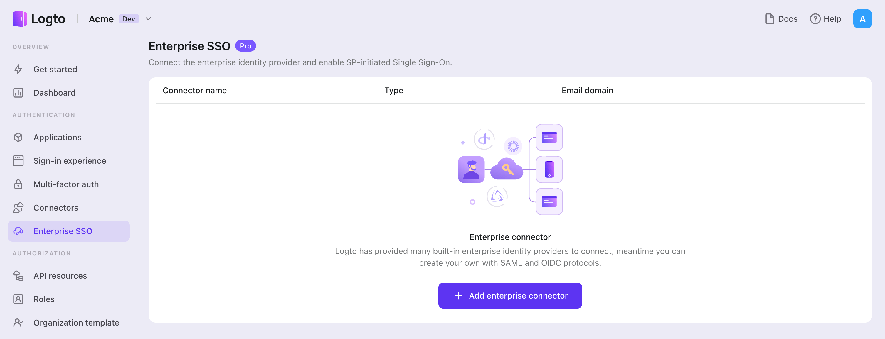
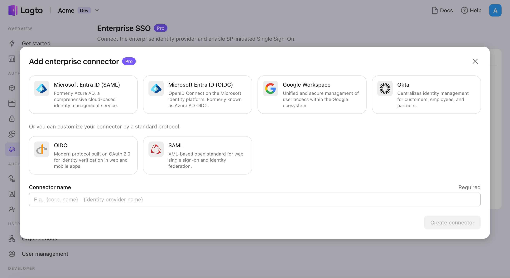
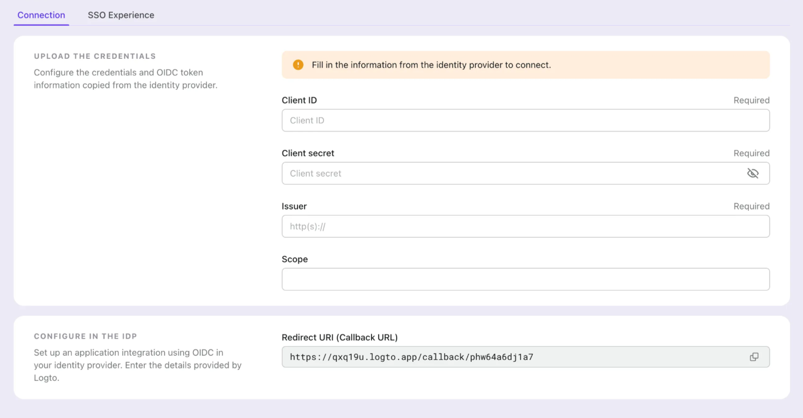
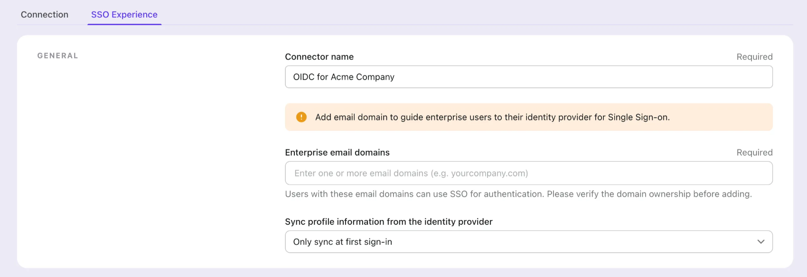

Чтобы упростить управление доступом и получить корпоративный уровень защиты для ваших крупных клиентов, подключитесь к {props.framework} в качестве федеративного провайдера идентификации. Коннектор корпоративного SSO Logto помогает установить это соединение за считанные минуты, позволяя вводить несколько параметров.

Чтобы добавить корпоративный SSO коннектор, просто выполните следующие шаги:

1. Перейдите в [Logto console > Enterprise SSO](https://cloud.logto.io/to/enterprise-sso).

2. Нажмите кнопку "Добавить корпоративный коннектор" и выберите тип вашего SSO провайдера. Выберите из предустановленных коннекторов для Microsoft Entra ID (Azure AD), Google Workspace и Okta, или создайте пользовательское SSO соединение, используя стандартный протокол OpenID Connect (OIDC) или SAML.
3. Укажите уникальное имя (например, SSO вход для компании Acme).

4. Настройте соединение с вашим IdP на вкладке "Connection". Ознакомьтесь с руководствами выше для каждого типа коннекторов.

5. Настройте опыт SSO и **домен электронной почты** предприятия на вкладке "Experience". Пользователи, входящие с доменом электронной почты, поддерживающим SSO, будут перенаправлены на аутентификацию SSO.

6. Сохраните изменения.
