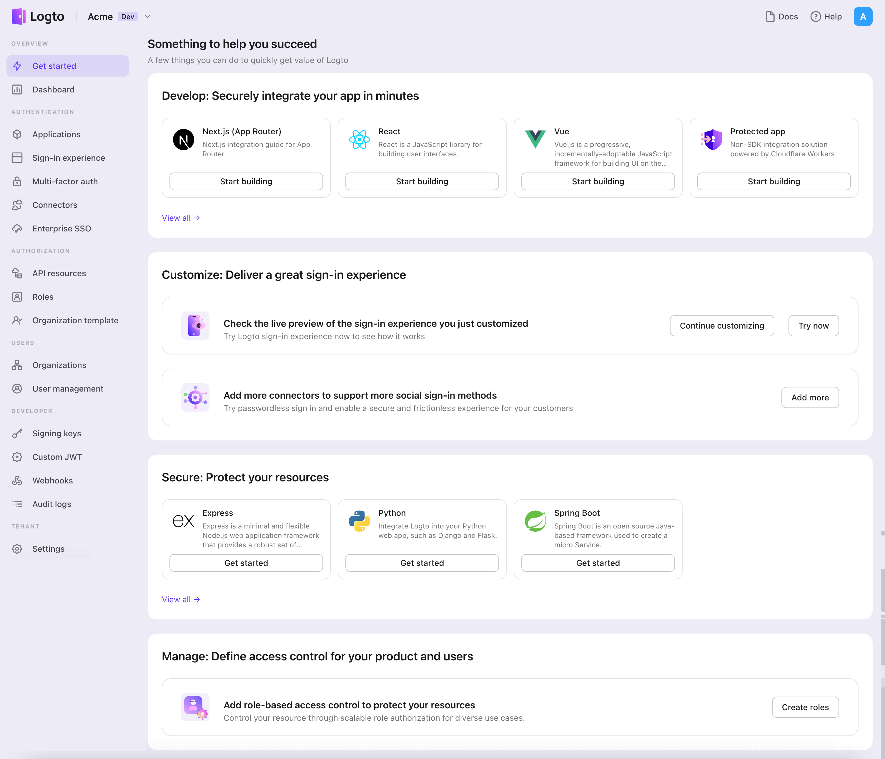

Logto основан на аутентификации OpenID Connect (OIDC) и авторизации OAuth 2.0. Он поддерживает федеративное управление идентификацией в нескольких приложениях, что обычно называется Единым входом (SSO).

Чтобы создать ваше приложение {props.type}, просто выполните следующие шаги:

1. Откройте [Logto Console](https://cloud.logto.io). В разделе "Начало работы" нажмите на ссылку "Просмотреть все", чтобы открыть список фреймворков приложений. В качестве альтернативы, вы можете перейти в [Logto Console > Applications](https://cloud.logto.io/to/applications) и нажать кнопку "Создать приложение".
   
2. В открывшемся модальном окне нажмите на раздел "{props.type}" или отфильтруйте все доступные фреймворки "{props.type}" с помощью флажков быстрого фильтра слева. Нажмите на карточку фреймворка "{props.framework}", чтобы начать создание вашего приложения.
   
3. Введите имя приложения, например, "Bookstore", и нажмите "Создать приложение".

🎉 Та-да! Вы только что создали свое первое приложение в Logto. Вы увидите страницу поздравления, которая включает подробное руководство по интеграции. Следуйте руководству, чтобы увидеть, каким будет опыт в вашем приложении.
