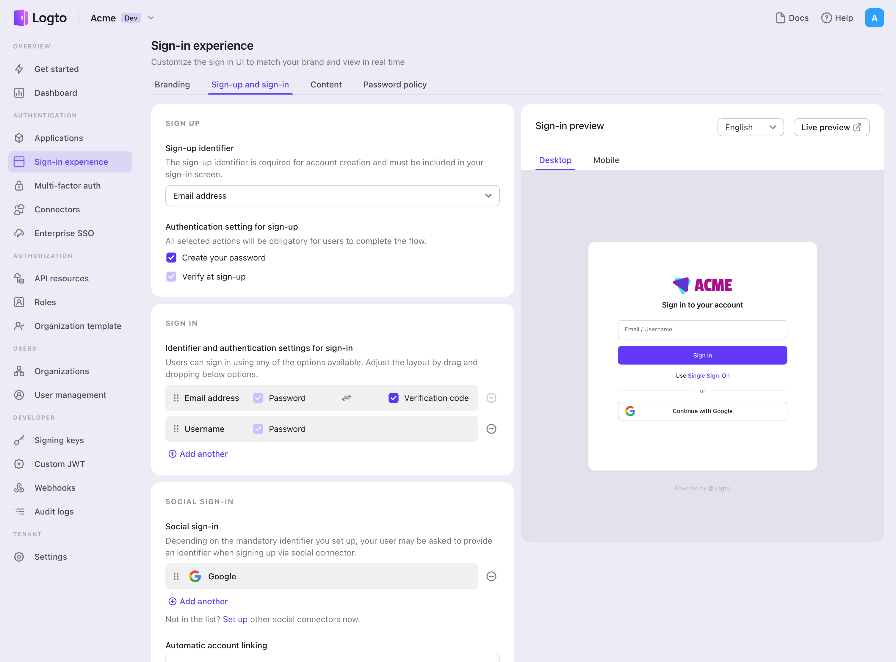

После успешного создания коннектора {props.connector}, вы можете включить вход и регистрацию без пароля на основе номера телефона.

1. Перейдите в [Консоль > Опыт входа > Регистрация и вход](https://cloud.logto.io/to/sign-in-experience/sign-up-and-sign-in).
2. Настройте методы регистрации (необязательно):
   1. Выберите "{props.passwordlessSignUpIdentifier}" или "Электронная почта или номер телефона" в качестве идентификатора регистрации.
   2. "Проверка при регистрации" принудительно включена. Вы также можете включить "Создать пароль" при регистрации.
3. Настройте методы входа:
   1. Выберите {props.passwordlessSignUpIdentifier} в качестве одного из идентификаторов входа. Вы можете предоставить несколько доступных идентификаторов (электронная почта, номер телефона и имя пользователя).
   2. Выберите "Код подтверждения" и / или "Пароль" в качестве фактора аутентификации.
4. Нажмите "Сохранить изменения" и протестируйте в "Живом предварительном просмотре".

В дополнение к регистрации и входу через OTP {props.connector}, вы также можете включить восстановление пароля и проверку безопасности на основе {props.connector}, а также связывание {props.passwordlessSignUpIdentifier} с профилем. Подробнее см. в разделе [Потоки конечных пользователей](https://docs.logto.io/end-user-flows).
