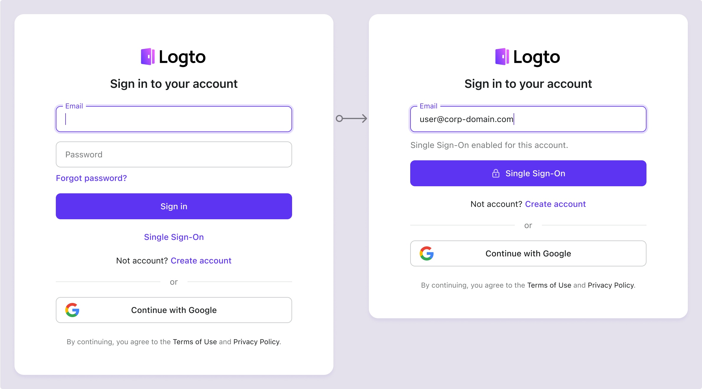
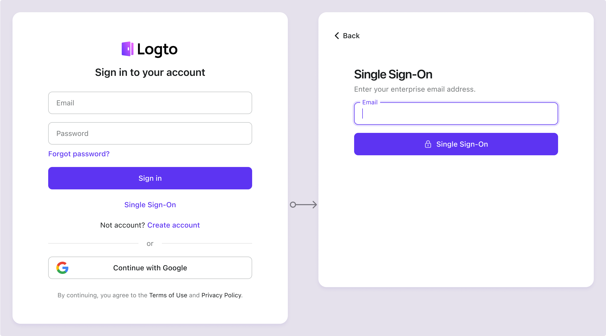

Вам не нужно настраивать корпоративные коннекторы по отдельности, Logto упрощает интеграцию SSO в ваши приложения всего одним кликом.

1. Перейдите по адресу: [Console > Sign-in experience > Sign-up and sign-in](https://cloud.logto.io/to/sign-in-experience/sign-up-and-sign-in).
2. Включите переключатель "Корпоративный единый вход (SSO)".
3. Сохраните изменения.

После включения на вашей странице входа появится кнопка "Единый вход (SSO)". Корпоративные пользователи с доменами электронной почты, поддерживающими SSO, смогут получить доступ к вашим сервисам, используя своих корпоративных провайдеров идентификации (IdPs).

Чтобы узнать больше об опыте пользователей SSO, включая SSO, инициированный SP, и SSO, инициированный IdP, обратитесь к Пользовательским потокам: [Корпоративный единый вход (SSO)](/end-user-flows/enterprise-sso).
